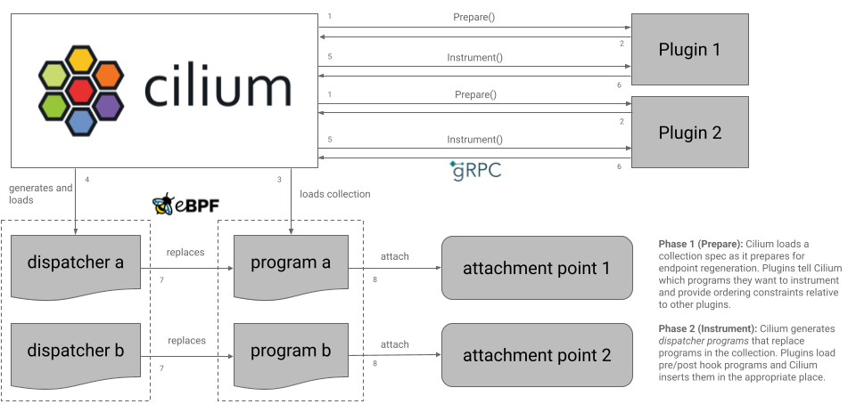

.. only:: not (epub or latex or html)

    WARNING: You are looking at unreleased Cilium documentation.
    Please use the official rendered version released here:
    https://docs.cilium.io

.. warning::
   This is a feature for advanced users with deep knowledge of Cilium and its
   architecture. Be very sure you actually need this before using it, as you
   can break Cilium's functionality or even compromise security. Use it at your
   own risk and know what you're doing.

.. warning::
    This is a beta feature. Please provide feedback and file a GitHub issue if
    you experience any problems.

################
Datapath Plugins
################

Datapath plugins let you inject your own BPF programs throughout the Cilium
datapath to influence datapath behavior or build custom observability tooling.
Datapath plugins are deployed as a ``DaemonSets`` and talk to Cilium agents via
a gRPC interface. Datapath plugins are intended primarily as means to enable
datapath extension for operators with advanced needs and advanced knowledge of
Cilium's inner workings who are willing to continually maintain their plugin
as Cilium's internal architecture evolves. They are *not* intended to enable an
ecosystem of third party off-the-shelf plugins and there are *little to no*
compatibility guarantees for datapath plugins between Cilium versions. With
that in mind, we will explore how datapath plugins work, what capabilities they
provide, and how to build and deploy one.

Overview
========

Datapath plugins are deployed as a ``DaemonSet``. An instance of the plugin sits
on each node talking to the local Cilium agent via gRPC over a Unix domain
socket.

As Cilium is loading a BPF collection and preparing it for an attachment point
or set of related attachment points, whether they be TC attachments for a
network interface, an XDP attachment, or a cgroup attachment as with SOCK_ADDR
and SOCKET hooks, it sends two rounds of gRPC requests to all registered
plugins allowing them to instrument the collection with hooks that run before
(pre) or after (post) programs in that collection. For now, only *entrypoints*
are allowed to be instrumented, the top-level program Cilium attaches to a BPF
attachment point, but this constraint may be loosened in the future to allow
for more fine-grained instrumentation of the collection by a plugin.

1. After loading the collection spec but before loading the collection into the
   kernel, Cilium sends each plugin a ``PrepareCollection`` request containing
   all the context about the collection, the attachment point, and its
   configuration. Each plugin uses this information to determine which of
   Cilium's programs (if any) it would like to instrument. The
   ``PrepareCollection`` response contains a list of pre or post program hooks
   that the plugin would like to inject. Each hook specification may contain a
   set of ordering constraints which express to Cilium that this particular hook
   must be placed before or after those of another plugin at that same hook
   point.
2. After receiving all ``PrepareCollection`` responses, if any plugin has
   indicated that it would like to inject a hook before or after some program in
   the collection, Cilium generates a *dispatcher program* in its place which
   invokes any pre hooks, invokes the original program, and finally invokes any
   post hooks. The dispatcher mechanism is covered in more detail below.
3. Cilium loads the modified collection into the kernel.
4. Cilium creates an ephemeral request-specific directory in BPFFS to contain
   hook program pins for this load operation, e.g.
   ``/sys/fs/bpf/cilium/operations/6a950f84-d8c0-468f-a8e5-c30545fd1ca5`` and
   maps each pre/post hook to a unique pin path within this directory. No pins
   are actually created at this point.
5. Cilium sends an ``InstrumentCollection`` request to any plugin that provided
   a hook specification in the prepare phase. Each ``InstrumentCollection``
   request contains the same context about the collection and attachment point
   that was in the preceding ``PrepareCollection`` request along with a list of
   hooks mirroring those requested by the plugin in its ``PrepareCollection``
   response. Each hook contains an attach target providing all the context the
   plugin needs to load a ``BPF_PROG_TYPE_EXT`` hook program into the
   kernel, and the unique ``pin_path`` for this hook program that Cilium
   generated in the previous step.
6. Each plugin loads hook programs and pins them to the designated pin paths
   before responding to the ``InstrumentCollection`` request.
7. Cilium opens and unpins the hook programs then replaces the dispatcher
   subprograms with these programs creating a set of freplace links in their
   place.
8. With the collection finalized, Cilium attaches collection entrypoints
   to the relevant BPF attachment points in the kernel.

Enabling Datapath Plugins
=========================

.. tabs::

    .. group-tab:: Helm

       .. parsed-literal::

             --set enable-datapath-plugins=true \\
             --set datapath-plugins-state-dir=/var/run/cilium/plugins

Plugin Registration
===================

To register a plugin with Cilium, create a ``CiliumDatapathPlugin`` resource:

.. code-block:: yaml

    apiVersion: cilium.io/v2alpha1
    kind: CiliumDatapathPlugin
    metadata:
      name: example
    spec:
      attachmentPolicy: Always
      version: 0.0.1

``attachmentPolicy`` can be ``Always`` or ``BestEffort``. ``Always`` means that
Cilium must be able to talk to the plugin to successfully load and attach any
BPF collection. ``BestEffort`` means that if Cilium cannot talk to the plugin,
it can proceed without consulting the plugin. Any time a
``CiliumDatapathPlugin`` is created, updated, or deleted Cilium triggers a full
datapath reinitialization. Bump the ``version`` string if you upgrade your
plugin and want Cilium to reinitialize; Cilium will not reinitialize the
datapath if your plugin's pod shuts down or is replaced.

Talking To Cilium
=================

Plugins should create a subdirectory that matches the ``name`` of their
``CiliumDatapathPlugin`` CR under the configured ``datapath-plugins-state-dir``
and listen on a Unix socket called ``plugin.sock``. For example, if your
plugin's name is "example" and ``datapath-plugins-state-dir`` is
``/var/run/cilium/plugins``, your plugin should  create a socket at
``/var/run/cilium/plugins/example/plugin.sock`` and serve the ``DatapathPlugin``
gRPC interface over it. Example:

.. code-block:: go

        	unixSocketPath := "/var/run/cilium/plugins/example/plugin.sock"
                // Clear out the old socket
        	os.Remove(unixSocketPath)
        	addr, err := net.ResolveUnixAddr("unix", unixSocketPath)
        	if err != nil {
        		return fmt.Errorf("resolving address: %w", err)
        	}
        	listener, err := net.ListenUnix("unix", addr)
        	if err != nil {
        		return fmt.Errorf("starting listener: %w", err)
        	}
        	server := grpc.NewServer()
        	datapathplugins.RegisterDatapathPluginServer(server, /* DatapathPluginServer implementation */)
        	server.Serve(listener)

Implementing The Server
=======================

The ``DatapathPlugin`` service defines two request types: ``PrepareCollection``
and ``InstrumentCollection``. ``PrepareCollection`` happens before the BPF
collection is loaded into the kernel. Cilium passes BPF collection details to
the plugin and the plugin tells Cilium how it would like to modify the
collection. ``InstrumentCollection`` happens after the BPF collection is loaded
into the kernel. Cilium passes BPF collection details to the plugin along with
details about hook attachment points it created in the prepare phase. The plugin
loads its BPF programs and passes them back to Cilium to be attached to these
hook points. See the full gRPC API listing below for details on the structure
of the request and response messages.

.. code-block:: go

   func (s *datapathPluginServer) PrepareCollection(ctx context.Context, req *datapathplugins.PrepareCollectionRequest) (*datapathplugins.PrepareCollectionResponse, error) {
       // Determine which programs in the collection to instrument and tell
       // Cilium in the PrepareCollectionResponse.
   }

   func (s *datapathPluginServer) InstrumentCollection(ctx context.Context, req *datapathplugins.InstrumentCollectionRequest) (*datapathplugins.InstrumentCollectionResponse, error) {
       // Load and pin BPF programs for each hook point specified in the
       // request. The set of hooks will match those passed to Cilium in the
       // associated PrepareCollection response.
   }

CAP_SYS_ADMIN
=============

Cilium passes program and map IDs for the programs and maps in the collection
in the ``InstrumentCollection`` request. Depending on your plugin's needs, you
may wish to pass these maps or programs to your own BPF collection as you
load your hooks. In order to get a BPF object ID from a file descriptor, you
must grant ``SYS_ADMIN`` to your plugin's pod:

.. code-block:: yaml

   securityContext:
     capabilities:
       drop:
       - ALL
       add:
       # BPF ID -> FD translation requires CAP_SYS_ADMIN.
       - SYS_ADMIN

Putting It All Together: Example Plugin
=======================================

Cilium provides an `example plugin <https://github.com/cilium/cilium/examples/datapath-plugin>`_ that illustrates how to instrument each kind of collection and
program. To deploy it to a kind cluster, run the following commands:

.. code-block:: bash

   $ make kind-image-datapath-plugin
   $ make kind-install-datapath-plugin

The Dispatcher Mechanism And Interactions Between Plugins
=========================================================

Plugins can specify ordering constraints relative to other plugins on the same
hook point. Cilium uses these constraints to decide the relative order of plugin
hooks inside the dispatcher that it generates. ``PRE`` hooks run *before* the
original Cilium program while ``POST`` hooks run *after* the original Cilium
program.

Although Cilium generates the dispatcher dynamically, the logic looks like this:

.. code-block:: c

	int dispatch(void *ctx) {
	    int orig_ret, ret;

	    ret = __pre_hook_plugin_a__(ctx);
	    if (ret != RET_PROCEED)
	        return ret;
	    ret = __pre_hook_plugin_b__(ctx);
	    if (ret != RET_PROCEED)
	        return ret;
	    ...
	    orig_ret = original_cilium_prog(ctx);
	    ...
	    ret = __post_hook_plugin_a__(ctx, orig_ret);
	    if (ret != RET_PROCEED)
	        return ret;
	    ret = __post_hook_plugin_b__(ctx, orig_ret);
	    if (ret != RET_PROCEED)
	        return ret;

	    return orig_ret;
	}

Any plugin hook can stop the pipeline at any stage by returning any value other
than ``RET_PROCEED``. The value of ``RET_PROCEED`` differs depending on the
type of program. For XDP and TC programs it's -1 for everything else it's 1.

It doesn't matter if the original Cilium program or any of the hook programs
tail call internally. Execution flow will always return to the dispatcher once
the last tail call in the chain returns and its return value will be handed
to the dispatcher. This works because each subprogram gets its own stack frame
and tail calls only unwind the current stack frame.

Known Limitations
=================

* It is currently not possible to instrument programs that are intended to
  go into a ``BPF_MAP_TYPE_PROG_ARRAY`` which excludes any programs except
  entrypoints like ``cil_to_container``.
  `This <https://lore.kernel.org/all/20241015150207.70264-2-leon.hwang@linux.dev/>`_
  prevents Cilium from using freplace with such programs.

gRPC API Reference
==================
.. toctree::
   :maxdepth: 3

   Datapath Plugins <../../_api/v1/datapathplugins/README>
 
