.. only:: not (epub or latex or html)

    WARNING: You are looking at unreleased Cilium documentation.
    Please use the official rendered version released here:
    https://docs.cilium.io

.. _install_metrics:

****************************
Running Prometheus & Grafana
****************************

Install Prometheus & Grafana
============================

This is an example deployment that includes Prometheus and Grafana in a single
deployment.

The default installation contains:

- **Grafana**: A visualization dashboard with Cilium Dashboard pre-loaded.
- **Prometheus**: a time series database and monitoring system.

 .. parsed-literal::

    $ kubectl apply -f \ |SCM_WEB|\/examples/kubernetes/addons/prometheus/monitoring-example.yaml
    namespace/cilium-monitoring created
    serviceaccount/prometheus-k8s created
    configmap/grafana-config created
    configmap/grafana-cilium-dashboard created
    configmap/grafana-cilium-operator-dashboard created
    configmap/grafana-hubble-dashboard created
    configmap/prometheus created
    clusterrole.rbac.authorization.k8s.io/prometheus unchanged
    clusterrolebinding.rbac.authorization.k8s.io/prometheus unchanged
    service/grafana created
    service/prometheus created
    deployment.apps/grafana created
    deployment.apps/prometheus created

This example deployment of Prometheus and Grafana will automatically scrape the
Cilium and Hubble metrics. See the :ref:`metrics` configuration guide on how to
configure a custom Prometheus instance.

Deploy Cilium and Hubble with metrics enabled
=============================================

*Cilium*, *Hubble*, and *Cilium Operator* do not expose metrics by
default. Enabling metrics for these services will open ports ``9962``, ``9965``,
and ``9963`` respectively on all nodes of your cluster where these components
are running.

The metrics for Cilium, Hubble, and Cilium Operator can all be enabled
independently of each other with the following Helm values:

 - ``prometheus.enabled=true``: Enables metrics for ``cilium-agent``.
 - ``operator.prometheus.enabled=true``: Enables metrics for ``cilium-operator``.
 - ``hubble.metrics.enabled``: Enables the provided list of Hubble metrics.
   For Hubble metrics to work, Hubble itself needs to be enabled with
   ``hubble.enabled=true``. See
   :ref:`Hubble exported metrics<hubble_exported_metrics>` for the list of
   available Hubble metrics.

Refer to :ref:`metrics` for more details about the individual metrics.

.. include:: ../installation/k8s-install-download-release.rst

Deploy Cilium via Helm as follows to enable all metrics:

.. parsed-literal::

   helm install cilium |CHART_RELEASE| \\
      --namespace kube-system \\
      --set prometheus.enabled=true \\
      --set operator.prometheus.enabled=true \\
      --set hubble.enabled=true \\
      --set hubble.metrics.enableOpenMetrics=true \\
      --set hubble.metrics.enabled="{dns,drop,tcp,flow,port-distribution,icmp,httpV2:exemplars=true;labelsContext=source_ip\\,source_namespace\\,source_workload\\,destination_ip\\,destination_namespace\\,destination_workload\\,traffic_direction}"

.. note::

   You can combine the above Helm options with any of the other installation
   guides.

How to access Grafana
=====================

Expose the port on your local machine

.. code-block:: shell-session

    kubectl -n cilium-monitoring port-forward service/grafana --address 0.0.0.0 --address :: 3000:3000

Access it via your browser: http://localhost:3000

How to access Prometheus
========================

Expose the port on your local machine

.. code-block:: shell-session

    kubectl -n cilium-monitoring port-forward service/prometheus --address 0.0.0.0 --address :: 9090:9090

Access it via your browser: http://localhost:9090

Examples
========

Generic
-------

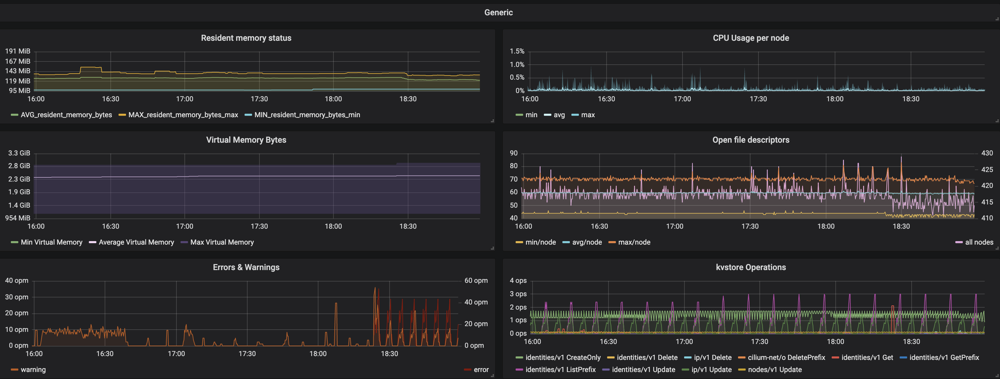

Network
-------

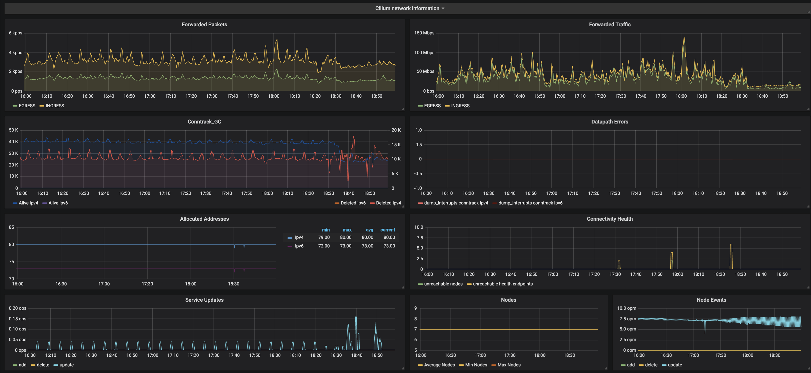

Policy
-------

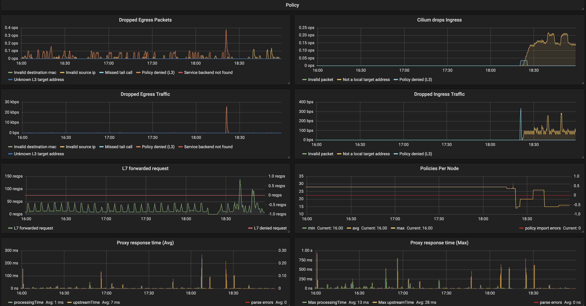
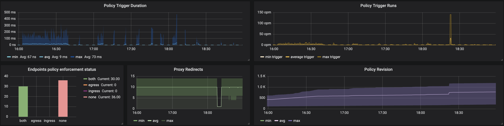

Endpoints
---------

.. image:: images/grafana_endpoints.png

Controllers
-----------

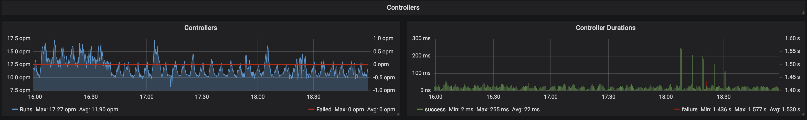

Kubernetes
----------

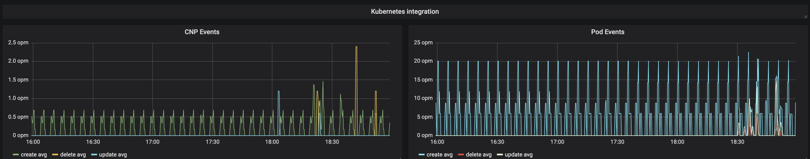

Hubble General Processing
-------------------------

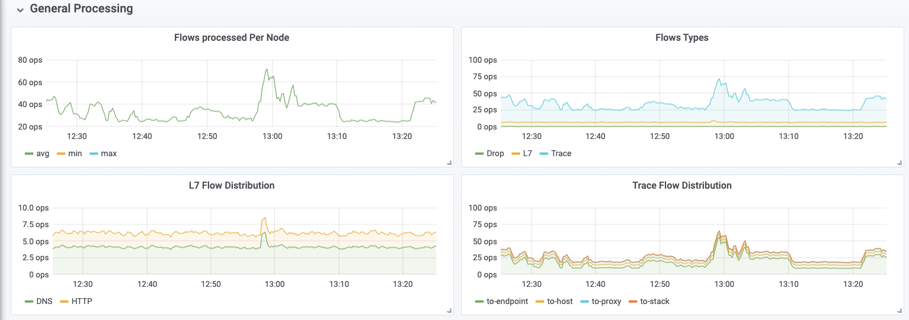

Hubble Networking
-----------------
.. note::

   The ``port-distribution`` metric is disabled by default.
   Refer to :ref:`metrics` for more details about the individual metrics.

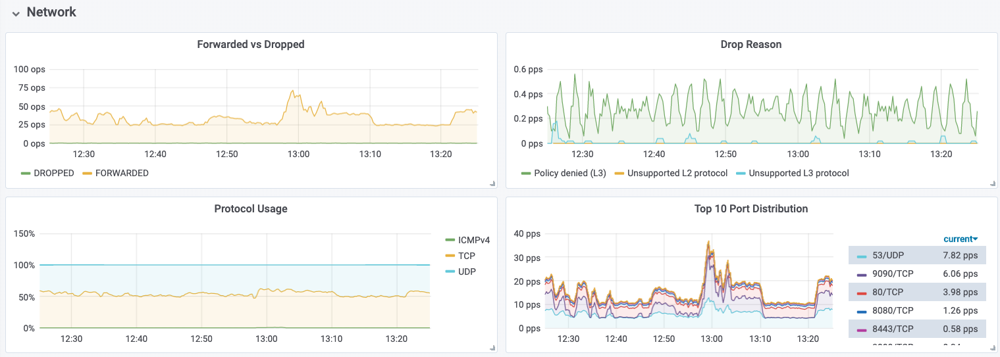
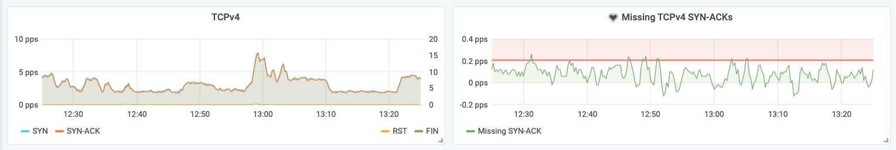
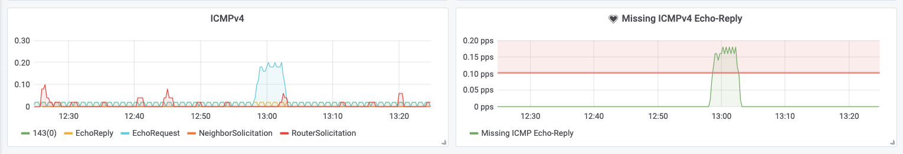

Hubble DNS
----------

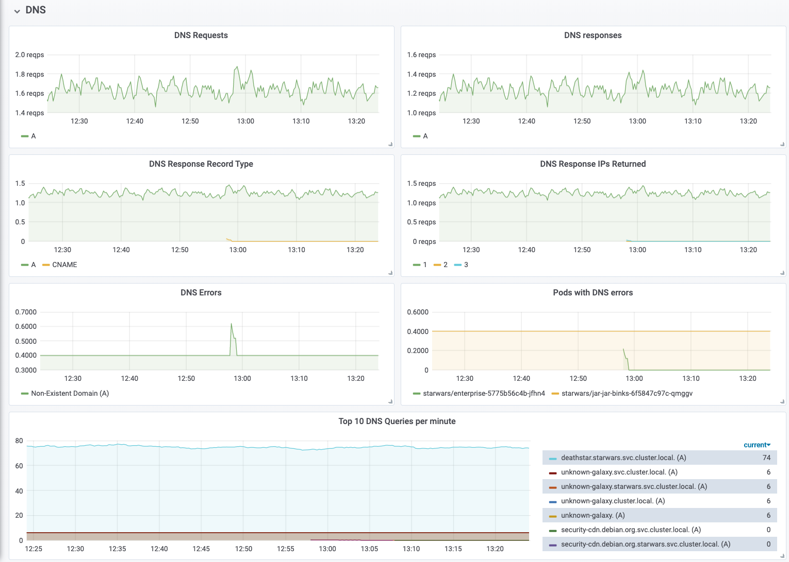

Hubble HTTP
-----------

.. image:: images/grafana_hubble_http.png

Hubble Network Policy
---------------------

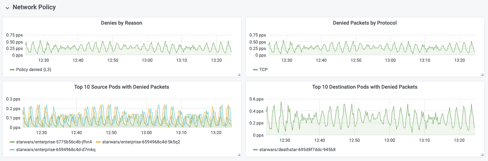
