.. only:: not (epub or latex or html)

    WARNING: You are looking at unreleased Cilium documentation.
    Please use the official rendered version released here:
    https://docs.cilium.io

.. _performance_report:

*************************
CNI Performance Benchmark
*************************

Introduction
============

This chapter contains performance benchmark numbers for a variety of scenarios.
All tests are performed between containers running on two different bare metal
nodes connected back-to-back by a 100Gbit/s network interface. Upon popular
request we have included performance numbers for Calico for comparison.

.. admonition:: Video
  :class: attention

  You can also watch Thomas Graf, Co-founder of Cilium, dive deep into this chapter
  in `eCHO episode 5: Network performance benchmarking <https://www.youtube.com/watch?v=2lGag_j4dIw&t=377s>`__.

.. tip::

   To achieve these performance results, follow the :ref:`performance_tuning`.

For more information on the used system and configuration, see
:ref:`test_hardware`. For more details on all tested configurations, see
:ref:`test_configurations`.

The following metrics are collected and reported. Each metric represents a
different traffic pattern that can be required for workloads. See the specific
sections for an explanation on what type of workloads are represented by each
benchmark.

Throughput
  Maximum transfer rate via a single TCP connection and the total transfer rate
  of 32 accumulated connections.

Request/Response Rate
  The number of request/response messages per second that can be transmitted over
  a single TCP connection and over 32 parallel TCP connections.

Connections Rate
  The number of connections per second that can be established in sequence with
  a single request/response payload message transmitted for each new connection. A
  single process and 32 parallel processes are tested.

For the various benchmarks `netperf`_ has been used to generate the workloads
and to collect the metrics. For spawning parallel netperf sessions,
`super_netperf <https://raw.githubusercontent.com/borkmann/netperf_scripts/master/super_netperf>`_
has been used. Both netperf and super_netperf are also frequently used and well
established tools for benchmarking in the Linux kernel networking community.

.. _benchmark_throughput:

TCP Throughput (TCP_STREAM)
===========================

Throughput testing (TCP_STREAM) is useful to understand the maximum throughput
that can be achieved with a particular configuration. All or most configurations
can achieve line-rate or close to line-rate if enough CPU resources are thrown
at the load. It is therefore important to understand the amount of CPU resources
required to achieve a certain throughput as these CPU resources will no longer
be available to workloads running on the machine.

This test represents bulk data transfer workloads, e.g. streaming services or
services performing data upload/download.

Single-Stream
-------------

In this test, a single TCP stream is opened between the containers and maximum
throughput is achieved:

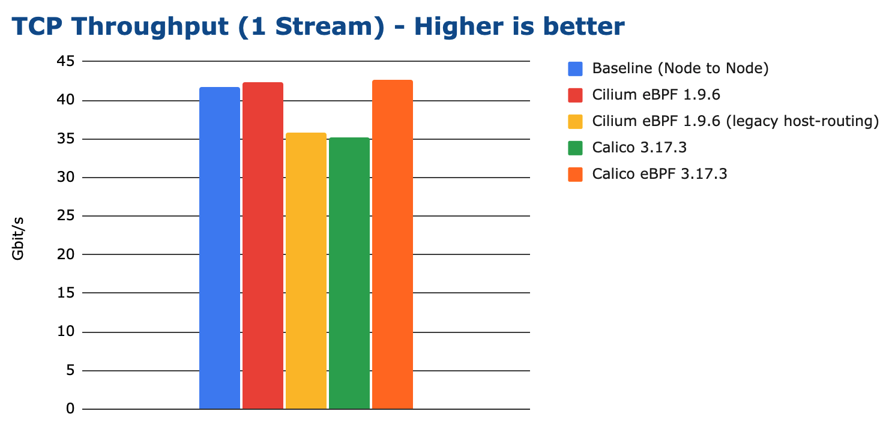

We can see that eBPF-based solutions can outperform even the node-to-node
baseline on modern kernels despite performing additional work (forwarding
into the network namespace of the container, policy enforcement, ...). This is
because eBPF is capable of bypassing the iptables layer of the node which is
still traversed for the node to node baseline.

The following graph shows the total CPU consumption across the entire system
while running the benchmark, normalized to a 50Gbit throughput:

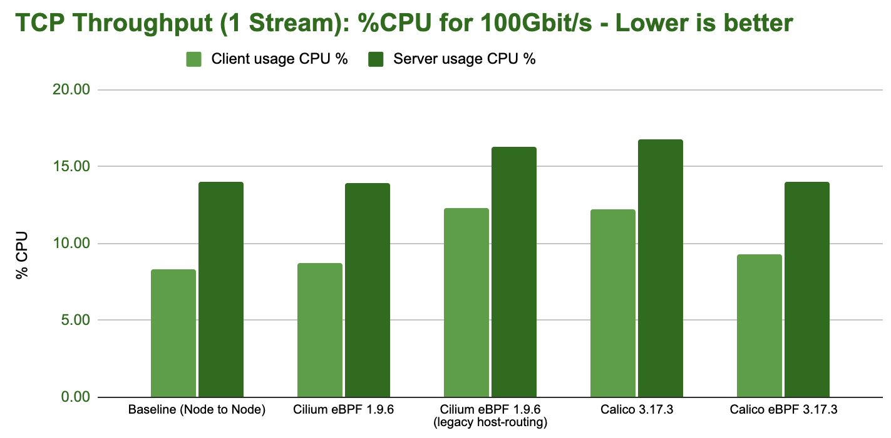

.. tip::

   **Kernel wisdom:** TCP flow performance is limited by the receiver, since
   sender can use both TSO super-packets. This can be observed in the increased
   CPU spending on the server-side above above.

Multi-Stream
-------------

In this test, 32 processes are opening 32 parallel TCP connections. Each process
is attempting to reach maximum throughput and the total is reported:

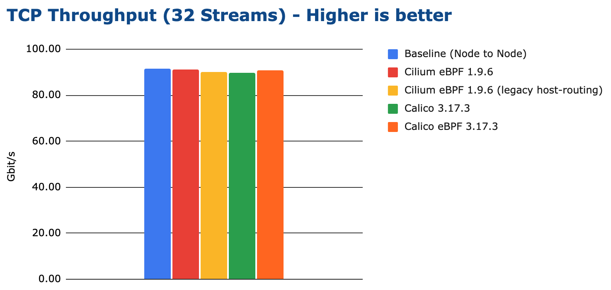

Given multiple processes are being used, all test configurations can achieve
transfer rates close to the line-rate of the network interface. The main
difference is the CPU resources required to achieve it:

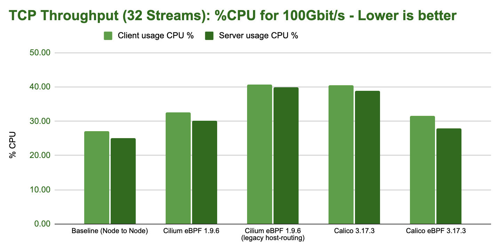

.. _request_response:

Request/Response Rate (TCP_RR)
==============================

The request/response rate (TCP_RR) primarily measures the latency and
efficiency to handle round-trip forwarding of an individual network packet.
This benchmark will lead to the most packets per second possible on the wire
and stresses the cost performed by a network packet. This is the opposite of
the throughput test which maximizes the size of each network packet.

A configuration that is doing well in this test (delivering high requests per
second rates) will also deliver better (lower) network latencies.

This test represents services which maintain persistent connections and exchange
request/response type interactions with other services. This is common for services
using REST or gRPC APIs.

1 Process
---------

In this test, a single TCP connection is opened between the containers and a
single byte is sent back and forth between the containers. For each round-trip,
one request is counted:

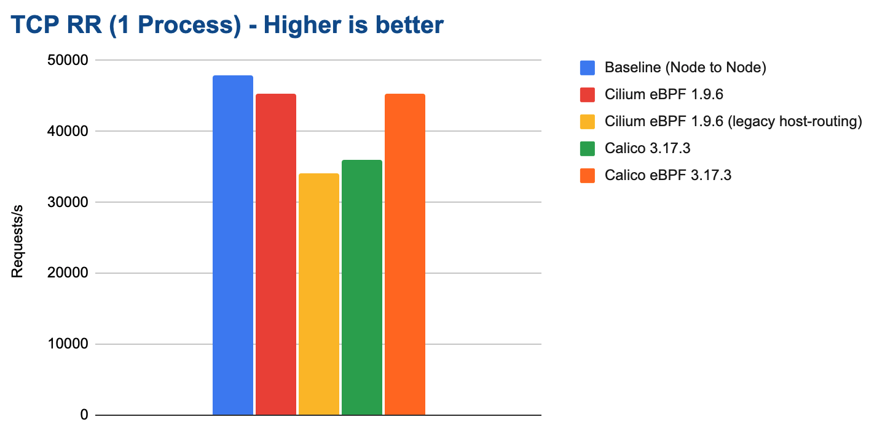

eBPF on modern kernels can achieve almost the same request/response rate as the
baseline while only consuming marginally more CPU resources:

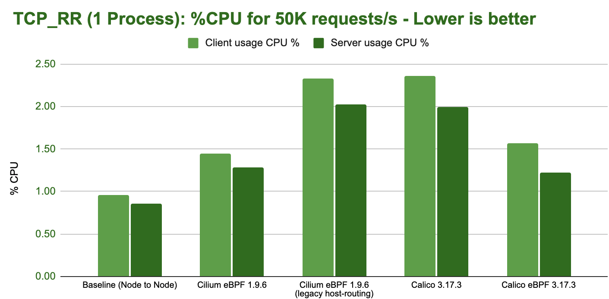

32 Processes
------------

In this test, 32 processes are opening 32 parallel TCP connections. Each process
is performing single byte round-trips. The total number of requests per second
is reported:

.. image:: images/bench_tcp_rr_32_processes.png

Cilium can achieve close to 1M requests/s in this test while consuming about 30%
of the system resources on both the sender and receiver:

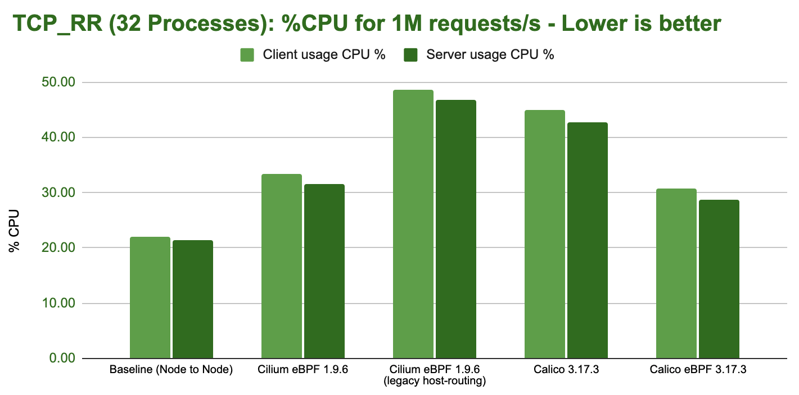

Connection Rate (TCP_CRR)
=========================

The connection rate (TCP_CRR) test measures the efficiency in handling new
connections. It is similar to the request/response rate test but will create a new
TCP connection for each round-trip. This measures the cost of establishing a
connection, transmitting a byte in both directions, and closing the connection.
This is more expensive than the TCP_RR test and puts stress on the cost related
to handling new connections.

This test represents a workload that receives or initiates a lot of TCP
connections. An example where this is the case is a publicly exposed service
that receives connections from many clients. Good examples of this are L4
proxies or services opening many connections to external endpoints. This
benchmark puts the most stress on the system with the least work offloaded to
hardware so we can expect to see the biggest difference between tested
configurations.

A configuration that does well in this test (delivering high connection rates)
will handle situations with overwhelming connection rates much better, leaving
more CPU resources available to workloads on the system.

1 Process
---------

In this test, a single process opens as many TCP connections as possible
in sequence:

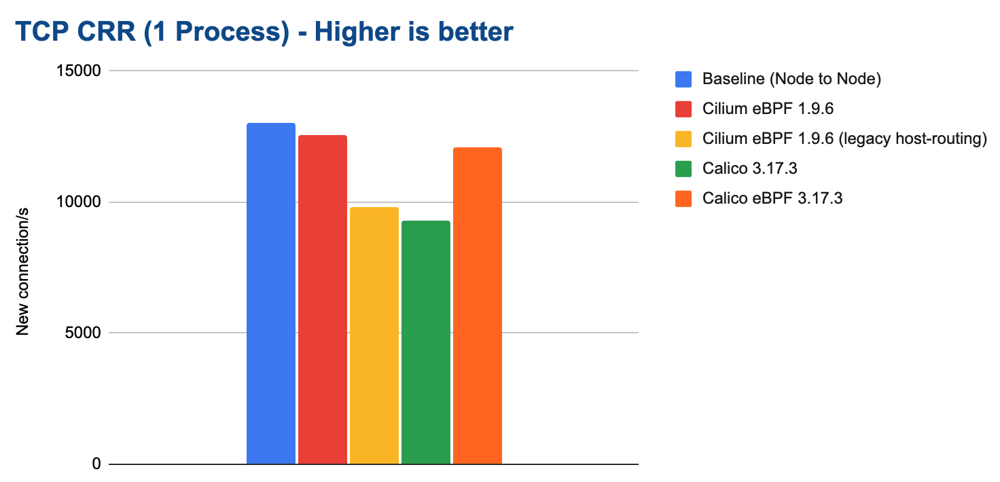

The following graph shows the total CPU consumption across the entire system
while running the benchmark:

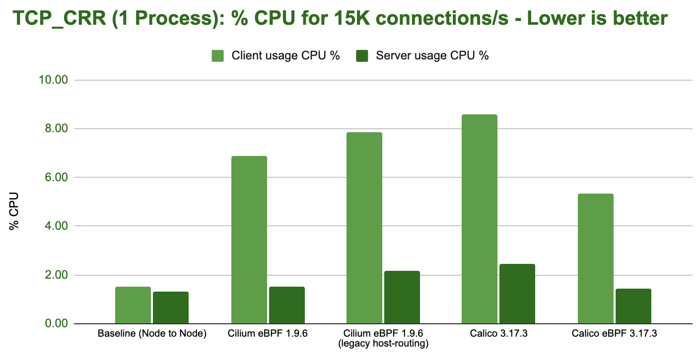

.. tip::

   **Kernel wisdom:** The CPU resources graph makes it obvious that some
   additional kernel cost is paid at the sender as soon as network namespace
   isolation is performed as all container workload benchmarks show signs of
   this cost. We will investigate and optimize this aspect in a future release.

32 Processes
------------

In this test, 32 processes running in parallel open as many TCP connections in
sequence as possible. This is by far the most stressful test for the system.

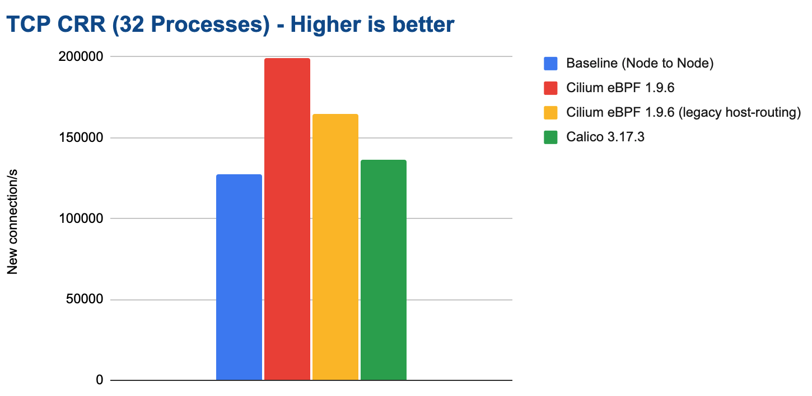

This benchmark outlines major differences between the tested configurations. In
particular, it illustrates the overall cost of iptables which is optimized to
perform most of the required work per connection and then caches the result.
This leads to a worst-case performance scenario when a lot of new connections
are expected.

.. note::

   We have not been able to measure stable results for the Calico eBPF
   datapath.  We are not sure why. The network packet flow was never steady. We
   have thus not included the result. We invite the Calico team to work with us
   to investigate this and then re-test.

The following graph shows the total CPU consumption across the entire system
while running the benchmark:

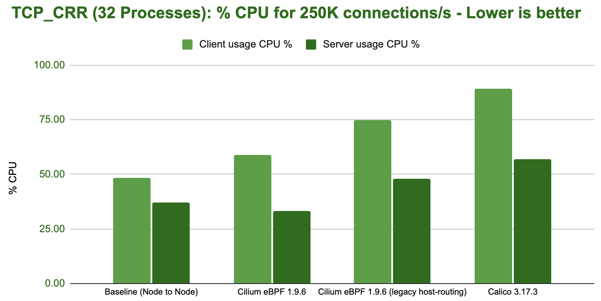

Encryption (WireGuard/IPsec)
============================

Cilium supports encryption via WireGuard® and IPsec. This first section will
look at WireGuard and compare it against using Calico for WireGuard encryption.
If you are interested in IPsec performance and how it compares to WireGuard,
please see :ref:`performance_wireguard_ipsec`.

WireGuard Throughput
--------------------

Looking at TCP throughput first, the following graph shows results for both
1500 bytes MTU and 9000 bytes MTU:

.. image:: images/bench_wireguard_tcp_1_stream.png

.. note::

   The Cilium eBPF kube-proxy replacement combined with WireGuard is currently
   slightly slower than Cilium eBPF + kube-proxy. We have identified the
   problem and will be resolving this deficit in one of the next releases.

The following graph shows the total CPU consumption across the entire system
while running the WireGuard encryption benchmark:

WireGuard Request/Response
--------------------------

The next benchmark measures the request/response rate while encrypting with
WireGuard. See :ref:`request_response` for details on what this test actually
entails.

All tested configurations performed more or less the same. The following graph
shows the total CPU consumption across the entire system while running the
WireGuard encryption benchmark:

.. _performance_wireguard_ipsec:

WireGuard vs IPsec
------------------

In this section, we compare Cilium encryption using WireGuard and IPsec.
WireGuard is able to achieve a higher maximum throughput:

However, looking at the CPU resources required to achieve 10Gbit/s of
throughput, WireGuard is less efficient at achieving the same throughput:

.. tip::

   IPsec performing better than WireGuard in in this test is unexpected in some
   ways. A possible explanation is that the IPsec encryption is making use of
   AES-NI instructions whereas the WireGuard implementation is not. This would
   typically lead to IPsec being more efficient when AES-NI offload is
   available and WireGuard being more efficient if the instruction set is not
   available.

Looking at the request/response rate, IPsec is outperforming WireGuard in our
tests. Unlike for the throughput tests, the MTU does not have any effect as the
packet sizes remain small:

Test Environment
================

.. _test_hardware:

Test Hardware
-------------

All tests are performed using regular off-the-shelf hardware.

============  ======================================================================================================================================================
Item          Description
============  ======================================================================================================================================================
CPU           `AMD Ryzen 9 3950x <https://www.amd.com/en/products/cpu/amd-ryzen-9-3950x>`_, AM4 platform, 3.5GHz, 16 cores / 32 threads
Mainboard     `x570 Aorus Master <https://www.gigabyte.com/us/Motherboard/X570-AORUS-MASTER-rev-11-12/sp#sp>`_, PCIe 4.0 x16 support
Memory        `HyperX Fury DDR4-3200 <https://www.hyperxgaming.com/us/memory/fury-ddr4>`_ 128GB, XMP clocked to 3.2GHz
Network Card  `Intel E810-CQDA2 <https://ark.intel.com/content/www/us/en/ark/products/192558/intel-ethernet-network-adapter-e810-cqda2.html>`_, dual port, 100Gbit/s per port, PCIe 4.0 x16
Kernel        Linux 5.10 LTS, see also :ref:`performance_tuning`
============  ======================================================================================================================================================

.. _test_configurations:

Test Configurations
-------------------

All tests are performed using standardized configuration. Upon popular request,
we have included measurements for Calico for direct comparison.

============================ ===================================================================
Configuration Name           Description
============================ ===================================================================
Baseline (Node to Node)      No Kubernetes
Cilium                       Cilium 1.9.6, eBPF host-routing, kube-proxy replacement, No CT
Cilium (legacy host-routing) Cilium 1.9.6, legacy host-routing, kube-proxy replacement, No CT
Calico                       Calico 3.17.3, kube-proxy
Calico eBPF                  Calico 3.17.3, eBPF datapath, No CT
============================ ===================================================================

How to reproduce
================

To ease reproducibility, this report is paired with a set of scripts that can
be found in `cilium/cilium-perf-networking <https://github.com/cilium/cilium-perf-networking>`_.
All scripts in this document refer to this repository. Specifically, we use
`Terraform <https://www.terraform.io/>`_ and `Ansible
<https://www.ansible.com/>`_ to setup the environment and execute benchmarks.
We use `Packet <https://www.packet.com/>`_ bare metal servers as our hardware
platform, but the guide is structured so that it can be easily adapted to other
environments.

Download the Cilium performance evaluation scripts:

.. code-block:: shell-session

  $ git clone https://github.com/cilium/cilium-perf-networking.git
  $ cd cilium-perf-networking

Packet Servers
--------------

To evaluate both :ref:`arch_overlay` and :ref:`native_routing`, we configure
the Packet machines to use a `"Mixed/Hybrid"
<https://www.packet.com/developers/docs/network/advanced/layer-2/>`_ network
mode, where the secondary interfaces of the machines share a flat L2 network.
While this can be done on the Packet web UI, we include appropriate Terraform
(version 0.13) files to automate this process.

.. code-block:: shell-session

  $ cd terraform
  $ terraform init
  $ terraform apply -var 'packet_token=API_TOKEN' -var 'packet_project_id=PROJECT_ID'
  $ terraform output ansible_inventory  | tee ../packet-hosts.ini
  $ cd ../

The above will provision two servers named ``knb-0`` and ``knb-1`` of type
``c3.small.x86`` and configure them to use a "Mixed/Hybrid" network mode under a
common VLAN named ``knb``.  The machines will be provisioned with an
``ubuntu_20_04`` OS.  We also create a ``packet-hosts.ini`` file to use as an
inventory file for Ansible.

Verify that the servers are successfully provisioned by executing an ad-hoc ``uptime``
command on the servers.

.. code-block:: shell-session

  $ cat packet-hosts.ini
  [master]
  136.144.55.223 ansible_python_interpreter=python3 ansible_user=root prv_ip=10.67.33.131 node_ip=10.33.33.10 master=knb-0
  [nodes]
  136.144.55.225 ansible_python_interpreter=python3 ansible_user=root prv_ip=10.67.33.133 node_ip=10.33.33.11
  $ ansible -i packet-hosts.ini all -m shell -a 'uptime'
  136.144.55.223 | CHANGED | rc=0 >>
  09:31:43 up 33 min,  1 user,  load average: 0.00, 0.00, 0.00
  136.144.55.225 | CHANGED | rc=0 >>
    09:31:44 up 33 min,  1 user,  load average: 0.00, 0.00, 0.00

Next, we use the ``packet-disbond.yaml`` playbook to configure the network
interfaces of the machines. This will destroy the ``bond0`` interface and
configure the first physical interface with the public and private IPs
(``prv_ip``) and the second with the node IP (``node_ip``) that will be used
for our evaluations (see `Packet documentation
<https://www.packet.com/resources/guides/layer-2-configurations/>`_ and our
scripts for more info).

.. code-block:: shell-session

  $ ansible-playbook -i packet-hosts.ini playbooks/packet-disbond.yaml

.. note::

    For hardware platforms other than Packet, users need to provide their own
    inventory file (``packet-hosts.ini``) and follow the subsequent steps.

Install Required Software
-------------------------

Install netperf (used for raw host-to-host measurements):

.. code-block:: shell-session

  $ ansible-playbook -i packet-hosts.ini playbooks/install-misc.yaml

Install ``kubeadm`` and its dependencies:

.. code-block:: shell-session

  $ ansible-playbook -i packet-hosts.ini playbooks/install-kubeadm.yaml

We use `kubenetbench <https://github.com/cilium/kubenetbench>`_ to execute the
`netperf`_ benchmark in a Kubernetes environment. kubenetbench is a Kubernetes
benchmarking project that is agnostic to the CNI or networking plugin that the
cluster is deployed with. In this report we focus on pod-to-pod communication
between different nodes. To install kubenetbench:

.. code-block:: shell-session

  $ ansible-playbook -i packet-hosts.ini playbooks/install-kubenetbench.yaml

.. _netperf: https://github.com/HewlettPackard/netperf

Running Benchmarks
------------------

.. _tunneling_results:

Tunneling
~~~~~~~~~

Configure Cilium in tunneling (:ref:`arch_overlay`) mode:

.. code-block:: shell-session

  $ ansible-playbook -e mode=tunneling -i packet-hosts.ini playbooks/install-k8s-cilium.yaml
  $ ansible-playbook -e conf=vxlan -i packet-hosts.ini playbooks/run-kubenetbench.yaml

The first command configures Cilium to use tunneling (``-e mode=tunneling``),
which by default uses the VXLAN overlay.  The second executes our benchmark
suite (the ``conf`` variable is used to identify this benchmark run). Once
execution is done, a results directory will be copied back in a folder named
after the ``conf`` variable (in this case, ``vxlan``). This directory includes
all the benchmark results as generated by kubenetbench, including netperf output
and system information.

.. _native_routing_results:

Native Routing
~~~~~~~~~~~~~~

We repeat the same operation as before, but configure Cilium to use
:ref:`native_routing` (``-e mode=directrouting``).

.. code-block:: shell-session

  $ ansible-playbook -e mode=directrouting -i packet-hosts.ini playbooks/install-k8s-cilium.yaml
  $ ansible-playbook -e conf=routing -i packet-hosts.ini playbooks/run-kubenetbench.yaml

.. _encryption_results:

Encryption
~~~~~~~~~~

To use encryption with native routing:

.. code-block:: shell-session

    $ ansible-playbook -e kubeproxyfree=disabled -e mode=directrouting -e encryption=yes -i packet-hosts.ini playbooks/install-k8s-cilium.yaml
    $ ansible-playbook -e conf=encryption-routing -i packet-hosts.ini playbooks/run-kubenetbench.yaml

Baseline
~~~~~~~~

To have a point of reference for our results, we execute the same benchmarks
between hosts without Kubernetes running. This provides an effective upper
limit to the performance achieved by Cilium.

.. code-block:: shell-session

  $ ansible-playbook -i packet-hosts.ini playbooks/reset-kubeadm.yaml
  $ ansible-playbook -i packet-hosts.ini playbooks/run-rawnetperf.yaml

The first command removes Kubernetes and reboots the machines to ensure that there
are no residues in the systems, whereas the second executes the same set of
benchmarks between hosts. An alternative would be to run the raw benchmark
before setting up Cilium, in which case one would only need the second command.

Cleanup
-------

When done with benchmarking, the allocated Packet resources can be released with:

.. code-block:: shell-session

  $ cd terraform && terraform destroy -var 'packet_token=API_TOKEN' -var 'packet_project_id=PROJECT_ID'

