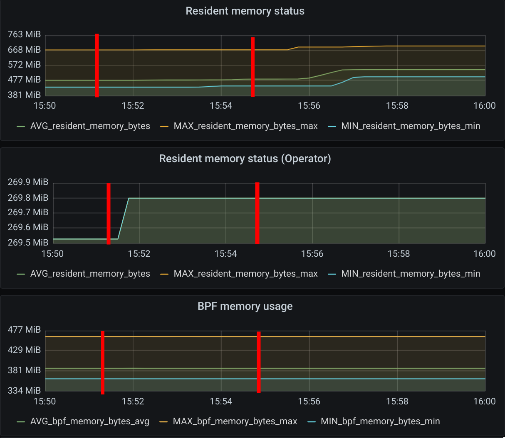
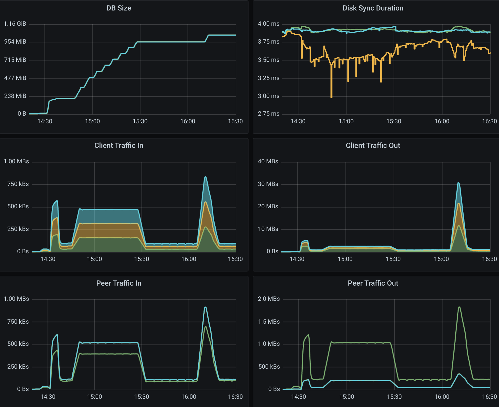

.. only:: not (epub or latex or html)

    WARNING: You are looking at unreleased Cilium documentation.
    Please use the official rendered version released here:
    https://docs.cilium.io

.. _scalability_guide:

******************
Scalability report
******************

This report is intended for users planning to run Cilium on clusters with more
than 200 nodes in CRD mode (without a kvstore available). In our development
cycle we have deployed Cilium on large clusters and these were the options that
were suitable for our testing:

=====
Setup
=====

.. code-block:: shell-session

 helm template cilium \\
     --namespace kube-system \\
     --set endpointHealthChecking.enabled=false \\
     --set healthChecking=false \\
     --set ipam.mode=kubernetes \\
     --set k8sServiceHost=<KUBE-APISERVER-LB-IP-ADDRESS> \\
     --set k8sServicePort=<KUBE-APISERVER-LB-PORT-NUMBER> \\
     --set prometheus.enabled=true \\
     --set operator.prometheus.enabled=true \\
   > cilium.yaml

* ``--set endpointHealthChecking.enabled=false`` and
  ``--set healthChecking=false`` disable endpoint health
  checking entirely. However it is recommended that those features be enabled
  initially on a smaller cluster (3-10 nodes) where it can be used to detect
  potential packet loss due to firewall rules or hypervisor settings.

* ``--set ipam.mode=kubernetes`` is set to ``"kubernetes"`` since our
  cloud provider has pod CIDR allocation enabled in ``kube-controller-manager``.

* ``--set k8sServiceHost`` and ``--set k8sServicePort`` were set
  with the IP address of the loadbalancer that was in front of ``kube-apiserver``.
  This allows Cilium to not depend on kube-proxy to connect to ``kube-apiserver``.

* ``--set prometheus.enabled=true`` and
  ``--set operator.prometheus.enabled=true`` were just set because we
  had a Prometheus server probing for metrics in the entire cluster.

Our testing cluster consisted of 3 controller nodes and 1000 worker nodes.
We have followed the recommended settings from the
`official Kubernetes documentation <https://kubernetes.io/docs/setup/best-practices/cluster-large/>`_
and have provisioned our machines with the following settings:

* **Cloud provider**: Google Cloud

* **Controllers**: 3x n1-standard-32 (32vCPU, 120GB memory and 50GB SSD, kernel 5.4.0-1009-gcp)

* **Workers**: 1 pool of 1000x custom-2-4096 (2vCPU, 4GB memory and 10GB HDD, kernel 5.4.0-1009-gcp)

* **Metrics**: 1x n1-standard-32 (32vCPU, 120GB memory and 10GB HDD + 500GB HDD)
  this is a dedicated node for prometheus and grafana pods.

.. note::

    All 3 controller nodes were behind a GCE load balancer.

    Each controller contained ``etcd``, ``kube-apiserver``,
    ``kube-controller-manager`` and ``kube-scheduler`` instances.

    The CPU, memory and disk size set for the workers might be different for
    your use case. You might have pods that require more memory or CPU available
    so you should design your workers based on your requirements.

    During our testing we had to set the ``etcd`` option
    ``quota-backend-bytes=17179869184`` because ``etcd`` failed once it reached
    around ``2GiB`` of allocated space.

    We provisioned our worker nodes without ``kube-proxy`` since Cilium is
    capable of performing all functionalities provided by ``kube-proxy``. We
    created a load balancer in front of ``kube-apiserver`` to allow Cilium to
    access ``kube-apiserver`` without ``kube-proxy``, and configured Cilium with
    the options ``--set k8sServiceHost=<KUBE-APISERVER-LB-IP-ADDRESS>``
    and ``--set k8sServicePort=<KUBE-APISERVER-LB-PORT-NUMBER>``.

    Our ``DaemonSet`` ``updateStrategy`` had the ``maxUnavailable`` set to 250
    pods instead of 2, but this value highly depends on your requirements when
    you are performing a rolling update of Cilium.

=====
Steps
=====

For each step we took, we provide more details below, with our findings and
expected behaviors.

^^^^^^^^^^^^^^^^^^^^^^^^^^^^^^^^^^^^^^^^^^^^^^^^^^^^^^^^^^^^^^^^
1. Install Kubernetes v1.18.3 with EndpointSlice feature enabled
^^^^^^^^^^^^^^^^^^^^^^^^^^^^^^^^^^^^^^^^^^^^^^^^^^^^^^^^^^^^^^^^

To test the most up-to-date functionalities from Kubernetes and Cilium, we have
performed our testing with Kubernetes v1.18.3 and the EndpointSlice feature
enabled to improve scalability.

Since Kubernetes requires an ``etcd`` cluster, we have deployed v3.4.9.

^^^^^^^^^^^^^^^^^^^^^^^^^^^^^^^^^^^^^^^^
2. Deploy Prometheus, Grafana and Cilium
^^^^^^^^^^^^^^^^^^^^^^^^^^^^^^^^^^^^^^^^

We have used Prometheus v2.18.1 and Grafana v7.0.1 to retrieve and analyze
``etcd``, ``kube-apiserver``, ``cilium`` and ``cilium-operator`` metrics.

^^^^^^^^^^^^^^^^^^^^^^^^^^^
3. Provision 2 worker nodes
^^^^^^^^^^^^^^^^^^^^^^^^^^^

This helped us to understand if our testing cluster was correctly provisioned
and all metrics were being gathered.

^^^^^^^^^^^^^^^^^^^^^^^^^^^^^^^^^^^^^^^^^^^^^^^^^^^^^^^^^^^^
4. Deploy 5 namespaces with 25 deployments on each namespace
^^^^^^^^^^^^^^^^^^^^^^^^^^^^^^^^^^^^^^^^^^^^^^^^^^^^^^^^^^^^

* Each deployment had 1 replica (125 pods in total).

* To measure **only** the resources consumed by Cilium, all deployments used
  the same base image ``registry.k8s.io/pause:3.2``. This image does not have any
  CPU or memory overhead.

* We provision a small number of pods in a small cluster to understand the CPU
  usage of Cilium:

.. figure:: images/image_4_01.png

The mark shows when the creation of 125 pods started.
As expected, we can see a slight increase of the CPU usage on both
Cilium agents running and in the Cilium operator. The agents peaked at 6.8% CPU
usage on a 2vCPU machine.

.. figure:: images/image_4_02.png

For the memory usage, we have not seen a significant memory growth in the
Cilium agent. On the eBPF memory side, we do see it increasing due to the
initialization of some eBPF maps for the new pods.

^^^^^^^^^^^^^^^^^^^^^^^^^^^^^^^^^^^^^^^^^^^^^^^^^^^^
5. Provision 998 additional nodes (total 1000 nodes)
^^^^^^^^^^^^^^^^^^^^^^^^^^^^^^^^^^^^^^^^^^^^^^^^^^^^

.. figure:: images/image_5_01.png

The first mark represents the action of creating nodes, the second mark
when 1000 Cilium pods were in ready state. The CPU usage increase is expected
since each Cilium agent receives events from Kubernetes whenever a new node is
provisioned in the cluster. Once all nodes were deployed the CPU usage was
0.15% on average on a 2vCPU node.

As we have increased the number of nodes in the cluster to 1000, it is expected
to see a small growth of the memory usage in all metrics. However, it is
relevant to point out that **an increase in the number of nodes does not cause
any significant increase in Cilium’s memory consumption in both control and
dataplane.**

^^^^^^^^^^^^^^^^^^^^^^^^^^^^^^^^^^^^^^^^^^^^^^^
6. Deploy 25 more deployments on each namespace
^^^^^^^^^^^^^^^^^^^^^^^^^^^^^^^^^^^^^^^^^^^^^^^

This will now bring us a total of
``5 namespaces * (25 old deployments + 25 new deployments)=250`` deployments in
the entire cluster.
We did not install 250 deployments from the start since we only had 2 nodes and
that would create 125 pods on each worker node. According to the Kubernetes
documentation the maximum recommended number of pods per node is 100.

^^^^^^^^^^^^^^^^^^^^^^^^^^^^^^^^^^^^^^^^^^^^^^^^^^^^^^^^^^^^^^
7. Scale each deployment to 200 replicas (50000 pods in total)
^^^^^^^^^^^^^^^^^^^^^^^^^^^^^^^^^^^^^^^^^^^^^^^^^^^^^^^^^^^^^^

Having 5 namespaces with 50 deployments means that we have 250 different unique
security identities. Having a low cardinality in the labels selected by Cilium
helps scale the cluster. By default, Cilium has a limit of 16k security
identities, but it can be increased with ``bpf-policy-map-max`` in the Cilium
``ConfigMap``.

.. figure:: images/image_7_01.png

The first mark represents the action of scaling up the deployments, the second
mark when 50000 pods were in ready state.

* It is expected to see the CPU usage of Cilium increase since, on each node,
  Cilium agents receive events from Kubernetes when a new pod is scheduled
  and started.

* The average CPU consumption of all Cilium agents was 3.38% on a 2vCPU machine.
  At one point, roughly around minute 15:23, one of those Cilium agents picked
  27.94% CPU usage.

* Cilium Operator had a stable 5% CPU consumption while the pods were being
  created.

.. figure:: images/image_7_02.png

Similar to the behavior seen while increasing the number of worker nodes,
adding new pods also increases Cilium memory consumption.

* As we increased the number of pods from 250 to 50000, we saw a maximum memory
  usage of 573MiB for one of the Cilium agents while the average was 438 MiB.
* For the eBPF memory usage we saw a max usage of 462.7MiB
* This means that each **Cilium agent's memory increased by 10.5KiB per new pod
  in the cluster.**

^^^^^^^^^^^^^^^^^^^^^^^^^^^^^^^^^^^^^^
8. Deploy 250 policies for 1 namespace
^^^^^^^^^^^^^^^^^^^^^^^^^^^^^^^^^^^^^^

Here we have created 125 L4 network policies and 125 L7 policies. Each policy
selected all pods on this namespace and was allowed to send traffic to another
pod on this namespace. Each of the 250 policies allows access to a disjoint set
of ports. In the end we will have 250 different policies selecting 10000 pods.

.. code-block:: yaml

    apiVersion: "cilium.io/v2"
    kind: CiliumNetworkPolicy
    metadata:
      name: "l4-rule-#"
      namespace: "namespace-1"
    spec:
      endpointSelector:
        matchLabels:
          my-label: testing
      fromEndpoints:
        matchLabels:
          my-label: testing
      egress:
        - toPorts:
          - ports:
            - port: "[0-125]+80" // from 80 to 12580
              protocol: TCP
    ---
    apiVersion: "cilium.io/v2"
    kind: CiliumNetworkPolicy
    metadata:
      name: "l7-rule-#"
      namespace: "namespace-1"
    spec:
      endpointSelector:
        matchLabels:
          my-label: testing
      fromEndpoints:
        matchLabels:
          my-label: testing
      ingress:
      - toPorts:
        - ports:
          - port: '[126-250]+80' // from 12680 to 25080
            protocol: TCP
          rules:
            http:
            - method: GET
              path: "/path1$"
            - method: PUT
              path: "/path2$"
              headers:
              - 'X-My-Header: true'

.. figure:: images/image_8_01.png

In this case we saw one of the Cilium agents jumping to 100% CPU usage for 15
seconds while the average peak was 40% during a period of 90 seconds.

.. figure:: images/image_8_02.png

As expected, **increasing the number of policies does not have a significant
impact on the memory usage of Cilium since the eBPF policy maps have a constant
size** once a pod is initialized.

.. figure:: images/image_8_03.png
.. figure:: images/image_8_04.png

The first mark represents the point in time when we ran ``kubectl create`` to
create the ``CiliumNetworkPolicies``. Since we created the 250 policies
sequentially, we cannot properly compute the convergence time. To do that,
we could use a single CNP with multiple policy rules defined under the
``specs`` field (instead of the ``spec`` field).

Nevertheless, we can see the time it took the last Cilium agent to increment its
Policy Revision, which is incremented individually on each Cilium agent every
time a CiliumNetworkPolicy (CNP) is received, between second ``15:45:44``
and ``15:45:46`` and see when was the last time an Endpoint was regenerated by
checking the 99th percentile of the "Endpoint regeneration time". In this
manner, that it took less than 5s. We can also verify **the maximum time was
less than 600ms for an endpoint to have the policy enforced.**

^^^^^^^^^^^^^^^^^^^^^^^^^^^^^^^^^^^^^^^^^^^^^^^^^^^^^^^^^^^^^^^^^^
9. Deploy 250 policies for CiliumClusterwideNetworkPolicies (CCNP)
^^^^^^^^^^^^^^^^^^^^^^^^^^^^^^^^^^^^^^^^^^^^^^^^^^^^^^^^^^^^^^^^^^

The difference between these policies and the previous ones installed is that
these select all pods in all namespaces. To recap, this means that we will now
have **250 different network policies selecting 10000 pods and 250 different
network policies selecting 50000 pods on a cluster with 1000 nodes.** Similarly
to the previous step we will deploy 125 L4 policies and another 125 L7 policies.

.. figure:: images/image_9_01.png

Similar to the creation of the previous 250 CNPs, there was also an increase in
CPU usage during the creation of the CCNPs. The CPU usage was similar even
though the policies were effectively selecting more pods.

.. figure:: images/image_9_03.png

As all pods running in a node are selected by **all 250 CCNPs created**, we see
an increase of the **Endpoint regeneration time** which **peaked a little above
3s.**

^^^^^^^^^^^^^^^^^^^^^^^^^^^^^^^^^^^^
10. "Accidentally" delete 10000 pods
^^^^^^^^^^^^^^^^^^^^^^^^^^^^^^^^^^^^

In this step we have "accidentally" deleted 10000 random pods. Kubernetes will
then recreate 10000 new pods so it will help us understand what the convergence
time is for all the deployed network polices.

.. figure:: images/image_10_01.png

* The first mark represents the point in time when pods were "deleted" and the
  second mark represents the point in time when Kubernetes finished recreating
  10k pods.

* Besides the CPU usage slightly increasing while pods are being scheduled in
  the cluster, we did see some interesting data points in the eBPF memory usage.
  As each endpoint can have one or more dedicated eBPF maps, the eBPF memory usage
  is directly proportional to the number of pods running in a node. **If the
  number of pods per node decreases so does the eBPF memory usage.**

We inferred the time it took for all the endpoints to get regenerated by looking
at the number of Cilium endpoints with the policy enforced over time.
Luckily enough we had another metric that was showing how many Cilium endpoints
had policy being enforced:

.. figure:: images/image_10_04.png

^^^^^^^^^^^^^^^^^^^^^^^^^^^^^^^^^^^^^^^^^^^
11. Control plane metrics over the test run
^^^^^^^^^^^^^^^^^^^^^^^^^^^^^^^^^^^^^^^^^^^

The focus of this test was to study the Cilium agent resource consumption at
scale. However, we also monitored some metrics of the control plane nodes such as
etcd metrics and CPU usage of the k8s-controllers and we present them in the
next figures.

Memory consumption of the 3 etcd instances during the entire scalability
testing.

.. figure:: images/image_11_02.png

CPU usage for the 3 controller nodes, average latency per request type in
the etcd cluster as well as the number of operations per second made to etcd.

All etcd metrics, from left to right, from top to bottom: database size,
disk sync duration, client traffic in, client traffic out, peer traffic in,
peer traffic out.

=============
Final Remarks
=============

These experiments helped us develop a better understanding of Cilium running
in a large cluster entirely in CRD mode and without depending on etcd. There is
still some work to be done to optimize the memory footprint of eBPF maps even
further, as well as reducing the memory footprint of the Cilium agent. We will
address those in the next Cilium version.

We can also determine that it is scalable to run Cilium in CRD mode on a cluster
with more than 200 nodes. However, it is worth pointing out that we need to run
more tests to verify Cilium's behavior when it loses the connectivity with
``kube-apiserver``, as can happen during a control plane upgrade for example.
This will also be our focus in the next Cilium version.
