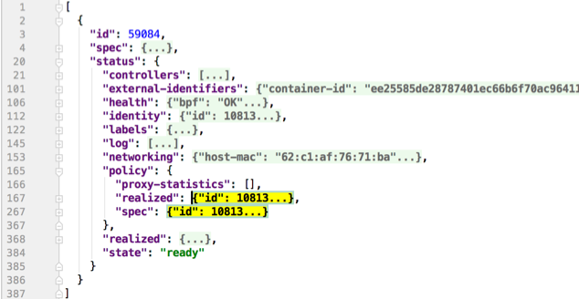

.. only:: not (epub or latex or html)

    WARNING: You are looking at unreleased Cilium documentation.
    Please use the official rendered version released here:
    https://docs.cilium.io

.. _admin_guide:

###############
Troubleshooting
###############

This document describes how to troubleshoot Cilium in different deployment
modes. It focuses on a full deployment of Cilium within a datacenter or public
cloud. If you are just looking for a simple way to experiment, we highly
recommend trying out the :ref:`getting_started` guide instead.

This guide assumes that you have read the :ref:`network_root` and `security_root` which explain all
the components and concepts.

We use GitHub issues to maintain a list of `Cilium Frequently Asked Questions
(FAQ)`_. You can also check there to see if your question(s) is already
addressed.

Component & Cluster Health
==========================

Kubernetes
----------

An initial overview of Cilium can be retrieved by listing all pods to verify
whether all pods have the status ``Running``:

.. code-block:: shell-session

   $ kubectl -n kube-system get pods -l k8s-app=cilium
   NAME           READY     STATUS    RESTARTS   AGE
   cilium-2hq5z   1/1       Running   0          4d
   cilium-6kbtz   1/1       Running   0          4d
   cilium-klj4b   1/1       Running   0          4d
   cilium-zmjj9   1/1       Running   0          4d

If Cilium encounters a problem that it cannot recover from, it will
automatically report the failure state via ``cilium status`` which is regularly
queried by the Kubernetes liveness probe to automatically restart Cilium pods.
If a Cilium pod is in state ``CrashLoopBackoff`` then this indicates a
permanent failure scenario.

Detailed Status
~~~~~~~~~~~~~~~

If a particular Cilium pod is not in running state, the status and health of
the agent on that node can be retrieved by running ``cilium status`` in the
context of that pod:

.. code-block:: shell-session

   $ kubectl -n kube-system exec cilium-2hq5z -- cilium status
   KVStore:                Ok   etcd: 1/1 connected: http://demo-etcd-lab--a.etcd.tgraf.test1.lab.corp.isovalent.link:2379 - 3.2.5 (Leader)
   ContainerRuntime:       Ok   docker daemon: OK
   Kubernetes:             Ok   OK
   Kubernetes APIs:        ["cilium/v2::CiliumNetworkPolicy", "networking.k8s.io/v1::NetworkPolicy", "core/v1::Service", "core/v1::Endpoint", "core/v1::Node", "CustomResourceDefinition"]
   Cilium:                 Ok   OK
   NodeMonitor:            Disabled
   Cilium health daemon:   Ok
   Controller Status:      14/14 healthy
   Proxy Status:           OK, ip 10.2.0.172, port-range 10000-20000
   Cluster health:   4/4 reachable   (2018-06-16T09:49:58Z)

Alternatively, the ``k8s-cilium-exec.sh`` script can be used to run ``cilium
status`` on all nodes. This will provide detailed status and health information
of all nodes in the cluster:

.. code-block:: shell-session

   curl -sLO https://raw.githubusercontent.com/cilium/cilium/main/contrib/k8s/k8s-cilium-exec.sh
   chmod +x ./k8s-cilium-exec.sh

... and run ``cilium status`` on all nodes:

.. code-block:: shell-session

   $ ./k8s-cilium-exec.sh cilium status
   KVStore:                Ok   Etcd: http://127.0.0.1:2379 - (Leader) 3.1.10
   ContainerRuntime:       Ok
   Kubernetes:             Ok   OK
   Kubernetes APIs:        ["networking.k8s.io/v1beta1::Ingress", "core/v1::Node", "CustomResourceDefinition", "cilium/v2::CiliumNetworkPolicy", "networking.k8s.io/v1::NetworkPolicy", "core/v1::Service", "core/v1::Endpoint"]
   Cilium:                 Ok   OK
   NodeMonitor:            Listening for events on 2 CPUs with 64x4096 of shared memory
   Cilium health daemon:   Ok
   Controller Status:      7/7 healthy
   Proxy Status:           OK, ip 10.15.28.238, 0 redirects, port-range 10000-20000
   Cluster health:   1/1 reachable   (2018-02-27T00:24:34Z)

Detailed information about the status of Cilium can be inspected with the
``cilium status --verbose`` command. Verbose output includes detailed IPAM state
(allocated addresses), Cilium controller status, and details of the Proxy
status.

.. _ts_agent_logs:

Logs
~~~~

To retrieve log files of a cilium pod, run (replace ``cilium-1234`` with a pod
name returned by ``kubectl -n kube-system get pods -l k8s-app=cilium``)

.. code-block:: shell-session

   kubectl -n kube-system logs --timestamps cilium-1234

If the cilium pod was already restarted due to the liveness problem after
encountering an issue, it can be useful to retrieve the logs of the pod before
the last restart:

.. code-block:: shell-session

   kubectl -n kube-system logs --timestamps -p cilium-1234

Generic
-------

When logged in a host running Cilium, the cilium CLI can be invoked directly,
e.g.:

.. code-block:: shell-session

   $ cilium status
   KVStore:                Ok   etcd: 1/1 connected: https://192.168.60.11:2379 - 3.2.7 (Leader)
   ContainerRuntime:       Ok
   Kubernetes:             Ok   OK
   Kubernetes APIs:        ["core/v1::Endpoint", "networking.k8s.io/v1beta1::Ingress", "core/v1::Node", "CustomResourceDefinition", "cilium/v2::CiliumNetworkPolicy", "networking.k8s.io/v1::NetworkPolicy", "core/v1::Service"]
   Cilium:                 Ok   OK
   NodeMonitor:            Listening for events on 2 CPUs with 64x4096 of shared memory
   Cilium health daemon:   Ok
   IPv4 address pool:      261/65535 allocated
   IPv6 address pool:      4/4294967295 allocated
   Controller Status:      20/20 healthy
   Proxy Status:           OK, ip 10.0.28.238, port-range 10000-20000
   Hubble:                 Ok      Current/Max Flows: 2542/4096 (62.06%), Flows/s: 164.21      Metrics: Disabled
   Cluster health:         2/2 reachable   (2018-04-11T15:41:01Z)

.. _hubble_troubleshooting:

Observing Flows with Hubble
===========================

Hubble is a built-in observability tool which allows you to inspect recent flow
events on all endpoints managed by Cilium.

Ensure Hubble is running correctly
----------------------------------

To ensure the Hubble client can connect to the Hubble server running inside
Cilium, you may use the ``hubble status`` command from within a Cilium pod:

.. code-block:: shell-session

   $ hubble status
   Healthcheck (via unix:///var/run/cilium/hubble.sock): Ok
   Current/Max Flows: 4095/4095 (100.00%)
   Flows/s: 164.21

``cilium-agent`` must be running with the ``--enable-hubble`` option (default) in order
for the Hubble server to be enabled. When deploying Cilium with Helm, make sure
to set the ``hubble.enabled=true`` value.

To check if Hubble is enabled in your deployment, you may look for the
following output in ``cilium status``:

.. code-block:: shell-session

   $ cilium status
   ...
   Hubble:   Ok   Current/Max Flows: 4095/4095 (100.00%), Flows/s: 164.21   Metrics: Disabled
   ...

.. note::
   Pods need to be managed by Cilium in order to be observable by Hubble.
   See how to :ref:`ensure a pod is managed by Cilium<ensure_managed_pod>`
   for more details.

Observing flows of a specific pod
---------------------------------

In order to observe the traffic of a specific pod, you will first have to
:ref:`retrieve the name of the cilium instance managing it<retrieve_cilium_pod>`.
The Hubble CLI is part of the Cilium container image and can be accessed via
``kubectl exec``. The following query for example will show all events related
to flows which either originated or terminated in the ``default/tiefighter`` pod
in the last three minutes:

.. code-block:: shell-session

   $ kubectl exec -n kube-system cilium-77lk6 -- hubble observe --since 3m --pod default/tiefighter
   May  4 12:47:08.811: default/tiefighter:53875 -> kube-system/coredns-74ff55c5b-66f4n:53 to-endpoint FORWARDED (UDP)
   May  4 12:47:08.811: default/tiefighter:53875 -> kube-system/coredns-74ff55c5b-66f4n:53 to-endpoint FORWARDED (UDP)
   May  4 12:47:08.811: default/tiefighter:53875 <- kube-system/coredns-74ff55c5b-66f4n:53 to-endpoint FORWARDED (UDP)
   May  4 12:47:08.811: default/tiefighter:53875 <- kube-system/coredns-74ff55c5b-66f4n:53 to-endpoint FORWARDED (UDP)
   May  4 12:47:08.811: default/tiefighter:50214 <> default/deathstar-c74d84667-cx5kp:80 to-overlay FORWARDED (TCP Flags: SYN)
   May  4 12:47:08.812: default/tiefighter:50214 <- default/deathstar-c74d84667-cx5kp:80 to-endpoint FORWARDED (TCP Flags: SYN, ACK)
   May  4 12:47:08.812: default/tiefighter:50214 <> default/deathstar-c74d84667-cx5kp:80 to-overlay FORWARDED (TCP Flags: ACK)
   May  4 12:47:08.812: default/tiefighter:50214 <> default/deathstar-c74d84667-cx5kp:80 to-overlay FORWARDED (TCP Flags: ACK, PSH)
   May  4 12:47:08.812: default/tiefighter:50214 <- default/deathstar-c74d84667-cx5kp:80 to-endpoint FORWARDED (TCP Flags: ACK, PSH)
   May  4 12:47:08.812: default/tiefighter:50214 <> default/deathstar-c74d84667-cx5kp:80 to-overlay FORWARDED (TCP Flags: ACK, FIN)
   May  4 12:47:08.812: default/tiefighter:50214 <- default/deathstar-c74d84667-cx5kp:80 to-endpoint FORWARDED (TCP Flags: ACK, FIN)
   May  4 12:47:08.812: default/tiefighter:50214 <> default/deathstar-c74d84667-cx5kp:80 to-overlay FORWARDED (TCP Flags: ACK)

You may also use ``-o json`` to obtain more detailed information about each
flow event.

.. note::
   **Hubble Relay**  allows you to query multiple Hubble instances
   simultaneously without having to first manually target a specific node.  See
   `Observing flows with Hubble Relay`_ for more information.

Observing flows with Hubble Relay
=================================

Hubble Relay is a service which allows to query multiple Hubble instances
simultaneously and aggregate the results. See :ref:`hubble_setup` to enable
Hubble Relay if it is not yet enabled and install the Hubble CLI on your local
machine.

You may access the Hubble Relay service by port-forwarding it locally:

.. code-block:: shell-session

   kubectl -n kube-system port-forward service/hubble-relay --address 0.0.0.0 --address :: 4245:80

This will forward the Hubble Relay service port (``80``) to your local machine
on port ``4245`` on all of it's IP addresses.

You can verify that Hubble Relay can be reached by using the Hubble CLI and
running the following command from your local machine:

.. code-block:: shell-session

   hubble status

This command should return an output similar to the following:

::

   Healthcheck (via localhost:4245): Ok
   Current/Max Flows: 16380/16380 (100.00%)
   Flows/s: 46.19
   Connected Nodes: 4/4

You may see details about nodes that Hubble Relay is connected to by running
the following command:

.. code-block:: shell-session

   hubble list nodes

As Hubble Relay shares the same API as individual Hubble instances, you may
follow the `Observing flows with Hubble`_ section keeping in mind that
limitations with regards to what can be seen from individual Hubble instances no
longer apply.

Connectivity Problems
=====================

Cilium connectivity tests
------------------------------------

The Cilium connectivity test deploys a series of services, deployments, and
CiliumNetworkPolicy which will use various connectivity paths to connect to
each other. Connectivity paths include with and without service load-balancing
and various network policy combinations.

.. note::
   The connectivity tests this will only work in a namespace with no other pods
   or network policies applied. If there is a Cilium Clusterwide Network Policy
   enabled, that may also break this connectivity check.

To run the connectivity tests create an isolated test namespace called
``cilium-test`` to deploy the tests with.

.. parsed-literal::

   kubectl create ns cilium-test
   kubectl apply --namespace=cilium-test -f \ |SCM_WEB|\/examples/kubernetes/connectivity-check/connectivity-check.yaml

The tests cover various functionality of the system. Below we call out each test
type. If tests pass, it suggests functionality of the referenced subsystem.

+----------------------------+-----------------------------+-------------------------------+-----------------------------+----------------------------------------+
| Pod-to-pod (intra-host)    | Pod-to-pod (inter-host)     | Pod-to-service (intra-host)   | Pod-to-service (inter-host) | Pod-to-external resource               |
+============================+=============================+===============================+=============================+========================================+
| eBPF routing is functional | Data plane, routing, network| eBPF service map lookup       | VXLAN overlay port if used  | Egress, CiliumNetworkPolicy, masquerade|
+----------------------------+-----------------------------+-------------------------------+-----------------------------+----------------------------------------+

The pod name indicates the connectivity
variant and the readiness and liveness gate indicates success or failure of the
test:

.. code-block:: shell-session

   $ kubectl get pods -n cilium-test
   NAME                                                    READY   STATUS    RESTARTS   AGE
   echo-a-6788c799fd-42qxx                                 1/1     Running   0          69s
   echo-b-59757679d4-pjtdl                                 1/1     Running   0          69s
   echo-b-host-f86bd784d-wnh4v                             1/1     Running   0          68s
   host-to-b-multi-node-clusterip-585db65b4d-x74nz         1/1     Running   0          68s
   host-to-b-multi-node-headless-77c64bc7d8-kgf8p          1/1     Running   0          67s
   pod-to-a-allowed-cnp-87b5895c8-bfw4x                    1/1     Running   0          68s
   pod-to-a-b76ddb6b4-2v4kb                                1/1     Running   0          68s
   pod-to-a-denied-cnp-677d9f567b-kkjp4                    1/1     Running   0          68s
   pod-to-b-intra-node-nodeport-8484fb6d89-bwj8q           1/1     Running   0          68s
   pod-to-b-multi-node-clusterip-f7655dbc8-h5bwk           1/1     Running   0          68s
   pod-to-b-multi-node-headless-5fd98b9648-5bjj8           1/1     Running   0          68s
   pod-to-b-multi-node-nodeport-74bd8d7bd5-kmfmm           1/1     Running   0          68s
   pod-to-external-1111-7489c7c46d-jhtkr                   1/1     Running   0          68s
   pod-to-external-fqdn-allow-google-cnp-b7b6bcdcb-97p75   1/1     Running   0          68s

Information about test failures can be determined by describing a failed test
pod

.. code-block:: shell-session

   $ kubectl describe pod pod-to-b-intra-node-hostport
     Warning  Unhealthy  6s (x6 over 56s)   kubelet, agent1    Readiness probe failed: curl: (7) Failed to connect to echo-b-host-headless port 40000: Connection refused
     Warning  Unhealthy  2s (x3 over 52s)   kubelet, agent1    Liveness probe failed: curl: (7) Failed to connect to echo-b-host-headless port 40000: Connection refused

.. _cluster_connectivity_health:

Checking cluster connectivity health
------------------------------------

Cilium can rule out network fabric related issues when troubleshooting
connectivity issues by providing reliable health and latency probes between all
cluster nodes and a simulated workload running on each node.

By default when Cilium is run, it launches instances of ``cilium-health`` in
the background to determine the overall connectivity status of the cluster. This
tool periodically runs bidirectional traffic across multiple paths through the
cluster and through each node using different protocols to determine the health
status of each path and protocol. At any point in time, cilium-health may be
queried for the connectivity status of the last probe.

.. code-block:: shell-session

   $ kubectl -n kube-system exec -ti cilium-2hq5z -- cilium-health status
   Probe time:   2018-06-16T09:51:58Z
   Nodes:
     ip-172-0-52-116.us-west-2.compute.internal (localhost):
       Host connectivity to 172.0.52.116:
         ICMP to stack: OK, RTT=315.254µs
         HTTP to agent: OK, RTT=368.579µs
       Endpoint connectivity to 10.2.0.183:
         ICMP to stack: OK, RTT=190.658µs
         HTTP to agent: OK, RTT=536.665µs
     ip-172-0-117-198.us-west-2.compute.internal:
       Host connectivity to 172.0.117.198:
         ICMP to stack: OK, RTT=1.009679ms
         HTTP to agent: OK, RTT=1.808628ms
       Endpoint connectivity to 10.2.1.234:
         ICMP to stack: OK, RTT=1.016365ms
         HTTP to agent: OK, RTT=2.29877ms

For each node, the connectivity will be displayed for each protocol and path,
both to the node itself and to an endpoint on that node. The latency specified
is a snapshot at the last time a probe was run, which is typically once per
minute. The ICMP connectivity row represents Layer 3 connectivity to the
networking stack, while the HTTP connectivity row represents connection to an
instance of the ``cilium-health`` agent running on the host or as an endpoint.

.. _monitor:

Monitoring Datapath State
-------------------------

Sometimes you may experience broken connectivity, which may be due to a
number of different causes. A main cause can be unwanted packet drops on
the networking level. The tool
``cilium monitor`` allows you to quickly inspect and see if and where packet
drops happen. Following is an example output (use ``kubectl exec`` as in
previous examples if running with Kubernetes):

.. code-block:: shell-session

   $ kubectl -n kube-system exec -ti cilium-2hq5z -- cilium monitor --type drop
   Listening for events on 2 CPUs with 64x4096 of shared memory
   Press Ctrl-C to quit
   xx drop (Policy denied) to endpoint 25729, identity 261->264: fd02::c0a8:210b:0:bf00 -> fd02::c0a8:210b:0:6481 EchoRequest
   xx drop (Policy denied) to endpoint 25729, identity 261->264: fd02::c0a8:210b:0:bf00 -> fd02::c0a8:210b:0:6481 EchoRequest
   xx drop (Policy denied) to endpoint 25729, identity 261->264: 10.11.13.37 -> 10.11.101.61 EchoRequest
   xx drop (Policy denied) to endpoint 25729, identity 261->264: 10.11.13.37 -> 10.11.101.61 EchoRequest
   xx drop (Invalid destination mac) to endpoint 0, identity 0->0: fe80::5c25:ddff:fe8e:78d8 -> ff02::2 RouterSolicitation

The above indicates that a packet to endpoint ID ``25729`` has been dropped due
to violation of the Layer 3 policy.

Handling drop (CT: Map insertion failed)
~~~~~~~~~~~~~~~~~~~~~~~~~~~~~~~~~~~~~~~~

If connectivity fails and ``cilium monitor --type drop`` shows ``xx drop (CT:
Map insertion failed)``, then it is likely that the connection tracking table
is filling up and the automatic adjustment of the garbage collector interval is
insufficient.

Setting ``--conntrack-gc-interval`` to an interval lower than the current value
may help. This controls the time interval between two garbage collection runs.

By default ``--conntrack-gc-interval`` is set to 0 which translates to
using a dynamic interval. In that case, the interval is updated after each
garbage collection run depending on how many entries where garbage collected.
If very few or no entries were garbage collected, the interval will increase;
if many entries were garbage collected, it will decrease. The current interval
value is reported in the Cilium agent logs.

Alternatively, the value for ``bpf-ct-global-any-max`` and
``bpf-ct-global-tcp-max`` can be increased. Setting both of these options will
be a trade-off of CPU for ``conntrack-gc-interval``, and for
``bpf-ct-global-any-max`` and ``bpf-ct-global-tcp-max`` the amount of memory
consumed. You can track conntrack garbage collection related metrics such as
``datapath_conntrack_gc_runs_total`` and ``datapath_conntrack_gc_entries`` to
get visibility into garbage collection runs. Refer to :ref:`metrics` for more
details.

Enabling datapath debug messages
~~~~~~~~~~~~~~~~~~~~~~~~~~~~~~~~

By default, datapath debug messages are disabled, and therefore not shown in
``cilium monitor -v`` output. To enable them, add ``"datapath"`` to
the ``debug-verbose`` option.

Policy Troubleshooting
======================

.. _ensure_managed_pod:

Ensure pod is managed by Cilium
-------------------------------

A potential cause for policy enforcement not functioning as expected is that
the networking of the pod selected by the policy is not being managed by
Cilium. The following situations result in unmanaged pods:

* The pod is running in host networking and will use the host's IP address
  directly. Such pods have full network connectivity but Cilium will not
  provide security policy enforcement for such pods by default. To enforce
  policy against these pods, either set ``hostNetwork`` to false or use
  :ref:`HostPolicies`.

* The pod was started before Cilium was deployed. Cilium only manages pods
  that have been deployed after Cilium itself was started. Cilium will not
  provide security policy enforcement for such pods. These pods should be
  restarted in order to ensure that Cilium can provide security policy
  enforcement.

If pod networking is not managed by Cilium. Ingress and egress policy rules
selecting the respective pods will not be applied. See the section
:ref:`network_policy` for more details.

For a quick assessment of whether any pods are not managed by Cilium, the
`Cilium CLI <https://github.com/cilium/cilium-cli>`_ will print the number
of managed pods. If this prints that all of the pods are managed by Cilium,
then there is no problem:

.. code-block:: shell-session

   $ cilium status
       /¯¯\
    /¯¯\__/¯¯\    Cilium:         OK
    \__/¯¯\__/    Operator:       OK
    /¯¯\__/¯¯\    Hubble:         OK
    \__/¯¯\__/    ClusterMesh:    disabled
       \__/

   Deployment        cilium-operator    Desired: 2, Ready: 2/2, Available: 2/2
   Deployment        hubble-relay       Desired: 1, Ready: 1/1, Available: 1/1
   Deployment        hubble-ui          Desired: 1, Ready: 1/1, Available: 1/1
   DaemonSet         cilium             Desired: 2, Ready: 2/2, Available: 2/2
   Containers:       cilium-operator    Running: 2
                     hubble-relay       Running: 1
                     hubble-ui          Running: 1
                     cilium             Running: 2
   Cluster Pods:     5/5 managed by Cilium
   ...

You can run the following script to list the pods which are *not* managed by
Cilium:

.. code-block:: shell-session

   $ curl -sLO https://raw.githubusercontent.com/cilium/cilium/main/contrib/k8s/k8s-unmanaged.sh
   $ chmod +x k8s-unmanaged.sh
   $ ./k8s-unmanaged.sh
   kube-system/cilium-hqpk7
   kube-system/kube-addon-manager-minikube
   kube-system/kube-dns-54cccfbdf8-zmv2c
   kube-system/kubernetes-dashboard-77d8b98585-g52k5
   kube-system/storage-provisioner

Understand the rendering of your policy
---------------------------------------

There are always multiple ways to approach a problem. Cilium can provide the
rendering of the aggregate policy provided to it, leaving you to simply compare
with what you expect the policy to actually be rather than search (and
potentially overlook) every policy. At the expense of reading a very large dump
of an endpoint, this is often a faster path to discovering errant policy
requests in the Kubernetes API.

Start by finding the endpoint you are debugging from the following list. There
are several cross references for you to use in this list, including the IP
address and pod labels:

.. code-block:: shell-session

    kubectl -n kube-system exec -ti cilium-q8wvt -- cilium endpoint list

When you find the correct endpoint, the first column of every row is the
endpoint ID. Use that to dump the full endpoint information:

.. code-block:: shell-session

    kubectl -n kube-system exec -ti cilium-q8wvt -- cilium endpoint get 59084

Importing this dump into a JSON-friendly editor can help browse and navigate the
information here. At the top level of the dump, there are two nodes of note:

* ``spec``: The desired state of the endpoint
* ``status``: The current state of the endpoint

This is the standard Kubernetes control loop pattern. Cilium is the controller
here, and it is iteratively working to bring the ``status`` in line with the
``spec``.

Opening the ``status``, we can drill down through ``policy.realized.l4``. Do
your ``ingress`` and ``egress`` rules match what you expect? If not, the
reference to the errant rules can be found in the ``derived-from-rules`` node.

etcd (kvstore)
==============

Introduction
------------

Cilium can be operated in CRD-mode and kvstore/etcd mode. When cilium is
running in kvstore/etcd mode, the kvstore becomes a vital component of the
overall cluster health as it is required to be available for several
operations.

Operations for which the kvstore is strictly required when running in etcd
mode:

Scheduling of new workloads:
  As part of scheduling workloads/endpoints, agents will perform security
  identity allocation which requires interaction with the kvstore. If a
  workload can be scheduled due to re-using a known security identity, then
  state propagation of the endpoint details to other nodes will still depend on
  the kvstore and thus packets drops due to policy enforcement may be observed
  as other nodes in the cluster will not be aware of the new workload.

Multi cluster:
  All state propagation between clusters depends on the kvstore.

Node discovery:
  New nodes require to register themselves in the kvstore.

Agent bootstrap:
  The Cilium agent will eventually fail if it can't connect to the kvstore at
  bootstrap time, however, the agent will still perform all possible operations
  while waiting for the kvstore to appear.

Operations which *do not* require kvstore availability:

All datapath operations:
  All datapath forwarding, policy enforcement and visibility functions for
  existing workloads/endpoints do not depend on the kvstore. Packets will
  continue to be forwarded and network policy rules will continue to be
  enforced.

  However, if the agent requires to restart as part of the
  :ref:`etcd_recovery_behavior`, there can be delays in:

  * processing of flow events and metrics
  * short unavailability of layer 7 proxies

NetworkPolicy updates:
  Network policy updates will continue to be processed and applied.

Services updates:
  All updates to services will be processed and applied.

Understanding etcd status
-------------------------

The etcd status is reported when running ``cilium status``. The following line
represents the status of etcd::

   KVStore:  Ok  etcd: 1/1 connected, lease-ID=29c6732d5d580cb5, lock lease-ID=29c6732d5d580cb7, has-quorum=true: https://192.168.60.11:2379 - 3.4.9 (Leader)

OK:
  The overall status. Either ``OK`` or ``Failure``.

1/1 connected:
  Number of total etcd endpoints and how many of them are reachable.

lease-ID:
  UUID of the lease used for all keys owned by this agent.

lock lease-ID:
  UUID of the lease used for locks acquired by this agent.

has-quorum:
  Status of etcd quorum. Either ``true`` or set to an error.

consecutive-errors:
  Number of consecutive quorum errors. Only printed if errors are present.

https://192.168.60.11:2379 - 3.4.9 (Leader):
  List of all etcd endpoints stating the etcd version and whether the
  particular endpoint is currently the elected leader. If an etcd endpoint
  cannot be reached, the error is shown.

.. _etcd_recovery_behavior:

Recovery behavior
-----------------

In the event of an etcd endpoint becoming unhealthy, etcd should automatically
resolve this by electing a new leader and by failing over to a healthy etcd
endpoint. As long as quorum is preserved, the etcd cluster will remain
functional.

In addition, Cilium performs a background check in an interval to determine
etcd health and potentially take action. The interval depends on the overall
cluster size. The larger the cluster, the longer the `interval
<https://pkg.go.dev/github.com/cilium/cilium/pkg/kvstore?tab=doc#ExtraOptions.StatusCheckInterval>`_:

 * If no etcd endpoints can be reached, Cilium will report failure in ``cilium
   status``. This will cause the liveness and readiness probe of Kubernetes to
   fail and Cilium will be restarted.

 * A lock is acquired and released to test a write operation which requires
   quorum. If this operation fails, loss of quorum is reported. If quorum fails
   for three or more intervals in a row, Cilium is declared unhealthy.

 * The Cilium operator will constantly write to a heartbeat key
   (``cilium/.heartbeat``). All Cilium agents will watch for updates to this
   heartbeat key. This validates the ability for an agent to receive key
   updates from etcd. If the heartbeat key is not updated in time, the quorum
   check is declared to have failed and Cilium is declared unhealthy after 3 or
   more consecutive failures.

Example of a status with a quorum failure which has not yet reached the
threshold::

    KVStore: Ok   etcd: 1/1 connected, lease-ID=29c6732d5d580cb5, lock lease-ID=29c6732d5d580cb7, has-quorum=2m2.778966915s since last heartbeat update has been received, consecutive-errors=1: https://192.168.60.11:2379 - 3.4.9 (Leader)

Example of a status with the number of quorum failures exceeding the threshold::

    KVStore: Failure   Err: quorum check failed 8 times in a row: 4m28.446600949s since last heartbeat update has been received

.. _troubleshooting_clustermesh:

.. include:: ./troubleshooting_clustermesh.rst

.. _troubleshooting_servicemesh:

.. include:: troubleshooting_servicemesh.rst

Symptom Library
===============

Node to node traffic is being dropped
-------------------------------------

Symptom
~~~~~~~

Endpoint to endpoint communication on a single node succeeds but communication
fails between endpoints across multiple nodes.

Troubleshooting steps:
~~~~~~~~~~~~~~~~~~~~~~

#. Run ``cilium-health status`` on the node of the source and destination
   endpoint. It should describe the connectivity from that node to other
   nodes in the cluster, and to a simulated endpoint on each other node.
   Identify points in the cluster that cannot talk to each other. If the
   command does not describe the status of the other node, there may be an
   issue with the KV-Store.

#. Run ``cilium monitor`` on the node of the source and destination endpoint.
   Look for packet drops.

   When running in :ref:`arch_overlay` mode:

#. Run ``cilium bpf tunnel list`` and verify that each Cilium node is aware of
   the other nodes in the cluster.  If not, check the logfile for errors.

#. If nodes are being populated correctly, run ``tcpdump -n -i cilium_vxlan`` on
   each node to verify whether cross node traffic is being forwarded correctly
   between nodes.

   If packets are being dropped,

   * verify that the node IP listed in ``cilium bpf tunnel list`` can reach each
     other.
   * verify that the firewall on each node allows UDP port 8472.

   When running in :ref:`arch_direct_routing` mode:

#. Run ``ip route`` or check your cloud provider router and verify that you have
   routes installed to route the endpoint prefix between all nodes.

#. Verify that the firewall on each node permits to route the endpoint IPs.

Useful Scripts
==============

.. _retrieve_cilium_pod:

Retrieve Cilium pod managing a particular pod
---------------------------------------------

Identifies the Cilium pod that is managing a particular pod in a namespace:

.. code-block:: shell-session

    k8s-get-cilium-pod.sh <pod> <namespace>

**Example:**

.. code-block:: shell-session

    $ curl -sLO https://raw.githubusercontent.com/cilium/cilium/main/contrib/k8s/k8s-get-cilium-pod.sh
    $ chmod +x k8s-get-cilium-pod.sh
    $ ./k8s-get-cilium-pod.sh luke-pod default
    cilium-zmjj9
    cilium-node-init-v7r9p
    cilium-operator-f576f7977-s5gpq

Execute a command in all Kubernetes Cilium pods
-----------------------------------------------

Run a command within all Cilium pods of a cluster

.. code-block:: shell-session

    k8s-cilium-exec.sh <command>

**Example:**

.. code-block:: shell-session

    $ curl -sLO https://raw.githubusercontent.com/cilium/cilium/main/contrib/k8s/k8s-cilium-exec.sh
    $ chmod +x k8s-cilium-exec.sh
    $ ./k8s-cilium-exec.sh uptime
     10:15:16 up 6 days,  7:37,  0 users,  load average: 0.00, 0.02, 0.00
     10:15:16 up 6 days,  7:32,  0 users,  load average: 0.00, 0.03, 0.04
     10:15:16 up 6 days,  7:30,  0 users,  load average: 0.75, 0.27, 0.15
     10:15:16 up 6 days,  7:28,  0 users,  load average: 0.14, 0.04, 0.01

List unmanaged Kubernetes pods
------------------------------

Lists all Kubernetes pods in the cluster for which Cilium does *not* provide
networking. This includes pods running in host-networking mode and pods that
were started before Cilium was deployed.

.. code-block:: shell-session

   k8s-unmanaged.sh

**Example:**

.. code-block:: shell-session

   $ curl -sLO https://raw.githubusercontent.com/cilium/cilium/main/contrib/k8s/k8s-unmanaged.sh
   $ chmod +x k8s-unmanaged.sh
   $ ./k8s-unmanaged.sh
   kube-system/cilium-hqpk7
   kube-system/kube-addon-manager-minikube
   kube-system/kube-dns-54cccfbdf8-zmv2c
   kube-system/kubernetes-dashboard-77d8b98585-g52k5
   kube-system/storage-provisioner

Reporting a problem
===================

Before you report a problem, make sure to retrieve the necessary information
from your cluster before the failure state is lost.

Automatic log & state collection
--------------------------------

.. include:: ../installation/cli-download.rst

Then, execute ``cilium sysdump`` command to collect troubleshooting information
from your Kubernetes cluster:

.. code-block:: shell-session

   cilium sysdump

Note that by default ``cilium sysdump`` will attempt to collect as much logs as
possible and for all the nodes in the cluster. If your cluster size is above 20
nodes, consider setting the following options to limit the size of the sysdump.
This is not required, but useful for those who have a constraint on bandwidth or
upload size.

* set the ``--node-list`` option to pick only a few nodes in case the cluster has
  many of them.
* set the ``--logs-since-time`` option to go back in time to when the issues started.
* set the ``--logs-limit-bytes`` option to limit the size of the log files (note:
  passed onto ``kubectl logs``; does not apply to entire collection archive).

Ideally, a sysdump that has a full history of select nodes, rather than a brief
history of all the nodes, would be preferred (by using ``--node-list``). The second
recommended way would be to use ``--logs-since-time`` if you are able to narrow down
when the issues started. Lastly, if the Cilium agent and Operator logs are too
large, consider ``--logs-limit-bytes``.

Use ``--help`` to see more options:

.. code-block:: shell-session

   cilium sysdump --help

Single Node Bugtool
~~~~~~~~~~~~~~~~~~~

If you are not running Kubernetes, it is also possible to run the bug
collection tool manually with the scope of a single node:

The ``cilium-bugtool`` captures potentially useful information about your
environment for debugging. The tool is meant to be used for debugging a single
Cilium agent node. In the Kubernetes case, if you have multiple Cilium pods,
the tool can retrieve debugging information from all of them. The tool works by
archiving a collection of command output and files from several places. By
default, it writes to the ``tmp`` directory.

Note that the command needs to be run from inside the Cilium pod/container.

.. code-block:: shell-session

   cilium-bugtool

When running it with no option as shown above, it will try to copy various
files and execute some commands. If ``kubectl`` is detected, it will search for
Cilium pods. The default label being ``k8s-app=cilium``, but this and the
namespace can be changed via ``k8s-namespace`` and ``k8s-label`` respectively.

If you want to capture the archive from a Kubernetes pod, then the process is a
bit different

.. code-block:: shell-session

   $ # First we need to get the Cilium pod
   $ kubectl get pods --namespace kube-system
   NAME                          READY     STATUS    RESTARTS   AGE
   cilium-kg8lv                  1/1       Running   0          13m
   kube-addon-manager-minikube   1/1       Running   0          1h
   kube-dns-6fc954457d-sf2nk     3/3       Running   0          1h
   kubernetes-dashboard-6xvc7    1/1       Running   0          1h

   $ # Run the bugtool from this pod
   $ kubectl -n kube-system exec cilium-kg8lv -- cilium-bugtool
   [...]

   $ # Copy the archive from the pod
   $ kubectl cp kube-system/cilium-kg8lv:/tmp/cilium-bugtool-20180411-155146.166+0000-UTC-266836983.tar /tmp/cilium-bugtool-20180411-155146.166+0000-UTC-266836983.tar
   [...]

.. note::

   Please check the archive for sensitive information and strip it
   away before sharing it with us.

Below is an approximate list of the kind of information in the archive.

* Cilium status
* Cilium version
* Kernel configuration
* Resolve configuration
* Cilium endpoint state
* Cilium logs
* Docker logs
* ``dmesg``
* ``ethtool``
* ``ip a``
* ``ip link``
* ``ip r``
* ``iptables-save``
* ``kubectl -n kube-system get pods``
* ``kubectl get pods,svc for all namespaces``
* ``uname``
* ``uptime``
* ``cilium bpf * list``
* ``cilium endpoint get for each endpoint``
* ``cilium endpoint list``
* ``hostname``
* ``cilium policy get``
* ``cilium service list``

Debugging information
~~~~~~~~~~~~~~~~~~~~~

If you are not running Kubernetes, you can use the ``cilium debuginfo`` command
to retrieve useful debugging information. If you are running Kubernetes, this
command is automatically run as part of the system dump.

``cilium debuginfo`` can print useful output from the Cilium API. The output
format is in Markdown format so this can be used when reporting a bug on the
`issue tracker`_.  Running without arguments will print to standard output, but
you can also redirect to a file like

.. code-block:: shell-session

   cilium debuginfo -f debuginfo.md

.. note::

   Please check the debuginfo file for sensitive information and strip it
   away before sharing it with us.

Slack Assistance
----------------

The Cilium slack community is helpful first point of assistance to get help
troubleshooting a problem or to discuss options on how to address a problem.

The slack community is open to everyone. You can request an invite email by
visiting `Slack <https://cilium.herokuapp.com/>`_.

Report an issue via GitHub
--------------------------

If you believe to have found an issue in Cilium, please report a
`GitHub issue`_ and make sure to attach a system dump as described above to
ensure that developers have the best chance to reproduce the issue.

.. _Slack channel: https://cilium.herokuapp.com
.. _NodeSelector: https://kubernetes.io/docs/concepts/scheduling-eviction/assign-pod-node/#nodeselector
.. _RBAC: https://kubernetes.io/docs/reference/access-authn-authz/rbac/
.. _CNI: https://github.com/containernetworking/cni
.. _Volumes: https://kubernetes.io/docs/tasks/configure-pod-container/configure-volume-storage/

.. _Cilium Frequently Asked Questions (FAQ): https://github.com/cilium/cilium/issues?utf8=%E2%9C%93&q=label%3Akind%2Fquestion%20

.. _issue tracker: https://github.com/cilium/cilium/issues
.. _GitHub issue: `issue tracker`_
