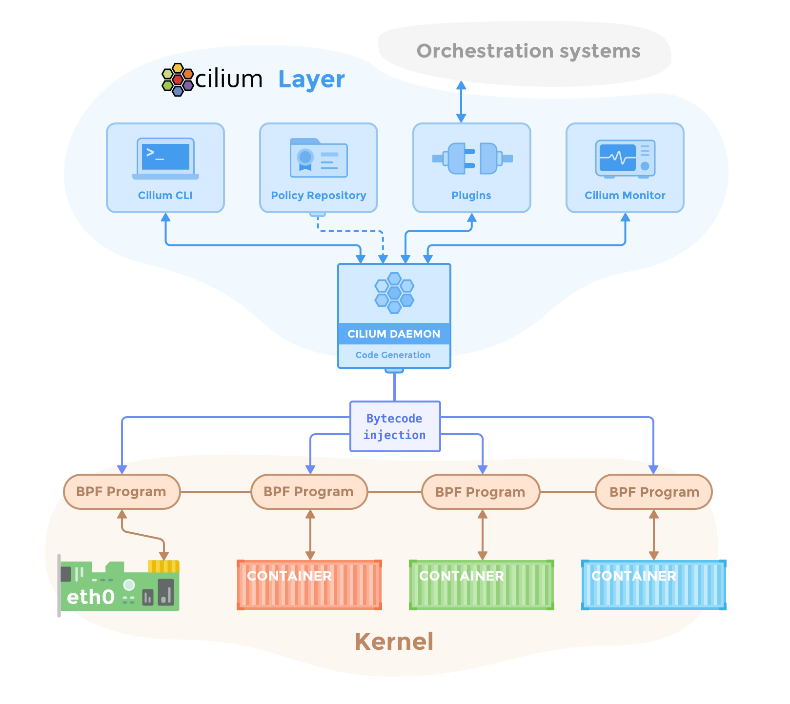

.. only:: not (epub or latex or html)

    WARNING: You are looking at unreleased Cilium documentation.
    Please use the official rendered version released here:
    https://docs.cilium.io

.. _component_overview:

******************
Component Overview
******************

A deployment of Cilium and Hubble consists of the following components running
in a cluster:

Cilium
======

Agent
  The Cilium agent (``cilium-agent``) runs on each node in the cluster. At a
  high-level, the agent accepts configuration via Kubernetes or APIs that
  describes networking, service load-balancing, network policies, and
  visibility & monitoring requirements.

  The Cilium agent listens for events from orchestration systems such as
  Kubernetes to learn when containers or workloads are started and stopped. It
  manages the eBPF programs which the Linux kernel uses to control all network
  access in / out of those containers.

Client (CLI)
  The Cilium CLI client (``cilium``) is a command-line tool that is installed
  along with the Cilium agent. It interacts with the REST API of the Cilium
  agent running on the same node. The CLI allows inspecting the state and
  status of the local agent. It also provides tooling to directly access the
  eBPF maps to validate their state.

  .. note::

     The in-agent Cilium CLI client described here should not be confused with
     the `command line tool for quick-installing, managing and troubleshooting
     Cilium on Kubernetes clusters <https://github.com/cilium/cilium-cli>`_,
     which also has the name ``cilium``. That tool is typically installed
     remote from the cluster, and uses ``kubeconfig`` information to access
     Cilium running on the cluster via the Kubernetes API.

Operator
  The Cilium Operator is responsible for managing duties in the cluster which
  should logically be handled once for the entire cluster, rather than once for
  each node in the cluster. The Cilium operator is not in the critical path for
  any forwarding or network policy decision. A cluster will generally continue
  to function if the operator is temporarily unavailable. However, depending on
  the configuration, failure in availability of the operator can lead to:

  * Delays in :ref:`address_management` and thus delay in scheduling of new
    workloads if the operator is required to allocate new IP addresses
  * Failure to update the kvstore heartbeat key which will lead agents to
    declare kvstore unhealthiness and restart.

CNI Plugin
  The CNI plugin (``cilium-cni``) is invoked by Kubernetes when a pod is
  scheduled or terminated on a node. It interacts with the Cilium API of the
  node to trigger the necessary datapath configuration to provide networking,
  load-balancing and network policies for the pod.

Hubble
======

Server
  The Hubble server runs on each node and retrieves the eBPF-based visibility
  from Cilium. It is embedded into the Cilium agent in order to achieve high
  performance and low-overhead. It offers a gRPC service to retrieve flows and
  Prometheus metrics.

Relay
  Relay (``hubble-relay``) is a standalone component which is aware of all
  running Hubble servers and offers cluster-wide visibility by connecting to
  their respective gRPC APIs and providing an API that represents all servers
  in the cluster.

Client (CLI)
  The Hubble CLI (``hubble``) is a command-line tool able to connect to either
  the gRPC API of ``hubble-relay`` or the local server to retrieve flow events.

Graphical UI (GUI)
  The graphical user interface (``hubble-ui``) utilizes relay-based visibility
  to provide a graphical service dependency and connectivity map.

eBPF
====

eBPF is a Linux kernel bytecode interpreter originally introduced to filter
network packets, e.g. tcpdump and socket filters. It has since been extended
with additional data structures such as hashtable and arrays as well as
additional actions to support packet mangling, forwarding, encapsulation, etc.
An in-kernel verifier ensures that eBPF programs are safe to run and a JIT
compiler converts the bytecode to CPU architecture specific instructions for
native execution efficiency. eBPF programs can be run at various hooking points
in the kernel such as for incoming and outgoing packets.

Cilium is capable of probing the Linux kernel for available features and will
automatically make use of more recent features as they are detected.

For more detail on kernel versions, see: :ref:`admin_kernel_version`.

Data Store
==========

Cilium requires a data store to propagate state between agents. It supports the
following data stores:

Kubernetes CRDs (Default)
  The default choice to store any data and propagate state is to use Kubernetes
  custom resource definitions (CRDs). CRDs are offered by Kubernetes for
  cluster components to represent configurations and state via Kubernetes
  resources.

Key-Value Store
  All requirements for state storage and propagation can be met with Kubernetes
  CRDs as configured in the default configuration of Cilium. A key-value store
  can optionally be used as an optimization to improve the scalability of a
  cluster as change notifications and storage requirements are more efficient
  with direct key-value store usage.

  The currently supported key-value stores are:

    * `etcd <https://github.com/etcd-io/etcd>`_

  .. note::

     It is possible to leverage the etcd cluster of Kubernetes directly or to
     maintain a dedicated etcd cluster.
