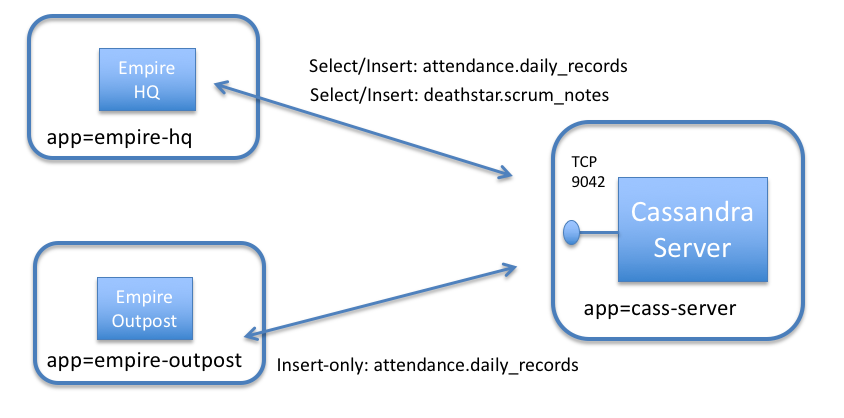
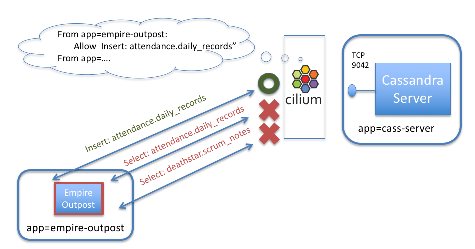

.. only:: not (epub or latex or html)

    WARNING: You are looking at unreleased Cilium documentation.
    Please use the official rendered version released here:
    https://docs.cilium.io

*****************************
Securing a Cassandra Database
*****************************

This document serves as an introduction to using Cilium to enforce Cassandra-aware
security policies.  It is a detailed walk-through of getting a single-node
Cilium environment running on your machine. It is designed to take 15-30
minutes.

**NOTE:** Cassandra-aware policy support is still in beta phase.  It is not yet ready for
production use.   Additionally, the Cassandra-specific policy language is highly likely to
change in a future Cilium version.

.. include:: gsg_requirements.rst

Deploy the Demo Application
===========================

Now that we have Cilium deployed and ``kube-dns`` operating correctly we can
deploy our demo Cassandra application.  Since our first
`HTTP-aware Cilium  Star Wars demo <https://cilium.io/blog/2017/5/4/demo-may-the-force-be-with-you/>`_
showed how the Galactic Empire used HTTP-aware security policies to protect the Death Star from the
Rebel Alliance, this Cassandra demo is Star Wars-themed as well.

`Apache Cassanadra <http://cassandra.apache.org>`_ is a popular NOSQL database focused on
delivering high-performance transactions (especially on writes) without sacrificing on availability or scale.
Cassandra operates as a cluster of servers, and Cassandra clients query these services via a
the `native Cassandra protocol <https://github.com/apache/cassandra/blob/trunk/doc/native_protocol_v4.spec>`_ .
Cilium understands the Cassandra protocol, and thus is able to provide deep visibility and control over
which clients are able to access particular tables inside a Cassandra cluster, and which actions
(e.g., "select", "insert", "update", "delete") can be performed on tables.

With Cassandra, each table belongs to a "keyspace", allowing multiple groups to use a single cluster without conflicting.
Cassandra queries specify the full table name qualified by the keyspace using the syntax "<keyspace>.<table>".

In our simple example, the Empire uses a Cassandra cluster to store two different types of information:

- **Employee Attendance Records** : Use to store daily attendance data (attendance.daily_records).
- **Deathstar Scrum Reports** : Daily scrum reports from the teams working on the Deathstar (deathstar.scrum_reports).

To keep the setup small, we will just launch a small number of pods to represent this setup:

- **cass-server** : A single pod running the Cassandra service, representing a Cassandra cluster
  (label app=cass-server).
- **empire-hq** : A pod representing the Empire's Headquarters, which is the only pod that should
  be able to read all attendance data, or read/write the Deathstar scrum notes (label app=empire-hq).
- **empire-outpost** : A random outpost in the empire.  It should be able to insert employee attendance
  records, but not read records for other empire facilities.   It also should not have any access to the
  deathstar keyspace (label app=empire-outpost).

All pods other than *cass-server* are Cassandra clients, which need access to the *cass-server*
container on TCP port 9042 in order to send Cassandra protocol messages.

The file ``cass-sw-app.yaml`` contains a Kubernetes Deployment for each of the pods described
above, as well as a Kubernetes Service *cassandra-svc* for the Cassandra cluster.

.. parsed-literal::

    $ kubectl create -f \ |SCM_WEB|\/examples/kubernetes-cassandra/cass-sw-app.yaml
    deployment.apps/cass-server created
    service/cassandra-svc created
    deployment.apps/empire-hq created
    deployment.apps/empire-outpost created

Kubernetes will deploy the pods and service in the background.
Running ``kubectl get svc,pods`` will inform you about the progress of the operation.
Each pod will go through several states until it reaches ``Running`` at which
point the setup is ready.

.. code-block:: shell-session

    $ kubectl get svc,pods
    NAME                    TYPE        CLUSTER-IP   EXTERNAL-IP   PORT(S)    AGE
    service/cassandra-svc   ClusterIP   None         <none>        9042/TCP   1m
    service/kubernetes      ClusterIP   10.96.0.1    <none>        443/TCP    15h

    NAME                                  READY     STATUS    RESTARTS   AGE
    pod/cass-server-5674d5b946-x8v4j      1/1       Running   0          1m
    pod/empire-hq-c494c664d-xmvdl         1/1       Running   0          1m
    pod/empire-outpost-68bf76858d-flczn   1/1       Running   0          1m

Step 3: Test Basic Cassandra Access
===================================

First, we'll create the keyspaces and tables mentioned above, and populate them with some initial data:

.. parsed-literal::

   $  curl -s \ |SCM_WEB|\/examples/kubernetes-cassandra/cass-populate-tables.sh | bash

Next, create two environment variables that refer to the *empire-hq* and *empire-outpost* pods:

.. code-block:: shell-session

   $ HQ_POD=$(kubectl get pods -l app=empire-hq -o jsonpath='{.items[0].metadata.name}')
   $ OUTPOST_POD=$(kubectl get pods -l app=empire-outpost -o jsonpath='{.items[0].metadata.name}')

Now we will run the 'cqlsh' Cassandra client in the *empire-outpost* pod, telling it to access
the Cassandra cluster identified by the 'cassandra-svc' DNS name:

.. code-block:: shell-session

    $ kubectl exec -it $OUTPOST_POD -- cqlsh cassandra-svc
    Connected to Test Cluster at cassandra-svc:9042.
    [cqlsh 5.0.1 | Cassandra 3.11.3 | CQL spec 3.4.4 | Native protocol v4]
    Use HELP for help.
    cqlsh>

Next, using the cqlsh prompt, we'll show that the outpost can add records to the "daily_records" table
in the "attendance" keyspace:

.. code-block:: shell-session

    cqlsh> INSERT INTO attendance.daily_records (creation, loc_id, present, empire_member_id) values (now(), 074AD3B9-A47D-4EBC-83D3-CAD75B1911CE, true, 6AD3139F-EBFC-4E0C-9F79-8F997BA01D90);

We have confirmed that outposts are able to report daily attendance records as intended. We're off to a good start!

The Danger of a Compromised Cassandra Client
============================================

But what if a rebel spy gains access to any of the remote outposts that act as a Cassandra client?
Since every client has access to the Cassandra API on port 9042, it can do some bad stuff.
For starters, the outpost container can not only add entries to the attendance.daily_reports table,
but it could read all entries as well.

To see this, we can run the following command:

.. code-block:: shell-session

  $ cqlsh> SELECT * FROM attendance.daily_records;

    loc_id                               | creation                             | empire_member_id                     | present
   --------------------------------------+--------------------------------------+--------------------------------------+---------
   a855e745-69d8-4159-b8b6-e2bafed8387a | c692ce90-bf57-11e8-98e6-f1a9f45fc4d8 | cee6d956-dbeb-4b09-ad21-1dd93290fa6c |    True
   5b9a7990-657e-442d-a3f7-94484f06696e | c8493120-bf57-11e8-98e6-f1a9f45fc4d8 | e74a0300-94f3-4b3d-aee4-fea85eca5af7 |    True
   53ed94d0-ddac-4b14-8c2f-ba6f83a8218c | c641a150-bf57-11e8-98e6-f1a9f45fc4d8 | 104ddbb6-f2f7-4cd0-8683-cc18cccc1326 |    True
   074ad3b9-a47d-4ebc-83d3-cad75b1911ce | 9674ed40-bf59-11e8-98e6-f1a9f45fc4d8 | 6ad3139f-ebfc-4e0c-9f79-8f997ba01d90 |    True
   fe72cc39-dffb-45dc-8e5f-86c674a58951 | c5e79a70-bf57-11e8-98e6-f1a9f45fc4d8 | 6782689c-0488-4ecb-b582-a2ccd282405e |    True
   461f4176-eb4c-4bcc-a08a-46787ca01af3 | c6fefde0-bf57-11e8-98e6-f1a9f45fc4d8 | 01009199-3d6b-4041-9c43-b1ca9aef021c |    True
   64dbf608-6947-4a23-98e9-63339c413136 | c8096900-bf57-11e8-98e6-f1a9f45fc4d8 | 6ffe024e-beff-4370-a1b5-dcf6330ec82b |    True
   13cefcac-5652-4c69-a3c2-1484671f2467 | c53f4c80-bf57-11e8-98e6-f1a9f45fc4d8 | 55218adc-2f3d-4f84-a693-87a2c238bb26 |    True
   eabf5185-376b-4d4a-a5b5-99f912d98279 | c593fc30-bf57-11e8-98e6-f1a9f45fc4d8 | 5e22159b-f3a9-4f8a-9944-97375df570e9 |    True
   3c0ae2d1-c836-4aa4-8fe2-5db6cc1f92fc | c7af1400-bf57-11e8-98e6-f1a9f45fc4d8 | 0ccb3df7-78d0-4434-8a7f-4bfa8d714275 |    True
   31a292e0-2e28-4a7d-8c84-8d4cf0c57483 | c4e0d8d0-bf57-11e8-98e6-f1a9f45fc4d8 | 8fe7625c-f482-4eb6-b33e-271440777403 |    True

  (11 rows)

Uh oh!  The rebels now has strategic information about empire troop strengths at each location in the galaxy.

But even more nasty from a security perspective is that the outpost container can also access information in any keyspace,
including the deathstar keyspace.  For example, run:

.. code-block:: shell-session

 $ cqlsh> SELECT * FROM deathstar.scrum_notes;

  empire_member_id                     | content                                                                                                        | creation
 --------------------------------------+----------------------------------------------------------------------------------------------------------------+--------------------------------------
 34e564c2-781b-477e-acd0-b357d67f94f2 | Designed protective shield for deathstar.  Could be based on nearby moon.  Feature punted to v2.  Not blocked. | c3c8b210-bf57-11e8-98e6-f1a9f45fc4d8
 dfa974ea-88cd-4e9b-85e3-542b9d00e2df |   I think the exhaust port could be vulnerable to a direct hit.  Hope no one finds out about it.  Not blocked. | c37f4d00-bf57-11e8-98e6-f1a9f45fc4d8
 ee12306a-7b44-46a4-ad68-42e86f0f111e |        Trying to figure out if we should paint it medium grey, light grey, or medium-light grey.  Not blocked. | c32daa90-bf57-11e8-98e6-f1a9f45fc4d8

 (3 rows)

We see that any outpost can actually access the deathstar scrum notes, which mentions a pretty serious issue with the exhaust port.

Securing Access to Cassandra with Cilium
========================================

Obviously, it would be much more secure to limit each pod's access to the Cassandra server to be
least privilege (i.e., only what is needed for the app to operate correctly and nothing more).

We can do that with the following Cilium security policy.   As with Cilium HTTP policies, we can write
policies that identify pods by labels, and then limit the traffic in/out of this pod.  In
this case, we'll create a policy that identifies the tables that each client should be able to access,
the actions that are allowed on those tables, and deny the rest.

As an example, a policy could limit containers with label *app=empire-outpost* to only be able to
insert entries into the table "attendance.daily_reports", but would block any attempt by a compromised outpost
to read all attendance information or access other keyspaces.

Here is the *CiliumNetworkPolicy* rule that limits access of pods with label *app=empire-outpost* to
only insert records into "attendance.daily_reports":

.. literalinclude:: ../../examples/kubernetes-cassandra/cass-sw-security-policy.yaml

A *CiliumNetworkPolicy* contains a list of rules that define allowed requests, meaning that requests
that do not match any rules are denied as invalid.

The rule explicitly matches Cassandra connections destined to TCP 9042 on cass-server pods, and allows
query actions like select/insert/update/delete only on a specified set of tables.
The above rule applies to inbound (i.e., "ingress") connections to cass-server pods (as indicated by "app:cass-server"
in the "endpointSelector" section).  The rule applies different rules based on whether the
client pod has labels "app: empire-outpost" or "app: empire-hq" as indicated by the "fromEndpoints" section.

The policy limits the *empire-outpost* pod to performing "select" queries on the "system" and "system_schema"
keyspaces (required by cqlsh on startup) and "insert" queries to the "attendance.daily_records" table.

The full policy adds another rule that allows all queries from the *empire-hq* pod.

Apply this Cassandra-aware network security policy using ``kubectl`` in a new window:

.. parsed-literal::

    $ kubectl create -f \ |SCM_WEB|\/examples/kubernetes-cassandra/cass-sw-security-policy.yaml

If we then again try to perform the attacks from the *empire-outpost* pod, we'll see that they are denied:

.. code-block:: shell-session

  $ cqlsh> SELECT * FROM attendance.daily_records;
  Unauthorized: Error from server: code=2100 [Unauthorized] message="Request Unauthorized"

This is because the policy only permits pods with labels app: empire-outpost to insert into attendance.daily_records, it does
not permit select on that table, or any action on other tables (with the exception of the system.* and system_schema.*
keyspaces).  Its worth noting that we don't simply drop the message (which
could easily be confused with a network error), but rather we respond with the Cassandra Unauthorized error message.
(similar to how HTTP would return an error code of 403 unauthorized).

Likewise, if the outpost pod ever tries to access a table in another keyspace, like deathstar, this request will also be
denied:

.. code-block:: shell-session

  $ cqlsh> SELECT * FROM deathstar.scrum_notes;
  Unauthorized: Error from server: code=2100 [Unauthorized] message="Request Unauthorized"

This is blocked as well, thanks to the Cilium network policy.

Use another window to confirm that the *empire-hq* pod still has full access to the cassandra cluster:

.. code-block:: shell-session

    $ kubectl exec -it $HQ_POD -- cqlsh cassandra-svc
    Connected to Test Cluster at cassandra-svc:9042.
    [cqlsh 5.0.1 | Cassandra 3.11.3 | CQL spec 3.4.4 | Native protocol v4]
    Use HELP for help.
    cqlsh>

The power of Cilium's identity-based security allows *empire-hq* to still have full access
to both tables:

.. code-block:: shell-session

  $ cqlsh> SELECT * FROM attendance.daily_records;
   loc_id                               | creation                             | empire_member_id                     | present
  --------------------------------------+--------------------------------------+--------------------------------------+---------
  a855e745-69d8-4159-b8b6-e2bafed8387a | c692ce90-bf57-11e8-98e6-f1a9f45fc4d8 | cee6d956-dbeb-4b09-ad21-1dd93290fa6c |    True

  <snip>

  (12 rows)

Similarly, the deathstar can still access the scrum notes:

.. code-block:: shell-session

  $ cqlsh> SELECT * FROM deathstar.scrum_notes;

    <snip>

  (3 rows)

Cassandra-Aware Visibility (Bonus)
==================================

As a bonus, you can re-run the above queries with policy enforced and view how Cilium provides Cassandra-aware visibility, including
whether requests are forwarded or denied.   First, use "kubectl exec" to access the cilium pod.

.. code-block:: shell-session

  $ CILIUM_POD=$(kubectl get pods -n kube-system -l k8s-app=cilium -o jsonpath='{.items[0].metadata.name}')
  $ kubectl exec -it -n kube-system $CILIUM_POD -- /bin/bash
  root@minikube:~#

Next, start Cilium monitor, and limit the output to only "l7" type messages using the "-t" flag:

::

  root@minikube:~# cilium monitor -t l7
  Listening for events on 2 CPUs with 64x4096 of shared memory
  Press Ctrl-C to quit

In the other windows, re-run the above queries, and you will see that Cilium provides full visibility at the level of
each Cassandra request, indicating:

- The Kubernetes label-based identity of both the sending and receiving pod.
- The details of the Cassandra request, including the 'query_action' (e.g., 'select', 'insert')
  and 'query_table' (e.g., 'system.local', 'attendance.daily_records')
- The 'verdict' indicating whether the request was allowed by policy ('Forwarded' or 'Denied').

Example output is below.   All requests are from *empire-outpost* to *cass-server*.   The first two requests are
allowed, a 'select' into 'system.local' and an 'insert' into 'attendance.daily_records'.
The second two requests are denied, a 'select' into 'attendance.daily_records' and a select into 'deathstar.scrum_notes' :

::

  <- Request cassandra from 0 ([k8s:io.cilium.k8s.policy.serviceaccount=default k8s:io.kubernetes.pod.namespace=default k8s:app=empire-outpost]) to 64503 ([k8s:app=cass-server k8s:io.kubernetes.pod.namespace=default k8s:io.cilium.k8s.policy.serviceaccount=default]), identity 12443->16168, verdict Forwarded query_table:system.local query_action:selec
  <- Request cassandra from 0 ([k8s:io.cilium.k8s.policy.serviceaccount=default k8s:io.kubernetes.pod.namespace=default k8s:app=empire-outpost]) to 64503 ([k8s:app=cass-server k8s:io.kubernetes.pod.namespace=default k8s:io.cilium.k8s.policy.serviceaccount=default]), identity 12443->16168, verdict Forwarded query_action:insert query_table:attendance.daily_records
  <- Request cassandra from 0 ([k8s:io.cilium.k8s.policy.serviceaccount=default k8s:io.kubernetes.pod.namespace=default k8s:app=empire-outpost]) to 64503 ([k8s:app=cass-server k8s:io.kubernetes.pod.namespace=default k8s:io.cilium.k8s.policy.serviceaccount=default]), identity 12443->16168, verdict Denied query_action:select query_table:attendance.daily_records
  <- Request cassandra from 0 ([k8s:io.cilium.k8s.policy.serviceaccount=default k8s:io.kubernetes.pod.namespace=default k8s:app=empire-outpost]) to 64503 ([k8s:app=cass-server k8s:io.kubernetes.pod.namespace=default k8s:io.cilium.k8s.policy.serviceaccount=default]), identity 12443->16168, verdict Denied query_table:deathstar.scrum_notes query_action:select

Clean Up
========

You have now installed Cilium, deployed a demo app, and tested
L7 Cassandra-aware network security policies.  To clean up, run:

.. parsed-literal::

   $ kubectl delete -f \ |SCM_WEB|\/examples/kubernetes-cassandra/cass-sw-app.yaml
   $ kubectl delete cnp secure-empire-cassandra

After this, you can re-run the tutorial from Step 1.
