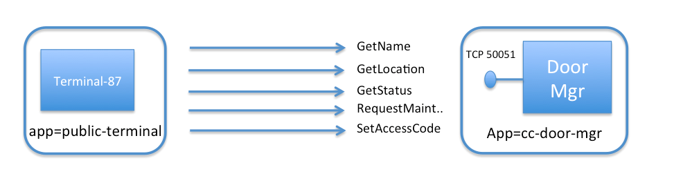
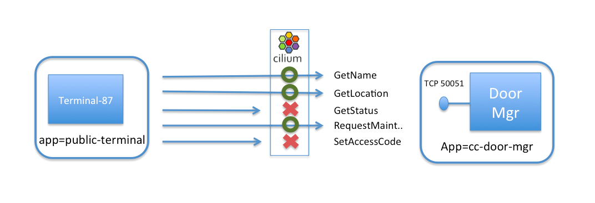

.. only:: not (epub or latex or html)

    WARNING: You are looking at unreleased Cilium documentation.
    Please use the official rendered version released here:
    https://docs.cilium.io

*************
Securing gRPC
*************

This document serves as an introduction to using Cilium to enforce gRPC-aware
security policies.  It is a detailed walk-through of getting a single-node
Cilium environment running on your machine. It is designed to take 15-30
minutes.

.. include:: gsg_requirements.rst

It is important for this demo that ``kube-dns`` is working correctly. To know the
status of ``kube-dns`` you can run the following command:

.. code-block:: shell-session

    $ kubectl get deployment kube-dns -n kube-system
    NAME       DESIRED   CURRENT   UP-TO-DATE   AVAILABLE   AGE
    kube-dns   1         1         1            1           13h

Where at least one pod should be available.

Deploy the Demo Application
===========================

Now that we have Cilium deployed and ``kube-dns`` operating correctly we can
deploy our demo gRPC application.  Since our first demo of Cilium + HTTP-aware security
policies was Star Wars-themed, we decided to do the same for gRPC. While the
`HTTP-aware Cilium  Star Wars demo <https://cilium.io/blog/2017/5/4/demo-may-the-force-be-with-you/>`_
showed how the Galactic Empire used HTTP-aware security policies to protect the Death Star from the
Rebel Alliance, this gRPC demo shows how the lack of gRPC-aware security policies allowed Leia, Chewbacca, Lando, C-3PO, and R2-D2 to escape from Cloud City, which had been overtaken by
empire forces.

`gRPC <https://grpc.io/>`_ is a high-performance RPC framework built on top of the `protobuf <https://developers.google.com/protocol-buffers/>`_
serialization/deserialization library popularized by Google.  There are gRPC bindings
for many programming languages, and the efficiency of the protobuf parsing as well as
advantages from leveraging HTTP 2 as a transport make it a popular RPC framework for
those building new microservices from scratch.

For those unfamiliar with the details of the movie, Leia and the other rebels are
fleeing storm troopers and trying to reach the space port platform where the Millennium Falcon
is parked, so they can fly out of Cloud City. However, the door to the platform is closed,
and the access code has been changed. However, R2-D2 is able to access the Cloud City
computer system via a public terminal, and disable this security, opening the door and
letting the Rebels reach the Millennium Falcon just in time to escape.

In our example, Cloud City's internal computer system is built as a set of gRPC-based
microservices (who knew that gRPC was actually invented a long time ago, in a galaxy
far, far away?).

With gRPC, each service is defined using a language independent protocol buffer definition.
Here is the definition for the system used to manage doors within Cloud City:

.. code-block:: java

  package cloudcity;

  // The door manager service definition.
  service DoorManager {

    // Get human readable name of door.
    rpc GetName(DoorRequest) returns (DoorNameReply) {}

    // Find the location of this door.
    rpc GetLocation (DoorRequest) returns (DoorLocationReply) {}

    // Find out whether door is open or closed
    rpc GetStatus(DoorRequest) returns (DoorStatusReply) {}

    // Request maintenance on the door
    rpc RequestMaintenance(DoorMaintRequest) returns (DoorActionReply) {}

    // Set Access Code to Open / Lock the door
    rpc SetAccessCode(DoorAccessCodeRequest) returns (DoorActionReply) {}

  }

To keep the setup small, we will just launch two pods to represent this setup:

- **cc-door-mgr**: A single pod running the gRPC door manager service with label ``app=cc-door-mgr``.
- **terminal-87**: One of the public network access terminals scattered across Cloud City. R2-D2 plugs into terminal-87 as the rebels are desperately trying to escape. This terminal uses the gRPC client code to communicate with the door management services with label ``app=public-terminal``.

The file ``cc-door-app.yaml`` contains a Kubernetes Deployment for the door manager
service, a Kubernetes Pod representing ``terminal-87``, and a Kubernetes Service for
the door manager services. To deploy this example app, run:

.. parsed-literal::

    $ kubectl create -f \ |SCM_WEB|\/examples/kubernetes-grpc/cc-door-app.yaml
    deployment "cc-door-mgr" created
    service "cc-door-server" created
    pod "terminal-87" created

Kubernetes will deploy the pods and service in the background. Running
``kubectl get svc,pods`` will inform you about the progress of the operation.
Each pod will go through several states until it reaches ``Running`` at which
point the setup is ready.

.. code-block:: shell-session

    $ kubectl get pods,svc
    NAME                                 READY     STATUS    RESTARTS   AGE
    po/cc-door-mgr-3590146619-cv4jn      1/1       Running   0          1m
    po/terminal-87                       1/1       Running   0          1m

    NAME                 CLUSTER-IP   EXTERNAL-IP   PORT(S)     AGE
    svc/cc-door-server   10.0.0.72    <none>        50051/TCP   1m
    svc/kubernetes       10.0.0.1     <none>        443/TCP     6m

Test Access Between gRPC Client and Server
==========================================

First, let's confirm that the public terminal can properly act as a client to the
door service.  We can test this by running a Python gRPC client for the door service that
exists in the *terminal-87* container.

We'll invoke the 'cc_door_client' with the name of the gRPC method to call, and any
parameters (in this case, the door-id):

.. code-block:: shell-session

    $ kubectl exec terminal-87 -- python3 /cloudcity/cc_door_client.py GetName 1
    Door name is: Spaceport Door #1

    $ kubectl exec terminal-87 -- python3 /cloudcity/cc_door_client.py GetLocation 1
    Door location is lat = 10.222200393676758 long = 68.87879943847656

Exposing this information to public terminals seems quite useful, as it helps travelers new
to Cloud City identify and locate different doors. But recall that the door service also
exposes several other methods, including ``SetAccessCode``. If access to the door manager
service is protected only using traditional IP and port-based firewalling, the TCP port of
the service (50051 in this example) will be wide open to allow legitimate calls like
``GetName`` and ``GetLocation``, which also leave more sensitive calls like ``SetAccessCode`` exposed as
well. It is this mismatch between the course granularity of traditional firewalls and
the fine-grained nature of gRPC calls that R2-D2 exploited to override the security
and help the rebels escape.

To see this, run:

.. code-block:: shell-session

    $ kubectl exec terminal-87 -- python3 /cloudcity/cc_door_client.py SetAccessCode 1 999
    Successfully set AccessCode to 999

Securing Access to a gRPC Service with Cilium
=============================================

Once the legitimate owners of Cloud City recover the city from the empire, how can they
use Cilium to plug this key security hole and block requests to ``SetAccessCode`` and ``GetStatus``
while still allowing ``GetName``, ``GetLocation``, and ``RequestMaintenance``?

Since gRPC build on top of HTTP, this can be achieved easily by understanding how a
gRPC call is mapped to an HTTP URL, and then applying a Cilium HTTP-aware filter to
allow public terminals to only invoke a subset of all the total gRPC methods available
on the door service.

Each gRPC method is mapped to an HTTP POST call to a URL of the form
``/cloudcity.DoorManager/<method-name>``.

As a result, the following *CiliumNetworkPolicy* rule limits access of pods with label
``app=public-terminal`` to only invoke ``GetName``, ``GetLocation``, and ``RequestMaintenance``
on the door service, identified by label ``app=cc-door-mgr``:

.. literalinclude:: ../../examples/kubernetes-grpc/cc-door-ingress-security.yaml
   :language: yaml
   :emphasize-lines: 9,13,21

A *CiliumNetworkPolicy* contains a list of rules that define allowed requests,
meaning that requests that do not match any rules (e.g., ``SetAccessCode``) are denied as invalid.

The above rule applies to inbound (i.e., "ingress") connections to ``cc-door-mgr pods`` (as
indicated by ``app: cc-door-mgr``
in the "endpointSelector" section). The rule will apply to connections from pods with label
``app: public-terminal`` as indicated by the "fromEndpoints" section.
The rule explicitly matches
gRPC connections destined to TCP 50051, and white-lists specifically the permitted URLs.

Apply this gRPC-aware network security policy using ``kubectl`` in the main window:

.. parsed-literal::

    $ kubectl create -f \ |SCM_WEB|\/examples/kubernetes-grpc/cc-door-ingress-security.yaml

After this security policy is in place, access to the innocuous calls like ``GetLocation``
still works as intended:

.. code-block:: shell-session

    $ kubectl exec terminal-87 -- python3 /cloudcity/cc_door_client.py GetLocation 1
    Door location is lat = 10.222200393676758 long = 68.87879943847656

However, if we then again try to invoke ``SetAccessCode``, it is denied:

.. code-block:: shell-session

    $ kubectl exec terminal-87 -- python3 /cloudcity/cc_door_client.py SetAccessCode 1 999

    Traceback (most recent call last):
      File "/cloudcity/cc_door_client.py", line 71, in <module>
        run()
      File "/cloudcity/cc_door_client.py", line 53, in run
        door_id=int(arg2), access_code=int(arg3)))
      File "/usr/local/lib/python3.4/dist-packages/grpc/_channel.py", line 492, in __call__
        return _end_unary_response_blocking(state, call, False, deadline)
      File "/usr/local/lib/python3.4/dist-packages/grpc/_channel.py", line 440, in _end_unary_response_blocking
        raise _Rendezvous(state, None, None, deadline)
    grpc._channel._Rendezvous: <_Rendezvous of RPC that terminated with (StatusCode.CANCELLED, Received http2 header with status: 403)>

This is now blocked, thanks to the Cilium network policy. And notice that unlike
a traditional firewall which would just drop packets in a way indistinguishable
from a network failure, because Cilium operates at the API-layer, it can
explicitly reply with an custom HTTP 403 Unauthorized error, indicating that the
request was intentionally denied for security reasons.

Thank goodness that the empire IT staff hadn't had time to deploy Cilium on
Cloud City's internal network prior to the escape attempt, or things might have
turned out quite differently for Leia and the other Rebels!

Clean-Up
========

You have now installed Cilium, deployed a demo app, and tested
L7 gRPC-aware network security policies. To clean-up, run:

.. parsed-literal::

   $ kubectl delete -f \ |SCM_WEB|\/examples/kubernetes-grpc/cc-door-app.yaml
   $ kubectl delete cnp rule1

After this, you can re-run the tutorial from Step 1.
