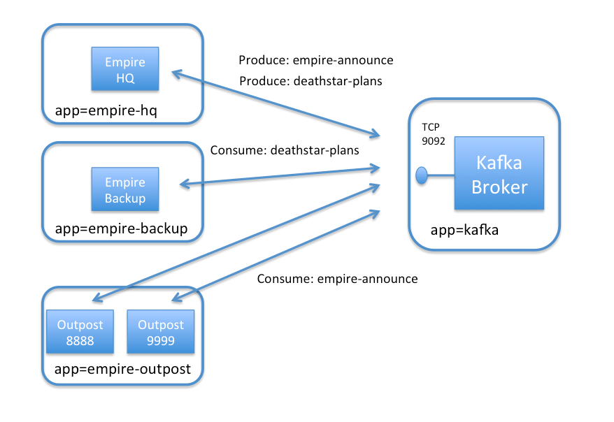
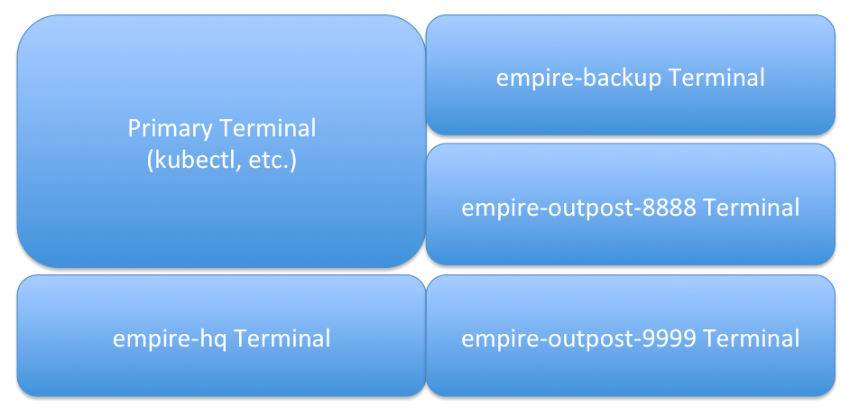
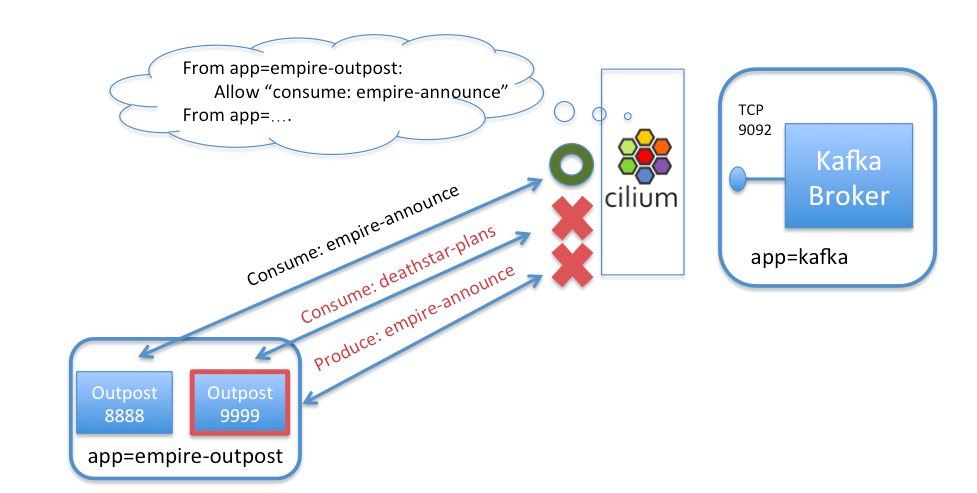

.. only:: not (epub or latex or html)

    WARNING: You are looking at unreleased Cilium documentation.
    Please use the official rendered version released here:
    https://docs.cilium.io

.. _gs_kafka:

************************
Securing a Kafka Cluster
************************

This document serves as an introduction to using Cilium to enforce Kafka-aware
security policies.  It is a detailed walk-through of getting a single-node
Cilium environment running on your machine. It is designed to take 15-30
minutes.

.. include:: gsg_requirements.rst

Deploy the Demo Application
===========================

Now that we have Cilium deployed and ``kube-dns`` operating correctly we can
deploy our demo Kafka application.  Since our first demo of Cilium + HTTP-aware security
policies was Star Wars-themed we decided to do the same for Kafka.  While the
`HTTP-aware Cilium  Star Wars demo <https://cilium.io/blog/2017/5/4/demo-may-the-force-be-with-you/>`_
showed how the Galactic Empire used HTTP-aware security policies to protect the Death Star from the
Rebel Alliance, this Kafka demo shows how the lack of Kafka-aware security policies allowed the
Rebels to steal the Death Star plans in the first place.

Kafka is a powerful platform for passing datastreams between different components of an application.
A cluster of "Kafka brokers" connect nodes that "produce" data into a data stream, or "consume" data
from a datastream.   Kafka refers to each datastream as a "topic".
Because scalable and highly-available Kafka clusters are non-trivial to run, the same cluster of
Kafka brokers often handles many different topics at once (read this `Introduction to Kafka
<https://kafka.apache.org/intro>`_ for more background).

In our simple example, the Empire uses a Kafka cluster to handle two different topics:

- *empire-announce* : Used to broadcast announcements to sites spread across the galaxy
- *deathstar-plans* : Used by a small group of sites coordinating on building the ultimate battlestation.

To keep the setup small, we will just launch a small number of pods to represent this setup:

- *kafka-broker* : A single pod running Kafka and Zookeeper representing the Kafka cluster
  (label app=kafka).
- *empire-hq* : A pod representing the Empire's Headquarters, which is the only pod that should
  produce messages to *empire-announce* or *deathstar-plans* (label app=empire-hq).
- *empire-backup* : A secure backup facility located in `Scarif <https://starwars.fandom.com/wiki/Scarif_vault>`_ ,
  which is allowed to "consume" from the secret *deathstar-plans* topic (label app=empire-backup).
- *empire-outpost-8888* : A random outpost in the empire.  It needs to "consume" messages from
  the *empire-announce* topic (label app=empire-outpost).
- *empire-outpost-9999* : Another random outpost in the empire that "consumes" messages from
  the *empire-announce* topic (label app=empire-outpost).

All pods other than *kafka-broker* are Kafka clients, which need access to the *kafka-broker*
container on TCP port 9092 in order to send Kafka protocol messages.

The file ``kafka-sw-app.yaml`` contains a Kubernetes Deployment for each of the pods described
above, as well as a Kubernetes Service for both Kafka and Zookeeper.

.. parsed-literal::

    $ kubectl create -f \ |SCM_WEB|\/examples/kubernetes-kafka/kafka-sw-app.yaml
    deployment "kafka-broker" created
    deployment "zookeeper" created
    service "zook" created
    service "kafka-service" created
    deployment "empire-hq" created
    deployment "empire-outpost-8888" created
    deployment "empire-outpost-9999" created
    deployment "empire-backup" created

Kubernetes will deploy the pods and service  in the background.
Running ``kubectl get svc,pods`` will inform you about the progress of the operation.
Each pod will go through several states until it reaches ``Running`` at which
point the setup is ready.

.. code-block:: shell-session

    $ kubectl get svc,pods
    NAME            TYPE        CLUSTER-IP      EXTERNAL-IP   PORT(S)    AGE
    kafka-service   ClusterIP   None            <none>        9092/TCP   2m
    kubernetes      ClusterIP   10.96.0.1       <none>        443/TCP    10m
    zook            ClusterIP   10.97.250.131   <none>        2181/TCP   2m

    NAME                                   READY     STATUS    RESTARTS   AGE
    empire-backup-6f4567d5fd-gcrvg         1/1       Running   0          2m
    empire-hq-59475b4b64-mrdww             1/1       Running   0          2m
    empire-outpost-8888-78dffd49fb-tnnhf   1/1       Running   0          2m
    empire-outpost-9999-7dd9fc5f5b-xp6jw   1/1       Running   0          2m
    kafka-broker-b874c78fd-jdwqf           1/1       Running   0          2m
    zookeeper-85f64b8cd4-nprck             1/1       Running   0          2m

Setup Client Terminals
======================

First we will open a set of windows to represent the different Kafka clients discussed above.
For consistency, we recommend opening them in the pattern shown in the image below, but this is optional.

In each window, use copy-paste to have each terminal provide a shell inside each pod.

empire-hq terminal:

.. code-block:: shell-session

   $ HQ_POD=$(kubectl get pods -l app=empire-hq -o jsonpath='{.items[0].metadata.name}') && kubectl exec -it $HQ_POD -- sh -c "PS1=\"empire-hq $\" /bin/bash"

empire-backup terminal:

.. code-block:: shell-session

   $ BACKUP_POD=$(kubectl get pods -l app=empire-backup -o jsonpath='{.items[0].metadata.name}') && kubectl exec -it $BACKUP_POD -- sh -c "PS1=\"empire-backup $\" /bin/bash"

outpost-8888 terminal:

.. code-block:: shell-session

   $ OUTPOST_8888_POD=$(kubectl get pods -l outpostid=8888 -o jsonpath='{.items[0].metadata.name}') && kubectl exec -it $OUTPOST_8888_POD -- sh -c "PS1=\"outpost-8888 $\" /bin/bash"

outpost-9999 terminal:

.. code-block:: shell-session

   $ OUTPOST_9999_POD=$(kubectl get pods -l outpostid=9999 -o jsonpath='{.items[0].metadata.name}') && kubectl exec -it $OUTPOST_9999_POD -- sh -c "PS1=\"outpost-9999 $\" /bin/bash"

Test Basic Kafka Produce & Consume
==================================

First, let's start the consumer clients listening to their respective Kafka topics.  All of the consumer
commands below will hang intentionally, waiting to print data they consume from the Kafka topic:

In the *empire-backup* window, start listening on the top-secret *deathstar-plans* topic:

.. code-block:: shell-session

    $ ./kafka-consume.sh --topic deathstar-plans

In the *outpost-8888* window, start listening to *empire-announcement*:

.. code-block:: shell-session

    $ ./kafka-consume.sh --topic empire-announce

Do the same in the *outpost-9999* window:

.. code-block:: shell-session

    $ ./kafka-consume.sh --topic empire-announce

Now from the *empire-hq*, first produce a message to the *empire-announce* topic:

.. code-block:: shell-session

   $ echo "Happy 40th Birthday to General Tagge" | ./kafka-produce.sh --topic empire-announce

This message will be posted to the *empire-announce* topic, and shows up in both the *outpost-8888* and
*outpost-9999* windows who consume that topic.   It will not show up in *empire-backup*.

*empire-hq* can also post a version of the top-secret deathstar plans to the *deathstar-plans* topic:

.. code-block:: shell-session

   $ echo "deathstar reactor design v3" | ./kafka-produce.sh --topic deathstar-plans

This message shows up in the *empire-backup* window, but not for the outposts.

Congratulations, Kafka is working as expected :)

The Danger of a Compromised Kafka Client
========================================

But what if a rebel spy gains access to any of the remote outposts that act as Kafka clients?
Since every client has access to the Kafka broker on port 9092, it can do some bad stuff.
For starters, the outpost container can actually switch roles from a consumer to a producer,
sending "malicious" data to all other consumers on the topic.

To prove this, kill the existing ``kafka-consume.sh`` command in the outpost-9999 window
by typing control-C and instead run:

.. code-block:: shell-session

  $ echo "Vader Booed at Empire Karaoke Party" | ./kafka-produce.sh --topic empire-announce

Uh oh!  Outpost-8888 and all of the other outposts in the empire have now received this fake announcement.

But even more nasty from a security perspective is that the outpost container can access any topic
on the kafka-broker.

In the outpost-9999 container, run:

.. code-block:: shell-session

  $ ./kafka-consume.sh --topic deathstar-plans
  "deathstar reactor design v3"

We see that any outpost can actually access the secret deathstar plans.  Now we know how the rebels got
access to them!

Securing Access to Kafka with Cilium
====================================

Obviously, it would be much more secure to limit each pod's access to the Kafka broker to be
least privilege (i.e., only what is needed for the app to operate correctly and nothing more).

We can do that with the following Cilium security policy.   As with Cilium HTTP policies, we can write
policies that identify pods by labels, and then limit the traffic in/out of this pod.  In
this case, we'll create a policy that identifies the exact traffic that should be allowed to reach the
Kafka broker, and deny the rest.

As an example, a policy could limit containers with label *app=empire-outpost* to only be able to consume
topic *empire-announce*, but would block any attempt by a compromised container (e.g., empire-outpost-9999)
from producing to *empire-announce* or consuming from *deathstar-plans*.

Here is the *CiliumNetworkPolicy* rule that limits access of pods with label *app=empire-outpost* to
only consume on topic *empire-announce*:

.. literalinclude:: ../../examples/policies/getting-started/kafka.yaml

A *CiliumNetworkPolicy* contains a list of rules that define allowed requests, meaning that requests
that do not match any rules are denied as invalid.

The above rule applies to inbound (i.e., "ingress") connections to kafka-broker pods (as
indicated by "app: kafka"
in the "endpointSelector" section).  The rule will apply to connections from pods with label
"app: empire-outpost" as indicated by the "fromEndpoints" section.   The rule explicitly matches
Kafka connections destined to TCP 9092, and allows consume/produce actions on various topics of interest.
For example we are allowing *consume* from topic *empire-announce* in this case.

The full policy adds two additional rules that permit the legitimate "produce"
(topic *empire-announce* and topic *deathstar-plans*) from *empire-hq* and the
legitimate consume  (topic = "deathstar-plans") from *empire-backup*.  The full policy
can be reviewed by opening the URL in the command below in a browser.

Apply this Kafka-aware network security policy using ``kubectl`` in the main window:

.. parsed-literal::

    $ kubectl create -f \ |SCM_WEB|\/examples/kubernetes-kafka/kafka-sw-security-policy.yaml

If we then again try to produce a message from outpost-9999 to *empire-annnounce*, it is denied.
Type control-c and then run:

.. code-block:: shell-session

  $ echo "Vader Trips on His Own Cape" | ./kafka-produce.sh --topic empire-announce
  >>[2018-04-10 23:50:34,638] ERROR Error when sending message to topic empire-announce with key: null, value: 27 bytes with error: (org.apache.kafka.clients.producer.internals.ErrorLoggingCallback)
  org.apache.kafka.common.errors.TopicAuthorizationException: Not authorized to access topics: [empire-announce]

This is because the policy does not allow messages with role = "produce" for topic "empire-announce" from
containers with label app = empire-outpost.  Its worth noting that we don't simply drop the message (which
could easily be confused with a network error), but rather we respond with the Kafka access denied error
(similar to how HTTP would return an error code of 403 unauthorized).

Likewise, if the outpost container ever tries to consume from topic *deathstar-plans*, it is denied, as
role = consume is only allowed for topic *empire-announce*.

To test, from the outpost-9999 terminal, run:

.. code-block:: shell-session

  $./kafka-consume.sh --topic deathstar-plans
  [2018-04-10 23:51:12,956] WARN Error while fetching metadata with correlation id 2 : {deathstar-plans=TOPIC_AUTHORIZATION_FAILED} (org.apache.kafka.clients.NetworkClient)

This is blocked as well, thanks to the Cilium network policy. Imagine how different things would have been if the empire had been using
Cilium from the beginning!

Clean Up
========

You have now installed Cilium, deployed a demo app, and tested both
L7 Kafka-aware network security policies.  To clean up, run:

.. parsed-literal::

   $ kubectl delete -f \ |SCM_WEB|\/examples/kubernetes-kafka/kafka-sw-app.yaml
   $ kubectl delete cnp secure-empire-kafka

After this, you can re-run the tutorial from Step 1.
