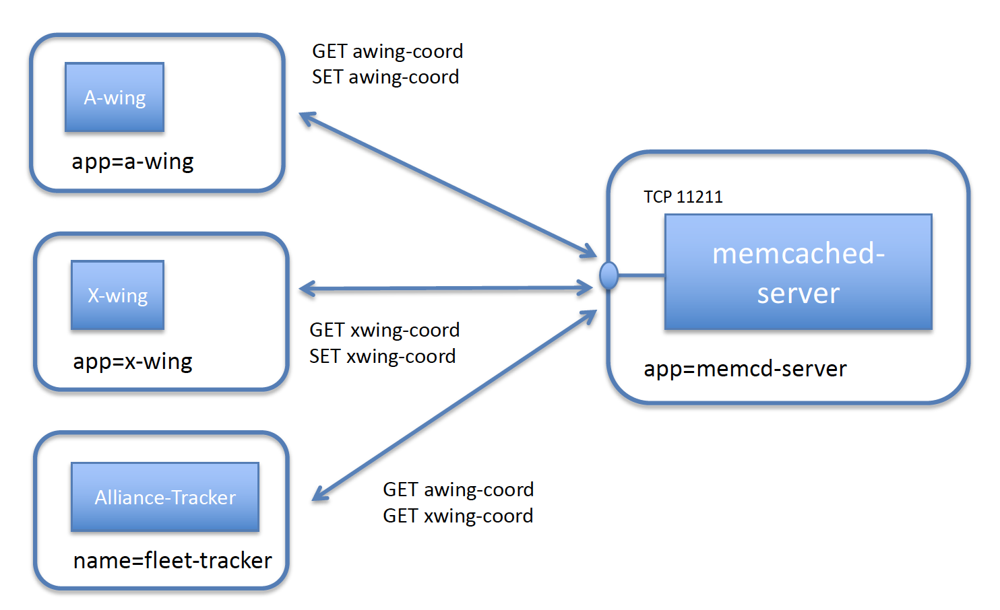
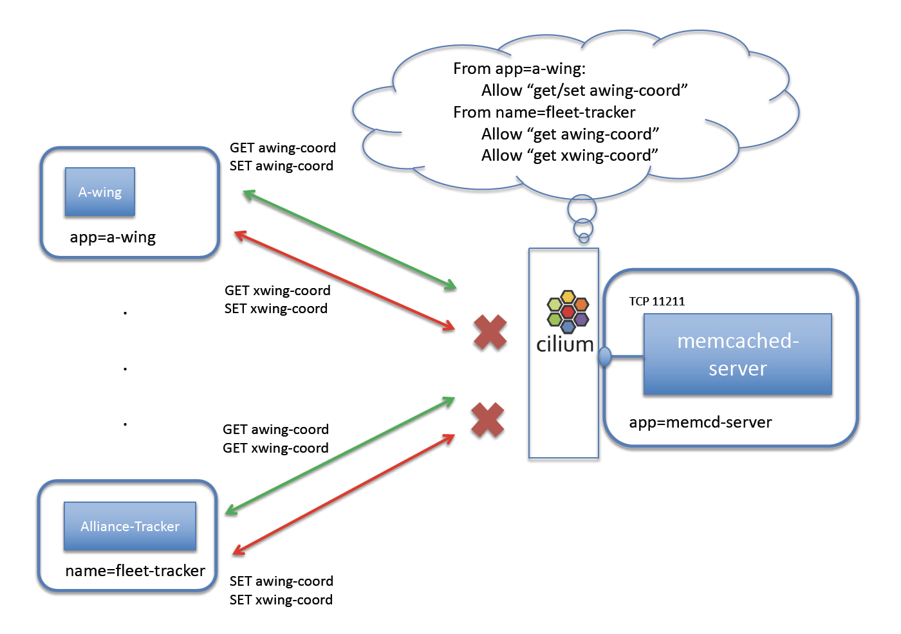

.. only:: not (epub or latex or html)

    WARNING: You are looking at unreleased Cilium documentation.
    Please use the official rendered version released here:
    https://docs.cilium.io

******************
Securing Memcached
******************

This document serves as an introduction to using Cilium to enforce memcached-aware
security policies. It walks through a single-node
Cilium environment running on your machine. It is designed to take 15-30
minutes.

**NOTE:** memcached-aware policy support is still in beta.  It is not yet ready for
production use. Additionally, the memcached-specific policy language is highly likely to
change in a future Cilium version.

`Memcached <https://memcached.org/>`_ is a high performance, distributed memory object caching system. It's simple yet powerful, and used by dynamic web applications to alleviate database load. Memcached is designed to work efficiently for a very large number of open connections. Thus, clients are encouraged to cache their connections rather
than the overhead of reopening TCP connections every time they need to store or retrieve data. Multiple clients can benefit from this distributed cache's performance benefits.

There are two kinds of data sent in the memcache protocol: text lines
and unstructured (binary) data.  We will demonstrate clients using both types of protocols to communicate with a memcached server.

.. include:: gsg_requirements.rst

Step 2: Deploy the Demo Application
===================================

Now that we have Cilium deployed and ``kube-dns`` operating correctly we can
deploy our demo memcached application.  Since our first
`HTTP-aware Cilium demo <https://cilium.io/blog/2017/5/4/demo-may-the-force-be-with-you/>`_ was based on Star Wars, we continue with the theme for the memcached demo as well.

Ever wonder how the Alliance Fleet manages the changing positions of their ships? The Alliance Fleet uses memcached to store the coordinates of their ships. The Alliance Fleet leverages the memcached-svc service implemented as a memcached server. Each ship in the fleet constantly updates its coordinates and has the ability to get the coordinates of other ships in the Alliance Fleet.

In this simple example, the Alliance Fleet uses a memcached server for their starfighters to store their own supergalatic coordinates and get those of other starfighters.

In order to avoid collisions and protect against compromised starfighters, memcached commands are limited to gets for any starfighter coordinates and sets only to a key specific to the starfighter. Thus the following operations are allowed:

- **A-wing**: can set coordinates to key "awing-coord" and get the key coordinates.
- **X-wing**: can set coordinates to key "xwing-coord" and get the key coordinates.
- **Alliance-Tracker**: can get any coordinates but not set any.

To keep the setup small, we will launch a small number of pods to represent a larger environment:

- **memcached-server** : A Kubernetes service represented by a single pod running a memcached server (label app=memcd-server).
- **a-wing** memcached binary client : A pod representing an A-wing starfighter, which can update its coordinates and read it via the binary memcached protocol (label app=a-wing).
- **x-wing** memcached text-based client : A pod representing an X-wing starfighter, which can update its coordinates and read it via the text-based memcached protocol (label app=x-wing).
- **alliance-tracker** memcached binary client : A pod representing the Alliance Fleet Tracker, able to read the coordinates of all starfighters (label name=fleet-tracker).

Memcached clients access the *memcached-server* on TCP port 11211 and send memcached protocol messages to it.

The file ``memcd-sw-app.yaml`` contains a Kubernetes Deployment for each of the pods described
above, as well as a Kubernetes Service *memcached-server* for the Memcached server.

.. parsed-literal::

    $ kubectl create -f \ |SCM_WEB|\/examples/kubernetes-memcached/memcd-sw-app.yaml
    deployment.apps/memcached-server created
    service/memcached-server created
    deployment.apps/a-wing created
    deployment.apps/x-wing created
    deployment.apps/alliance-tracker created

Kubernetes will deploy the pods and service in the background.
Running ``kubectl get svc,pods`` will inform you about the progress of the operation.
Each pod will go through several states until it reaches ``Running`` at which
point the setup is ready.

.. code-block:: shell-session

    $ kubectl get svc,pods
    NAME                       TYPE        CLUSTER-IP   EXTERNAL-IP   PORT(S)     AGE
    service/kubernetes         ClusterIP   10.96.0.1    <none>        443/TCP     31m
    service/memcached-server   ClusterIP   None         <none>        11211/TCP   14m

    NAME                                    READY   STATUS    RESTARTS   AGE
    pod/a-wing-67db8d5fcc-dpwl4             1/1     Running   0          14m
    pod/alliance-tracker-6b6447bd69-sz5hz   1/1     Running   0          14m
    pod/memcached-server-bdbfb87cd-8tdh7    1/1     Running   0          14m
    pod/x-wing-fd5dfb9d9-wrtwn              1/1     Running   0          14m

We suggest having a main terminal window to execute *kubectl* commands and two additional terminal windows dedicated to accessing the **A-Wing** and **Alliance-Tracker**, which use a python library to communicate to the memcached server using the binary protocol.

In **all three** terminal windows, set some handy environment variables for the demo with the following script:

.. parsed-literal::

    $ curl -s \ |SCM_WEB|\/examples/kubernetes-memcached/memcd-env.sh > memcd-env.sh
    $ source memcd-env.sh

In the terminal window dedicated for the A-wing pod, exec in, use python to import the binary memcached library and set the client connection to the memcached server:

.. code-block:: shell-session

    $ kubectl exec -ti $AWING_POD -- sh
    # python
    Python 3.7.0 (default, Sep  5 2018, 03:25:31)
    [GCC 6.3.0 20170516] on linux
    Type "help", "copyright", "credits" or "license" for more information.
    >>> import bmemcached
    >>> client = bmemcached.Client(("memcached-server:11211", ))

In the terminal window dedicated for the Alliance-Tracker, exec in, use python to import the binary memcached library and set the client connection to the memcached server:

.. code-block:: shell-session

    $ kubectl exec -ti $TRACKER_POD -- sh
    # python
    Python 3.7.0 (default, Sep  5 2018, 03:25:31)
    [GCC 6.3.0 20170516] on linux
    Type "help", "copyright", "credits" or "license" for more information.
    >>> import bmemcached
    >>> client = bmemcached.Client(("memcached-server:11211", ))

Step 3: Test Basic Memcached Access
===================================

Let's show that each client is able to access the memcached server. Execute the following to have the A-wing and X-wing starfighters update the Alliance Fleet memcached-server with their respective supergalatic coordinates:

A-wing will access the memcached-server using the *binary protocol*. In your terminal window for A-Wing, set A-wing's coordinates:

.. code-block:: python

    >>> client.set("awing-coord","4309.432,918.980",time=2400)
    True
    >>> client.get("awing-coord")
    '4309.432,918.980'

In your main terminal window, have X-wing starfighter set their coordinates using the text-based protocol to the memcached server.

.. code-block:: shell-session

    $ kubectl exec $XWING_POD -- sh -c "echo -en \\"$SETXC\\" | nc memcached-server 11211"
    STORED
    $ kubectl exec $XWING_POD -- sh -c "echo -en \\"$GETXC\\" | nc memcached-server 11211"
    VALUE xwing-coord 0 16
    8893.34,234.3290
    END

Check that the Alliance Fleet Tracker is able to get all starfighters' coordinates in your terminal window for the Alliance-Tracker:

.. code-block:: python

    >>> client.get("awing-coord")
    '4309.432,918.980'
    >>> client.get("xwing-coord")
    '8893.34,234.3290'

Step 4:  The Danger of a Compromised Memcached Client
=====================================================

Imagine if a starfighter ship is captured. Should the starfighter be able to set the coordinates of other ships, or get the coordinates of all other ships? Or if the Alliance-Tracker is compromised, can it modify the coordinates of any starfighter ship?
If every client has access to the Memcached API on port 11211, all have over-privileged access until further locked down.

With L4 port access to the memcached server, all starfighters could write to any key/ship and read all ship coordinates. In your main terminal, execute:

.. code-block:: shell-session

    $ kubectl exec $XWING_POD sh -- -c "echo -en \\"$GETAC\\" | nc memcached-server 11211"
    VALUE awing-coord 0 16
    4309.432,918.980
    END

In your A-Wing terminal window, confirm the over-privileged access:

.. code-block:: python

    >>> client.get("xwing-coord")
    '8893.34,234.3290'
    >>> client.set("xwing-coord","0.0,0.0",time=2400)
    True
    >>> client.get("xwing-coord")
    '0.0,0.0'

From A-Wing, set the X-Wing coordinates back to their proper position:

.. code-block:: python

    >>> client.set("xwing-coord","8893.34,234.3290",time=2400)
    True

Thus, the Alliance Fleet Tracking System could be made weak if a single starfighter ship is compromised.

Step 5: Securing Access to Memcached with Cilium
================================================

Cilium helps lock down Memcached servers to ensure clients have secure access to it. Beyond just providing access to port 11211,
Cilium can enforce specific key value access by understanding both the text-based and the unstructured (binary) memcached protocol.

We'll create a policy that limits the scope of what a starfighter can access and write. Thus, only the intended memcached protocol calls to the memcached-server can be made.

In this example, we'll only allow A-Wing to get and set the key "awing-coord", only allow X-Wing to get and set key "xwing-coord", and allow Alliance-Tracker to only get coordinates.

Here is the *CiliumNetworkPolicy* rule that limits the access of starfighters to their own key and allows Alliance Tracker to get any coordinate:

.. literalinclude:: ../../examples/kubernetes-memcached/memcd-sw-security-policy.yaml

A *CiliumNetworkPolicy* contains a list of rules that define allowed memcached commands, and requests
that do not match any rules are denied. The rules explicitly match connections destined to the Memcached Service on TCP 11211.

The rules apply to inbound (i.e., "ingress") connections bound for memcached-server pods (as indicated by ``app:memcached-server``
in the "endpointSelector" section).  The rules apply differently depending on the
client pod: ``app:a-wing``, ``app:x-wing``, or ``name:fleet-tracker`` as indicated by the "fromEndpoints" section.

With the policy in place, A-wings can only get and set the key "awing-coord"; similarly the X-Wing can only get and set "xwing-coord". The Alliance Tracker can only get coordinates - not set.

Apply this Memcached-aware network security policy using ``kubectl`` in your main terminal window:

.. parsed-literal::

    $ kubectl create -f \ |SCM_WEB|\/examples/kubernetes-memcached/memcd-sw-security-policy.yaml

If we then try to perform the attacks from the *X-wing* pod from the main terminal window, we'll see that they are denied:

.. code-block:: shell-session

    $ kubectl exec $XWING_POD -- sh -c "echo -en \\"$GETAC\\" | nc memcached-server 11211"
    CLIENT_ERROR access denied

From the A-Wing terminal window, we can confirm that if *A-wing* goes outside of the bounds of its allowed calls. You may need to run the ``client.get`` command twice for the python call:

.. code-block:: python

    >>> client.get("awing-coord")
    '4309.432,918.980'
    >>> client.get("xwing-coord")
    Traceback (most recent call last):
      File "<stdin>", line 1, in <module>
      File "/usr/local/lib/python3.7/site-packages/bmemcached/client/replicating.py", line 42, in get
        value, cas = server.get(key)
      File "/usr/local/lib/python3.7/site-packages/bmemcached/protocol.py", line 440, in get
        raise MemcachedException('Code: %d Message: %s' % (status, extra_content), status)
    bmemcached.exceptions.MemcachedException: ("Code: 8 Message: b'access denied'", 8)

Similarly, the Alliance-Tracker cannot set any coordinates, which you can attempt from the Alliance-Tracker terminal window:

.. code-block:: python

    >>> client.get("xwing-coord")
    '8893.34,234.3290'
    >>> client.set("awing-coord","0.0,0.0",time=1200)
    Traceback (most recent call last):
      File "<stdin>", line 1, in <module>
      File "/usr/local/lib/python3.7/site-packages/bmemcached/client/replicating.py", line 112, in set
        returns.append(server.set(key, value, time, compress_level=compress_level))
      File "/usr/local/lib/python3.7/site-packages/bmemcached/protocol.py", line 604, in set
        return self._set_add_replace('set', key, value, time, compress_level=compress_level)
      File "/usr/local/lib/python3.7/site-packages/bmemcached/protocol.py", line 583, in _set_add_replace
        raise MemcachedException('Code: %d Message: %s' % (status, extra_content), status)
    bmemcached.exceptions.MemcachedException: ("Code: 8 Message: b'access denied'", 8)

The policy is working as expected.

With the CiliumNetworkPolicy in place, the allowed Memcached calls are still allowed from the respective pods.

In the main terminal window, execute:

.. code-block:: shell-session

  $ kubectl exec $XWING_POD -- sh -c "echo -en \\"$GETXC\\" | nc memcached-server 11211"
  VALUE xwing-coord 0 16
  8893.34,234.3290
  END
  $ SETXC="set xwing-coord 0 1200 16\\r\\n9854.34,926.9187\\r\\nquit\\r\\n"
  $ kubectl exec $XWING_POD -- sh -c "echo -en \\"$SETXC\\" | nc memcached-server 11211"
  STORED
  $ kubectl exec $XWING_POD -- sh -c "echo -en \\"$GETXC\\" | nc memcached-server 11211"
  VALUE xwing-coord 0 16
  9854.34,926.9187
  END

In the A-Wing terminal window, execute:

.. code-block:: python

  >>> client.set("awing-coord","9852.542,892.1318",time=1200)
  True
  >>> client.get("awing-coord")
  '9852.542,892.1318'
  >>> exit()
  # exit

In the Alliance-Tracker terminal window, execute:

.. code-block:: python

  >>> client.get("awing-coord")
  '9852.542,892.1318'
  >>> client.get("xwing-coord")
  '9854.34,926.9187'
  >>> exit()
  # exit

Step 6: Clean Up
================

You have now installed Cilium, deployed a demo app, and tested
L7 memcached-aware network security policies.  To clean up, in your main terminal window, run:

.. parsed-literal::

   $ kubectl delete -f \ |SCM_WEB|\/examples/kubernetes-memcached/memcd-sw-app.yaml
   $ kubectl delete cnp secure-fleet

For some handy memcached references, see below:

* https://memcached.org/
* https://github.com/memcached/memcached/blob/master/doc/protocol.txt
* https://python-binary-memcached.readthedocs.io/en/latest/intro/
