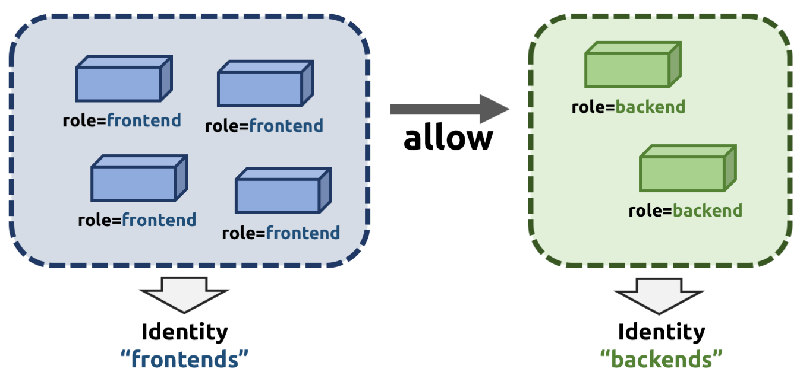

.. only:: not (epub or latex or html)

    WARNING: You are looking at unreleased Cilium documentation.
    Please use the official rendered version released here:
    https://docs.cilium.io

.. _arch_id_security:

**************
Identity-Based
**************

Container management systems such as Kubernetes deploy a networking model which
assigns an individual IP address to each pod (group of containers). This
ensures simplicity in architecture, avoids unnecessary network address
translation (NAT) and provides each individual container with a full range of
port numbers to use. The logical consequence of this model is that depending on
the size of the cluster and total number of pods, the networking layer has to
manage a large number of IP addresses.

Traditionally security enforcement architectures have been based on IP address
filters.  Let's walk through a simple example: If all pods with the label
``role=frontend`` should be allowed to initiate connections to all pods with
the label ``role=backend`` then each cluster node which runs at least one pod
with the label ``role=backend`` must have a corresponding filter installed
which allows all IP addresses of all ``role=frontend`` pods to initiate a
connection to the IP addresses of all local ``role=backend`` pods. All other
connection requests should be denied. This could look like this: If the
destination address is *10.1.1.2* then allow the connection only if the source
address is one of the following *[10.1.2.2,10.1.2.3,20.4.9.1]*.

Every time a new pod with the label ``role=frontend`` or ``role=backend`` is
either started or stopped, the rules on every cluster node which run any such
pods must be updated by either adding or removing the corresponding IP address
from the list of allowed IP addresses. In large distributed applications, this
could imply updating thousands of cluster nodes multiple times per second
depending on the churn rate of deployed pods. Worse, the starting of new
``role=frontend`` pods must be delayed until all servers running
``role=backend`` pods have been updated with the new security rules as
otherwise connection attempts from the new pod could be mistakenly dropped.
This makes it difficult to scale efficiently.

In order to avoid these complications which can limit scalability and
flexibility, Cilium entirely separates security from network addressing.
Instead, security is based on the identity of a pod, which is derived through
labels.  This identity can be shared between pods. This means that when the
first ``role=frontend`` pod is started, Cilium assigns an identity to that pod
which is then allowed to initiate connections to the identity of the
``role=backend`` pod. The subsequent start of additional ``role=frontend`` pods
only requires to resolve this identity via a key-value store, no action has to
be performed on any of the cluster nodes hosting ``role=backend`` pods. The
starting of a new pod must only be delayed until the identity of the pod has
been resolved which is a much simpler operation than updating the security
rules on all other cluster nodes.

