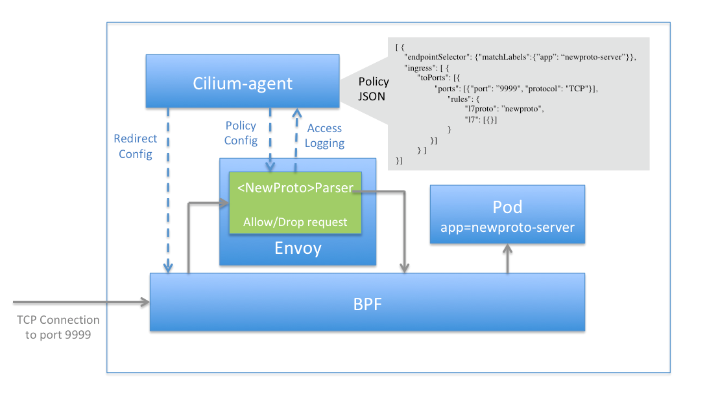
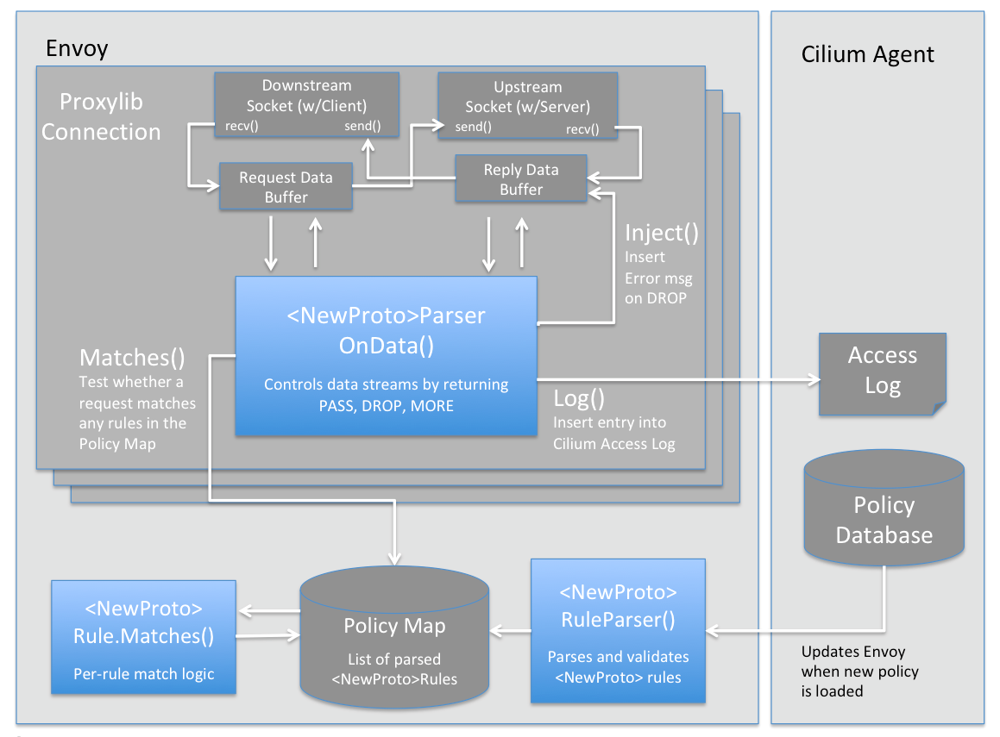

.. only:: not (epub or latex or html)

    WARNING: You are looking at unreleased Cilium documentation.
    Please use the official rendered version released here:
    https://docs.cilium.io

.. _envoy:

=====
Envoy
=====

Envoy proxy shipped with Cilium is built with minimal Envoy extensions and custom policy enforcement filters.
Cilium uses this minimal distribution as its host proxy for enforcing HTTP and other L7 policies as specified in network policies
for the cluster. Cilium proxy is distributed within the Cilium images.

For more information on the version compatibility matrix, see `Cilium Proxy documentation <https://github.com/cilium/proxy#version-compatibility-matrix>`_.

*************
Go Extensions
*************

.. note:: This feature is currently in beta phase.

This is a guide for developers who are interested in writing a Go extension to the 
Envoy proxy as part of Cilium.   

As depicted above, this framework allows a developer to write a small amount of Go
code (green box) focused on parsing a new API protocol, and this Go code is able to  
take full advantage of Cilium features including high-performance redirection to/from Envoy, 
rich L7-aware policy language
and access logging, and visibility into encrypted traffic via kTLS (coming soon!).
In sum, you as the developer need only worry about the logic of parsing the protocol, 
and Cilium + Envoy + eBPF do the heavy-lifting.  

This guide uses simple examples based on a hypothetical "r2d2" protocol 
(see `proxylib/r2d2/r2d2parser.go <https://github.com/cilium/cilium/blob/main/proxylib/r2d2/r2d2parser.go>`_)
that might be used to talk to a simple protocol droid a long time ago in a galaxy far, far away.   
But it also points to other real protocols like Memcached and Cassandra that already exist in the cilium/proxylib 
directory.  

Step 1: Decide on a Basic Policy Model
======================================

To get started, take some time to think about what it means to provide protocol-aware security
in the context of your chosen protocol.   Most protocols follow a common pattern of a client 
who performs an ''operation'' on a ''resource''.   For example: 

- A standard RESTful HTTP request has a GET/POST/PUT/DELETE methods (operation) and URLs (resource).
- A database protocol like MySQL has SELECT/INSERT/UPDATE/DELETE actions (operation) on a combined database + table name (resource).   
- A queueing protocol like Kafka has produce/consume (operation) on a particular queue (resource).    

A common policy model is to allow the user to whitelist certain operations on one or more resources.   
In some cases, the resources need to support regexes to avoid explicit matching on variable content 
like ids (e.g., /users/<uuid> would match /users/.*) 

In our examples, the ''r2d2'' example, we'll use a basic set of operations (READ/WRITE/HALT/RESET). 
The READ and WRITE commands also support a 'filename' resource, while HALT and RESET have no resource.  

Step 2: Understand Protocol, Encoding, Framing and Types
========================================================

Next, get your head wrapped around how a protocol looks terms of the raw data, as this is what you'll be parsing. 

Try looking for official definitions of the protocol or API.   Official docs will not only help you quickly 
learn how the protocol works, but will also help you by documenting tricky corner cases that wouldn't be 
obvious just from regular use of the protocol.   For example, here are example specs for 
`Redis Protocol <https://redis.io/topics/protocol>`_ , `Cassandra Protocol <https://github.com/apache/cassandra/blob/trunk/doc/native_protocol_v4.spec>`_,  
and `AWS SQS <https://docs.aws.amazon.com/AWSSimpleQueueService/latest/APIReference/Welcome.html>`_ .  

These specs help you understand protocol aspects like: 

- **encoding / framing** : how to recognize the beginning/end of individual requests/replies within a TCP stream. 
  This typically involves reading a header that encodes the overall request length, though some simple 
  protocols use a delimiter like ''\r\n\'' to separate messages.  

- **request/reply fields** : for most protocols, you will need to parse out fields at various offsets
  into the request data in order to extract security-relevant values for visibility + filtering.  In some cases, access
  control requires filtering requests from clients to servers, but in some cases, parsing replies will also be required
  if reply data is required to understand future requests (e.g., prepared-statements in database protocols).  

- **message flow** : specs often describe various dependencies between different requests.  Basic protocols tend to 
  follow a simple serial request/reply model, but more advanced protocols will support pipelining (i.e., sending 
  multiple requests before any replies have been received).  

- **protocol errors** : when a Cilium proxy denies a request based on policy, it should return a protocol-specific
  error to the client (e.g., in HTTP, a proxy should return a ''403 Access Denied'' error).  Looking at the protocol
  spec will typically indicate how you should return an equivalent ''Access Denied'' error.    
  
Sometimes, the protocol spec does not give you a full sense of the set of commands that can be sent over the protocol.  In that 
case, looking at higher-level user documentation can fill in some of these knowledge gaps.  Here are examples for 
`Redis Commands <https://redis.io/commands>`_ and `Cassandra CQL Commands <https://docs.datastax.com/en/archived/cql/3.1/cql/cql_reference/cqlCommandsTOC.html>`_ .
 
Another great trick is to use `Wireshark <https://www.wireshark.org>`_  to capture raw packet data between
a client and server.   For many protocols, the `Wireshark Sample Captures <https://wiki.wireshark.org/SampleCaptures>`_ 
has already saved captures for us.  Otherwise, you can easily use tcpdump to capture a file.  For example, for 
MySQL traffic on port 3306, you could run the following in a container running the MySQL client or server: 
“tcpdump -s 0 port 3306 -w mysql.pcap”.  `More Info <https://linuxexplore.com/2012/06/07/use-tcpdump-to-capture-in-a-pcap-file-wireshark-dump/>`_    

In our example r2d2 protocol, we'll keep the spec as simple as possible.  It is a text-only based protocol, 
with each request being a line terminated by ''\r\n''.  A request starts with a case-insensitive string 
command ("READ","WRITE","HALT","RESET").   If the command is "READ" or "WRITE", the command must be followed
by a space, and a non-empty filename that contains only non whitespace ASCII characters.  

Step 3: Search for Existing Parser Code / Libraries
===================================================

Look for open source Go library/code that can help.    
Is there existing open source Go code that parse your protocol that you can leverage, 
either directly as library or a motivating example?  For example, the `tidwall/recon library 
<https://github.com/tidwall/redcon>`_ parses Redis in Go, and `Vitess 
<https://github.com/vitessio/vitess>`_ parses MySQL in Go.   `Wireshark dissectors 
<https://github.com/boundary/wireshark/tree/master/epan/dissectors>`_ also has a wealth of 
protocol parsers written in C that can serve as useful guidance.    Note:  finding client-only 
protocol parsing code is typically less helpful than finding a proxy implementation, or a full 
parser library.   This is because the set of requests a client parsers is typically the inverse
set of the requests a Cilium proxy needs to parse, since the proxy mimics the server rather than 
the client.   Still, viewing a Go client can give you a general idea of how to parse the 
general serialization format of the protocol.  

Step 4: Follow the Cilium Developer Guide
=========================================

It is easiest to start Cilium development by following the :ref:`dev_guide`

After cloning Cilium: 

.. code-block:: shell-session

    $ cd cilium 
    $ contrib/vagrant/start.sh 
    $ cd proxylib

While this dev VM is running, you can open additional terminals to the Cilium dev VM
by running ''vagrant ssh'' from within the cilium source directory.  

Step 5: Create New Proxy Skeleton 
=================================

From inside the proxylib directory, copy the rd2d directory and rename the files. 
Replace ''newproto'' with your protocol: 

.. code-block:: shell-session

    $ mkdir newproto
    $ cd newproto
    $ cp ../r2d2/r2d2parser.go newproto.go
    $ cp ../r2d2/r2d2parser_test.go newproto_test.go

Within both newproto.go and newproto_test.go update references to r2d2 with
your protocol name.   Search for both ''r2d2'' and ''R2D2''.  

Also, edit proxylib.go and add the following import line: 

:: 

       _ "github.com/cilium/cilium/proxylib/newproto"

Step 6: Update OnData Method 
============================

Implementing a parser requires you as the developer to implement three primary functions,
shown as blue in the diagram below.   We will cover OnData() in this section, and 
the other functions in section `Step 9:  Add Policy Loading and Matching`_.  

The beating heart of your parsing is implementing the onData function.  You can think of any 
proxy as have two data streams, one in the request direction (i.e., client to server) and one in 
the reply direction (i.e., server to client).   OnData is called when there is data to process, 
and the value of the boolean 'reply' parameter indicates the direction of the stream for a given 
call to OnData.   The data passed to OnData is a slice of byte slices (i.e., an array of byte arrays).  

The return values of the OnData function tell the Go framework tell how data in the stream
should be processed, with four primary outcomes:  

- **PASS x** :  The next x bytes in the data stream passed to OnData represent a request/reply that should be
  passed on to the server/client.   The common case here is that this is a request that should be 
  allowed by policy, or that no policy is applied.  Note: x bytes may be less than the total amount
  of data passed to OnData, in which case the remaining bytes will still be in the data stream when
  onData is invoked next.  x bytes may also be more than the data that has been passed to OnData. 
  For example, in the case of a protocol where the parser filters only on values in a protocol header, 
  it is often possible to make a filtering decision, and then pass (or drop) the size of the full 
  request/reply without having the entire request passed to Go.  

- **MORE x** :  The buffers passed to OnData to do not represent all of the data required to frame and
  filter the request/reply.  Instead, the parser 
  needs to see at least x additional bytes beyond the current data to make a decision.  
  In some cases, the full request must be read to understand framing and filtering, but in others a decision 
  can be made simply by reading a protocol header.   When parsing data, be defensive, and recognize that it is technically possible that 
  data arrives one byte at a time. Two common scenarios exist here:

  - **Text-based Protocols** : For text-based protocols
    that use a delimiter like "\r\n", it is common to simply check if the delimiter exists, and return 
    MORE 1 if it does not, as technically one more character could result in the delimiter being present.
    See the sample r2d2 parser as a basic example of this.    

  - **Binary-based protocols** : Many binary protocols  
    have a fixed header length, which containers a field that then indicates the remaining length
    of the request.  In the binary case, first check to make sure a full header is received.  Typically
    the header will indicate both the full request length (i.e., framing), as well as the request type, 
    which indicates how much of the full request must be read in order to perform filtering (in many cases, this is less than 
    the full request).  A binary parser will typically return MORE if the data passed to OnData is less than 
    the header length.   After reading a full header, the simple approach is for the parser to return MORE to wait 
    for the full request to be received and parsed  (see the existing CassandraParser as an example).
    However, as an optimization, the parser can attempt to only 
    request the minimum number of bytes required beyond the header to make a policy decision, and then PASS or DROP
    the remaining bytes without requiring them to be passed to the Go parser. 

- **DROP x** :  Remove the first x bytes from the data stream passed to OnData, as they represent a request/reply
  that should not be forwarded to the client or server based on policy.  Don't worry about making onData return 
  a drop right away, as we'll return to DROP in a later step below.  

- **ERROR y** : The connection contains data that does not match the protocol spec, and prevents you from further 
  parsing the data stream.   The framework will terminate the connection.   An example would be a request length
  that falls outside the min/max specified by the protocol spec, or values for a field that fall outside the values
  indicated by the spec (e.g., wrong versions, unknown commands).  If you are still able to properly frame the 
  requests, you can also choose to simply drop the request and return a protocol error (e.g., similar to an 
  ''HTTP 400 Bad Request'' error.   But in all cases, you should write your parser defensively, such that you 
  never forward a request that you do not understand, as such a request could become an avenue for subverting 
  the intended security visibility and filtering policies.  See proxylib/types.h for the set of valid error codes.   

See proxylib/proxylib/parserfactory.go for the official OnData interface definition.   

Keep it simple, and work iteratively.  Start out just getting the framing right.  Can you write a parser that just 
prints out the length and contents of a request, and then PASS each request with no policy enforcement?   

One simple trick is to comment out the r2d2 parsing logic in OnData, but leave it in the file as a reference, as your protocol will likely
require similar code as we add more functionality below.  

Step 7: Use Unit Testing To Drive Development
=============================================

Use unit tests to drive your development.    Its tempting to want to first test your parser by firing up a
client and server and developing on the fly.   But in our experience you’ll iterate faster by using the 
great unit test framework created along with the Go proxy framework.   This framework lets you pass
in an example set of requests as byte arrays to a CheckOnDataOK method, which are passed to the parser's OnData method.
CheckOnDataOK takes a set of expected return values, and compares them to the actual return values from OnData 
processing the byte arrays.  

Take some time to look at the unit tests for the r2d2 parser, and then for more complex parsers like Cassandra
and Memcached.   For simple text-based protocols, you can simply write ASCII strings to represent protocol messages, 
and convert them to []byte arrays and pass them to CheckOnDataOK.   For binary protocols, one can either create 
byte arrays directly, or use a mechanism to convert a hex string to byte[] array using a helper function like 
hexData in cassandra/cassandraparser_test.go

A great way to get the exact data to pass in is to copy the data from the Wireshark captures mentioned
above in Step #2.   You can see the full application layer data streams in Wireshark by right-clicking
on a packet and selecting “Follow As… TCP Stream”.  If the protocol is text-based, you can copy the data 
as ASCII (see r2d2/r2d2parser_test.go as an example of this).   For binary data, it can be easier to instead 
select “raw” in the drop-down, and use a basic utility to convert from ascii strings to binary raw data (see 
cassandra/cassandraparser_test.go for an example of this). 

To run the unit tests, go to proxylib/newproto and run: 

.. code-block:: shell-session

  $ go test

This will build the latest version of your parser and unit test files and run the unit tests.   

Step 8: Add More Advanced Parsing
=================================

Thinking back to step #1, what are the critical fields to parse out of the request in order to 
understand the “operation” and “resource” of each request.  Can you print those out for each request?

Use the unit test framework to pass in increasingly complex requests, and confirm that the parser prints out the right values, and that the 
unit tests are properly slicing the datastream into requests and parsing out the required fields. 

A couple scenarios to make sure your parser handles properly via unit tests: 

- data chunks that are less than a full request (return MORE) 
- requests that are spread across multiple data chunks. (return MORE ,then PASS) 
- multiple requests that are bundled into a single data chunk (return PASS, then another PASS)
- rejection of malformed requests (return ERROR). 

For certain advanced cases, it is required for a parser to store state across requests. 
In this case, data can be stored using data structures that
are included as part of the main parser struct.  See CassandraParser in cassandra/cassandraparser.go as an example 
of how the parser uses a string to store the current 'keyspace' in use, and uses Go maps to keep 
state required for handling prepared queries.   

Step 9:  Add Policy Loading and Matching
========================================

Once you have the parsing of most protocol messages ironed out, its time to start enforcing policy. 

First, create a Go object that will represent a single rule in the policy language. For example,
this is the rule for the r2d2 protocol, which performs exact match on the command string, and a regex
on the filename:  

.. code-block:: go

    type R2d2Rule struct {
       cmdExact   string
       fileRegexCompiled *regexp.Regexp
    }

There are two key methods to update: 

- Matches :   This function implements the basic logic of comparing data from a single request 
  against a single policy rule, and return true if that rule matches (i.e., allows) that request.  

- <NewProto>RuleParser : Reads key value pairs from policy, validates those entries, and stores
  them as a <NewProto>Rule object.   

See r2d2/r2d2parser.go for examples of both functions for the r2d2 protocol.  

You'll also need to update OnData to call p.connection.Matches(), and if this function return false, 
return DROP for a request.  Note: despite the similar names between the Matches() function you 
create in your newprotoparser.go and p.connection.Matches(), do not confuse
the two.  Your OnData function should always call p.connection.Matches() rather than invoking your
own Matches() directly, as p.connection.Matches()
calls the parser's Matches() function only on the subset of L7 rules that apply for the given 
Cilium source identity for this particular connection.  

Once you add the logic to call Matches() and return DROP in OnData, you will need to update
unit tests to have policies that allow the traffic you expect to be passed.   The following 
is an example of how r2d2/r2d2parser_test.go adds an allow-all policy for a given test: 

.. code-block:: go

    s.ins.CheckInsertPolicyText(c, "1", []string{`
        name: "cp1"
        policy: 2
        ingress_per_port_policies: <
          port: 80
          rules: <
            l7_proto: "r2d2"
          >
        >
        `})

The following is an example of a policy that would allow READ commands with a file 
regex of ".*": 

.. code-block:: go

    s.ins.CheckInsertPolicyText(c, "1", []string{`
        name: "cp2"
        policy: 2
        ingress_per_port_policies: <
          port: 80
          rules: <
            l7_proto: "r2d2"
            l7_rules: <
            rule: <
              key: "cmd"
              value: "READ"
            >
            rule: <
              key: "file"
              value: ".*"
            >
              >
            >
          >
        >
        `})

Step 10: Inject Error Response
==============================

Simply dropping the request from the request data stream prevents the request from reaching the server, but it would 
leave the client hanging, waiting for a response that would never come since the server did not see the request. 

Instead, the proxy should return an application-layer reply indicating that access was denied, similar to how
an HTTP proxy would return a ''403 Access Denied'' error.  Look back at the protocol spec discussed in Step 2 to 
understand what an access denied message looks like for this protocol, and use the p.connection.Inject() method 
to send this error reply back to the client.   See r2d2/r2d2parser.go for an example. 

.. code-block:: go

    p.connection.Inject(true, []byte("ERROR\r\n"))

Note:  p.connection.Inject() will inject the data it is passed into the reply datastream.  In order for the client 
to parse this data correctly, it must be injected at a proper framing boundary (i.e., in between other reply messages
that may be in the reply data stream).  If the client is following a basic serial request/reply model per connection, this is 
essentially guaranteed as at the time of a request that is denied, there are no other replies potentially in the 
reply datastream.   But if the protocol supports pipelining (i.e., multiple requests in flight) replies must be properly 
framed and PASSed on a per request basis, and the timing of the call to p.connection.Inject() must be controlled
such that the client will properly match the Error response with the correct request.   See the Memcached parser
as an example of how to accomplish this.  

Step 11: Add Access Logging
===========================

Cilium also has the notion of an ''Access Log'', which records each request handled by the proxy 
and indicates whether the request was allowed or denied.  

A call to ''p.connection.Log()'' implements access logging. See the OnData function in r2d2/r2d2parser.go 
as an example: 

.. code-block:: go

      p.connection.Log(access_log_entry_type,
        &cilium.LogEntry_GenericL7{
            &cilium.L7LogEntry{
                Proto: "r2d2",
                Fields: map[string]string{
                    "cmd":  reqData.cmd,
                    "file": reqData.file,
                },
            },
      })  

Step 12: Manual Testing
=======================

Find the standard docker container for running the protocol server.  Often the same image also has a CLI client that you can use as a client. 

Start both a server and client container running in the cilium dev VM, and attach them to the already created “cilium-net”.  For example, with Cassandra, we run:

.. code-block:: shell-session

    docker run --name cass-server -l id=cass-server -d --net cilium-net cassandra

    docker run --name cass-client -l id=cass-client -d --net cilium-net cassandra sh -c 'sleep 3000' 
 

Note that we run both containers with labels that will make it easy to refer to these containers in a cilium 
network policy.   Note that we have the client container run the sleep command, as we will use 'docker exec' to 
access the client CLI.  

Use ''cilium endpoint list'' to identify the IP address of the protocol server.  

.. code-block:: shell-session

  $ cilium endpoint list
  ENDPOINT   POLICY (ingress)   POLICY (egress)   IDENTITY   LABELS (source:key[=value])   IPv6                 IPv4            STATUS   
             ENFORCEMENT        ENFORCEMENT                                                                                     
  2987       Disabled           Disabled          31423      container:id=cass-server      f00d::a0b:0:0:bab    10.11.51.247    ready   
  27333      Disabled           Disabled          4          reserved:health               f00d::a0b:0:0:6ac5   10.11.92.46     ready   
  50923      Disabled           Disabled          18253      container:id=cass-client      f00d::a0b:0:0:c6eb   10.11.175.191   ready 

One can then invoke the client CLI using that server IP address (10.11.51.247 in the above example):

.. code-block:: shell-session

    docker exec -it cass-client sh -c 'cqlsh 10.11.51.247 -e "select * from system.local"'

Note that in the above example, ingress policy is not enforced for the Cassandra server endpoint, so no data will flow through the
Cassandra parser.  A simple ''allow all'' L7 Cassandra policy can be used to send all data to the Cassandra server through the 
Go Cassandra parser.  This policy has a single empty rule, which matches all requests.  An allow all policy looks like: 

.. code-block:: json

  [ { 
    "endpointSelector": {"matchLabels":{"id":"cass-server"}}, 
    "ingress": [ {
	  "toPorts": [{
		  "ports": [{"port": "9042", "protocol": "TCP"}],
            		"rules": {
                		"l7proto": "cassandra",
                		"l7": [{}]
            		}
		}]
	  } ] 
  }]

A policy can be imported into cilium using ''cilium policy import'', after which another call to ''cilium endpoint list''
confirms that ingress policy is now in place on the server.  If the above policy was saved to a file cass-allow-all.json, 
one would run: 

.. code-block:: shell-session

    $ cilium policy import cass-allow-all.json
    Revision: 1
    $ cilium endpoint list
    ENDPOINT   POLICY (ingress)   POLICY (egress)   IDENTITY   LABELS (source:key[=value])   IPv6                 IPv4            STATUS   
               ENFORCEMENT        ENFORCEMENT                                                                                     
    2987       Enabled            Disabled          31423      container:id=cass-server      f00d::a0b:0:0:bab    10.11.51.247    ready   
    27333      Disabled           Disabled          4          reserved:health               f00d::a0b:0:0:6ac5   10.11.92.46     ready   
    50923      Disabled           Disabled          18253      container:id=cass-client      f00d::a0b:0:0:c6eb   10.11.175.191   ready 

Note that policy is now showing as ''Enabled'' for the Cassandra server on ingress. 

To remove this or any other policy, run: 

.. code-block:: shell-session

    $ cilium policy delete --all 

To install a new policy, first delete, and then run ''cilium policy import'' again.  For example, the following policy would allow
select statements on a specific set of tables to this Cassandra server, but deny all other queries. 

.. code-block:: json

  [ {
    "endpointSelector": {"matchLabels":{"id":"cass-server"}},
    "ingress": [ {
          "toPorts": [{
                  "ports": [{"port": "9042", "protocol": "TCP"}],
                        "rules": {
                                "l7proto": "cassandra",
                                "l7": [
                                       { "query_action" : "select", "query_table": "^system.*"},
                                       { "query_action" : "select", "query_table" : "^posts_db.posts$"}

                                ]}
                        }]
         }]
  } ]

When performing manual testing, remember that each time you change your Go proxy code, you must
re-run ``make`` and ``sudo make install`` and then restart the cilium-agent process.  If the only changes
you have made since last compiling cilium are in your cilium/proxylib directory, you can safely 
just run ``make`` and ``sudo make install``  in that directory, which saves time.  
For example: 

.. code-block:: shell-session

  $ cd proxylib  // only safe is this is the only directory that has changed
  $ make  
    <snip> 
  $ sudo make install 
    <snip> 

If you rebase or other files change, you need to run both commands from the top level directory.  

Cilium agent default to running as a service in the development VM.  However, the default options do not include 
the ''--debug-verbose=flow'' flag, which is critical to getting visibility in troubleshooting Go proxy frameworks. 
So it is easiest to stop the cilium service and run the cilium-agent directly as a command in a terminal window, 
and adding the ''--debug-verbose=flow'' flag. 

.. code-block:: shell-session

  $ sudo service cilium stop 
  
  $ sudo /usr/bin/cilium-agent --debug --ipv4-range 10.11.0.0/16 --kvstore-opt consul.address=192.168.60.11:8500 --kvstore consul -t vxlan --fixed-identity-mapping=128=kv-store --fixed-identity-mapping=129=kube-dns --debug-verbose=flow

Step 13: Add Runtime Tests
==========================

Before submitting this change to the Cilium community, it is recommended that you add runtime tests that will run as
part of Cilium's continuous integration testing.   Usually these runtime test can be based on the same container 
images and test commands you used for manual testing.   

The best approach for adding runtime tests is typically to start out by copying-and-pasting an existing L7 protocol runtime
test and then updating it to run the container images and CLI commands specific to the new protocol.   
See cilium/test/runtime/cassandra.go as an example that matches the use of Cassandra described above in the manual testing
section.   Note that the json policy files used by the runtime tests are stored in cilium/test/runtime/manifests, and 
the Cassandra example policies in those directories are easy to use as a based for similar policies you may create for your
new protocol.  

Step 14: Review Spec for Corner Cases
=====================================

Many protocols have advanced features or corner cases that will not manifest themselves as part of basic testing.   
Once you have written a first rev of the parser, it is a good idea to go back and review the protocol's spec or list of 
commands to see what if any aspects may fall outside the scope of your initial parser.    
For example, corner cases like the handling of empty or nil lists may not show up in your testing, but may cause your
parser to fail.   Add more unit tests to cover these corner cases.  
It is OK for the first rev of your parser not to handle all types of requests, or to have a simplified policy structure 
in terms of which fields can be matched.   However, it is 
important to know what aspects of the protocol you are not parsing, and ensure that it does not lead to any security concerns. 
For example, failing to parse prepared statements in a database protocol and instead just passing PREPARE and EXECUTE
commands through would lead to gaping security whole that would render your other filtering meaningless in the face of
a sophisticated attacker.   

Step 15: Write Docs or Getting Started Guide (optional) 
=======================================================

At a minimum, the policy examples included as part of the runtime tests serve
as basic documentation of the policy and its expected behavior.  But we also 
encourage adding more user friendly examples and documentation, for example, 
Getting Started Guides.  cilium/Documentation/gettingstarted/cassandra.rst is
a good example to follow.   Also be sure to update Documentation/gettingstarted/index.rst
with a link to this new getting started guide. 

With that, you are ready to post this change for feedback from the Cilium community.  Congrats! 
