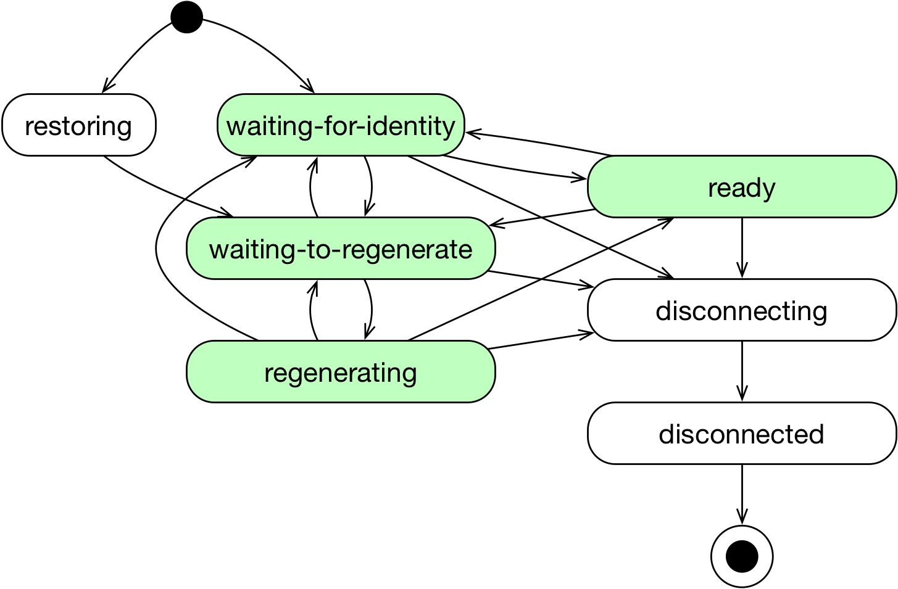

.. only:: not (epub or latex or html)

    WARNING: You are looking at unreleased Cilium documentation.
    Please use the official rendered version released here:
    https://docs.cilium.io

.. _endpoint_lifecycle:
.. _Endpoint Lifecycle:

Endpoint Lifecycle
==================

This section specifies the lifecycle of Cilium endpoints.

Every endpoint in Cilium is in one of the following states:

* ``restoring``: The endpoint was started before Cilium started, and
  Cilium is restoring its networking configuration.
* ``waiting-for-identity``: Cilium is allocating a unique identity for
  the endpoint.
* ``waiting-to-regenerate``: The endpoint received an identity and is
  waiting for its networking configuration to be (re)generated.
* ``regenerating``: The endpoint's networking configuration is being
  (re)generated. This includes programming eBPF for that endpoint.
* ``ready``: The endpoint's networking configuration has been
  successfully (re)generated.
* ``disconnecting``: The endpoint is being deleted.
* ``disconnected``: The endpoint has been deleted.

The state of an endpoint can be queried using the ``cilium endpoint
list`` and ``cilium endpoint get`` CLI commands.

While an endpoint is running, it transitions between the
``waiting-for-identity``, ``waiting-to-regenerate``, ``regenerating``,
and ``ready`` states.  A transition into the ``waiting-for-identity``
state indicates that the endpoint changed its identity.  A transition
into the ``waiting-to-regenerate`` or ``regenerating`` state indicates
that the policy to be enforced on the endpoint has changed because of
a change in identity, policy, or configuration.

An endpoint transitions into the ``disconnecting`` state when it is
being deleted, regardless of its current state.

.. _init_identity:

Init Identity
-------------

In some situations, Cilium can't determine the labels of an endpoint
immediately when the endpoint is created, and therefore can't allocate an
identity for the endpoint at that point.  Until the endpoint's labels are
known, Cilium temporarily associates a special single label ``reserved:init``
to the endpoint. When the endpoint's labels become known, Cilium then replaces
that special label with the endpoint's labels and allocates a proper identity
to the endpoint.

This may occur during endpoint creation in the following cases:

* Running Cilium with docker via libnetwork
* With Kubernetes when the Kubernetes API server is not available
* In etcd mode when the corresponding kvstore is not available

To allow traffic to/from endpoints while they are initializing, you
can create policy rules that select the ``reserved:init`` label,
and/or rules that allow traffic to/from the special ``init`` entity.

For instance, writing a rule that allows all initializing endpoints to
receive connections from the host and to perform DNS queries may be
done as follows:

.. only:: html

   .. tabs::
     .. group-tab:: k8s YAML

        .. literalinclude:: ../../../examples/policies/l4/init.yaml
     .. group-tab:: JSON

        .. literalinclude:: ../../../examples/policies/l4/init.json

.. only:: epub or latex

        .. literalinclude:: ../../../examples/policies/l4/init.json

Likewise, writing a rule that allows an endpoint to receive DNS
queries from initializing endpoints may be done as follows:

.. only:: html

   .. tabs::
     .. group-tab:: k8s YAML

        .. literalinclude:: ../../../examples/policies/l4/from_init.yaml
     .. group-tab:: JSON

        .. literalinclude:: ../../../examples/policies/l4/from_init.json

.. only:: epub or latex

        .. literalinclude:: ../../../examples/policies/l4/from_init.json

If any ingress (resp. egress) policy rules selects the
``reserved:init`` label, all ingress (resp. egress) traffic to
(resp. from) initializing endpoints that is not explicitly allowed by
those rules will be dropped.  Otherwise, if the policy enforcement
mode is ``never`` or ``default``, all ingress (resp. egress) traffic
is allowed to (resp. from) initializing endpoints.  Otherwise, all
ingress (resp. egress) traffic is dropped.
