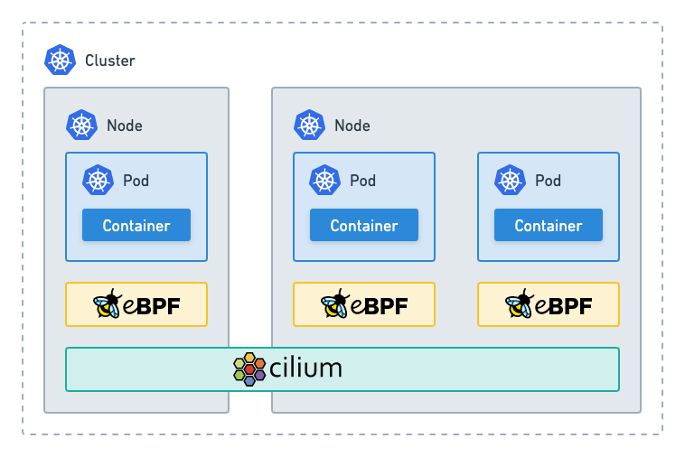
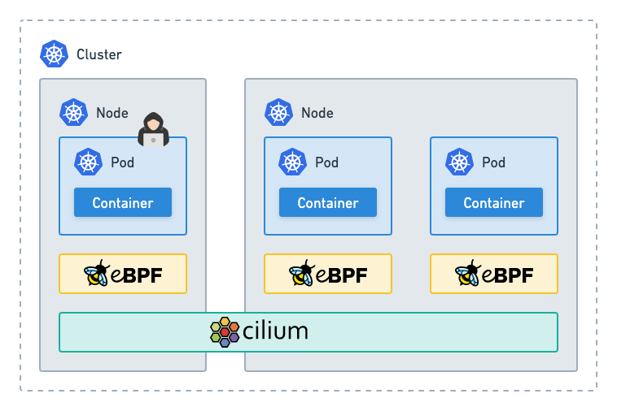
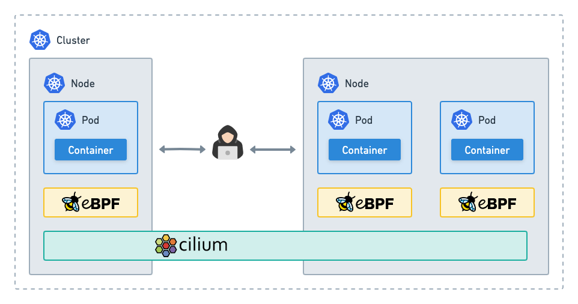
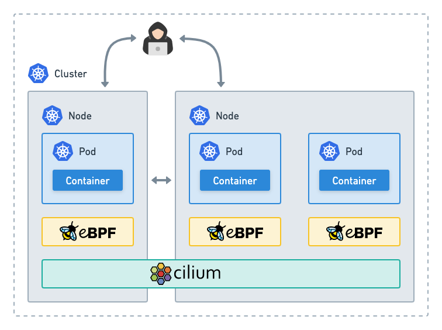
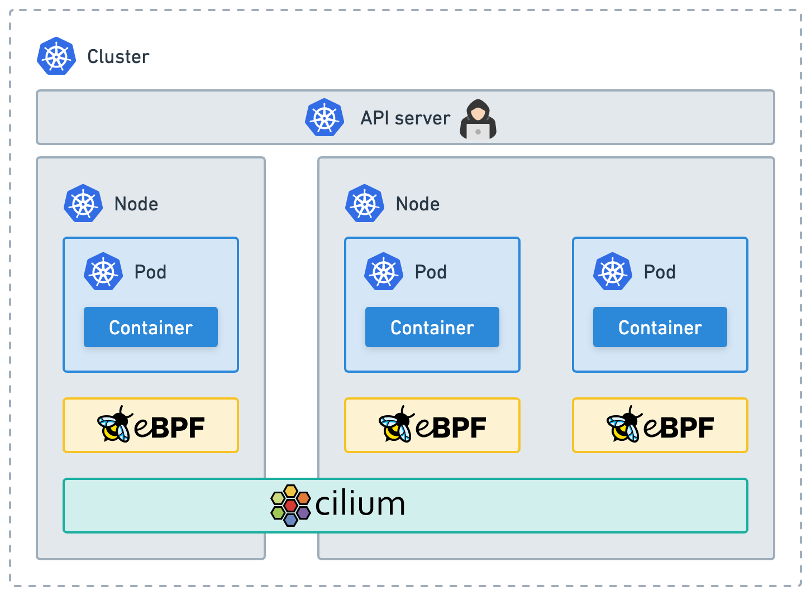
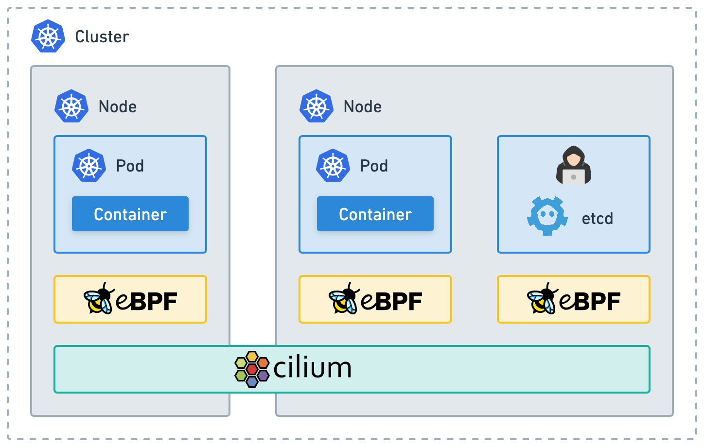
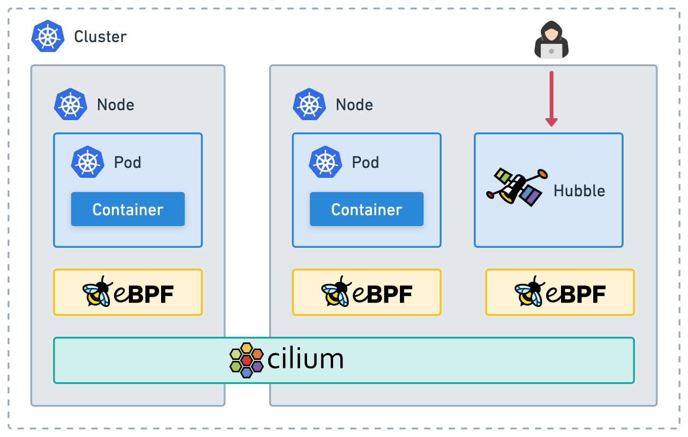

.. only:: not (epub or latex or html)

    WARNING: You are looking at unreleased Cilium documentation.
    Please use the official rendered version released here:
    https://docs.cilium.io

Threat Model
============

This section presents a threat model for Cilium. This threat model
allows interested parties to understand:

-  security-specific implications of Cilium's architecture
-  controls that are in place to secure data flowing through Cilium's various components
-  recommended controls for running Cilium in a production environment

Scope and Prerequisites
-----------------------

This threat model considers the possible attacks that could affect an
up-to-date version of Cilium running in a production environment; it
will be refreshed when there are significant changes to Cilium's
architecture or security posture.

This model does not consider supply-chain attacks, such as attacks where
a malicious contributor is able to intentionally inject vulnerable code
into Cilium. For users who are concerned about supply-chain attacks,
Cilium's `security audit`_ assessed Cilium's supply chain controls
against `the SLSA framework`_.

In order to understand the following threat model, readers will need
familiarity with basic Kubernetes concepts, as well as a high-level
understanding of Cilium's :ref:`architecture and components<component_overview>`.

.. _security audit: https://github.com/cilium/cilium.io/blob/main/Security-Reports/CiliumSecurityAudit2022.pdf
.. _the SLSA framework:  https://slsa.dev/

Methodology
-----------

This threat model considers eight different types of threat
actors, placed at different parts of a typical deployment stack. We will
primarily use Kubernetes as an example but the threat model remains
accurate if deployed with other orchestration systems, or when running
Cilium outside of Kubernetes. The attackers will have different levels
of initial privileges, giving us a broad overview of the security
guarantees that Cilium can provide depending on the nature of the threat
and the extent of a previous compromise.

For each threat actor, this guide uses the `the STRIDE methodology`_ to
assess likely attacks. Where one attack type in the STRIDE set can lead to others
(for example, tampering leading to denial of service), we have described the
attack path under the most impactful attack type. For the potential attacks
that we identify, we recommend controls that can be used to reduce the
risk of the identified attacks compromising a cluster. Applying the
recommended controls is strongly advised in order to run Cilium securely
in production.

.. _the STRIDE methodology: https://en.wikipedia.org/wiki/STRIDE_(security)

Reference Architecture
----------------------

For ease of understanding, consider a single Kubernetes
cluster running Cilium, as illustrated below:

The Threat Surface
~~~~~~~~~~~~~~~~~~

In the above scenario, the aim of Cilium's security controls is to
ensure that all the components of the Cilium platform are operating
correctly, to the extent possible given the abilities of the threat
actor that Cilium is faced with. The key components that need to be
protected are:

-  the Cilium agent running on a node, either as a Kubernetes pod, a host process, or as an entire virtual machine
-  Cilium state (either stored via CRDs or via an external key-value store like etcd)
-  eBPF programs loaded by Cilium into the kernel
-  network packets managed by Cilium
-  observability data collected by Cilium and stored by Hubble

The Threat Model
----------------

For each type of attacker, we consider the plausible types of attacks
available to them, how Cilium can be used to protect against these
attacks, as well as the security controls that Cilium provides. For
attacks which might arise as a consequence of the high level of
privileges required by Cilium, we also suggest mitigations that users
should apply to secure their environments.

.. _kubernetes-workload-attacker:

Kubernetes Workload Attacker
~~~~~~~~~~~~~~~~~~~~~~~~~~~~

For the first scenario, consider an attacker who has been able to
gain access to a Kubernetes pod, and is now able to run arbitrary code
inside a container. This could occur, for example, if a vulnerable
service is exposed externally to a network. In this case, let us also
assume that the compromised pod does not have any elevated privileges
(in Kubernetes or on the host) or direct access to host files.

In this scenario, there is no potential for compromise of the Cilium
stack; in fact, Cilium provides several features that would allow users
to limit the scope of such an attack:

.. rst-class:: wrapped-table

+-----------------+---------------------+--------------------------------+
| Threat surface  | Identified STRIDE   | Cilium security benefits       |
|                 | threats             |                                |
+=================+=====================+================================+
| Cilium agent    | Potential denial of | Cilium can enforce             |
|                 | service if the      | `bandwidth limitations`_       |
|                 | compromised         | on pods to limit the network   | 
|                 |                     | resource utilization.          |
|                 | Kubernetes workload |                                |
|                 | does not have       |                                |
|                 | defined resource    |                                |
|                 | limits.             |                                |
+-----------------+---------------------+--------------------------------+
| Cilium          | None                |                                |
| configuration   |                     |                                |
+-----------------+---------------------+--------------------------------+
| Cilium eBPF     | None                |                                |
| programs        |                     |                                |
+-----------------+---------------------+--------------------------------+
| Network data    | None                | - Cilium's network policy can  |
|                 |                     |   be used to provide           |
|                 |                     |   least-privilege isolation    |
|                 |                     |   between Kubernetes           |
|                 |                     |   workloads, and between       |
|                 |                     |   Kubernetes workloads and     |
|                 |                     |   "external" endpoints running |
|                 |                     |   outside the Kubernetes       |
|                 |                     |   cluster, or running on the   |
|                 |                     |   Kubernetes worker nodes.     |
|                 |                     |   Users should ideally define  |
|                 |                     |   specific allow rules that    |
|                 |                     |   only permit expected         |
|                 |                     |   communication between        |
|                 |                     |   services.                    |
|                 |                     | - Cilium's network             |
|                 |                     |   connectivity will prevent an |
|                 |                     |   attacker from observing the  |
|                 |                     |   traffic intended for other   |
|                 |                     |   workloads, or sending        |
|                 |                     |   traffic that "spoofs" the    |
|                 |                     |   identity of another pod,     |
|                 |                     |   even if transparent          |
|                 |                     |   encryption is not in use.    |
|                 |                     |   Pods cannot send traffic     |
|                 |                     |   that "spoofs" other pods due |
|                 |                     |   to limits on the use of      |
|                 |                     |   source IPs and limits on     |
|                 |                     |   sending tunneled traffic.    |
+-----------------+---------------------+--------------------------------+
| Observability   | None                | Cilium's Hubble flow-event     |
| data            |                     | observability can be used to   |
|                 |                     | provide reliable audit of      |
|                 |                     | the attacker's L3/L4 and L7    |
|                 |                     | network connectivity.          |
+-----------------+---------------------+--------------------------------+

.. _bandwidth limitations: https://docs.cilium.io/en/stable/network/kubernetes/bandwidth-manager/

Recommended Controls
^^^^^^^^^^^^^^^^^^^^

-  Kubernetes workloads should have `defined resource limits`_.
   This will help in ensuring that Cilium is not starved of resources due to a misbehaving deployment in a cluster.
-  Cilium can be given prioritized access to system resources either via
   Kubernetes, cgroups, or other controls.
-  Runtime security solutions such as `Tetragon`_ should be deployed to 
   ensure that container compromises can be detected as they occur.

.. _defined resource limits: https://kubernetes.io/docs/concepts/configuration/manage-resources-containers/
.. _Tetragon: https://github.com/cilium/tetragon

.. _limited-privilege-host-attacker:

Limited-privilege Host Attacker
~~~~~~~~~~~~~~~~~~~~~~~~~~~~~~~

In this scenario, the attacker is someone with the ability to run
arbitrary code with direct access to the host PID or network namespace
(or both), but without "root" privileges that would allow them to
disable Cilium components or undermine the eBPF and other kernel state
Cilium relies on.

This level of access could exist for a variety of reasons, including:

-  Pods or other containers running in the host PID or network
   namespace, but not with "root" privileges. This includes
   ``hostNetwork: true`` and ``hostPID: true`` containers.
-  Non-"root" SSH or other console access to a node.
-  A containerized workload that has "escaped" the container namespace
   but as a non-privileged user.

In this case, an attacker would be able to bypass some of Cilium's
network controls, as described below:

.. rst-class:: wrapped-table

+-----------------+-------------------------+----------------------------+
| **Threat        | **Identified STRIDE     | **Cilium security          |
| surface**       | threats**               | benefits**                 |
+=================+=========================+============================+
| Cilium agent    | - If the non-privileged |                            |
|                 |   attacker is able to   |                            |
|                 |   access the container  |                            |
|                 |   runtime and Cilium is |                            |
|                 |   running as a          |                            |
|                 |   container, the        |                            |
|                 |   attacker will be able |                            |
|                 |   to tamper with the    |                            |
|                 |   Cilium agent running  |                            |
|                 |   on the node.*         |                            |
|                 | - Denial of service is  |                            |
|                 |   also possible via     |                            |
|                 |   spawning workloads    |                            |
|                 |   directly on the host. |                            |
+-----------------+-------------------------+----------------------------+
| Cilium          | Same as for the Cilium  |                            |
| configuration   | agent.                  |                            |
|                 |                         |                            |
|                 |                         |                            |
|                 |                         |                            |
|                 |                         |                            |
|                 |                         |                            |
|                 |                         |                            |
|                 |                         |                            |
+-----------------+-------------------------+----------------------------+
| Cilium eBPF     | Same as for the Cilium  |                            |
| programs        | agent.                  |                            |
|                 |                         |                            |
|                 |                         |                            |
|                 |                         |                            |
|                 |                         |                            |
|                 |                         |                            |
|                 |                         |                            |
|                 |                         |                            |
+-----------------+-------------------------+----------------------------+
| Network data    | Elevation of            | Cilium's network           |
|                 | privilege: traffic      | connectivity will prevent  |
|                 | sent by the attacker    | an attacker from observing |
|                 | will no longer be       | the traffic intended for   |
|                 | subject to Kubernetes   | other workloads, or        |
|                 | or                      | sending traffic that       |
|                 | container-networked     | spoofs the identity of     |
|                 | Cilium network          | another pod, even if       |
|                 | policies.               | transparent encryption is  |
|                 | :ref:`Host-networked    | not in use.                |
|                 | Cilium                  |                            |
|                 | policies                |                            |
|                 | <host_firewall>`        |                            |
|                 | will continue to        |                            |
|                 | apply. Other traffic    |                            |
|                 | within the cluster      |                            |
|                 | remains unaffected.     |                            |
+-----------------+-------------------------+----------------------------+
| Observability   | None                    | Cilium's Hubble flow-event |
| data            |                         | observability can be used  |
|                 |                         | to provide reliable audit  |
|                 |                         | of the attacker's L3/L4    |
|                 |                         | and L7 network             |
|                 |                         | connectivity. Traffic sent |
|                 |                         | by the attacker will be    |
|                 |                         | attributed to the worker   |
|                 |                         | node, and not to a         |
|                 |                         | specific Kubernetes        |
|                 |                         | workload.                  |
+-----------------+-------------------------+----------------------------+

Recommended Controls
^^^^^^^^^^^^^^^^^^^^

In addition to the recommended controls against the :ref:`kubernetes-workload-attacker`:

-  Container images should be regularly patched to reduce the chance of
   compromise.
-  Minimal container images should be used where possible.
-  Host-level privileges should be avoided where possible.
-  Ensure that the container users do not have access to the underlying
   container runtime.

.. _root-equivalent-host-attacker:

Root-equivalent Host Attacker
~~~~~~~~~~~~~~~~~~~~~~~~~~~~~

A "root" privilege host attacker has full privileges to do everything on
the local host. This access could exist for several reasons, including:

-  Root SSH or other console access to the Kubernetes worker node.
-  A containerized workload that has escaped the container namespace as
   a privileged user.
-  Pods running with ``privileged: true`` or other significant
   capabilities like ``CAP_SYS_ADMIN`` or ``CAP_BPF``.

.. rst-class:: wrapped-table

+-------------------+--------------------------------------------------+
| **Threat          | **Identified STRIDE threats**                    |
| surface**         |                                                  |
+===================+==================================================+
| Cilium agent      | In this situation, all potential attacks covered |
|                   | by STRIDE are possible. Of note:                 |
|                   |                                                  |
|                   | -  The attacker would be able to disable eBPF on |
|                   |    the node, disabling Cilium's network and      |
|                   |    runtime visibility and enforcement. All       |
|                   |    further operations by the attacker will be    |
|                   |    unlimited and unaudited.                      |
|                   | -  The attacker would be able to observe network |
|                   |    connectivity across all workloads on the      |
|                   |    host.                                         |
|                   | -  The attacker can spoof traffic from the node  |
|                   |    such that it appears to come from pods        |
|                   |    with any identity.                            |
|                   | -  If the physical network allows ARP poisoning, |
|                   |    or if any other attack allows a               |
|                   |    compromised node to "attract" traffic         |
|                   |    destined to other nodes, the attacker can     |
|                   |    potentially intercept all traffic in the      |
|                   |    cluster, even if this traffic is encrypted    |
|                   |    using IPsec, since we use a cluster-wide      |
|                   |    pre-shared key.                               |
|                   | -  The attacker can also use Cilium's            |
|                   |    credentials to :ref:`attack the Kubernetes    |
|                   |    API server <kubernetes-api-server-attacker>`, |
|                   |    as well as Cilium's :ref:`etcd key-value      |
|                   |    store <kv-store-attacker>` (if in use).       |
|                   | -  If the compromised node is running the        |
|                   |    ``cilium-operator`` pod, the attacker         |
|                   |    would be able to carry out denial of          |
|                   |    service attacks against other nodes using     |
|                   |    the ``cilium-operator`` service account       |
|                   |    credentials found on the node.                |
+-------------------+                                                  |
| Cilium            |                                                  |
| configuration     |                                                  |
+-------------------+                                                  |
| Cilium eBPF       |                                                  |
| programs          |                                                  |
+-------------------+                                                  |
| Network data      |                                                  |
+-------------------+                                                  |
| Observability     |                                                  |
| data              |                                                  |
+-------------------+--------------------------------------------------+

This attack scenario emphasizes the importance of securing Kubernetes
nodes, minimizing the permissions available to container workloads, and
monitoring for suspicious activity on the node, container, and API
server levels.

Recommended Controls
^^^^^^^^^^^^^^^^^^^^

In addition to the controls against a :ref:`limited-privilege-host-attacker`:

-  Workloads with privileged access should be reviewed; privileged access should
   only be provided to deployments if essential.
-  Network policies should be configured to limit connectivity to workloads with
   privileged access.
-  Kubernetes audit logging should be enabled, with audit logs being sent to a
   centralized external location for automated review.
-  Detections should be configured to alert on suspicious activity.
-  ``cilium-operator`` pods should not be scheduled on nodes that run regular
   workloads, and should instead be configured to run on control plane nodes.

.. _mitm-attacker:

Man-in-the-middle Attacker
~~~~~~~~~~~~~~~~~~~~~~~~~~

In this scenario, our attacker has access to the underlying network
between Kubernetes worker nodes, but not the Kubernetes worker nodes
themselves. This attacker may inspect, modify, or inject malicious
network traffic.

The threat matrix for such an attacker is as follows:

.. rst-class:: wrapped-table

+------------------+---------------------------------------------------+
| **Threat         | **Identified STRIDE threats**                     |
| surface**        |                                                   |
+==================+===================================================+
| Cilium agent     | None                                              |
+------------------+---------------------------------------------------+
| Cilium           | None                                              |
| configuration    |                                                   |
+------------------+---------------------------------------------------+
| Cilium eBPF      | None                                              |
| programs         |                                                   |
+------------------+---------------------------------------------------+
| Network data     | - Without transparent encryption, an attacker     |
|                  |   could inspect traffic between workloads in both |
|                  |   overlay and native routing modes.               |
|                  | - Denial of service could occur depending on the  |
|                  |   behavior of the attacker.                       |
+------------------+---------------------------------------------------+
| Observability    | - TLS is required for all connectivity between    |
| data             |   Cilium components, as well as for exporting     |
|                  |   data to other destinations, removing the        |
|                  |   scope for spoofing or tampering.                |
|                  | - Without transparent encryption, the attacker    |
|                  |   could re-create the observability data as       |
|                  |   available on the network level.                 |
|                  | - Information leakage could occur via an attacker |
|                  |   scraping Hubble Prometheus metrics. These       |
|                  |   metrics are disabled by default, and            |
|                  |   can contain sensitive information on network    |
|                  |   flows.                                          |
|                  | - Denial of service could occur depending on the  |
|                  |   behavior of the attacker.                       |
+------------------+---------------------------------------------------+

Recommended Controls
^^^^^^^^^^^^^^^^^^^^

- :ref:`gsg_encryption` should be configured to ensure the confidentiality of
  communication between workloads.
- TLS should be configured for communication between the Prometheus
  metrics endpoints and the Prometheus server.
- Network policies should be configured such that only the Prometheus
  server is allowed to scrape :ref:`Hubble metrics <metrics>` in particular.

.. _network-attacker:

Network Attacker
~~~~~~~~~~~~~~~~

In our threat model, a generic network attacker has access to the same
underlying IP network as Kubernetes worker nodes, but is not inline
between the nodes. The assumption is that this attacker is still able to
send IP layer traffic that reaches a Kubernetes worker node. This is a
weaker variant of the man-in-the-middle attack described above, as the
attacker can only inject traffic to worker nodes, but not see the
replies.

For such an attacker, the threat matrix is as follows:

.. rst-class:: wrapped-table

+------------------+---------------------------------------------------+
| **Threat         | **Identified STRIDE threats**                     |
| surface**        |                                                   |
+==================+===================================================+
| Cilium agent     | None                                              |
+------------------+---------------------------------------------------+
| Cilium           | None                                              |
| configuration    |                                                   |
+------------------+---------------------------------------------------+
| Cilium eBPF      | None                                              |
| programs         |                                                   |
+------------------+---------------------------------------------------+
| Network data     | Denial of service could occur depending on the    |
|                  | behavior of the attacker.                         |
+------------------+---------------------------------------------------+
| Observability    | - Denial of service could occur depending on the  |
| data             |   behavior of the attacker.                       |
|                  | - Information leakage could occur via an attacker |
|                  |   scraping Cilium or Hubble Prometheus metrics,   |
|                  |   depending on the specific metrics enabled.      |
+------------------+---------------------------------------------------+

Recommended Controls
^^^^^^^^^^^^^^^^^^^^

- :ref:`gsg_encryption` should be configured to ensure the confidentiality of
  communication between workloads.

.. _kubernetes-api-server-attacker:

Kubernetes API Server Attacker
~~~~~~~~~~~~~~~~~~~~~~~~~~~~~~

This type of attack could be carried out by any user or code with
network access to the Kubernetes API server and credentials that allow
Kubernetes API requests. Such permissions would allow the user to read
or manipulate the API server state (for example by changing CRDs).

This section is intended to cover any attack that might be exposed via
Kubernetes API server access, regardless of whether the access is full or
limited. 

For such an attacker, our threat matrix is as follows:

.. rst-class:: wrapped-table

+------------------+---------------------------------------------------+
| **Threat         | **Identified STRIDE threats**                     |
| surface**        |                                                   |
+==================+===================================================+
| Cilium agent     | - A Kubernetes API user with ``kubectl exec``     |
|                  |   access to the pod running Cilium effectively    |
|                  |   becomes a :ref:`root-equivalent host            |
|                  |   attacker <root-equivalent-host-attacker>`,      |
|                  |   since Cilium runs as a privileged pod.          |
|                  | - An attacker with permissions to configure       |
|                  |   workload settings effectively becomes a         |
|                  |   :ref:`kubernetes-workload-attacker`.            |
+------------------+---------------------------------------------------+
| Cilium           | The ability to modify the ``Cilium*``             |
| configuration    | CustomResourceDefinitions, as well as any         |
|                  | CustomResource from Cilium, in the cluster could  |
|                  | have the following effects:                       |
|                  |                                                   |
|                  | -  The ability to create or modify CiliumIdentity |
|                  |    and CiliumEndpoint or CiliumEndpointSlice      |
|                  |    resources would allow an attacker to tamper    |
|                  |    with the identities of pods.                   |
|                  | -  The ability to delete Kubernetes or Cilium     |
|                  |    NetworkPolicies would remove policy            |
|                  |    enforcement.                                   |
|                  | -  Creating a large number of CiliumIdentity      |
|                  |    resources could result in denial of service.   |
|                  | -  Workloads external to the cluster could be     |
|                  |    added to the network.                          |
|                  | -  Traffic routing settings between workloads     |
|                  |    could be modified                              |
|                  |                                                   |
|                  | The cumulative effect of such actions could       |
|                  | result in the escalation of a single-node         |
|                  | compromise into a multi-node compromise.          |
+------------------+---------------------------------------------------+
| Cilium eBPF      | An attacker with ``kubectl exec`` access to the   |
| programs         | Cilium agent pod will be able to modify eBPF      |
|                  | programs.                                         |
+------------------+---------------------------------------------------+
| Network data     | Privileged Kubernetes API server access (``exec`` |
|                  | access to Cilium pods or access to view           |
|                  | Kubernetes secrets) could allow an attacker to    |
|                  | access the pre-shared key used for IPsec. When    |
|                  | used by a :ref:`man-in-the-middle                 |
|                  | attacker <mitm-attacker>`, this                   |
|                  | could undermine the confidentiality and integrity |
|                  | of workload communication.                        |
|                  | |br| |br|                                         |
|                  | Depending on the attacker's level of access, the  |
|                  | ability to spoof identities or tamper with policy |
|                  | enforcement could also allow them to view network |
|                  | data.                                             |
+------------------+---------------------------------------------------+
| Observability    | Users with permissions to configure workload      |
| data             | settings could cause denial of service.           |
+------------------+---------------------------------------------------+

Recommended Controls
^^^^^^^^^^^^^^^^^^^^

- `Kubernetes RBAC`_ should be configured to only grant necessary permissions
  to users and service accounts. Access to resources in the ``kube-system``
  and ``cilium`` namespaces in particular should be highly limited.
- Kubernetes audit logs should be used to automatically review requests
  made to the API server, and detections should be configured to
  alert on suspicious activity.

.. _Kubernetes RBAC: https://kubernetes.io/docs/reference/access-authn-authz/rbac/

.. _kv-store-attacker:

Cilium Key-value Store Attacker
~~~~~~~~~~~~~~~~~~~~~~~~~~~~~~~

Cilium can use :ref:`an external key-value store <k8s_install_etcd>`
such as etcd to store state. In this scenario, we consider a user with
network access to the Cilium etcd endpoints and credentials to access
those etcd endpoints. The credentials to the etcd endpoints are stored
as Kubernetes secrets; any attacker would first have to compromise these
secrets before gaining access to the key-value store.

.. rst-class:: wrapped-table

+------------------+---------------------------------------------------+
| **Threat         | **Identified STRIDE threats**                     |
| surface**        |                                                   |
+==================+===================================================+
| Cilium agent     | None                                              |
+------------------+---------------------------------------------------+
| Cilium           | The ability to create or modify Identities or     |
| configuration    | Endpoints in etcd would allow an attacker to      |
|                  | "give" any pod any identity. The ability to spoof |
|                  | identities in this manner might be used to        |
|                  | escalate a single node compromise to a multi-node |
|                  | compromise, for example by spoofing identities to |
|                  | undermine ingress segmentation rules that would   |
|                  | be applied on remote nodes.                       |
+------------------+---------------------------------------------------+
| Cilium eBPF      | None                                              |
| programs         |                                                   |
+------------------+---------------------------------------------------+
| Network data     | An attacker would be able to modify the routing   |
|                  | of traffic within a cluster, and as a consequence |
|                  | gain the privileges of a :ref:`mitm-attacker`.    |
|                  |                                                   |
+------------------+---------------------------------------------------+
| Observability    | None                                              |
| data             |                                                   |
+------------------+---------------------------------------------------+

Recommended Controls
^^^^^^^^^^^^^^^^^^^^

-  The ``etcd`` instance deployed to store Cilium configuration should be independent
   of the instance that is typically deployed as part of configuring a Kubernetes
   cluster. This separation reduces the risk of a Cilium ``etcd`` compromise
   leading to further cluster-wide impact.
-  Kubernetes RBAC controls should be applied to restrict access to Kubernetes
   secrets.
-  Kubernetes audit logs should be used to detect access to secret data and
   alert if such access is suspicious.

Hubble Data Attacker
~~~~~~~~~~~~~~~~~~~~

This is an attacker with network reachability to Kubernetes worker
nodes, or other systems that store or expose Hubble data, with the goal
of gaining access to potentially sensitive Hubble flow or process data.

.. rst-class:: wrapped-table

+------------------+---------------------------------------------------+
| **Threat         | **Identified STRIDE threats**                     |
| surface**        |                                                   |
+==================+===================================================+
| Cilium pods      | None                                              |
+------------------+---------------------------------------------------+
| Cilium           | None                                              |
| configuration    |                                                   |
+------------------+---------------------------------------------------+
| Cilium eBPF      | None                                              |
| programs         |                                                   |
+------------------+---------------------------------------------------+
| Network data     | None                                              |
+------------------+---------------------------------------------------+
| Observability    | None, assuming correct configuration of the       |
| data             | following:                                        |
|                  |                                                   |
|                  | -  Network policy to limit access to              |
|                  |    ``hubble-relay`` or ``hubble-ui`` services     |
|                  | -  Limited access to ``cilium``,                  |
|                  |    ``hubble-relay``, or ``hubble-ui`` pods        |
|                  | -  TLS for external data export                   |
|                  | -  Security controls at the destination of any    |
|                  |    exported data                                  |
+------------------+---------------------------------------------------+

Recommended Controls
^^^^^^^^^^^^^^^^^^^^

-  Network policies should limit access to the ``hubble-relay`` and
   ``hubble-ui`` services
-  Kubernetes RBAC should be used to limit access to any ``cilium-*``
   or ``hubble-`*`` pods
-  TLS should be configured for access to the Hubble Relay API and Hubble UI
-  TLS should be correctly configured for any data export
-  The destination data stores for exported data should be secured (such
   as by applying encryption at rest and cloud provider specific RBAC
   controls, for example)

Overall Recommendations
-----------------------

To summarize the recommended controls to be used when configuring a
production Kubernetes cluster with Cilium:

#. Ensure that Kubernetes roles are scoped correctly to the requirements of your
   users, and that service account permissions for pods are tightly scoped to
   the needs of the workloads. In particular, access to sensitive namespaces,
   ``exec`` actions, and Kubernetes secrets should all be highly controlled.
#. Use resource limits for workloads where possible to reduce the chance of
   denial of service attacks.
#. Ensure that workload privileges and capabilities are only granted when
   essential to the functionality of the workload, and ensure that specific
   controls to limit and monitor the behavior of the workload are in place.
#. Use :ref:`network policies <network_policy>` to ensure that network traffic in Kubernetes is segregated.
#. Use :ref:`gsg_encryption` in Cilium to ensure that communication between
   workloads is secured.
#. Enable Kubernetes audit logging, forward the audit logs to a centralized
   monitoring platform, and define alerting for suspicious activity.
#. Enable TLS for access to any externally-facing services, such as Hubble Relay
   and Hubble UI.
#. Use `Tetragon`_ as a runtime security solution to rapidly detect unexpected
   behavior within your Kubernetes cluster.

If you have questions, suggestions, or would like to help improve Cilium's security
posture, reach out to security@cilium.io.

.. |br| raw:: html

       
