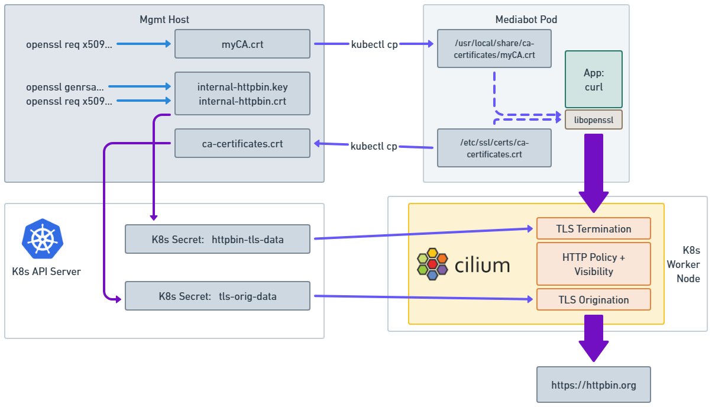

.. only:: not (epub or latex or html)

    WARNING: You are looking at unreleased Cilium documentation.
    Please use the official rendered version released here:
    https://docs.cilium.io

.. _gs_tls_inspection:

************************************************
Inspecting TLS Encrypted Connections with Cilium
************************************************

This document serves as an introduction for how network security teams can use Cilium to transparently inspect
TLS-encrypted connections.  This TLS-aware inspection allows Cilium API-aware visibility and policy to function
even for connections where client to server
communication is protected by TLS, such as when a client accesses the API service via HTTPS.  This capability is similar to
what is possible to traditional hardware firewalls, but is implemented entirely in software on the Kubernetes worker node,
and is policy driven, allowing inspection to target only selected network connectivity.

This type of visibility is
extremely valuable to be able to monitor how external API services are being used,
for example, understanding which S3 buckets are being accessed by an given application.

.. include:: gsg_requirements.rst

A Brief Overview of the TLS Certificate Model
=============================================

TLS is a protocol that "wraps" other protocols like HTTP and ensures that communication between client and
server has confidentiality (no one can read the data except the intended recipient), integrity (recipient
can confirm that the data has not been modified in transit), and authentication (sender can confirm that
it is talking with the intended destination, not an impostor).  We will provide a highly simplified overview
of TLS in this document, but for full details, please see
`<https://en.wikipedia.org/wiki/Transport_Layer_Security>`_ .

From an authentication perspective, the TLS model relies on a "Certificate Authority" (CA) which is an
entity that is trusted to create proof that a given network service (e.g., www.cilium.io)
is who they say they are.   The goal is to prevents a malicious party in the network between the client
and the server from intercepting the traffic and pretending to be the destination server.

In the case of "friendly interception" for network security monitoring, Cilium uses a model similar to
traditional firewalls with TLS inspection capabilities:  the network security team creates their own "internal
certificate authority"
that can be used to create alternative certificates for external destinations.  This model requires each
client workload to also trust this new certificate, otherwise the client's TLS library will reject
the connection as invalid.  In this model, the network firewall uses the certificate signed by the internal
CA to act like the destination service and terminate the TLS connection.  This allows the firewall to
inspect and even modify the application layer data, and then initiate another TLS connect to the actual
destination service.

The CA model within TLS is based on cryptographic keys and certificates.  Realizing the above model
requires four primary steps:

1) Create an internal certificate authority by generating a CA private key and CA certificate.

2) For any destination where TLS inspection is desired (e.g., httpbin.org in the example below),
   generate a private key and certificate signing request with a common name that matches the destination DNS
   name.

3) Use the CA private key to create a signed certificate.

4) Ensure that all clients where TLS inspection is have the CA certificate installed so that they will
   trust all certificates signed by that CA.

5) Given that Cilium will be terminating the initial TLS connection from the
   client and creating a new TLS connection to the destination, Cilium must be told the set of CAs that it
   should trust when validating the new TLS connection to the destination service.

.. note::

    In a non-demo environment it is EXTREMELY important that you keep the above private keys safe, as anyone
    with access to this private key will be able to inspect TLS-encrypted traffic (certificates on the other
    hand are public information, and are not at all sensitive).  In the guide below, the
    CA private key does not need to be provided to Cilium at all (it is used only to create certificates, which
    can be done offline) and private keys for individual destination services are stored as Kubernetes secrets.
    These secrets should be stored in a namespace where they can be accessed by Cilium, but not general purpose
    workloads.

How TLS Inspection works
========================

All TLS inspection relies on terminating the originating connection with a certificate
that will be accepted, then originating a new TLS connection using a client certificate
if necessary.

Because of this, the Network Policy requires configuring a ``terminatingTLS`` and optionally
an ``originatingTLS`` stanza.

When the Network Policy contains these details, then Cilium will redirect TLS connections to Envoy,
and allow connections that complete a TLS handshake and pass the configured Network Policy.

One of the most important parts of the configuration for this is how the certificates get to Envoy.

In the current version, Cilium has two options, NPDS (the original) and SDS (the new and better version).

Network Policy Discovery Service (NPDS)
---------------------------------------

In this version, certificates and keys are sent inline as Base64 encoded text in dedicated fields
in the Cilium-owned Network Policy Discovery Service.

This had the advantage that it was straightforward to build, but does come with a big disadvantage:

Each Network Policy rule that does TLS Interception keeps its own copy of each secret inline in the
NPDS config in Envoy. So, if (as is likely for a larger installation), you have the same secret reused
multiple times (for example if you generate one certificate that will terminate for many SANs, but you
have multiple rules using that certificate, or you include a valid root certificate bundle in the
``originatingTLS`` config), then multiple copies of the certificate will be stored in Envoy's memory.
This memory use can really add up in a large installation.

It also means that we don't benefit from work that has been done to protect secrets when they are sent
using Secret Discovery Service (.

Secret Discovery Service (SDS)
------------------------------

Both of the above reasons are why Envoy supports SDS for Network Policy secrets as of Cilium 1.17.

In this configuration, Cilium reads relevant Secrets from a configured secrets namespace, and exposes
those secrets to Envoy using the core Envoy SDS API. Those secrets are then referenced in the NPDS config
that's sent to Envoy to configure the Network Policy filter there by name, rather than being included
directly as Base64 encoded text.

This means that Envoy looks up the SDS secrets for NPDS in the same way as it does the secrets for
Ingress or Gateway API config.

This method also allows Envoy to deduplicate the storage of the secrets, since they are essentially
being passed by reference instead of being passed by value.

Because of these advantages over the older NPDS method, SDS is the default for new Cilium installations
as at Cilium 1.17.

Configuring TLS Interception
============================

There are three ways to use Cilium in 1.17 and later:

* Using SDS, Secrets referenced in Network Policy can be located anywhere in the cluster, and are
  copied into a configured namespace (``cilium-secrets`` by default) by the Cilium Operator, synchronized
  from there into SDS, then referenced in NPDS using that name. This is the default for new clusters,
  and the recommended method of operation.
* Secrets can be located anywhere in the cluster, and the Cilium Agent can be granted read access to
  all Secrets in the cluster. In this case, Secrets are read directly from their original location by
  the Cilium Agent and sent inline in NPDS. This deployment method is included for backwards compatibility
  purposes and is **not recommended**, as it **significantly expands** the security scope of the agent.
* Secrets can be added directly to the ``cilium-secrets`` namespace, then referenced in that namespace
  from Network Policy. This is also included for backwards compatibility based on user feedback about
  how this feature was actually being used. It is the default for **upgraded** clusters that have not
  configured any settings and are using the ``upgradeCompatibility`` setting in Helm, set to ``1.16``
  or below.

There are three settings in Helm that affect TLS Interception:

* ``tls.secretsNamespace.name`` - default ``cilium-secrets``. Configures the secrets namespace that will
  be used for Policy secrets. Note that this is set to the same value as a similar setting for Ingress,
  Gateway API, and BGP configuration by default, but **may** be set to a different value.
* ``tls.readSecretsOnlyFromSecretsNamespace`` - default ``true``. This setting tells the Helm chart
  and Cilium whether the Cilium Agent should only read secrets from the configured Secrets namespace,
  or if the Cilium Agent should attempt to read Secrets directly from their location in the cluster.
  Previous versions of Cilium used the item ``tls.secretsBackend``, which could be set to ``local``
  (meaning only read from the Secrets namespace) or ``k8s`` (meaning read from any namespace), but that
  field is now **deprecated**, as its naming had become detached from its function. Previous installations
  that set ``tls.secretsBackend`` to ``k8s`` should migrate to setting ``tls.readSecretsOnlyFromSecretsNamespace``
  to ``false`` instead, although the setting will continue to work for Cilium 1.17. ``tls.secretsBackend``
  will be removed in a future Cilium version.
* ``tls.secretSync.enabled`` - default ``true`` for new clusters. Configures secret synchronization and
  SDS use for Network Policy secrets. SDS use requires this to be set to ``true``, and must be disabled
  when this field is set to ``false``, so having an additional field for SDS config added no value.

Configuring the three available modes for TLS Interception
----------------------------------------------------------

SDS Mode (recommended, default for new clusters):
^^^^^^^^^^^^^^^^^^^^^^^^^^^^^^^^^^^^^^^^^^^^^^^^^

Set the following settings in your Helm Values:

.. code-block:: YAML

    tls:
      readSecretsOnlyFromSecretsNamespace: true
      secretsNamespace: 
        name: cilium-secrets # This setting is optional, as it is the default
      secretSync:
        enabled: true

Read all Secrets in the Cluster mode (not recommended)
^^^^^^^^^^^^^^^^^^^^^^^^^^^^^^^^^^^^^^^^^^^^^^^^^^^^^^

Set the following settings in your Helm Values:

.. code-block:: YAML

    tls:
      readSecretsOnlyFromSecretsNamespace: false
      secretSync:
        enabled: false

Read Secrets only from secrets namespace, no SDS (default for upgraded clusters)
^^^^^^^^^^^^^^^^^^^^^^^^^^^^^^^^^^^^^^^^^^^^^^^^^^^^^^^^^^^^^^^^^^^^^^^^^^^^^^^^

Set the following settings in your Helm Values:

.. code-block:: YAML

    tls:
      readSecretsOnlyFromSecretsNamespace: true
      secretsNamespace: 
        name: cilium-secrets # This setting is optional, as it is the default
      secretSync:
        enabled: false

.. Note::

    If you are using this mode, then you will need to replace all references to
    ``kube-system`` in the validation instructions on this page with ``cilium-secrets``
    (or whatever value you have set that namespace to).

Once you've chosen an option and configured your Cilium installation accordingly, proceed with
verifying your install using the rest of these instructions.

Deploy the Demo Application
===========================

To demonstrate TLS-interception we will use the same ``mediabot`` application that we used for the DNS-aware policy example.
This application will access the Star Wars API service using HTTPS, which would normally mean that network-layer mechanisms
like Cilium would not be able to see the HTTP-layer details of the communication, since all application data is encrypted
using TLS before that data is sent on the network.

In this guide we will learn about:

- Creating an internal Certificate Authority (CA) and associated certificates signed by that CA to enable TLS interception.
- Using Cilium network policy to select the traffic to intercept using DNS-based policy rules.
- Inspecting the details of the HTTP request using cilium monitor (accessing this visibility data via Hubble, and applying
  Cilium network policies to filter/modify the HTTP request is also possible, but is beyond the scope of this simple Getting Started Guide)

First off, we will create a single pod ``mediabot`` application:

.. parsed-literal::

   $ kubectl create -f \ |SCM_WEB|\/examples/kubernetes-dns/dns-sw-app.yaml
   $ kubectl wait pod/mediabot --for=condition=Ready
   $ kubectl get pods
   NAME                             READY   STATUS    RESTARTS   AGE
   pod/mediabot                     1/1     Running   0          14s

Generating and Installing TLS Keys and Certificates
===================================================

Now that we understand TLS and have configured Cilium to use TLS interception, we will walk through the
concrete steps to generate the appropriate keys and certificates using the ``openssl`` utility.

The following image describes the different files containing cryptographic data that are generated
or copied, and what components in the system need access to those files:

You can use openssl on your local system if it is already installed, but if not a simple
shortcut is to use ``kubectl exec`` to execute ``/bin/bash`` within any of the cilium pods, and
then run the resulting ``openssl`` commands.  Use ``kubectl cp`` to copy the resulting files out
of the cilium pod when it is time to use them to create Kubernetes secrets of copy them to the
``mediabot`` pod.

Create an Internal Certificate Authority (CA)
---------------------------------------------

Generate CA private key named 'myCA.key':

.. code-block:: shell-session

    $ openssl genrsa -des3 -out myCA.key 2048

Enter any password, just remember it for some of the later steps.

Generate CA certificate from the private key:

.. code-block:: shell-session

    $ openssl req -x509 -new -nodes -key myCA.key -sha256 -days 1825 -out myCA.crt

The values you enter for each prompt do not need to be any specific value, and do not need to be
accurate.

Create Private Key and Certificate Signing Request for a Given DNS Name
-----------------------------------------------------------------------

Generate an internal private key and certificate signing with a common name that matches the DNS name
of the destination service to be intercepted for inspection (in this example, use ``httpbin.org``).

First create the private key:

.. code-block:: shell-session

    $ openssl genrsa -out internal-httpbin.key 2048

Next, create a certificate signing request, specifying the DNS name of the destination service
for the common name field when prompted.  All other prompts can be filled with any value.

.. code-block:: shell-session

    $ openssl req -new -key internal-httpbin.key -out internal-httpbin.csr

The only field that must be a specific value is ensuring that ``Common Name`` is the exact DNS
destination ``httpbin.org`` that will be provided to the client.

This example workflow will work for any DNS
name as long as the toFQDNs rule in the policy YAML (below) is also updated to match the DNS name in the certificate.

Use CA to Generate a Signed Certificate for the DNS Name
--------------------------------------------------------

Use the internal CA private key to create a signed certificate for httpbin.org named ``internal-httpbin.crt``.

.. code-block:: shell-session

    $ openssl x509 -req -days 360 -in internal-httpbin.csr -CA myCA.crt -CAkey myCA.key -CAcreateserial -out internal-httpbin.crt -sha256

Next we create a Kubernetes secret that includes both the private key and signed certificates for the destination service:

.. code-block:: shell-session

    $ kubectl create secret tls httpbin-tls-data -n kube-system --cert=internal-httpbin.crt --key=internal-httpbin.key

Add the Internal CA as a Trusted CA Inside the Client Pod
---------------------------------------------------------

Once the CA certificate is inside the client pod, we still must make sure that the CA file is picked up by the TLS library used by your
application.  Most Linux applications automatically use a set of trusted CA certificates that are bundled along with the Linux distro.
In this guide, we are using an Ubuntu container as the client, and so will update it with Ubuntu specific instructions.  Other Linux distros
will have different mechanisms.  Also, individual applications may leverage their own certificate stores rather than use the OS certificate
store.  Java applications and the aws-cli are two common examples.  Please refer to the application or application runtime documentation
for more details.

For Ubuntu, we first copy the additional CA certificate to the client pod filesystem

.. code-block:: shell-session

    $ kubectl cp myCA.crt default/mediabot:/usr/local/share/ca-certificates/myCA.crt

Then run the Ubuntu-specific utility that adds this certificate to the global set of trusted certificate authorities in /etc/ssl/certs/ca-certificates.crt .

.. code-block:: shell-session

    $ kubectl exec mediabot -- update-ca-certificates

This command will issue a WARNING, but this can be ignored.

Provide Cilium with List of Trusted CAs
---------------------------------------

Next, we will provide Cilium with the set of CAs that it should trust when originating the secondary TLS connections.
This list should correspond to the standard set of global CAs that your organization trusts.  A logical option for this is the standard CAs
that are trusted by your operating system, since this is the set of CAs that were being used prior to introducing TLS inspection.

To keep things simple, in this example we will simply copy this list out of the Ubuntu filesystem of the mediabot pod, though it is
important to understand that this list of trusted CAs is not specific to a particular TLS client or server, and so this step need only
be performed once regardless of how many TLS clients or servers are involved in TLS inspection.

.. code-block:: shell-session

    $ kubectl cp default/mediabot:/etc/ssl/certs/ca-certificates.crt ca-certificates.crt

We then will create a Kubernetes secret using this certificate bundle so that Cilium can read the
certificate bundle and use it to validate outgoing TLS connections.

.. code-block:: shell-session

    $ kubectl create secret generic tls-orig-data -n kube-system --from-file=ca.crt=./ca-certificates.crt

Apply DNS and TLS-aware Egress Policy
=====================================

Up to this point, we have created keys and certificates to enable TLS inspection, but we
have not told Cilium which traffic we want to intercept and inspect.   This is done using
the same Cilium Network Policy constructs that are used for other Cilium Network Policies.

The following Cilium network policy indicates that Cilium should perform HTTP-aware inspect
of communication between the ``mediabot`` pod to ``httpbin.org``.

.. literalinclude:: ../../examples/kubernetes-tls-inspection/l7-visibility-tls.yaml
   :language: yaml

Let's take a closer look at the policy:

* The ``endpointSelector`` means that this policy will only apply to pods with labels ``class: mediabot, org:empire`` to have the egress access.
* The first egress section uses ``toFQDNs: matchName`` specification to allow TCP port 443 egress to ``httpbin.org``.
* The ``http`` section below the toFQDNs rule
  indicates that such connections should be parsed as HTTP, with a policy of ``{}`` which will allow all requests.
* The ``terminatingTLS`` and ``originatingTLS`` sections indicate that TLS interception should be used to terminate the initial TLS connection
  from mediabot and initiate a new out-bound TLS connection to ``httpbin.org``.
* The second egress section allows ``mediabot`` pods to access ``kube-dns`` service. Note that
  ``rules: dns`` instructs Cilium to inspect and allow DNS lookups matching specified patterns.
  In this case, inspect and allow all DNS queries.

Note that with this policy the ``mediabot`` doesn't have access to any internal cluster service other than ``kube-dns``
and will have no access to any other external destinations either. Refer to :ref:`Network Policy`
to learn more about policies for controlling access to internal cluster services.

Let's apply the policy:

.. parsed-literal::

  $ kubectl create -f \ |SCM_WEB|\/examples/kubernetes-tls-inspection/l7-visibility-tls.yaml

Demonstrating TLS Inspection
============================

Recall that the policy we pushed will allow all HTTPS requests from ``mediabot`` to ``httpbin.org``, but will parse all data at
the HTTP-layer, meaning that cilium monitor will report each HTTP request and response.

To see this, open a new window and run the following command to identity the name of the
cilium pod (e.g, cilium-97s78) that is running on the same Kubernetes worker node as the ``mediabot`` pod.

Then start running cilium-dbg monitor in "L7 mode" to monitor for HTTP requests being reported by Cilium:

.. code-block:: shell-session

    $ kubectl exec -it -n kube-system cilium-d5x8v -- cilium-dbg monitor -t l7

Next in the original window, from the ``mediabot`` pod we can access ``httpbin.org`` via HTTPS:

.. code-block:: shell-session

    $ kubectl exec -it mediabot -- curl -sL 'https://httpbin.org/anything'
    ...
    ...

    $ kubectl exec -it mediabot -- curl -sL 'https://httpbin.org/headers'
    ...
    ...

Looking back at the cilium-dbg monitor window, you will see each individual HTTP request and response.  For example::

    -> Request http from 2585 ([k8s:class=mediabot k8s:org=empire k8s:io.kubernetes.pod.namespace=default k8s:io.cilium.k8s.policy.serviceaccount=default k8s:io.cilium.k8s.policy.cluster=default]) to 0 ([reserved:world]), identity 24948->2, verdict Forwarded GET https://httpbin.org/anything => 0
    -> Response http to 2585 ([k8s:io.kubernetes.pod.namespace=default k8s:io.cilium.k8s.policy.serviceaccount=default k8s:io.cilium.k8s.policy.cluster=default k8s:class=mediabot k8s:org=empire]) from 0 ([reserved:world]), identity 24948->2, verdict Forwarded GET https://httpbin.org/anything => 200

Refer to :ref:`l4_policy` and :ref:`l7_policy` to learn more about Cilium L4 and L7 network policies.

Clean-up
========

.. parsed-literal::

   $ kubectl delete -f \ |SCM_WEB|\/examples/kubernetes-dns/dns-sw-app.yaml
   $ kubectl delete cnp l7-visibility-tls
   $ kubectl delete secret -n kube-system tls-orig-data
   $ kubectl delete secret -n kube-system httpbin-tls-data
