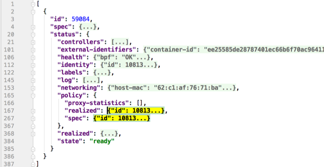

.. only:: not (epub or latex or html)

    WARNING: You are looking at unreleased Cilium documentation.
    Please use the official rendered version released here:
    http://docs.cilium.io

.. _admin_guide:

###############
Troubleshooting
###############

This document describes how to troubleshoot Cilium in different deployment
modes. It focuses on a full deployment of Cilium within a datacenter or public
cloud. If you are just looking for a simple way to experiment, we highly
recommend trying out the :ref:`gs_guide` instead.

This guide assumes that you have read the :ref:`concepts` which explains all
the components and concepts.

We use GitHub issues to maintain a list of `Cilium Frequently Asked Questions
(FAQ)`_. You can also check there to see if your question(s) is already
addressed.

Component & Cluster Health
==========================

Kubernetes
----------

An initial overview of Cilium can be retrieved by listing all pods to verify
whether all pods have the status ``Running``:

.. code:: bash

    $ kubectl -n kube-system get pods -l k8s-app=cilium
    NAME           READY     STATUS    RESTARTS   AGE
    cilium-2hq5z   1/1       Running   0          4d
    cilium-6kbtz   1/1       Running   0          4d
    cilium-klj4b   1/1       Running   0          4d
    cilium-zmjj9   1/1       Running   0          4d

If Cilium encounters a problem that it cannot recover from, it will
automatically report the failure state via ``cilium status`` which is regularly
queried by the Kubernetes liveness probe to automatically restart Cilium pods.
If a Cilium pod is in state ``CrashLoopBackoff`` then this indicates a
permanent failure scenario.

Detailed Status
~~~~~~~~~~~~~~~

If a particular Cilium pod is not in running state, the status and health of
the agent on that node can be retrieved by running ``cilium status`` in the
context of that pod:

.. code:: bash

    $ kubectl -n kube-system exec -ti cilium-2hq5z -- cilium status
    KVStore:                Ok   etcd: 1/1 connected: http://demo-etcd-lab--a.etcd.tgraf.test1.lab.corp.covalent.link:2379 - 3.2.5 (Leader)
    ContainerRuntime:       Ok   docker daemon: OK
    Kubernetes:             Ok   OK
    Kubernetes APIs:        ["cilium/v2::CiliumNetworkPolicy", "networking.k8s.io/v1::NetworkPolicy", "core/v1::Service", "core/v1::Endpoint", "core/v1::Node", "CustomResourceDefinition"]
    Cilium:                 Ok   OK
    NodeMonitor:            Disabled
    Cilium health daemon:   Ok
    Controller Status:      14/14 healthy
    Proxy Status:           OK, ip 10.2.0.172, port-range 10000-20000
    Cluster health:   4/4 reachable   (2018-06-16T09:49:58Z)

Alternatively, the ``k8s-cilium-exec.sh`` script can be used to run ``cilium
status`` on all nodes. This will provide detailed status and health information
of all nodes in the cluster:

.. code:: bash

    $ curl -sLO releases.cilium.io/v1.1.0/tools/k8s-cilium-exec.sh
    $ chmod +x ./k8s-cilium-exec.sh

... and run ``cilium status`` on all nodes:

.. code:: bash

    $ ./k8s-cilium-exec.sh cilium status
    KVStore:                Ok   Etcd: http://127.0.0.1:2379 - (Leader) 3.1.10
    ContainerRuntime:       Ok
    Kubernetes:             Ok   OK
    Kubernetes APIs:        ["extensions/v1beta1::Ingress", "core/v1::Node", "CustomResourceDefinition", "cilium/v2::CiliumNetworkPolicy", "networking.k8s.io/v1::NetworkPolicy", "core/v1::Service", "core/v1::Endpoint"]
    Cilium:                 Ok   OK
    NodeMonitor:            Listening for events on 2 CPUs with 64x4096 of shared memory
    Cilium health daemon:   Ok
    Controller Status:      7/7 healthy
    Proxy Status:           OK, ip 10.15.28.238, 0 redirects, port-range 10000-20000
    Cluster health:   1/1 reachable   (2018-02-27T00:24:34Z)

Logs
~~~~

To retrieve log files of a cilium pod, run (replace ``cilium-1234`` with a pod
name returned by ``kubectl -n kube-system get pods -l k8s-app=cilium``)

.. code:: bash

    $ kubectl -n kube-system logs --timestamps cilium-1234

If the cilium pod was already restarted due to the liveness problem after
encountering an issue, it can be useful to retrieve the logs of the pod before
the last restart:

.. code:: bash

    $ kubectl -n kube-system logs --timestamps -p cilium-1234

Generic
-------

When logged in a host running Cilium, the cilium CLI can be invoked directly,
e.g.:

.. code:: bash

    $ cilium status
    KVStore:                Ok   etcd: 1/1 connected: https://192.168.33.11:2379 - 3.2.7 (Leader)
    ContainerRuntime:       Ok
    Kubernetes:             Ok   OK
    Kubernetes APIs:        ["core/v1::Endpoint", "extensions/v1beta1::Ingress", "core/v1::Node", "CustomResourceDefinition", "cilium/v2::CiliumNetworkPolicy", "networking.k8s.io/v1::NetworkPolicy", "core/v1::Service"]
    Cilium:                 Ok   OK
    NodeMonitor:            Listening for events on 2 CPUs with 64x4096 of shared memory
    Cilium health daemon:   Ok
    IPv4 address pool:      261/65535 allocated
    IPv6 address pool:      4/4294967295 allocated
    Controller Status:      20/20 healthy
    Proxy Status:           OK, ip 10.0.28.238, port-range 10000-20000
    Cluster health:   2/2 reachable   (2018-04-11T15:41:01Z)

Connectivity Problems
=====================

Checking cluster connectivity health
------------------------------------

Cilium allows to rule out network fabric related issues when troubleshooting
connectivity issues by providing reliable health and latency probes between all
cluster nodes and between a simulated workload running on each node.

By default when Cilium is run, it launches instances of ``cilium-health`` in
the background to determine overall connectivity status of the cluster. This
tool periodically runs bidirectional traffic across multiple paths through the
cluster and through each node using different protocols to determine the health
status of each path and protocol. At any point in time, cilium-health may be
queried for the connectivity status of the last probe.

.. code:: bash

    $ kubectl -n kube-system exec -ti cilium-2hq5z -- cilium-health status
    Probe time:   2018-06-16T09:51:58Z
    Nodes:
      ip-172-0-52-116.us-west-2.compute.internal (localhost):
        Host connectivity to 172.0.52.116:
          ICMP to stack: OK, RTT=315.254µs
          HTTP to agent: OK, RTT=368.579µs
        Endpoint connectivity to 10.2.0.183:
          ICMP to stack: OK, RTT=190.658µs
          HTTP to agent: OK, RTT=536.665µs
      ip-172-0-117-198.us-west-2.compute.internal:
        Host connectivity to 172.0.117.198:
          ICMP to stack: OK, RTT=1.009679ms
          HTTP to agent: OK, RTT=1.808628ms
        Endpoint connectivity to 10.2.1.234:
          ICMP to stack: OK, RTT=1.016365ms
          HTTP to agent: OK, RTT=2.29877ms

For each node, the connectivity will be displayed for each protocol and path,
both to the node itself and to an endpoint on that node. The latency specified
is a snapshot at the last time a probe was run, which is typically once per
minute. The ICMP connectivity row represents Layer 3 connectivity to the
networking stack, while the HTTP connectivity row represents connection to an
instance of the ``cilium-health`` agent running on the host or as an endpoint.

Monitoring Packet Drops
-----------------------

Sometimes you may experience broken connectivity, which may be due to a
number of different causes. A main cause can be unwanted packet drops on
the networking level. The tool
``cilium monitor`` allows you to quickly inspect and see if and where packet
drops happen. Following is an example output (use ``kubectl exec`` as in previous
examples if running with Kubernetes):

.. code:: bash

    $ kubectl -n kube-system exec -ti cilium-2hq5z -- cilium monitor --type drop
    Listening for events on 2 CPUs with 64x4096 of shared memory
    Press Ctrl-C to quit
    xx drop (Policy denied (L3)) to endpoint 25729, identity 261->264: fd02::c0a8:210b:0:bf00 -> fd02::c0a8:210b:0:6481 EchoRequest
    xx drop (Policy denied (L3)) to endpoint 25729, identity 261->264: fd02::c0a8:210b:0:bf00 -> fd02::c0a8:210b:0:6481 EchoRequest
    xx drop (Policy denied (L3)) to endpoint 25729, identity 261->264: 10.11.13.37 -> 10.11.101.61 EchoRequest
    xx drop (Policy denied (L3)) to endpoint 25729, identity 261->264: 10.11.13.37 -> 10.11.101.61 EchoRequest
    xx drop (Invalid destination mac) to endpoint 0, identity 0->0: fe80::5c25:ddff:fe8e:78d8 -> ff02::2 RouterSolicitation

The above indicates that a packet to endpoint ID ``25729`` has been dropped due
to violation of the Layer 3 policy.

Handling drop (CT: Map insertion failed)
~~~~~~~~~~~~~~~~~~~~~~~~~~~~~~~~~~~~~~~~

If connectivity fails and ``cilium monitor --type drop`` shows ``xx drop (CT:
Map insertion failed)``, then it is likely that the connection tracking table
is filling up and the automatic adjustment of the garbage collector interval is
insufficient. Set ``--conntrack-gc-interval`` to an interval lower than the
default.  Alternatively, the value for ``bpf-ct-global-any-max`` and
``bpf-ct-global-tcp-max`` can be increased. Setting both of these options will
be a trade-off of CPU for ``conntrack-gc-interval``, and for
``bpf-ct-global-any-max`` and ``bpf-ct-global-tcp-max`` the amount of memory
consumed.

Policy Troubleshooting
======================

Ensure pod is managed by Cilium
-------------------------------

A potential cause for policy enforcement not functioning as expected is that
the networking of the pod selected by the policy is not being managed by
Cilium. The following situations result in unmanaged pods:

* The pod is running in host networking and will use the host's IP address
  directly. Such pods have full network connectivity but Cilium will not
  provide security policy enforcement for such pods.

* The pod was started before Cilium was deployed. Cilium only manages pods
  that have been deployed after Cilium itself was started. Cilium will not
  provide security policy enforcement for such pods.

If pod networking is not managed by Cilium. Ingress and egress policy rules
selecting the respective pods will not be applied. See the section
:ref:`network_policy` for more details.

You can run the following script to list the pods which are *not* managed by
Cilium:

.. code:: bash

    $ ./contrib/k8s/k8s-unmanaged.sh
    kube-system/cilium-hqpk7
    kube-system/kube-addon-manager-minikube
    kube-system/kube-dns-54cccfbdf8-zmv2c
    kube-system/kubernetes-dashboard-77d8b98585-g52k5
    kube-system/storage-provisioner

See section :ref:`policy_tracing` for details and examples on how to use the
policy tracing feature.

Understand the rendering of your policy
---------------------------------------

There are always multiple ways to approach a problem. Cilium can provide the
rendering of the aggregate policy provided to it, leaving you to simply compare
with what you expect the policy to actually be rather than search (and potentially
overlook) every policy. At the expense of reading a very large dump of an endpoint,
this is often a faster path to discovering errant policy requests in the Kubernetes
API.

Start by finding the endpoint you are debugging from the following list. There are
several cross references for you to use in this list, including the IP address and
pod labels:

.. code:: bash

    kubectl -n kube-system exec -ti cilium-q8wvt -- cilium endpoint list

When you find the correct endpoint, the first column of every row is the endpoint ID.
Use that to dump the full endpoint information:

.. code:: bash

    kubectl -n kube-system exec -ti cilium-q8wvt -- cilium endpoint get 59084

Importing this dump into a JSON-friendly editor can help browse and navigate the
information here. At the top level of the dump, there are two nodes of note:

* ``spec``: The desired state of the endpoint
* ``status``: The current state of the endpoint

This is the standard Kubernetes control loop pattern. Cilium is the controller here,
and it is iteratively working to bring the ``status`` in line with the ``spec``.

Opening the ``status``, we can drill down through ``policy.realized.l4``. Do your
``ingress`` and ``egress`` rules match what you expect? If not, the reference to the errant
rules can be found in the ``derived-from-rules`` node.

Automatic Diagnosis
===================

The ``cluster-diagnosis`` tool can help identify the most commonly encountered
issues in Cilium deployments. The tool currently supports Kubernetes
and Minikube clusters only.

The tool performs various checks and provides hints to fix specific
issues that it has identified.

The following is a list of prerequisites:

* Requires Python >= 2.7.*
* Requires ``kubectl``.
* ``kubectl`` should be pointing to your cluster before running the tool.

You can download the latest version of the cluster-diagnosis.zip file
using the following command:

::

    curl -sLO releases.cilium.io/tools/cluster-diagnosis.zip

Command to run the cluster-diagnosis tool:

.. code:: bash

    python cluster-diagnosis.zip

Command to collect the system dump using the cluster-diagnosis tool:

.. code:: bash

    python cluster-diagnosis.zip sysdump

Symptom Library
===============

Node to node traffic is being dropped
-------------------------------------

Symptom
~~~~~~~

Endpoint to endpoint communication on a single node succeeds but communication
fails between endpoints across multiple nodes.

Troubleshooting steps:
~~~~~~~~~~~~~~~~~~~~~~

1. Run ``cilium-health status`` on the node of the source and destination
   endpoint. It should describe the connectivity from that node to other
   nodes in the cluster, and to a simulated endpoint on each other node.
   Identify points in the cluster that cannot talk to each other. If the
   command does not describe the status of the other node, there may be an
   issue with the KV-Store.

2. Run ``cilium monitor`` on the node of the source and destination endpoint.
   Look for packet drops.

When running in :ref:`arch_overlay` mode:

3. Run ``cilium bpf tunnel list`` and verify that each Cilium node is aware of
   the other nodes in the cluster.  If not, check the logfile for errors.

4. If nodes are being populated correctly, run ``tcpdump -n -i cilium_vxlan`` on
   each node to verify whether cross node traffic is being forwarded correctly
   between nodes.

   If packets are being dropped,

   * verify that the node IP listed in ``cilium bpf tunnel list`` can reach each
     other.
   * verify that the firewall on each node allows UDP port 8472.

When running in :ref:`arch_direct_routing` mode:

3. Run ``ip route`` or check your cloud provider router and verify that you have
   routes installed to route the endpoint prefix between all nodes.

4. Verify that the firewall on each node permits to route the endpoint IPs.

Useful Scripts
==============

Retrieve Cilium pod managing a particular pod
---------------------------------------------

Identifies the Cilium pod that is managing a particular pod in a namespace:

.. code:: bash

    k8s-get-cilium-pod.sh <pod> <namespace>

**Example:**

.. code:: bash

    $ curl -sLO releases.cilium.io/v1.1.0/tools/k8s-get-cilium-pod.sh
    $ ./k8s-get-cilium-pod.sh luke-pod default
    cilium-zmjj9

Execute a command in all Kubernetes Cilium pods
-----------------------------------------------

Run a command within all Cilium pods of a cluster

.. code:: bash

    k8s-cilium-exec.sh <command>

**Example:**

.. code:: bash

    $ curl -sLO releases.cilium.io/v1.1.0/tools/k8s-cilium-exec.sh
    $ ./k8s-cilium-exec.sh uptime
     10:15:16 up 6 days,  7:37,  0 users,  load average: 0.00, 0.02, 0.00
     10:15:16 up 6 days,  7:32,  0 users,  load average: 0.00, 0.03, 0.04
     10:15:16 up 6 days,  7:30,  0 users,  load average: 0.75, 0.27, 0.15
     10:15:16 up 6 days,  7:28,  0 users,  load average: 0.14, 0.04, 0.01

List unmanaged Kubernetes pods
------------------------------

Lists all Kubernetes pods in the cluster for which Cilium does *not* provide
networking. This includes pods running in host-networking mode and pods that
were started before Cilium was deployed.

.. code:: bash

    k8s-unmanaged.sh

**Example:**

.. code:: bash

    $ curl -sLO releases.cilium.io/v1.1.0/tools/k8s-unmanaged.sh
    $ ./k8s-unmanaged.sh
    kube-system/cilium-hqpk7
    kube-system/kube-addon-manager-minikube
    kube-system/kube-dns-54cccfbdf8-zmv2c
    kube-system/kubernetes-dashboard-77d8b98585-g52k5
    kube-system/storage-provisioner

Reporting a problem
===================

Automatic log & state collection
--------------------------------

Before you report a problem, make sure to retrieve the necessary information
from your cluster before the failure state is lost. Cilium provides a script
to automatically grab logs and retrieve debug information from all Cilium pods
in the cluster.

The script has the following list of prerequisites:

* Requires Python >= 2.7.*
* Requires ``kubectl``.
* ``kubectl`` should be pointing to your cluster before running the tool.

You can download the latest version of the cluster-diagnosis.zip file
using the following command:

.. code:: bash

    $ curl -sLO releases.cilium.io/tools/cluster-diagnosis.zip
    $ python cluster-diagnosis.zip sysdump

Single Node Bugtool
~~~~~~~~~~~~~~~~~~~

If you are not running Kubernetes, it is also possible to run the bug
collection tool manually with the scope of a single node:

The ``cilium-bugtool`` captures potentially useful information about your
environment for debugging. The tool is meant to be used for debugging a single
Cilium agent node. In the Kubernetes case, if you have multiple Cilium pods,
the tool can retrieve debugging information from all of them. The tool works by
archiving a collection of command output and files from several places. By
default, it writes to the ``tmp`` directory.

Note that the command needs to be run from inside the Cilium pod/container.

.. code:: bash

    $ cilium-bugtool

When running it with no option as shown above, it will try to copy various
files and execute some commands. If ``kubectl`` is detected, it will search for
Cilium pods. The default label being ``k8s-app=cilium``, but this and the
namespace can be changed via ``k8s-namespace`` and ``k8s-label`` respectively.

If you'd prefer to browse the dump, there is a HTTP flag.

.. code:: bash

    $ cilium-bugtool --serve

If you want to capture the archive from a Kubernetes pod, then the process is a
bit different

.. code:: bash

    # First we need to get the Cilium pod
    $ kubectl get pods --namespace kube-system
      NAME                          READY     STATUS    RESTARTS   AGE
      cilium-kg8lv                  1/1       Running   0          13m
      kube-addon-manager-minikube   1/1       Running   0          1h
      kube-dns-6fc954457d-sf2nk     3/3       Running   0          1h
      kubernetes-dashboard-6xvc7    1/1       Running   0          1h

    # Run the bugtool from this pod
    $ kubectl -n kube-system exec cilium-kg8lv cilium-bugtool
      [...]

    # Copy the archive from the pod
    $ kubectl cp kube-system/cilium-kg8lv:/tmp/cilium-bugtool-20180411-155146.166+0000-UTC-266836983.tar /tmp/cilium-bugtool-20180411-155146.166+0000-UTC-266836983.tar
      [...]

.. Note::

          Please check the archive for sensitive information and strip it
          away before sharing it with us.

Below is an approximate list of the kind of information in the archive.

* Cilium status
* Cilium version
* Kernel configuration
* Resolve configuration
* Cilium endpoint state
* Cilium logs
* Docker logs
* ``dmesg``
* ``ethtool``
* ``ip a``
* ``ip link``
* ``ip r``
* ``iptables-save``
* ``kubectl -n kube-system get pods``
* ``kubectl get pods,svc for all namespaces``
* ``uname``
* ``uptime``
* ``cilium bpf * list``
* ``cilium endpoint get for each endpoint``
* ``cilium endpoint list``
* ``hostname``
* ``cilium policy get``
* ``cilium service list``
* ...

Debugging information
~~~~~~~~~~~~~~~~~~~~~

If you are not running Kubernetes, you can use the ``cilium debuginfo`` command
to retrieve useful debugging information. If you are running Kubernetes, this
command is automatically run as part of the system dump.

``cilium debuginfo`` can print useful output from the Cilium API. The output
format is in Markdown format so this can be used when reporting a bug on the
`issue tracker`_.  Running without arguments will print to standard output, but
you can also redirect to a file like

.. code:: bash

    $ cilium debuginfo -f debuginfo.md

.. Note::

    Please check the debuginfo file for sensitive information and strip it
    away before sharing it with us.

Slack Assistance
----------------

The Cilium slack community is helpful first point of assistance to get help
troubleshooting a problem or to discuss options on how to address a problem.

The slack community is open to everyone. You can request an invite email by
visiting `Slack <https://cilium.herokuapp.com/>`_.

Report an issue via GitHub
--------------------------

If you believe to have found an issue in Cilium, please report a `GitHub issue
<https://github.com/cilium/cilium/issues>`_ and make sure to attach a system
dump as described above to ensure that developers have the best chance to
reproduce the issue.

.. _Slack channel: https://cilium.herokuapp.com
.. _NodeSelector: https://kubernetes.io/docs/concepts/configuration/assign-pod-node/
.. _RBAC: https://kubernetes.io/docs/admin/authorization/rbac/
.. _CNI: https://github.com/containernetworking/cni
.. _Volumes: https://kubernetes.io/docs/tasks/configure-pod-container/configure-volume-storage/

.. _Cilium Frequently Asked Questions (FAQ): https://github.com/cilium/cilium/issues?utf8=%E2%9C%93&q=label%3Akind%2Fquestion%20

.. _issue tracker: https://github.com/cilium/cilium/issues
