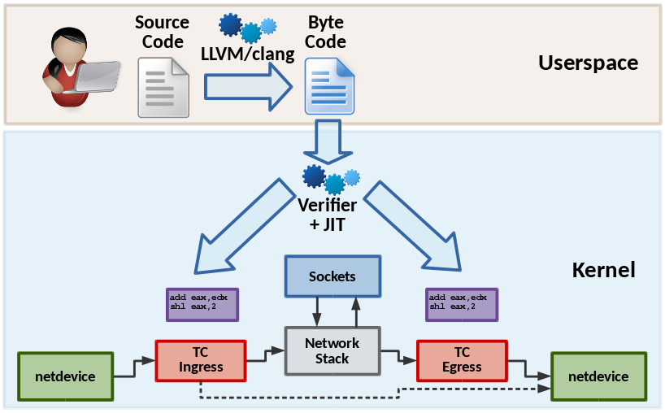

# BPF & XDP for containers

Cilium provides fast in-kernel networking and security policy enforcement for
containers based on eBPF programs generated on the fly. It is an experimental
project aiming at enabling emerging kernel technologies such as BPF and XDP
for containers.

   

## Components:
  * **Cilium Daemon**: Agent written in Go. Generates & compiles the BPF
    programs, manages the BPF maps, and interacts with the local container
    runtime.
  * **BPF programs**:
    * **container**: Container connectivity
    * **netdev**: Integration with L3 networks (physical/virtual)
    * **overlay**: Integration with overlay networks (VXLAN, Geneve)
    * **load balancer**: Fast L3/L4 load balancer with direct server return.
  * **Integration**: CNI, Kubernetes, Docker

## Getting Started

 * 5-min Quickstart: [Using the prebuilt docker images](examples/docker-compose/README.md)
 * For Developers: [Setting up a vagrant environment](doc/vagrant.md)
 * Manual installation: [Detailed installation instructions](doc/installation.md)

## Demo Tutorials

The following are video tutorials showcasing how to use Cilium:

 * [Networks & simple policies](https://asciinema.org/a/83373)
 * [Debugging a connectivity issue](https://asciinema.org/a/83376)
 * [Automatic learning of policy labels](https://asciinema.org/a/83365)
 * [Examine networking configuration of container](https://asciinema.org/a/83372)

## What is eBPF and XDP?

Berkley Packet Filter (BPF) is a bytecode interpreter orignially introduced
to filter network packets, e.g. tcpdump and socket filters. It has since been
extended to with additional data structures such as hashtable and arrays as
well as additional actions to support packet mangling, forwarding,
encapsulation, etc. An in-kernel verifier ensures that BPF programs are safe
to run and a JIT compiler converts the bytecode to CPU architecture specifc
instructions for native execution efficiency. BPF programs can be run at
various hooking points in the kernel such as for incoming packets, outgoing
packets, system call level, kprobes, etc.

   

XDP is a further step in evolution and enables to run a specific flavour of
BPF programs from the network driver with direct access to the packet's DMA
buffer.

## What are the benefits of Cilium's use of BPF?

 * **simple:**
   Every container is assigned a unique IPv6 address. An IPv4 address can be
   assigned optionally. There is no concept of networks, all containers are
   connected to a single virtual space. Isolation among containers is defined
   based on container labels.
 * **ipv6-focused**
   IPv6 is considered the primary addressing model with IPv4 support provided
   for backwards compatibility based on either native integration or with
   NAT46.
 * **extendable:**
   Users can extend and customize any aspect of the BPF programs. Forwarding
   logic and policy enforcement is not limited to the capabilities of a
   specific Linux kernel version. This may include the addition of additional
   statistics not provided by the Linux kernel, support for additional protocol
   parsers, modifications of the connection tracker or policy layer, additional
   forwarding logic, etc.
 * **fast:**
   The BPF JIT compiler integrated into the Linux kernel guarantees for
   efficient execution of BPF programs. A separate BPF program is generated for
   each individual container on the fly which allows to automatically reduce the
   code size to the minimal, similar to static linking.
 * **hotfixable:**
   Updates to the kernel forwarding path can be applied without restarting the
   kernel or any of the running containers.
 * **debuggable:**
   A highly efficient monitoring subsystem is integrated and can be enabled on
   demand at runtime. It provides visibility into the network activity of
   containers under high network speeds without disruption or introduction of
   latency.

## Prerequisites

Cilium requires a recent version of the Linux kernel iproute2 and clang+LLVM.
All required changes have been merged upstream but are not included in an
official release yet.
  * https://git.breakpoint.cc/cgit/dborkman/iproute2.git/log/?h=bpf-wip
  * https://git.breakpoint.cc/cgit/dborkman/net-next.git/log/?h=bpf-wip
  * clang+LLVM >=3.7.1: http://llvm.org/releases

Alternatively, the vagrant box `noironetworks/net-next` is built regularly
and provides the above branches compiled and pre-installed. See the
[vagrant section](doc/vagrant.md) for instructions on how to bring up a
virtual machine with all dependencies pre installed.

## Installation

See the [installation instructions](doc/installation.md).

## Integration

Cilium provides integration plugins for the following orchestration systems:
  * CNI (Kubernetes/Mesos) [Installation instructions](examples/kubernetes/README.md)
  * libnetwork (Docker) [Installation instructions](doc/docker.md)

## Contributions

We are eager to receive feedback and contributions. Please see the
[contributing guide](doc/contributing.md) for further instructions and ideas
on how to contribute.

## Presentations

 * Docker Distributed Systems Summit, Berlin, Oct 2016: [Slides](http://www.slideshare.net/Docker/cilium-bpf-xdp-for-containers-66969823), [Video](https://www.youtube.com/watch?v=TnJF7ht3ZYc&list=PLkA60AVN3hh8oPas3cq2VA9xB7WazcIgs&index=7)
 * NetDev1.2, Tokyo, Sep 2016 - cls bpf/eBPF updates since netdev 1.1: [Slides](http://borkmann.ch/talks/2016_tcws.pdf)
 * NetDev1.2, Tokyo, Sep 2016 - Advanced programmability and recent updates with tc’s cls bpf: [Slides](http://borkmann.ch/talks/2016_netdev2.pdf)
 * ContainerCon NA, Toronto, Aug 2016 - Fast IPv6 container networking with BPF & XDP: [Slides](http://www.slideshare.net/ThomasGraf5/cilium-fast-ipv6-container-networking-with-bpf-and-xdp)
 * NetDev1.1, Seville, Feb 2016 - On getting tc classifier fully programmable with cls bpf: [Slides](http://borkmann.ch/talks/2016_netdev.pdf)

## Podcasts

 * Software Gone Wild by Ivan Pepelnjak, Oct 2016: [Blog](http://blog.ipspace.net/2016/10/fast-linux-packet-forwarding-with.html), [MP3](http://media.blubrry.com/ipspace/stream.ipspace.net/nuggets/podcast/Show_64-Cilium_with_Thomas_Graf.mp3)
 * OVS Orbit by Ben Pfaff, May 2016: [Blog](https://ovsorbit.benpfaff.org/#e4), [MP3](https://ovsorbit.benpfaff.org/episode-4.mp3)

## Contact

If you have any questions feel free to contact us on [Slack](https://cilium.herokuapp.com/)

## License

The cilium user space components are licensed under the
[Apache License, Version 2.0](LICENSE). The BPF code templates are licensed
under the [General Public License, Version 2.0](bpf/COPYING).
