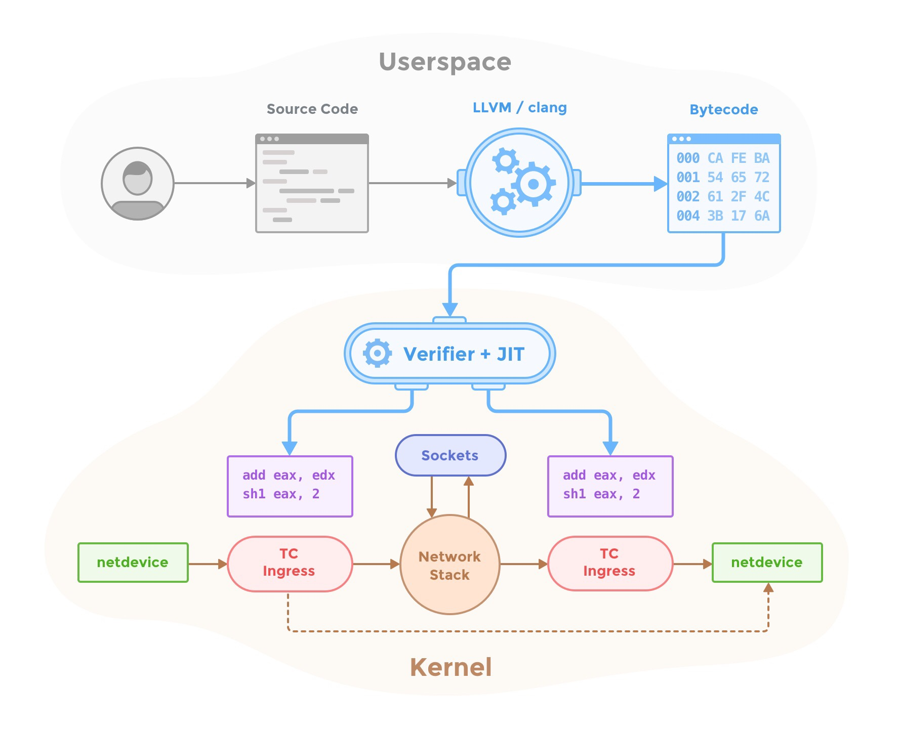

Cilium is open source software for providing and transparently securing network
connectivity and loadbalancing between application containers and services
deployed using Linux container management platforms like Docker and Kubernetes.

A new Linux kernel technology called eBPF is at the foundation of Cilium, which
enables the dynamic insertion of BPF bytecode into the Linux kernel. Cilium
generates eBPF programs for each individual application container to provide
networking, security, loadbalancing and visibility.

   

## Features Overview

 * **Security Policies:** Enforcement of security policies at application (L7)
   and networking (L3-L4) layer. Application level policies include filtering
   of HTTP protocol properties such as method, path, host, and headers.
   Networking policies include container/pod/service interconnectivity rules
   based on labels, restriction of traffic to certain CIDR and/or port ranges
   for both ingress and egress.
 * **Networking:** A simple flat Layer 3 network with the ability to span
   multiple clusters connects all application containers and services. Simple
   IP allocation using host scope allocators (dedicated /24 per cluster node
   for IPv4, dedicated /112 per cluster node for IPv6). Choice of either
   integrating with Linux routing to run a routing daemon or to create an
   overlay network using encapsulation (VXLAN/Geneve).
 * **Load balancing:** Distributed load balancing for east-west traffic from
   application container to application container, e.g. implementation of
   Kubernetes services. North-south traffic to load balance external traffic,
   e.g. implementation of Kubernetes ingress. All load-balancing performed
   with direct server return (DSR) by default for improved performance.
 * **Troubleshooting:** Built-in troubleshooting tools providing an alternative
   to traditional tcpdump troubleshooting techniques.
 * **Integrations:**
    * Network plugin integrations: [CNI][cni], [libnetwork][libnetwork]
    * Container runtime events: [containerd][containerd]
    * Kubernetes: [NetworkPolicy][k8s_netpolicy], [Labels][k8s_labels], [Ingress][k8s_ingress], [Service][k8s_service]
    * Logging: [fluentd][fluentd]

## Getting Started

 * [Why Cilium?](http://docs.cilium.io/en/latest/intro/#why-cilium)
 * [Getting Started with Vagrant](http://docs.cilium.io/en/latest/gettingstarted/)
 * [Architecture](http://docs.cilium.io/en/latest/architecture/)
 * [Administrator Guide](http://docs.cilium.io/en/latest/admin/)
 * [Frequently Asked Questions](https://github.com/cilium/cilium/issues?utf8=%E2%9C%93&q=is%3Aissue%20label%3Aquestion%20)
 * [Contributing](http://docs.cilium.io/en/latest/contributing)

## What is eBPF and XDP?

Berkeley Packet Filter (BPF) is a Linux kernel bytecode interpreter originally
introduced to filter network packets, e.g. for tcpdump and socket filters. The
BPF instruction set and surrounding architecture has recently been
significantly reworked with additional data structures such as hash tables and
arrays for keeping state as well as additional actions to support packet
mangling, forwarding, encapsulation, etc. Furthermore, a compiler back end for
LLVM allows for programs to be written in C and compiled into BPF instructions.
An in-kernel verifier ensures that BPF programs are safe to run and a JIT
compiler converts the BPF bytecode to CPU architecture specific instructions
for native execution efficiency. BPF programs can be run at various hooking
points in the kernel such as for incoming packets, outgoing packets, system
calls, kprobes, uprobes, tracepoints, etc.

BPF continues to evolve and gain additional capabilities with each new Linux
release. Cilium leverages BPF to perform core data path filtering, mangling,
monitoring and redirection, and requires BPF capabilities that are in any Linux
kernel version 4.8.0 or newer (the latest current stable Linux kernel is
4.10.x).

Many Linux distributions including CoreOS, Debian, Docker's LinuxKit, Fedora,
and Ubuntu already ship kernel versions >= 4.8.x. You can check your Linux
kernel version by running ``uname -a``. If you are not yet running a recent
enough kernel, check the Documentation of your Linux distribution on how to run
Linux kernel 4.9.x or later.

For more detail on kernel versions, see: [Prerequisites][prerequisites]

   

XDP is a further step in evolution and enables to run a specific flavor of BPF
programs from the network driver with direct access to the packet's DMA buffer.
This is, by definition, the earliest possible point in the software stack,
where programs can be attached to in order to allow for a programmable, high
performance packet processor in the Linux kernel networking data path.

Further information about BPF and XDP targeted for developers can be found in
the [BPF and XDP reference guide](http://docs.cilium.io/en/latest/bpf).

## Installation

See the [Installation instructions][installation]

## Presentations

 * DockerCon, April 18, 2017: [Cilium - Network and Application Security with BPF and XDP](https://www.slideshare.net/ThomasGraf5/dockercon-2017-cilium-network-and-application-security-with-bpf-and-xdp)
 * CNCF/KubeCon Meetup, March 28, 2017: [Linux Native, HTTP Aware Network Security](https://www.slideshare.net/ThomasGraf5/linux-native-http-aware-network-security)
 * Docker Distributed Systems Summit, Berlin, Oct 2016: [Slides](http://www.slideshare.net/Docker/cilium-bpf-xdp-for-containers-66969823), [Video](https://www.youtube.com/watch?v=TnJF7ht3ZYc&list=PLkA60AVN3hh8oPas3cq2VA9xB7WazcIgs&index=7)
 * NetDev1.2, Tokyo, Sep 2016 - cls_bpf/eBPF updates since netdev 1.1: [Slides](http://borkmann.ch/talks/2016_tcws.pdf), [Video](https://youtu.be/gwzaKXWIelc?t=12m55s)
 * NetDev1.2, Tokyo, Sep 2016 - Advanced programmability and recent updates with tc’s cls_bpf: [Slides](http://borkmann.ch/talks/2016_netdev2.pdf), [Video](https://www.youtube.com/watch?v=GwT9hRiqdUo)
 * ContainerCon NA, Toronto, Aug 2016 - Fast IPv6 container networking with BPF & XDP: [Slides](http://www.slideshare.net/ThomasGraf5/cilium-fast-ipv6-container-networking-with-bpf-and-xdp)

## Podcasts

 * Software Gone Wild by Ivan Pepelnjak, Oct 2016: [Blog](http://blog.ipspace.net/2016/10/fast-linux-packet-forwarding-with.html), [MP3](http://media.blubrry.com/ipspace/stream.ipspace.net/nuggets/podcast/Show_64-Cilium_with_Thomas_Graf.mp3)
 * OVS Orbit by Ben Pfaff, May 2016: [Blog](https://ovsorbit.benpfaff.org/#e4), [MP3](https://ovsorbit.benpfaff.org/episode-4.mp3)

## Community blog posts

 * Cilium for Network and Application Security with BPF and XDP, Apr 2017:
   [Blog](https://blog.scottlowe.org/2017/04/18/black-belt-cilium/)
 * Cilium, BPF and XDP, Google Open Source Blog, Nov 2016:
   [Blog](https://opensource.googleblog.com/2016/11/cilium-networking-and-security.html)

## Weekly Hangout
 * The developer community is hanging out on zoom on a weekly basis to chat. Everybody is welcome.
 * Weekly, Monday, 9:00 am PT, 12:00 pm (noon) ET, 6:00 pm CEST
 * [Join zoom](https://zoom.us/j/344163933)

## Contact

If you have any questions feel free to contact us on [Slack](https://cilium.herokuapp.com/)

## License

The cilium user space components are licensed under the
[Apache License, Version 2.0](LICENSE). The BPF code templates are licensed
under the [General Public License, Version 2.0](bpf/COPYING).

[prerequisites]: http://docs.cilium.io/en/latest/admin/#admin-kernel-version
[installation]: http://docs.cilium.io/en/latest/admin/#installing-cilium
[cni]: https://github.com/containernetworking/cni
[libnetwork]: https://github.com/docker/libnetwork
[containerd]: https://github.com/containerd/containerd
[k8s_service]: https://kubernetes.io/docs/concepts/services-networking/service/
[k8s_ingress]: https://kubernetes.io/docs/concepts/services-networking/ingress/
[k8s_netpolicy]: https://kubernetes.io/docs/concepts/services-networking/network-policies/
[k8s_labels]: https://kubernetes.io/docs/concepts/overview/working-with-objects/labels/
[fluentd]: http://www.fluentd.org/
