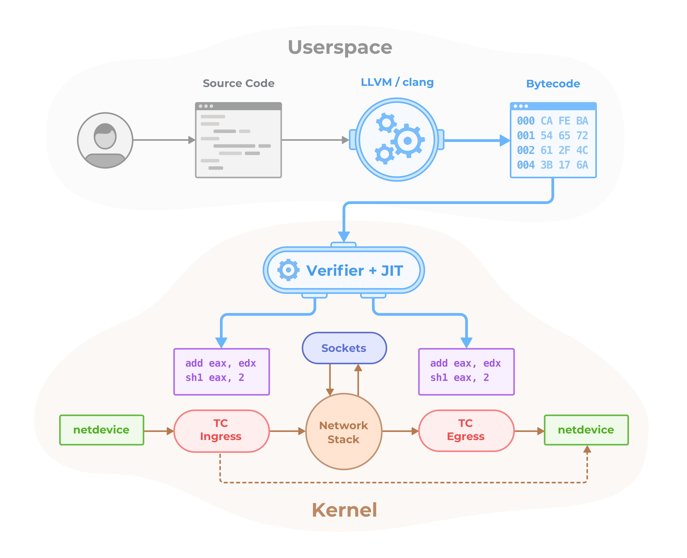

Cilium is open source software for providing and transparently securing the
network connectivity between application services deployed using Linux
container management platforms like Docker and Kubernetes.

At the foundation of Cilium is a new Linux kernel technology called eBPF, which
enables the dynamic insertion of BPF bytecode into the Linux kernel. Cilium
generates BPF programs for each individual container to provide networking,
security and visibility.

   

## Features Overview

 * **Security Policies:** Enforcement of security policies at application and
   networking layer. Application level policies include filtering of HTTP
   protocol properties such as method, path, and headers. Networking policies
   include container/pod/service interconnectivity rules as well as restriction
   to particular port ranges.
 * **Networking:** Single flat Layer 3 network which can span multiple clusters
   if needed. Support for native routing of container/pod/service IPs via the
   regular Linux routing layer or automatic creation of an overlay network with
   the means of encapsulation protocols (VXLAN/Geneve/GRE). No dependency on
   key/value store or external control plane.
 * **Load balancing:** Distributed load balancing for both inter service as
   well external traffic with direct server return (DSR) capability. Implements
   the Kubernetes Ingress and Service spec.
 * **Troubleshooting:** Built-in troubleshooting tools with full context
   visibility. tcpdump free troubleshooting guaranteed(tm)
 * **Integrations:**
    * Network plugins: CNI, libnetwork
    * container runtime events: containerd
    * Kubernetes: pod labels, Ingress, Service, NetworkPolicy
    * logging: logstash

## Getting Started

 * [Why Cilium?](http://docs.cilium.io/en/latest/intro/#why-cilium)
 * [Getting Started with Vagrant](http://docs.cilium.io/en/latest/gettingstarted/)
 * [Architecture](http://docs.cilium.io/en/latest/architecture/)
 * [Administrator Guide](http://docs.cilium.io/en/latest/admin/)
 * [Frequently Asked Questions](https://github.com/cilium/cilium/issues?utf8=%E2%9C%93&q=is%3Aissue%20label%3Aquestion%20)
 * [Contributing](http://docs.cilium.io/en/latest/contributing)

## What is eBPF and XDP?

Berkeley Packet Filter (BPF) is a Linux kernel bytecode interpreter originally
introduced to filter network packets, e.g. for tcpdump and socket filters. The
BPF instruction set and surrounding architecture has since been significantly
reworked with additional data structures such as hash tables and arrays for
keeping state as well as additional actions to support packet mangling,
forwarding, encapsulation, etc. Furthermore, a compiler back end for LLVM
allows for programs to be written in C and compiled into BPF instructions. An
in-kernel verifier ensures that BPF programs are safe to run and a JIT compiler
converts the BPF bytecode to CPU architecture specific instructions for native
execution efficiency. BPF programs can be run at various hooking points in the
kernel such as for incoming packets, outgoing packets, system calls, kprobes,
uprobes, tracepoints, etc.

BPF continues to evolve and gain additional capabilities with each new Linux
release. Cilium leverages BPF to perform core data path filtering, mangling,
monitoring and redirection, and requires BPF capabilities that are in any Linux
kernel version 4.8.0 or newer (the latest current stable Linux kernel is
4.10.x).

Many Linux distributions including CoreOS, Debian, Docker's LinuxKit, Fedora,
and Ubuntu already ship kernel versions >= 4.8.x. You can check your Linux
kernel version by running ``uname -a``. If you are not running a recent enough
kernel yet, check the Documentation of your Linux distribution on how to run
Linux kernel 4.9.x or later.

For more detail on kernel versions, see: [Prerequisites](prerequisites)

   

XDP is a further step in evolution and enables to run a specific flavor of BPF
programs from the network driver with direct access to the packet's DMA buffer.
This is, by definition, the earliest possible point in the software stack,
where programs can be attached to in order to allow for a programmable, high
performance packet processor in the Linux kernel networking data path.

Further information about BPF and XDP targeted for developers can be found in
the [BPF and XDP reference guide](http://docs.cilium.io/en/latest/bpf).

## Installation

See the [Installation instructions][installation]

## Presentations

 * DockerCon, April 18, 2017: [Cilium - Network and Application Security with BPF and XDP](https://www.slideshare.net/ThomasGraf5/dockercon-2017-cilium-network-and-application-security-with-bpf-and-xdp)
 * CNCF/KubeCon Meetup, March 28, 2017: [Linux Native, HTTP Aware Network Security](https://www.slideshare.net/ThomasGraf5/linux-native-http-aware-network-security)
 * Docker Distributed Systems Summit, Berlin, Oct 2016: [Slides](http://www.slideshare.net/Docker/cilium-bpf-xdp-for-containers-66969823), [Video](https://www.youtube.com/watch?v=TnJF7ht3ZYc&list=PLkA60AVN3hh8oPas3cq2VA9xB7WazcIgs&index=7)
 * NetDev1.2, Tokyo, Sep 2016 - cls_bpf/eBPF updates since netdev 1.1: [Slides](http://borkmann.ch/talks/2016_tcws.pdf), [Video](https://youtu.be/gwzaKXWIelc?t=12m55s)
 * NetDev1.2, Tokyo, Sep 2016 - Advanced programmability and recent updates with tc’s cls_bpf: [Slides](http://borkmann.ch/talks/2016_netdev2.pdf), [Video](https://www.youtube.com/watch?v=GwT9hRiqdUo)
 * ContainerCon NA, Toronto, Aug 2016 - Fast IPv6 container networking with BPF & XDP: [Slides](http://www.slideshare.net/ThomasGraf5/cilium-fast-ipv6-container-networking-with-bpf-and-xdp)
 * NetDev1.1, Seville, Feb 2016 - On getting tc classifier fully programmable with cls_bpf: [Slides](http://borkmann.ch/talks/2016_netdev.pdf), [Video](https://www.youtube.com/watch?v=KHXxSN5vwHY)

## Podcasts

 * Software Gone Wild by Ivan Pepelnjak, Oct 2016: [Blog](http://blog.ipspace.net/2016/10/fast-linux-packet-forwarding-with.html), [MP3](http://media.blubrry.com/ipspace/stream.ipspace.net/nuggets/podcast/Show_64-Cilium_with_Thomas_Graf.mp3)
 * OVS Orbit by Ben Pfaff, May 2016: [Blog](https://ovsorbit.benpfaff.org/#e4), [MP3](https://ovsorbit.benpfaff.org/episode-4.mp3)

## Community blog posts

 * Cilium for Network and Application Security with BPF and XDP, Apr 2017:
   [Blog](http://blog.scottlowe.org//2017/04/18/black-belt-cilium/)
 * Cilium, BPF and XDP, Google Open Source Blog, Nov 2016:
   [Blog](https://opensource.googleblog.com/2016/11/cilium-networking-and-security.html)

## Weekly Hangout
 * The developer community is hanging out on zoom on a weekly basis to chat. Everybody is welcome.
 * Weekly, Monday, 8am PT, 11am ET, 5pm CEST
 * [Join zoom](https://zoom.us/j/344163933)

## Contact

If you have any questions feel free to contact us on [Slack](https://cilium.herokuapp.com/)

## License

The cilium user space components are licensed under the
[Apache License, Version 2.0](LICENSE). The BPF code templates are licensed
under the [General Public License, Version 2.0](bpf/COPYING).

[prerequisites]: http://docs.cilium.io/en/latest/admin/#admin-kernel-version
[installation]: http://docs.cilium.io/en/latest/admin/#installing-cilium
