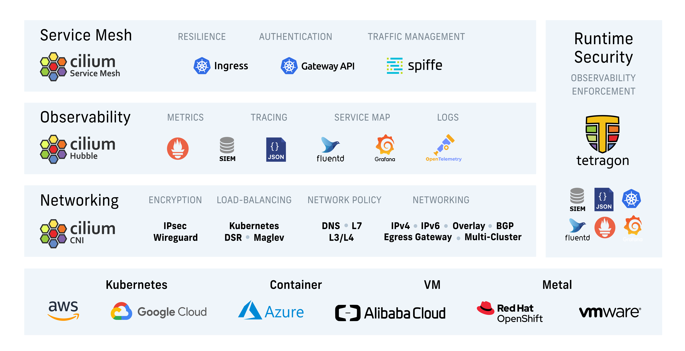

.. raw:: html

   <picture>
      <source media="(prefers-color-scheme: light)" srcset="https://cdn.jsdelivr.net/gh/cilium/cilium@main/Documentation/images/logo.png" width="350" alt="Cilium Logo">
      
   </picture>

   <picture>
      
   </picture>

|cii| |go-report| |clomonitor| |artifacthub| |slack| |go-doc| |rtd| |apache| |bsd| |gpl| |fossa| |gateway-api| |codespaces|

Cilium is a networking, observability, and security solution with an eBPF-based
dataplane. It provides a simple flat Layer 3 network with the ability to span
multiple clusters in either a native routing or overlay mode. It is L7-protocol
aware and can enforce network policies on L3-L7 using an identity based security
model that is decoupled from network addressing.

Cilium implements distributed load balancing for traffic between pods and to
external services, and is able to fully replace kube-proxy, using efficient
hash tables in eBPF allowing for almost unlimited scale. It also supports
advanced functionality like integrated ingress and egress gateway, bandwidth
management and service mesh, and provides deep network and security visibility and monitoring.

A new Linux kernel technology called eBPF_ is at the foundation of Cilium. It
supports dynamic insertion of eBPF bytecode into the Linux kernel at various
integration points such as: network IO, application sockets, and tracepoints to
implement security, networking and visibility logic. eBPF is highly efficient
and flexible. To learn more about eBPF, visit `eBPF.io`_.

Stable Releases
===============

The Cilium community maintains minor stable releases for the last three minor
Cilium versions. Older Cilium stable versions from minor releases prior to that
are considered EOL.

For upgrades to new minor releases please consult the `Cilium Upgrade Guide`_.

Listed below are the actively maintained release branches along with their latest
patch release, corresponding image pull tags and their release notes:

+---------------------------------------------------------+------------+------------------------------------+----------------------------------------------------------------------------+
| `v1.15 <https://github.com/cilium/cilium/tree/v1.15>`__ | 2024-07-11 | ``quay.io/cilium/cilium:v1.15.7``  | `Release Notes <https://github.com/cilium/cilium/releases/tag/v1.15.7>`__  |
+---------------------------------------------------------+------------+------------------------------------+----------------------------------------------------------------------------+
| `v1.14 <https://github.com/cilium/cilium/tree/v1.14>`__ | 2024-07-11 | ``quay.io/cilium/cilium:v1.14.13`` | `Release Notes <https://github.com/cilium/cilium/releases/tag/v1.14.13>`__ |
+---------------------------------------------------------+------------+------------------------------------+----------------------------------------------------------------------------+
| `v1.13 <https://github.com/cilium/cilium/tree/v1.13>`__ | 2024-07-11 | ``quay.io/cilium/cilium:v1.13.18`` | `Release Notes <https://github.com/cilium/cilium/releases/tag/v1.13.18>`__ |
+---------------------------------------------------------+------------+------------------------------------+----------------------------------------------------------------------------+

Architectures
-------------

Cilium images are distributed for AMD64 and AArch64 architectures.

Software Bill of Materials
--------------------------

Starting with Cilium version 1.13.0, all images include a Software Bill of
Materials (SBOM). The SBOM is generated in `SPDX`_ format. More information
on this is available on `Cilium SBOM`_.

.. _`SPDX`: https://spdx.dev/
.. _`Cilium SBOM`: https://docs.cilium.io/en/latest/configuration/sbom/

Development
===========

For development and testing purpose, the Cilium community publishes snapshots,
early release candidates (RC) and CI container images build from the `main
branch <https://github.com/cilium/cilium/commits/main>`_. These images are
not for use in production.

For testing upgrades to new development releases please consult the latest
development build of the `Cilium Upgrade Guide`_.

Listed below are branches for testing along with their snapshots or RC releases,
corresponding image pull tags and their release notes where applicable:

+--------------------------------------------------------------------------------------+------------+----------------------------------------------+-------------------------------------------------------------------------------------------+
| `main <https://github.com/cilium/cilium/commits/main>`__                             | daily      | ``quay.io/cilium/cilium-ci:latest``          | N/A                                                                                       |
+--------------------------------------------------------------------------------------+------------+----------------------------------------------+-------------------------------------------------------------------------------------------+
| `v1.16.0-rc.2 <https://github.com/cilium/cilium/commits/v1.16.0-rc.2>`__             | 2024-07-15 | ``quay.io/cilium/cilium:v1.16.0-rc.2``       | `Release Candidate Notes <https://github.com/cilium/cilium/releases/tag/v1.16.0-rc.2>`__  |
+--------------------------------------------------------------------------------------+------------+----------------------------------------------+-------------------------------------------------------------------------------------------+

Functionality Overview
======================

.. begin-functionality-overview

Protect and secure APIs transparently
-------------------------------------

Ability to secure modern application protocols such as REST/HTTP, gRPC and
Kafka. Traditional firewalls operate at Layer 3 and 4. A protocol running on a
particular port is either completely trusted or blocked entirely. Cilium
provides the ability to filter on individual application protocol requests such
as:

- Allow all HTTP requests with method ``GET`` and path ``/public/.*``. Deny all
  other requests.
- Allow ``service1`` to produce on Kafka topic ``topic1`` and ``service2`` to
  consume on ``topic1``. Reject all other Kafka messages.
- Require the HTTP header ``X-Token: [0-9]+`` to be present in all REST calls.

See the section `Layer 7 Policy`_ in our documentation for the latest list of
supported protocols and examples on how to use it.

Secure service to service communication based on identities
-----------------------------------------------------------

Modern distributed applications rely on technologies such as application
containers to facilitate agility in deployment and scale out on demand. This
results in a large number of application containers being started in a short
period of time. Typical container firewalls secure workloads by filtering on
source IP addresses and destination ports. This concept requires the firewalls
on all servers to be manipulated whenever a container is started anywhere in
the cluster.

In order to avoid this situation which limits scale, Cilium assigns a security
identity to groups of application containers which share identical security
policies. The identity is then associated with all network packets emitted by
the application containers, allowing to validate the identity at the receiving
node. Security identity management is performed using a key-value store.

Secure access to and from external services
-------------------------------------------

Label based security is the tool of choice for cluster internal access control.
In order to secure access to and from external services, traditional CIDR based
security policies for both ingress and egress are supported. This allows to
limit access to and from application containers to particular IP ranges.

Simple Networking
-----------------

A simple flat Layer 3 network with the ability to span multiple clusters
connects all application containers. IP allocation is kept simple by using host
scope allocators. This means that each host can allocate IPs without any
coordination between hosts.

The following multi node networking models are supported:

* **Overlay:** Encapsulation-based virtual network spanning all hosts.
  Currently, VXLAN and Geneve are baked in but all encapsulation formats
  supported by Linux can be enabled.

  When to use this mode: This mode has minimal infrastructure and integration
  requirements. It works on almost any network infrastructure as the only
  requirement is IP connectivity between hosts which is typically already
  given.

* **Native Routing:** Use of the regular routing table of the Linux host.
  The network is required to be capable to route the IP addresses of the
  application containers.

  When to use this mode: This mode is for advanced users and requires some
  awareness of the underlying networking infrastructure. This mode works well
  with:

  - Native IPv6 networks
  - In conjunction with cloud network routers
  - If you are already running routing daemons

Load Balancing
--------------

Cilium implements distributed load balancing for traffic between application
containers and to external services and is able to fully replace components
such as kube-proxy. The load balancing is implemented in eBPF using efficient
hashtables allowing for almost unlimited scale.

For north-south type load balancing, Cilium's eBPF implementation is optimized
for maximum performance, can be attached to XDP (eXpress Data Path), and supports
direct server return (DSR) as well as Maglev consistent hashing if the load
balancing operation is not performed on the source host.

For east-west type load balancing, Cilium performs efficient service-to-backend
translation right in the Linux kernel's socket layer (e.g. at TCP connect time)
such that per-packet NAT operations overhead can be avoided in lower layers.

Bandwidth Management
--------------------

Cilium implements bandwidth management through efficient EDT-based (Earliest Departure
Time) rate-limiting with eBPF for container traffic that is egressing a node. This
allows to significantly reduce transmission tail latencies for applications and to
avoid locking under multi-queue NICs compared to traditional approaches such as HTB
(Hierarchy Token Bucket) or TBF (Token Bucket Filter) as used in the bandwidth CNI
plugin, for example.

Monitoring and Troubleshooting
------------------------------

The ability to gain visibility and troubleshoot issues is fundamental to the
operation of any distributed system. While we learned to love tools like
``tcpdump`` and ``ping`` and while they will always find a special place in our
hearts, we strive to provide better tooling for troubleshooting. This includes
tooling to provide:

- Event monitoring with metadata: When a packet is dropped, the tool doesn't
  just report the source and destination IP of the packet, the tool provides
  the full label information of both the sender and receiver among a lot of
  other information.

- Metrics export via Prometheus: Key metrics are exported via Prometheus for
  integration with your existing dashboards.

- Hubble_: An observability platform specifically written for Cilium. It
  provides service dependency maps, operational monitoring and alerting,
  and application and security visibility based on flow logs.

.. _Hubble: https://github.com/cilium/hubble/
.. _`Layer 7 Policy`: https://docs.cilium.io/en/stable/security/policy/language/#layer-7-examples

.. end-functionality-overview

Getting Started
===============

* `Why Cilium?`_
* `Getting Started`_
* `Architecture and Concepts`_
* `Installing Cilium`_
* `Frequently Asked Questions`_
* Contributing_

What is eBPF and XDP?
=====================

Berkeley Packet Filter (BPF) is a Linux kernel bytecode interpreter originally
introduced to filter network packets, e.g. for tcpdump and socket filters. The
BPF instruction set and surrounding architecture have recently been
significantly reworked with additional data structures such as hash tables and
arrays for keeping state as well as additional actions to support packet
mangling, forwarding, encapsulation, etc. Furthermore, a compiler back end for
LLVM allows for programs to be written in C and compiled into BPF instructions.
An in-kernel verifier ensures that BPF programs are safe to run and a JIT
compiler converts the BPF bytecode to CPU architecture-specific instructions
for native execution efficiency. BPF programs can be run at various hooking
points in the kernel such as for incoming packets, outgoing packets, system
calls, kprobes, uprobes, tracepoints, etc.

BPF continues to evolve and gain additional capabilities with each new Linux
release. Cilium leverages BPF to perform core data path filtering, mangling,
monitoring and redirection, and requires BPF capabilities that are in any Linux
kernel version 4.8.0 or newer (the latest current stable Linux kernel is
4.14.x).

Many Linux distributions including CoreOS, Debian, Docker's LinuxKit, Fedora,
openSUSE and Ubuntu already ship kernel versions >= 4.8.x. You can check your Linux
kernel version by running ``uname -a``. If you are not yet running a recent
enough kernel, check the Documentation of your Linux distribution on how to run
Linux kernel 4.9.x or later.

To read up on the necessary kernel versions to run the BPF runtime, see the
section Prerequisites_.

.. image:: https://cdn.jsdelivr.net/gh/cilium/cilium@main/Documentation/images/bpf-overview.png
    :align: center

XDP is a further step in evolution and enables running a specific flavor of BPF
programs from the network driver with direct access to the packet's DMA buffer.
This is, by definition, the earliest possible point in the software stack,
where programs can be attached to in order to allow for a programmable, high
performance packet processor in the Linux kernel networking data path.

Further information about BPF and XDP targeted for developers can be found in
the `BPF and XDP Reference Guide`_.

To know more about Cilium, its extensions and use cases around Cilium and BPF
take a look at `Further Readings <FURTHER_READINGS.rst>`_ section.

Community
=========

Slack
-----

Join the Cilium `Slack channel <https://cilium.herokuapp.com/>`_ to chat with
Cilium developers and other Cilium users. This is a good place to learn about
Cilium, ask questions, and share your experiences.

Special Interest Groups (SIG)
-----------------------------

See `Special Interest groups
<https://docs.cilium.io/en/stable/community/community/#special-interest-groups>`_ for a list of all SIGs and their meeting times.

Developer meetings
------------------
The Cilium developer community hangs out on Zoom to chat. Everybody is welcome.

* Weekly, Wednesday,
  5:00 pm `Europe/Zurich time <https://time.is/Canton_of_Zurich>`__ (CET/CEST),
  usually equivalent to 8:00 am PT, or 11:00 am ET. `Join Zoom`_
* Third Wednesday of each month, 9:00 am `Japan time <https://time.is/Tokyo>`__ (JST). `Join Zoom`_

eBPF & Cilium Office Hours livestream
-------------------------------------
We host a weekly community `YouTube livestream called eCHO <https://www.youtube.com/channel/UCJFUxkVQTBJh3LD1wYBWvuQ>`_ which (very loosely!) stands for eBPF & Cilium Office Hours. Join us live, catch up with past episodes, or head over to the `eCHO repo <https://github.com/isovalent/eCHO>`_ and let us know your ideas for topics we should cover.

Governance
----------
The Cilium project is governed by a group of `Maintainers and Committers <https://raw.githubusercontent.com/cilium/cilium/main/MAINTAINERS.md>`__.
How they are selected and govern is outlined in our `governance document <https://github.com/cilium/community/blob/main/GOVERNANCE.md>`__.

Adopters
--------
A list of adopters of the Cilium project who are deploying it in production, and of their use cases,
can be found in file `USERS.md <https://github.com/cilium/cilium/blob/main/USERS.md>`__.

Roadmap
-------
Cilium maintains a `public roadmap <https://docs.cilium.io/en/latest/community/roadmap/>`__. It gives a high-level view of the main priorities for the project, the maturity of different features and projects, and how to influence the project direction.

License
=======

.. _apache-license: LICENSE
.. _bsd-license: bpf/LICENSE.BSD-2-Clause
.. _gpl-license: bpf/LICENSE.GPL-2.0

The Cilium user space components are licensed under the
`Apache License, Version 2.0 <apache-license_>`__.
The BPF code templates are dual-licensed under the
`General Public License, Version 2.0 (only) <gpl-license_>`__
and the `2-Clause BSD License <bsd-license_>`__
(you can use the terms of either license, at your option).

.. _`Cilium Upgrade Guide`: https://docs.cilium.io/en/stable/operations/upgrade/
.. _`Why Cilium?`: https://docs.cilium.io/en/stable/overview/intro
.. _`Getting Started`: https://docs.cilium.io/en/stable/#getting-started
.. _`Architecture and Concepts`: https://docs.cilium.io/en/stable/overview/component-overview/
.. _`Installing Cilium`: https://docs.cilium.io/en/stable/gettingstarted/k8s-install-default/
.. _`Frequently Asked Questions`: https://github.com/cilium/cilium/issues?utf8=%E2%9C%93&q=is%3Aissue+label%3Akind%2Fquestion+
.. _Contributing: https://docs.cilium.io/en/stable/contributing/development/
.. _Prerequisites: https://docs.cilium.io/en/stable/operations/system_requirements/
.. _`BPF and XDP Reference Guide`: https://docs.cilium.io/en/stable/bpf/
.. _`eBPF`: https://ebpf.io
.. _`eBPF.io`: https://ebpf.io
.. _`Join Zoom`: https://zoom.us/j/596609673

.. |go-report| image:: https://goreportcard.com/badge/github.com/cilium/cilium
    :alt: Go Report Card
    :target: https://goreportcard.com/report/github.com/cilium/cilium

.. |go-doc| image:: https://godoc.org/github.com/cilium/cilium?status.svg
    :alt: GoDoc
    :target: https://godoc.org/github.com/cilium/cilium

.. |rtd| image:: https://readthedocs.org/projects/docs/badge/?version=latest
    :alt: Read the Docs
    :target: https://docs.cilium.io/

.. |apache| image:: https://img.shields.io/badge/license-Apache-blue.svg
    :alt: Apache licensed
    :target: apache-license_

.. |bsd| image:: https://img.shields.io/badge/license-BSD-blue.svg
    :alt: BSD licensed
    :target: bsd-license_

.. |gpl| image:: https://img.shields.io/badge/license-GPL-blue.svg
    :alt: GPL licensed
    :target: gpl-license_

.. |slack| image:: https://img.shields.io/badge/slack-cilium-brightgreen.svg?logo=slack
    :alt: Join the Cilium slack channel
    :target: https://cilium.herokuapp.com/

.. |cii| image:: https://bestpractices.coreinfrastructure.org/projects/1269/badge
    :alt: CII Best Practices
    :target: https://bestpractices.coreinfrastructure.org/projects/1269

.. |clomonitor| image:: https://img.shields.io/endpoint?url=https://clomonitor.io/api/projects/cncf/cilium/badge
    :alt: CLOMonitor
    :target: https://clomonitor.io/projects/cncf/cilium

.. |artifacthub| image:: https://img.shields.io/endpoint?url=https://artifacthub.io/badge/repository/cilium
    :alt: Artifact Hub
    :target: https://artifacthub.io/packages/helm/cilium/cilium

.. |fossa| image:: https://app.fossa.com/api/projects/custom%2B162%2Fgit%40github.com%3Acilium%2Fcilium.git.svg?type=shield
    :alt: FOSSA Status
    :target: https://app.fossa.com/projects/custom%2B162%2Fgit%40github.com%3Acilium%2Fcilium.git?ref=badge_shield

.. |gateway-api| image:: https://img.shields.io/badge/Gateway%20API%20Conformance%20v1.0.0-Cilium-green
    :alt: Gateway API Status
    :target: https://github.com/kubernetes-sigs/gateway-api/blob/main/conformance/reports/v1.0.0/cilium.yaml

.. |codespaces| image:: https://img.shields.io/badge/Open_in_GitHub_Codespaces-gray?logo=github
    :alt: Github Codespaces
    :target: https://github.com/codespaces/new?hide_repo_select=true&ref=master&repo=48109239&machine=standardLinux32gb&location=WestEurope
