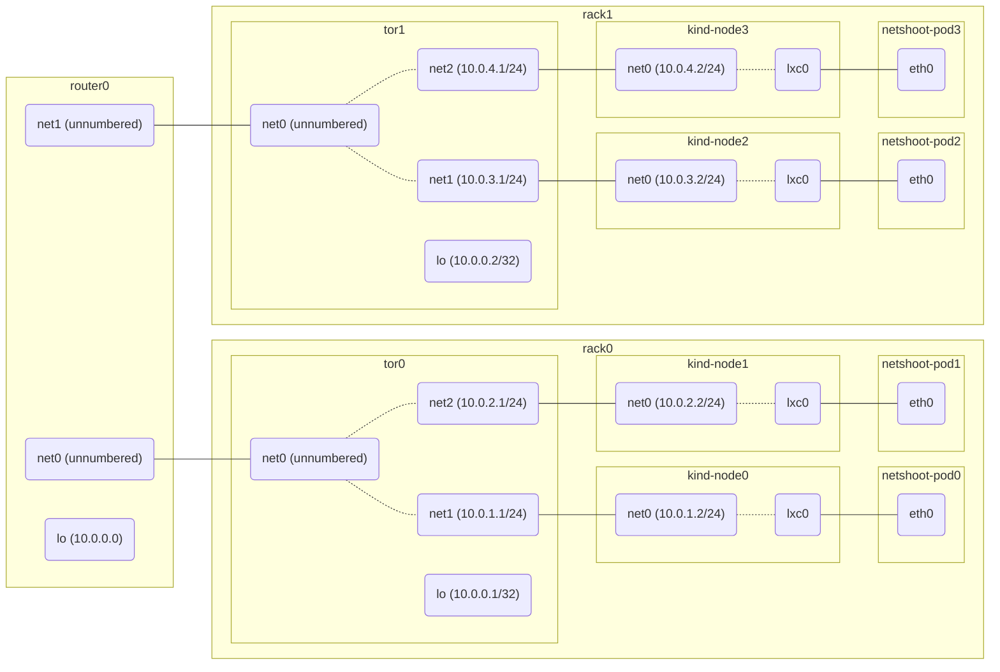

# BGP with LB IPAM & Gateway API

## Introduction

In this demo we want to show the interoperability and implementation of the Cilium LoadBalancer IP Address Managment (LB IPAM), BGP Control Plane and Gateway API features.

## User Story

As a platform engineer I would like to support a multi-tenant environment where each tenant will be provided with a separate IP Pool for Gateway and Service of Type LoadBalancer resources. Additionally I want to automatically advertise IP addresses for these resources to be announced to the network using BGP so that resources are reachable from the external network.

### Constraints

Gateway API now supports a new `infrastructure` field that lets you specify labels or annotations that will be copied from the Gateway to the resources created, such as Service of Type Load Balancers.
This ability is useful in multi-tenant or managed cloud environments where customization and configuration of Load Balancers is important. Using labels and Cilium's LB-IPAM feature, we can control what Service of Type Load Balancer IP addressses are assigned and advertised using either BGP or ARP.

### Design

It is possible to achieve a multi-tenant design using BGP with LB IPAM and Gateway resources by using either label or namespace selectors in the `CiliumLoadBalancerIPPool` resources.

Using the new `infrastructure` field in Gateway resources labels can be attached to Gateways which will be automatically propagated to associated Services of type Load Balancer. For example using `infrastructure.labels.color: blue` in the Gateway will ensure that the Service is configured with the same labels. Cilium LB IPAM can in turn use label selectors in `CiliumLoadBalancerIPPool` resources to assign an IP address from a specific IP Pool.

In case of using Namespace selectors, each Gateway being configured in a given Namespace will have a Service of Type Loadbalancer configured automatically. Given this Service is configured automatically and in case of a configured `CiliumLoadBalancerIPPool` with a Namespace selector will result that the Cilium operator will allocate an IP from the defined IP Pool.

### Requirements

The lab automatically installs the required Gateway API resources, including `GatewayClass`, `Gateway`, `HTTPRoute`, and `ReferenceGrant`.
Note that today we need to install the CRDs from the experimental channel.
The experimental release channel includes everything in the standard release channel plus some experimental resources and fields. This includes TCPRoute, TLSRoute, UDPRoute, GRPCRoute, and for this lab specific support for the `spec.infrastructure` field.

## Topology



## Demo Deployment

Make sure to review the Cilium `values.yaml` file before using this lab.

* `bgpControlPlane.enabled: true` enables the Cilium BGP Control Plane.
* `gatewayAPI.enabled: true` enables Cilium Gateway API.
* `kubeProxyReplacement: true` is required for Gateway API support.

1. Create an environment:

    ```shell-session
    make deploy
    ```

2. In this demo we use three Tenants which are `blue`, `red`, and `yellow`.  Check Tenant Namespaces:

    ```shell-session
    kubectl get ns
    ```

3. Check the `CiliumBGPClusterConfig` CRD in the `cilium-bgp-cluster.yaml` file.

    ```shell-session
    cat cilium-bgp-cluster.yaml
    ```

    This resource defines BGP instances and peer configurations that are applied to multiple nodes. In this demo we configure one `CiliumBGPPeerConfig` resource per rack.

4. Check the `CiliumBGPPeerConfig` CRD in the `cilium-bgp-cluster.yaml` file.

    ```shell-session
    cat cilium-bgp-cluster.yaml
    ```

    This resource provides a common set of BGP peering settings. It can be used across multiple peers.

5. Check the `CiliumBGPAdvertisement` CRD in the `cilium-bgp-cluster.yaml` file.

    ```shell-session
    cat cilium-bgp-cluster.yaml
    ```

   This resource defines prefixes that are injected into the BGP routing table.

   Note that by default there will be no LoadBalancer IPs advertised. We are using the `selector.matchExpressions:` to select LoadBalancer Services configured with labels matching key `color` with values `blue`, `red`, and `yellow`.
   This will result in IP addresses for LoadBalancer Services configured with such a label will be advertised using BGP.

    ```yaml
    spec:
      advertisements:
        - advertisementType: "Service"
          service:
            addresses:
              - LoadBalancerIP
          selector:
            matchExpressions:
              - { key: color, operator: In, values: [ red, blue, yellow ] }
    ```

   This will ensure Service of Type LoadBalancer resources with matching labels configured will be advertised to the BGP peers with configured IP addressses, which in turn are assigned by the Cilium Operator using LB IPAM.

6. Show neighboring status of routers and confirm Cilium nodes are not peering with them.

    ```shell-session
    make show-neighbors
    ```

    You can also use the Cilium CLI:

    ```shell-session
    cilium bgp peers
    ```

7. Apply the `CiliumBGPClusterConfig`, `CiliumBGPPeerConfig`, and `CiliumBGPAdvertisement` resources.

    ```shell-session
    make apply-policy
    ```

8. Show neighboring status of routers and confirm Cilium nodes are peering with them.

    ```shell-session
    make show-neighbors
    ```

    Using the Cilium CLI:

    ```shell-session
    cilium bgp peers
    ```

9. Let's create the Red IP Pool `ip-pool-red.yaml`. Note the `serviceSelector`:

    ```yaml
    serviceSelector:
      matchLabels:
        color: red
    ```

    This will ensure that any Load Balancer Service being created with the `color: red` labels will be assigned an IP address from the Red IP Pool.

    ```shell-session
    kubectl apply -f ip-pool-red.yaml
    ```

10. Now deploy the Red Gateway resource:

    ```shell-session
    kubectl apply -f gateway-red.yaml
    ```

11. Check that an IP address is being assigned by the LB IPAM and configured on the LoadBalancer Service:

    ```shell-session
    kubectl get -n tenant-red svc
    ```

12. Alternatively it is also possible to select Services based on `matchExpressions`. Let's create the Blue IP Pool. Note the `serviceSelector`:

    ```yaml
    serviceSelector:
      matchExpressions:
        - {key: color, operator: In, values: [blue]}
    ```

    This will ensure that any Load Balancer Service being created matching with the `color: blue` labels will be assigned an IP address from the Blue IP Pool.

    ```shell-session
    kubectl apply -f ip-pool-blue.yaml
    ```

13. Now deploy the Blue Gateway resource:

    ```shell-session
    kubectl apply -f gateway-blue.yaml
    ```

14. Check that an IP address is being assigned by the LB IPAM and configured on the LoadBalancer Service:

    ```shell-session
    kubectl get -n tenant-blue svc
    ```

15. It is also possible to select Services based on the Namespace they are deployed in using `matchExpressions`. Let's create the Yellow IP Pool. Note the `serviceSelector`:

    ```yaml
    serviceSelector:
      matchExpressions:
        "io.kubernetes.service.namespace": "tenant-yellow"
    ```

    This will result in any Service of Type LoadBalancer being created in the `tenant-yellow` namespace will be assigned an IP address from the configured CIDR in `ip-pool-yellow.yaml` IP Pool

    ```shell-session
    kubectl apply -f ip-pool-yellow.yaml
    ```

16. Now deploy the Yellow Gateway resource:

    ```shell-session
    kubectl apply -f gateway-yellow.yaml
    ```

17. Check that an IP address is being assigned by the LB IPAM and configured on the LoadBalancer Service:

    ```shell-session
    kubectl get -n tenant-yellow svc
    ```

18. Finally show the Load Balancer IP address being advertised and present in the BGP tables on the routers:

    ```shell-session
    make show-bgp
    ```

    Using the Cilium CLI:

    ```shell-session
    cilium bgp routes
    ```

## Usage

### Apply/Delete BGP policies

```bash
# Apply
make apply-policy

# Delete
make delete-policy
```

### Show neighboring state of all nodes

```bash
make show-neighbors
```

### Show RIB of all router nodes

```bash
make show-rib
```

### Show FIB of all nodes

```bash
make show-fib
```
