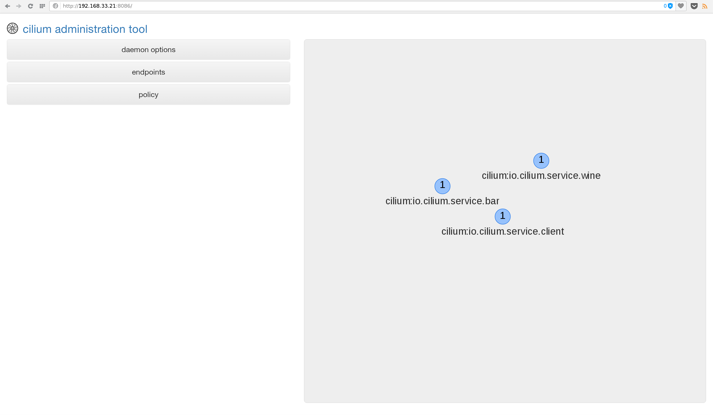
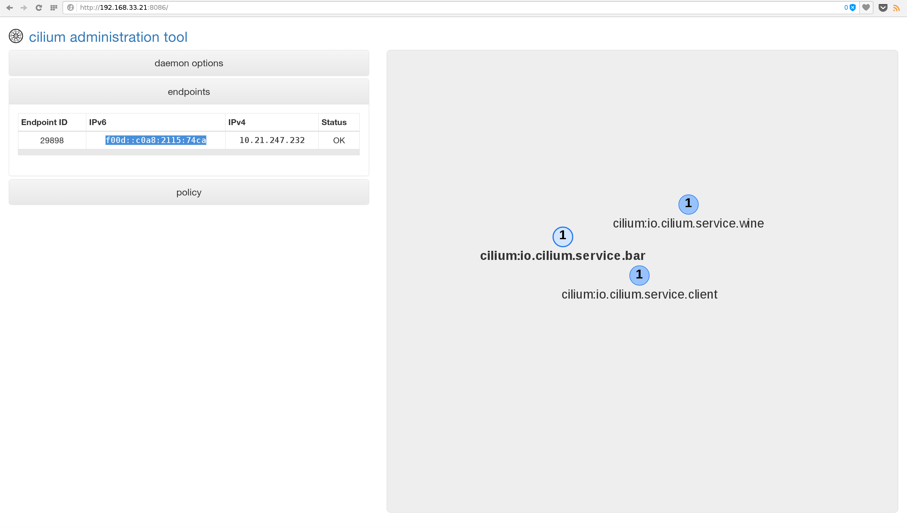
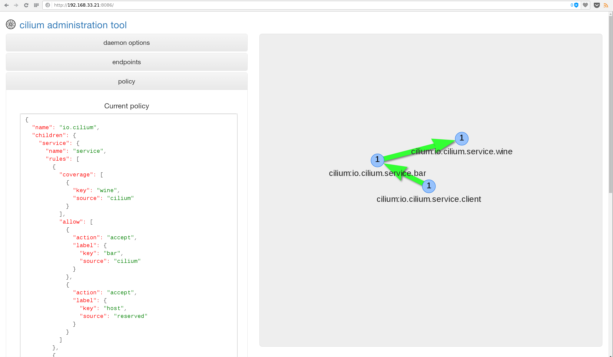
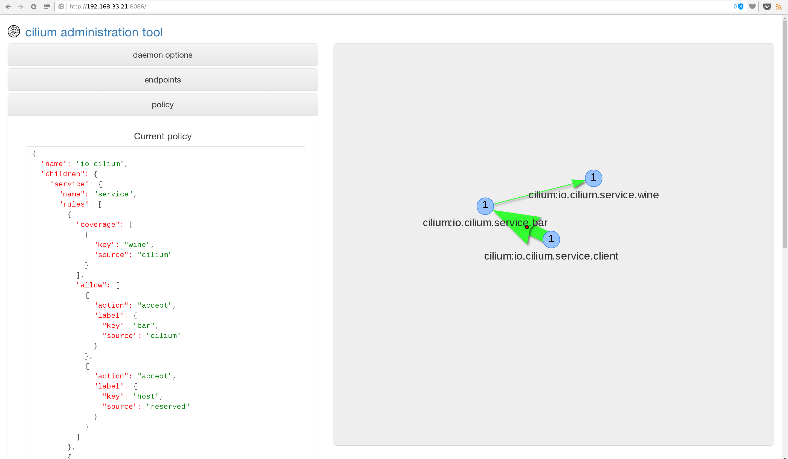

# Cilium with docker-compose

This tutorial will show you how you can have full IPv6 connectivity between
docker containers using the cilium docker image.

## Requirements

The easiest way is to use the [vagrant box](../../doc/vagrant.md) and just
install docker-compose >=1.7.1 in it.

If you want to install the dependencies manually, you need:
 - docker-compose (>=1.7.1)
 - Linux kernel and iproute2 from this tree:
    - https://git.breakpoint.cc/cgit/dborkman/iproute2.git/log/?h=bpf-wip
    - https://git.breakpoint.cc/cgit/dborkman/net-next.git/log/?h=bpf-wip

### Download docker-compose.yml

Download the `docker-compose.yml` [here](https://raw.githubusercontent.com/cilium/cilium/master/examples/docker-compose/docker-compose.yml).

### Vagrant users: Stop existing cilium and consul instance

If you are running the vagrant box. The Vagrantfile will have automatically
started both a consul container and the cilium-net service managed by upstart.
You need to stop both:

```
$ docker rm -f cilium-consul
$ sudo service cilium-net-daemon stop
```

### Run docker-compose

The only configuration required is to specify the interface which should be
used to connect to outside networks. Cilium will listen on this interface
for packets addressed to containers.

```
$ IFACE=eth1 docker-compose up
```

### Create a cilium network in docker

```
$ docker network create --ipv6 --subnet ::1/112 --ipam-driver cilium --driver cilium cilium
```

### Start and run containers

```
$ docker run -d --name wine --net cilium --label io.cilium.service.wine noironetworks/nettools sleep 30000
$ docker run -d --name bar --net cilium --label io.cilium.service.bar noironetworks/nettools sleep 30000
$ docker run -d --name client --net cilium --label io.cilium.service.client noironetworks/nettools sleep 30000
```

### Open your browser on the IP address of the interface where you're running cilium on port 8080



Click on the `endpoints` tab and then on the node that has the `io.cilium.service.bar` label.



Copy its IPv6 address and try to ping it from the `client` container where the ping will fail.

```
$ docker exec -ti client ping6 -c 4 f00d::c0a8:2115:74ca
PING f00d::c0a8:2115:74ca(f00d::c0a8:2115:74ca) 56 data bytes

--- f00d::c0a8:2115:74ca ping statistics ---
4 packets transmitted, 0 received, 100% packet loss, time 3095ms
```

The network lack a policy which allows both containers to speak with each other, in fact,
we only need the container `client` to consume container `bar` and `bar` to consume
container `wine`.

### Insert a valid policy into the daemon

Go to the browser again and open the policy tab. Choose the policy file provided
[here](https://raw.githubusercontent.com/cilium/cilium/master/examples/docker-compose/docker.policy) and upload it.



Try pinging again the container `bar` from `client` and you can see the pings are successfully
made.

```
$ docker exec -ti client ping6 -c 4 f00d::c0a8:2115:74ca
PING f00d::c0a8:2115:74ca(f00d::c0a8:2115:74ca) 56 data bytes
64 bytes from f00d::c0a8:2115:74ca: icmp_seq=1 ttl=63 time=0.043 ms
64 bytes from f00d::c0a8:2115:74ca: icmp_seq=2 ttl=63 time=0.054 ms
64 bytes from f00d::c0a8:2115:74ca: icmp_seq=3 ttl=63 time=0.083 ms
64 bytes from f00d::c0a8:2115:74ca: icmp_seq=4 ttl=63 time=0.066 ms

--- f00d::c0a8:2115:74ca ping statistics ---
4 packets transmitted, 4 received, 0% packet loss, time 2998ms
```



If you try to ping from `client` directly to `wine` it won't be possible since the policy
doesn't allow it.
