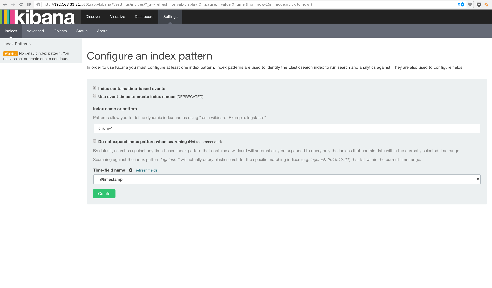
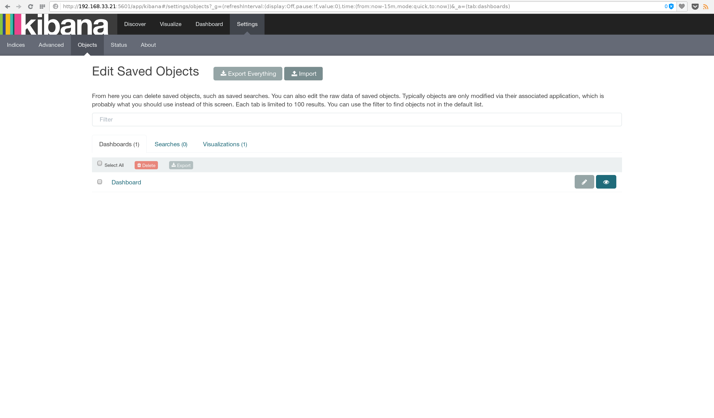
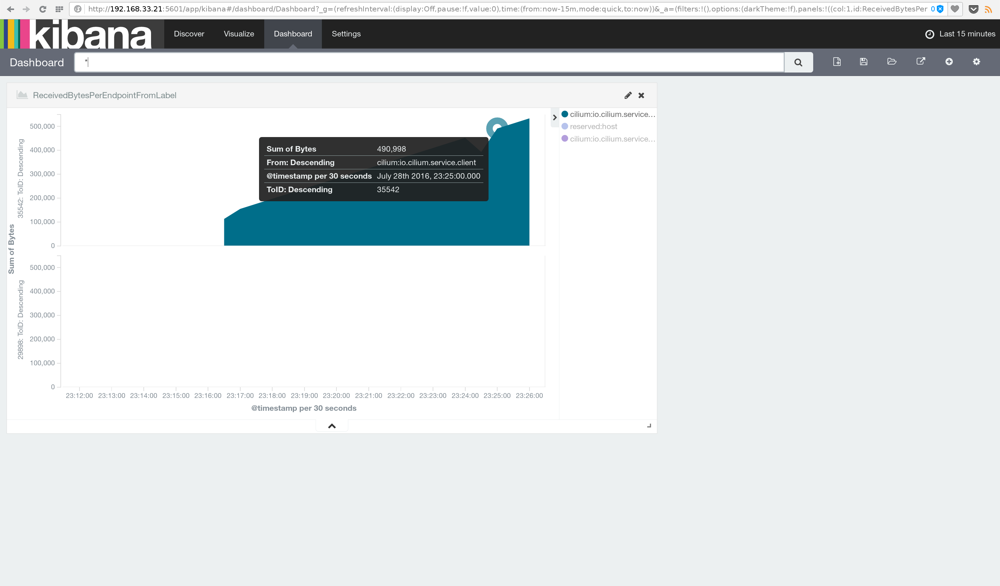

# Cilium with docker-compose

This tutorial will show you how you you can retrieve cilium statistics with ELK
(Elasticsearch, Logstash and Kibana)

## Requirements

 - docker-compose (>=1.7.1)
 - cilium

### Download docker-compose.yml

Download the `docker-compose.yml` [here](docker-compose.yml) and check if the set up ports
collide with other services running in your machine.

### Edit the `cilium.conf` or docker-compose.yml cilium file

If your are running cilium as standalone edit your `/etc/init/cilium.conf` file
and add the `--logstash` flag to point to the logstash address and port that you set up on the
previous step and after editing restart the `cilium` service.

```
exec cilium-agent --logstash 192.168.33.21:9302
```

Otherwise if you are running cilium with docker-compose edit the cilium docker-compose.yml
and add the `--logstash` flag to point to the logstash address and port that you set up on the
previous step.

```
version: '2'
services:
  cilium:
    image: docker.io/cilium:cilium-ubuntu-16-04
    command: cilium-agent --debug --logstash 192.168.33.21:9302
...
```

### Start docker-compose

```
$ docker-compose up
```

### Start, run containers and import a policy

Download the `docker.policy` [here](../docker-compose/docker.policy)

```
$ docker run -d --name wine --net cilium --label io.cilium.service.wine tgraf/nettools sleep 30000
$ docker run -d --name bar --net cilium --label io.cilium.service.bar tgraf/nettools sleep 30000
$ docker run -d --name client --net cilium --label io.cilium.service.client tgraf/nettools sleep 30000
$ cilium policy import ./docker.policy
```

### Ping some containers

```
$ cilium endpoint list
ENDPOINT ID   LABEL ID   LABELS (source:key[=value])       IPv6                   IPv4
29898         261        cilium:io.cilium.service.wine     f00d::c0a8:2115:74ca   10.21.247.232
33115         262        cilium:io.cilium.service.client   f00d::c0a8:2115:815b   10.21.242.54
35542         263        cilium:io.cilium.service.bar      f00d::c0a8:2115:8ad6   10.21.28.238
$
$ docker exec -ti client ping6 f00d::c0a8:2115:8ad6
PING f00d::c0a8:2115:8ad6(f00d::c0a8:2115:8ad6) 56 data bytes
64 bytes from f00d::c0a8:2115:8ad6: icmp_seq=1 ttl=63 time=0.040 ms
64 bytes from f00d::c0a8:2115:8ad6: icmp_seq=2 ttl=63 time=0.077 ms
...
```

### Open your browser on the Logstash address that you previously set up

Configure an index pattern by writting `cilium-*` in the search box and select `@timestamp`
as the Time-field name.



Click on the `Objects` tab and import the `kibana-backup.json` available [here](kibana-backup.json).
After importing you should have 1 Dashboard and 1 Visualizations.



Click on the eye icon, on the right side of `Dashboard` and it should sent you to the
primary dashboard where you can see all the bytes sent to a particular endpoint from a label ID.


