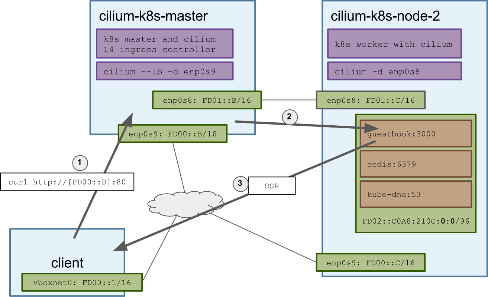
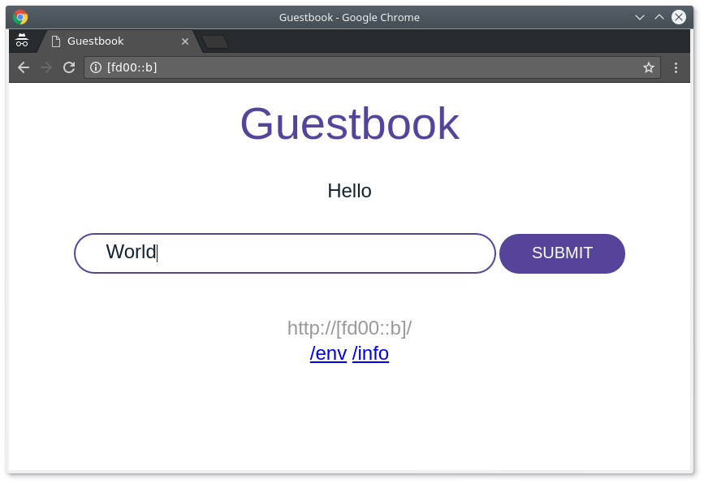

# Kubernetes Network Policy + (L4) Ingress Controller with Cilium

This tutorial demonstrates how to set up Kubernetes using Cilium to:

- Provide IPv4 & IPv6 network connectivity
- Enforce container/pod labels based network security policies (using the v1beta
"Network Policy" object)
- Run the BPF based kube-proxy replacement for services and ingress objects

On top of this, the pods will have some labels assigned by kubernetes and cilium
will enforce the kubernetes policy created via [v1beta1 kubernetes network policy API](https://github.com/kubernetes/kubernetes/blob/master/docs/proposals/network-policy.md).

Besides the network policy enforcement, kubernetes will be running **without**
kube-proxy and will enforce a basic set of ingress rules from an ingress object,
giving you a north-south loadbalancer, all of this will be taken care by cilium
which will also have the ability to perform east-west loadbalancer enforcement.

*What's Ingress? See [here](https://kubernetes.io/docs/user-guide/ingress/#what-is-ingress)*



## Requirements

 - VirtualBox
 - Vagrant
 - Cilium vagrant image with `K8S` mode ON
 - Tested with `kubernetes-v1.5.1`
 - 4GB of RAM (2GB per VM) (Minimal 1536MB per VM)

### Set up cilium vagrant image with K8S

Start the vagrant VM with our provided script and the following options:

- `LB=1` sets up the `cilium-k8s-master` to start up in loadbalancer mode;
- `IPV4=0` disables IPv4 mode in cilium;
- `K8S=1` installs k8s in the provided VM;
- `ǸWORKERS=1` runs a second VM.

Optional:
- `NFS=1` syncs the project's root directory with the VM;
(Demands firewall to be open to the VMs network: `udp:111`, `udp:2049`,
`udp:20048`)
- `MEMORY=1536` sets the VMs memory to 1536MB each.

If you encounter an error similar to:

```
WARN: VirtualBox network interface with "FD00::" set up not found
Please configure a VirtualBox network interface with "FD00::1/16"
```
You can add the IP address in VirtualBox: File > Preferences > Network >
Host-only.

Start the VM:

```
LB=1 IPV4=0 K8S=1 NWORKERS=1 ./contrib/vagrant/start.sh
```

*This might take a while depending on your network bandwidth and machine speed.*


### Connecting to your K8S cluster


Install the `kubectl` in your host by running the script. If you already have
`kubectl` installed, run the script without the `INSTALL` environment variable
so it sets `cilium-k8s-local` as the default `kubectl` cluster. The `IPV6_EXT`
is used to set the kubernetes master with the IPv6 address.

```
INSTALL=1 IPV6_EXT=1 examples/kubernetes/scripts/06-kubectl.sh
```

```
Cluster "cilium-k8s-local" set.
User "admin" set.
Context "default-context" set.
Switched to context "default-context".
NAME                 STATUS    MESSAGE              ERROR
scheduler            Healthy   ok
controller-manager   Healthy   ok
etcd-0               Healthy   {"health": "true"}
NAME                STATUS    AGE
cilium-k8s-master   Ready     43m
cilium-k8s-node-2   Ready     36m
Check cilium status:
cilium status
```

Check if the network policies are in place:
```
kubectl get networkpolicies
```

```
NAME              POD-SELECTOR       AGE
guestbook-redis   guestbook=redis    46m
guestbook-web     guestbook=web      46m
kubedns           k8s-app=kube-dns   46m
```
If they are not present you can install them by running:

```
kubectl create -f https://raw.githubusercontent.com/cilium/cilium/master/examples/kubernetes/network-policy/guestbook-policy-redis.json
kubectl create -f https://raw.githubusercontent.com/cilium/cilium/master/examples/kubernetes/network-policy/guestbook-policy-web.json
```


Check if `kube-dns` is running:
```
kubectl get pods -o wide --all-namespaces
```
```
NAMESPACE     NAME                           READY     STATUS    RESTARTS   AGE       IP                       NODE
kube-system   kube-dns-v20-888219237-mb931   3/3       Running   0          47m       fd02::c0a8:210c:0:74ca   cilium-k8s-node-2
```

### Create the guestbook pods and services

Now that you've a kubernetes cluster with all network policies and essential
services up and running, you can start creating your services.

Let's create the guestbook with the redis service:

```
kubectl create -f examples/kubernetes/deployments/guestbook
```
```
replicationcontroller "redis-master" created
service "redis-master" created
replicationcontroller "redis-slave" created
service "redis-slave" created
replicationcontroller "guestbook" created
service "guestbook" created
```

Check the deployment:
```
kubectl get pods -o wide
```
```
NAME                 READY     STATUS    RESTARTS   AGE       IP                       NODE
guestbook-cjxlw      1/1       Running   0          2m        fd02::c0a8:210c:0:fb5f   cilium-k8s-node-2
redis-master-r6psv   1/1       Running   0          2m        fd02::c0a8:210c:0:193a   cilium-k8s-node-2
redis-slave-shv8f    1/1       Running   0          2m        fd02::c0a8:210c:0:81db   cilium-k8s-node-2
```

*Wait until all pods are in `Running` status.*

Check the list of services installed in the cluster:

```
kubectl get svc
```
```
$ kubectl get svc
NAME           CLUSTER-IP   EXTERNAL-IP   PORT(S)    AGE
guestbook      fd03::ee8c   <none>        3000/TCP   4m
kubernetes     fd03::1      <none>        443/TCP    58m
redis-master   fd03::2e03   <none>        6379/TCP   5m
redis-slave    fd03::b1e7   <none>        6379/TCP   5m
```

### Create ingress rules

You now have a set of pods and services inside your cluster. That isn't too much
helpful unless they are exposed outside of the cluster.

```
kubectl create -f  examples/kubernetes/deployments/guestbook/ingress/guestbook-ingress.yml
```
```
ingress "guestbook-ingress" created
```
Verify if the ingress controller set up an address for the given ingress rule:
```
kubectl get ingresses
```
```
NAME                HOSTS     ADDRESS   PORTS     AGE
guestbook-ingress   *         FD00::B   80        6s
```

As you may noticed, cilium has set up the public address of `cilium-k8s-master`
as the ingress address. This will redirect all traffic that enters that IP with
port 80 to the `guestbook` service running on `cilium-k8s-node-2`. The response
packets from `guestbook` service will go directly to the client without touching
the loadbalancer node (`cilium-k8s-master`).

This loadbalancing mode is referred to as direct server return and decreases the
system load on the load balancers as reverse translation is distributed across
all backend nodes. This is in particular beneficial on asymmetric bandwidth
workloads with small requests and potentially large responses such as media
streaming.

Open your browser in [http://[FD00::B]](http://[FD00::B]) and you should see
something similar to this:



### Clean up

If you want to halt your VMs you can simply run:

```
NWORKERS=1 K8S=1 vagrant halt cilium-k8s-master cilium-k8s-node-2
```

And to resume use the same options when you start **plus** the `RELOAD=1`:

```
RELOAD=1 LB=1 IPV4=0 K8S=1 NWORKERS=1 ./contrib/vagrant/start.sh
```

If you want to delete and remove the VMs from your machine:

```
NWORKERS=1 K8S=1 vagrant destroy -f cilium-k8s-master cilium-k8s-node-2
```
