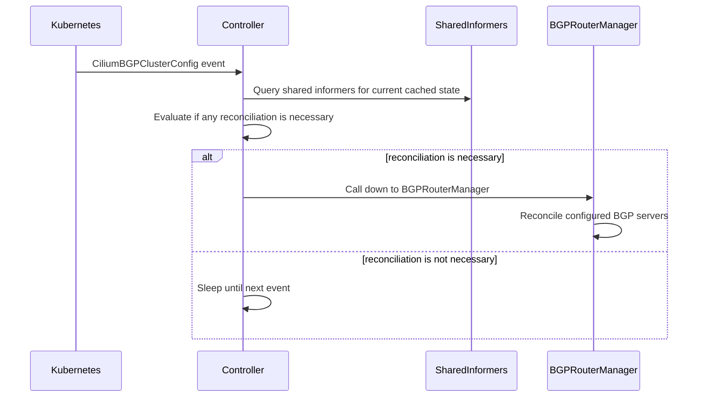
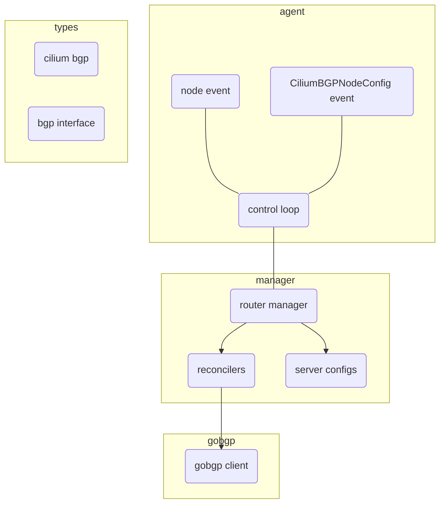

# Cilium BGP Control Plane

BGP Control Plane provides a way for Cilium to advertise routes to connected routers by using the
[Border Gateway Protocol][] (BGP). BGP Control Plane makes Pod networks and/or Services of type
`LoadBalancer` reachable from outside the cluster for environments that support BGP. Because BGP
Control Plane does not program the [datapath][], do not use it to establish reachability within
the cluster.

[Border Gateway Protocol]: https://datatracker.ietf.org/doc/html/rfc4271
[datapath]: https://docs.cilium.io/en/latest/network/ebpf/

## Usage

Currently a single flag in the `Cilium Agent` exists to turn on the `BGP Control Plane` feature set.

```
--enable-bgp-control-plane=true
```

When set to `true` the `BGP Control Plane` `Controllers` will be instantiated and will begin listening for events on `CiliumBGP*` resources.

## Configuration

Please see [Cilium BGP Control Plane](https://docs.cilium.io/en/stable/network/bgp-control-plane/bgp-control-plane/) documentation for configuration and operation guide.

## Architecture

The `BGP Control Plane` is split into a `Agent-Side Control Plane` and a `Operator-Side` control plane.

Both control planes are implemented by a `Controller` which follows the `Kubernetes` controller pattern. 

Both control planes primary listen for `CiliumBGP*` CRDs, along with other Cilium and Kubernetes resources useful for implementing a BGP control plane. 

The Operator-Side control plane processes `CiliumBGPClusterConfig` CRDs, and the CRDs referenced from it,
and creates/updes/deletes one `CiliumBGPNodeConfig` for each BGP-enabled node in the cluster. The
`CiliumBGPNodeConfig` with the name of the given node becomes the primary configuration source of the `Agent-Side Control Plane`.

### Agent-Side Architecture

#### Component Diagram

Above is a high level sequence diagram describing the control flow of the `Agent-Side BGP Control Plane` 

##### Architecture Diagram


*Note*: We summarize the Kubernetes events which trigger the `Controller` to just a `CiliumBGPNodeConfig` event, however the `Controller` will wake on other events which influence changes in the `Agent-Side BGP Control Plane`. See the source code for full details.

#### Controller
The `Agent-Side Control Plane` implements a controller located in `pkg/bgp/agent/controller.go`.

The controller listens for `CiliumBGPNodeConfig`, determines if a resource applies to its current host and if it does, captures some information about Cilium's current state then calls down to the implemented `Manager`.

#### Manager
The `Manager` is an interface used to define a declarative API between the `Controller` and instantiated BGP routers.

The interface defines a single declarative method whose argument is the desired `CiliumBGPNodeConfig` (among a few others).

The `Manager` is in charge of pushing the `BGP Control Plane` to the desired `CiliumBGPNodeConfig` or returning an error if it is not possible.

You can find this implementation in `pkg/bgp/manager`.

This implementation will 
* evaluate the desired `CiliumBGPNodeConfig`
* create/remove the desired BGP routers 
* advertise/withdraw the desired BGP routes 
* enable/disable any BGP server specific features
* inform the caller if the node config cannot be applied

The `Manager` implementation is capable of evaluating each `CiliumBGPNodeInstance` from withing a `CiliumBGPNodeConfig` in isolation.

This means when applying a `CiliumBGPNodeConfig` the `Manager` will attempt to create each `CiliumBGPNodeInstance`.

If a particular `CiliumBGPNodeInstance` fails to instantiate the error is logged and the `Manager` will continue to the next `CiliumBGPNodeInstance`, utilizing the aforementioned logic.

###### Manager Architecture

It's worth expanding on how the implementation of the `Manager` works internally.

This `Manager` views each `CiliumBGPNodeInstance` as a BGP router instance.

Each `CiliumBGPNodeInstance` defines a local ASN, a router ID and a list of neighbors to peer with.

This is enough for the `Manager` to create a `BgpServer` instance, which is the nomenclature defining a BGP speaker in `gobgp`-package-parlance.

The `Manager` employs a set of `ConfigReconciler`(s) which perform the order-dependent reconciliation actions for each `BgpServer` it must reconcile.

A `ConfigReconciler` is an interface where the reconciler is invoked via the `Reconcile` method.

See the source code at `pkg/bgp/manager` for a more in depth explanation of how each `ConfigReconciler` is called.

#### Router
Underlying router implementation exposes imperative API for BGP related configuration, such as add/remove neighbor, add/remove routes etc. Currently, only gobgp is supported as
underlying routing implementation.

This shim layer provides translation between cilium specific BGP types and gobgp types.

See the source code at `pkg/bgp/gobgp` for more details.
