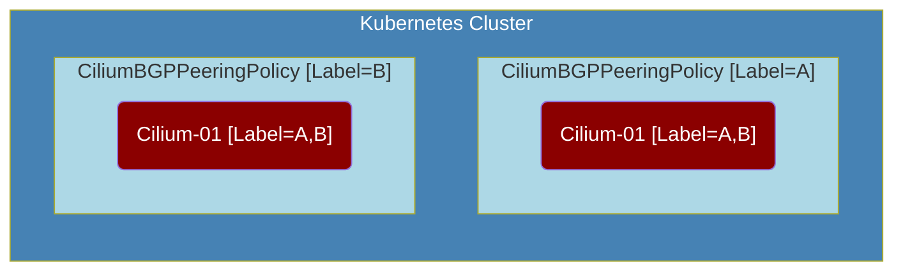
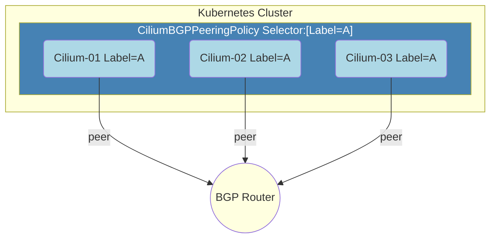
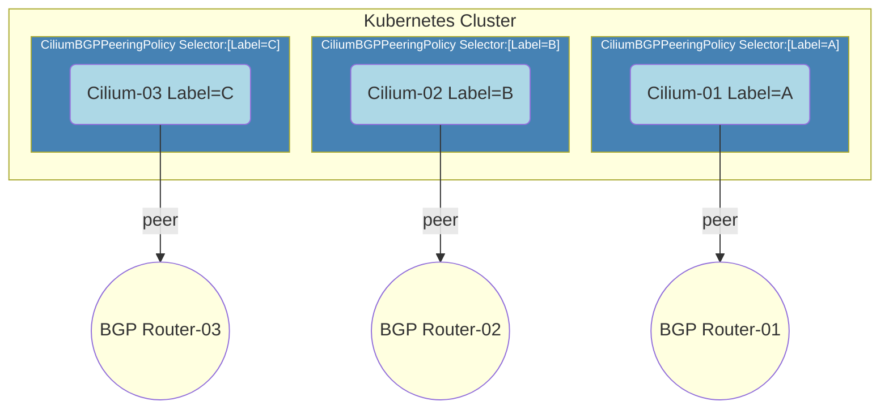
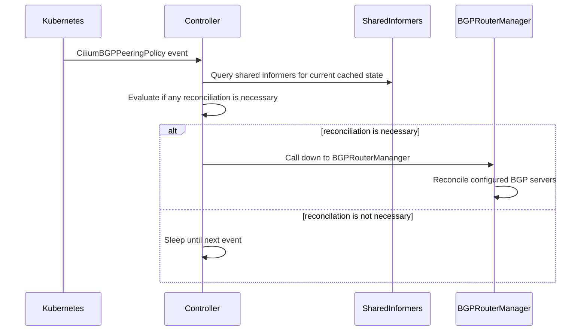
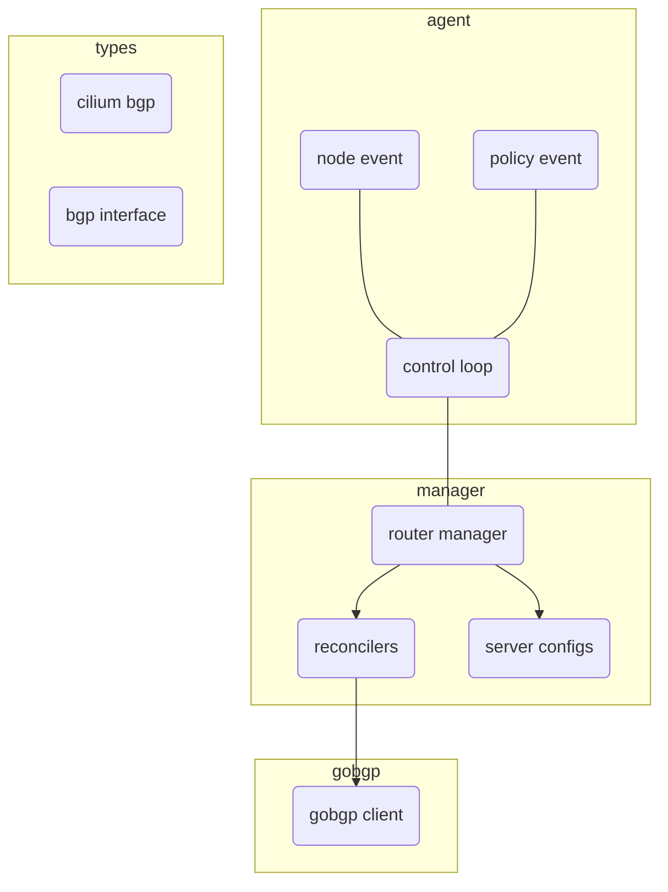

# Cilium BGP Control Plane

## Usage

Currently a single flag in the `Cilium Agent` exists to turn on the `BGP Control Plane` feature set.

```
--enable-bgp-control-plane=true
```

When set to `true` the `BGP Control Plane` `Controllers` will be instantiated and will begin listening for `CiliumBGPPeeringPolicy` events.

### CiliumBGPPeeringPolicy CRD

All `BGP` peering topology information is carried in a `CiliumBGPPeeringPolicy` CRD. 

`CiliumBGPPeeringPolicy` can be applied to one or more nodes based on its `nodeSelector` fields. 

A Cilium node may only have a single `CiliumBGPPeeringPolicy` apply to it and if more than one does, it will apply no policy at all.

Each `CiliumBGPPeeringPolicy` defines one or more `CiliumBGPVirtualRouter` configurations.

When these CRDs are written or read from the cluster the `Controllers` will take notice and perform the necessary actions to drive the `BGP Control Plane` to the desired state described by the policy.

The policy in `yaml` form is defined below:

```yaml
apiVersion: "cilium.io/v2alpha1"
kind: CiliumBGPPeeringPolicy
metadata:
 name: 01-bgp-peering-policy
spec: # CiliumBGPPeeringPolicySpec
 nodeSelector:
   matchLabels:
     bgp-policy: a
 virtualRouters: # []CiliumBGPVirtualRouter
 - localASN: 64512
   exportPodCIDR: true
   neighbors: # []CiliumBGPNeighbor
    - peerAddress: 'fc00:f853:ccd:e793::50/128'
      peerASN: 64512
```

#### Fields
``` 
nodeSelector: Nodes which are selected by this label selector will apply the given policy
 
 virtualRouters: One or more peering configurations outlined below. Each peering configuration can be thought of as a BGP router instance.
	
	virtualRouters[*].localASN: The local ASN for this peering configuration
	
	virtualRouters[*].exportPodCIDR: Whether to export the private pod CIDR block to the listed neighbors
	
	virtualRouters[*].neighbors: A list of neighbors to peer with
		neighbors[*].peerAddress: The address of the peer neighbor
		neighbors[*].peerASN: The ASN of the peer	
```

*Note*: *Setting unique configuration details of a particular instantiated virtual router on a particular Cilium node is explained in [Virtual Router Attributes](#Virtual Router Attributes)*

## Creating a BGP Topology

### Rules

Follow the rules below to have a `CiliumBGPPeeringPolicy` correctly apply to a node.

  * Only a single `CiliumBGPPeeringPolicy` can apply to a `Cilium` node. 
  * If the `BGP Control Plane` on a node iterates through the `CiliumBGPPeeringPolicy` CRs currently written to the cluster and discovers (n > 1) policies match its labels, it will return an error and remove any existing BGP sessions. Only (n == 1) policies **must** match a node's label sets.
  * Administrators should test a new BGP topology in a staging environment before making permanent changes in production.



The above diagram demonstrates the aforementioned error case. 
`Cilium-01` will not apply any `CiliumBGPPeeringPolicy` since both policies match its label set. 

* Within a `CiliumBGPPeeringPolicy` each `CiliumBGPVirtualRouter` defined must have a unique `localASN` field.
	* A node cannot host two or more logical routers with the same local ASN. Local ASNs are used as unique keys for a logical router.
	* A node can define the remote ASN on a per-neighbor basis to mitigate this scenario.  See `CiliumBGPNeighbor` CR sub-structure.
* IPv6 single stack deployments **must** set an IPv4 encoded `routerID` field in each defined `CiliumBGPVirtualRouter` object within a `CiliumBGPPeeringPolicy`
	* Cilium running on a IPv6 single stack cluster cannot reliably generate a unique 32 bit BGP router ID, as it defines no unique IPv4 addresses for the node. The administrator must define these IDs manually or an error applying the policy will occur.
	* This is explained further in [Virtual Router Attributes](#Virtual Router Attributes)
	

### Defining Topology

Within a `CiliumBGPPeeringPolicy` multiple `CiliumBGPVirtualRouter`(s) can be defined. 

Each one can be thought of as a logical BGP router instance. 

Defining more than one `CiliumBGPVirtualRouter` in a `CiliumBGPVirtualRouter` creates more than one logical BGP router on the hosts which the policy matches.

It is possible to create a single `CiliumBGPPeeringPolicy` for all nodes by giving each node in a cluster the same label and defining a single `CiliumBGPPeeringPolicy` which applies to this label. 

This is illustrated in the diagram below with a policy that peers to a single BGP router. 


It is also possible to provide each `Kubernetes` node its own `CiliumBGPPeeringPolicy` by giving each node a unique label and creating a `CiliumBGPPeeringPolicy` for each unique label. 

This is illustrated in the diagram below with each node is provided its own policy which peers to their own 



By showing a unified topology (former diagram) and a segregated topology (latter diagram) it should be apparent that any combination of the two is possible. 

This allows for selecting subsets of nodes which peer to a particular BGP router while another subset of nodes peer to a separate BGP router, akin to an "AS-per-rack" topology.

### Virtual Router Attributes

A `CiliumBGPPeeringPolicy` can apply to multiple nodes. 

When a `CiliumBGPPeeringPolicy` applies to one or more nodes each node will instantiate one or more BGP routers as defined by the list of `CiliumBGPVirutalRouter`.

However, there are times where fine-grained control over an instantiated virtual router's configuration needs to take place. 

To accomplish this a Kubernetes annotation is defined which applies to Kubernetes Node resources.

A single annotation is used to specify a set of configuration attributes to apply to a particular virtual router instantiated on a particular host.

The syntax of the annotation is as follows:

```
	cilium.io/bgp-virtual-router.{asn}="key=value,..."
```

The `{asn}` portion should be replaced by the virtual router's local ASN you wish to apply these configuration attributes to.

The following sections outline the currently supported attributes.

*Note*: *Each following section describes the syntax of applying a single 
attribute, however the annotation's value supports a comma separated lists of 
attributes and applying multiple attributes in a single annotation is supported.*

*Note*: *When duplicate `key=value` attributes are defined the last one will be 
selected.*

#### Router ID Attribute

When Cilium is running on an `IPv4` or a dual-stack `IPv4/6` cluster the `BGP Control Plane` will utilize the `IPv4` addressed used by Cilium for external reach ability. 

This will typically be Kubernetes' reported external IP address but can also be configured with a Cilium agent flag.

When running in `IPv6` single stack or when the administrator needs to manually define the instantiated BGP server's router ID a Kubernetes annotation can be placed on the node.

The annotation takes the following syntax:

```
cilium.io/bgp-virtual-router.{asn}="router-id=127.0.0.1"
```

The above annotation syntax should replace `{asn}` with the local ASN of the `CiliumBGPVirtualRouter` you are setting the provided router ID for.

When the `BGPControlPlane` evaluates a `CiliumBGPPeeringPolicy` with a `CiliumBGPVirtualRouter` it also searches for an annotation which targets the aforementioned `CiliumBGPVirtualRouter` local ASN. 

If found it will use the provided router ID and not attempt to use the IPv4 address assigned to the node.

#### Local Listening Port

By default the `GoBGP BGPRouterManager` will instantiate each virtual router without a listening port. 

It is possible to deploy a virtual router which creates a local listening port where BGP connections may take place. 

If this is desired the following annotation can be provided

```
cilium.io/bgp-virtual-router.{asn}="local-port=45450"
```


## Architecture

The `BGP Control Plane` is split into a `Agent-Side Control Plane` and a `Operator-Side` control plane (not yet implemented).

Both control planes are implemented by a `Controller` which follows the `Kubernetes` controller pattern. 

Both control planes primary listen for `CiliumBGPPeeringPolicy` CRDs, long with other Cilium and Kubernetes resources useful for implementing a BGP control plane. 

### Agent-Side Architecture

#### Component Diagram

Above is a high level sequence diagram describing the control flow of the `Agent-Side BGP Control Plane` 

##### Architecture Diagram


*Note*: We summarize the Kubernetes events which trigger the `Controller` to just a `CiliumBGPPeeringPolicy` event, however the `Controller` will wake on other events which influence changes in the `Agent-Side BGP Control Plane`. See the source code for full details.

#### Controller
The `Agent-Side Control Plane` implements a controller located in `pkg/bgpv1/agent/controller.go`. 

The controller listens for `CiliumBGPPeeringPolicy`, determines if a policy applies to its current host and if it does, captures some information about Cilium's current state then calls down to the implemented `Manager`.

#### Manager
The `Manager` is an interface used to define a declarative API between the `Controller` and instantiated BGP routers.

The interface defines a single declarative method whose argument is the desired `CiliumBGPPeeringPolicy` (among a few others).

The `Manager` is in charge of pushing the `BGP Control Plane` to the desired `CiliumBGPPeeringPolicy` or returning an error if it is not possible.

You can find this implementation in `pkg/bgpv1/manager`.

This implementation will 
* evaluate the desired `CiliumBGPPeeringPolicy`
* create/remove the desired BGP routers 
* advertise/withdraw the desired BGP routes 
* enable/disable any BGP server specific features
* inform the caller if the policy cannot be applied

The `Manager` implementation is capable of evaluating each `CiliumBGPVirtualRouter` in isolation.

This means when applying a `CiliumBGPPeeringPolicy` the `Manager` will attempt to create each `CiliumBGPVirtualRouter`.

If a particular `CiliumBGPVirtualRouter` fails to instantiate the error is logged and the `Manager` will continue to the next `CiliumBGPVirtualRouter`, utilizing the aforementioned logic.

###### Manager Architecture

It's worth expanding on how the implementation of the `Manager` works internally.

This `Manager` views each `CiliumBGPVirtualRouter` as a BGP router instance.

Each `CiliumBGPVirtualRouter` defines a local ASN, a router ID and a list of `CiliumBGPNeighbors` to peer with.

This is enough for the `Manager` to create a `BgpServer` instance, which is the nomenclature defining a BGP speaker in `gobgp`-package-parlance.

This `Manager` groups `BgpServer` instances by their local ASNs.

This leads to the following rule:
* A `CiliumBGPPeeringPolicy` applying to node `A` must not have two or more `CiliumBGPVirtualRouters` with the same `localASN` fields.

The `Manager` employs a set of `ConfigReconcilerFunc`(s) which perform the order-dependent reconciliation actions for each `BgpServer` it must reconcile.

A `ConfigReconcilerFunc` is simply a function with a typed signature. 

```go
type ConfigReconcilerFunc func(ctx context.Context, params ReconcileParams) error
``` 

See the source code at `pkg/bgpv1/manager/reconcile.go` for a more in depth explanation of how each `ConfigReconcilerFunc` is called.

#### Router
Underlying router implementation exposes imperative API for BGP related configuration, such as add/remove neighbor, add/remove routes etc. Currently, only gobgp is supported as
underlying routing implementation.

This shim layer provides translation between cilium specific BGP types and gobgp types.

See the source code at `pkg/bgpv1/gobgp` for more details.
