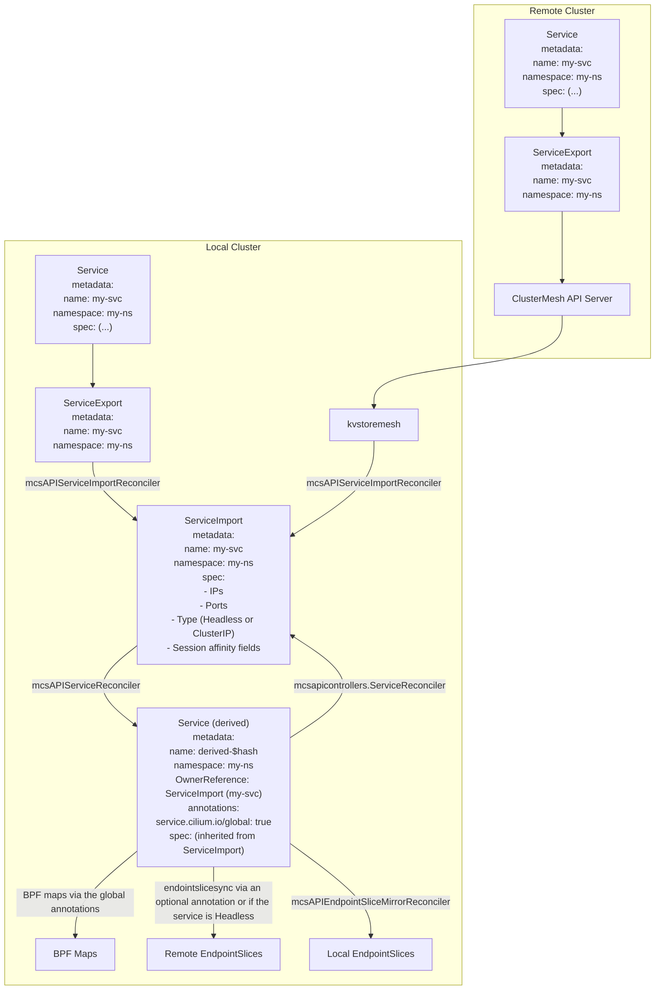

# Multi-Cluster Services API

Multi-Cluster Services API (MCS-API) is a standard API extending the Service concept
in multiple clusters. For more information about MCS-API see the [KEP-1645](https://github.com/kubernetes/enhancements/blob/master/keps/sig-multicluster/1645-multi-cluster-services-api/README.md).

MCS-API relies on two new CRDs: ServiceExport and ServiceImport. A ServiceExport
is a simple resource marking a Service of the same name and namespace for
exporting it into other clusters. The ServiceImport resource is entirely managed
by its implementation (by a Cilium controller in our case) and represents the
aggregation of all the Services exported. See also the [user documentation](https://docs.cilium.io/en/latest/network/clustermesh/mcsapi/) about
MCS-API in Cilium and the [KEP-1645](https://github.com/kubernetes/enhancements/blob/master/keps/sig-multicluster/1645-multi-cluster-services-api/README.md).

## The implementation

The implementation relies on a dedicated struct in the `types` subpackage named `MCSAPIServiceSpec`
which contains the different fields of the exported services (a Service and a ServiceExport of the same name).
This struct is synchronized to the Clustermesh API Server like other clustermesh structs
not directly tied to MCS-API. It is then pulled from all the clusters to reconstruct the
ServiceImport resources by the controller `mcsAPIServiceImportReconciler`.

Note that exporting a Service can result in a conflict, [see the dedicated
section in the KEP describing conflicts](https://github.com/kubernetes/enhancements/blob/master/keps/sig-multicluster/1645-multi-cluster-services-api/README.md#constraints-and-conflict-resolution).
Also unlike some other implementations we handle conflicts at import time (even though
this information is exposed to the user on the ServiceExport object). That's because the Cilium
way of exporting a Service is to update its local clustermesh API Server while at import time
it aggregates the information from every clustermesh API Server. Thus this is also handled
when we construct the ServiceImport resource in the `mcsAPIServiceImportReconciler` controller.

Then based on this ServiceImport another controller `mcsAPIServiceReconciler` will
create an actual Service named `derived-$hash` which is the internal Service designed to
trigger the normal mechanism of a regular global Service. This involves for instance ClusterIP
generation but also all the other clustermesh flows that are not necessarily related
directly to MCS-API (syncing the remote endpoints to BPF maps, EndpointSliceSync, ...).

There is also another controller that we use directly from the MCS-API repository
`mcsapicontrollers.ServiceReconciler` that reports back the ClusterIP from the
derived Service to the ServiceImport.

To handle all the DNS aspect we rely on the multicluster CoreDNS plugin which queries
the ServiceImport and the EndpointSlice resources, for more details about this see
the [user documentation](https://docs.cilium.io/en/latest/network/clustermesh/mcsapi/) describing its installation.

