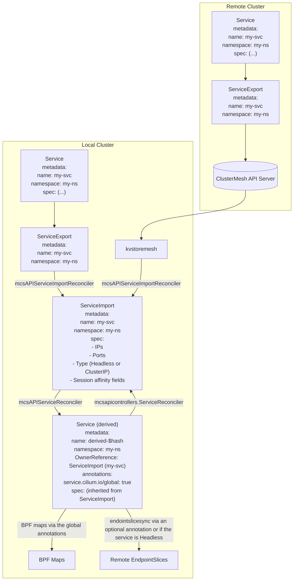

# MCS-API Cilium implementation

The implementation relies on a dedicated struct in the `types` subpackage named `MCSAPIServiceSpec`
which contains the different fields of the exported services (a Service and a ServiceExport of the same name).
This struct is synchronized to the Clustermesh API Server like other struct.
It is then pulled locally to reconstruct the ServiceImport resource by the controller `mcsAPIServiceImportReconciler`.

Then based on this ServiceImport another controller `mcsAPIServiceReconciler` will
create an actual Service named `derived-$hash` which is internal Service designed to
trigger the normal mechanism of a regular Service. This involves for instance ClusterIP
generation but also all the other clustermesh flows that are not necessarily related
directly to MCS-API (syncing the remote endpoints to BPF maps, EndpointSliceSync, ...).

There is also another controller that we use directly from the MCS-API repository
`mcsapicontrollers.ServiceReconciler` that reports back the ClusterIP from the derived Service to the ServiceImport.

```mermaid
flowchart TD
    subgraph Remote Cluster
        remoteService["`
            Service
            metadata:
                name: my-svc
                namespace: my-ns
            spec: (...)
        `"]
        remoteServiceExport["`
            ServiceExport
            metadata:
                name: my-svc
                namespace: my-ns
        `"]
        clustermeshAPIServer@{ shape: cyl, label: "ClusterMesh API Server" }

        remoteService --> remoteServiceExport
        remoteServiceExport --> clustermeshAPIServer
    end
    subgraph Local Cluster
        serviceImport["`
        ServiceImport
        metadata:
            name: my-svc
            namespace: my-ns
        spec:
            - IPs
            - Ports
            - Type (Headless or ClusterIP)
            - Session affinity fields
        `"]
        derivedService["`
        Service (derived)
        metadata:
            name: derived-$hash
            namespace: my-ns
            OwnerReference: ServiceImport (my-svc)
            annotations:
                service.cilium.io/global: true
        spec: (inherited from ServiceImport)
        `"]

        serviceImport -->|mcsAPIServiceReconciler| derivedService
        derivedService -->|mcsapicontrollers.ServiceReconciler| serviceImport

        localService["`
        Service
        metadata:
            name: my-svc
            namespace: my-ns
        spec: (...)
        `"]
        localServiceExport["`
            ServiceExport
            metadata:
                name: my-svc
                namespace: my-ns
        `"]

        clustermeshAPIServer --> kvstoremesh
        localService --> localServiceExport
        localServiceExport & kvstoremesh --> |mcsAPIServiceImportReconciler| serviceImport

        bpfMaps["BPF Maps"]
        endpointslices["Remote EndpointSlices"]
        derivedService --> |BPF maps via the global annotations| bpfMaps
        derivedService --> |endointslicesync via an optional annotation or if the service is Headless| endpointslices
    end
```
