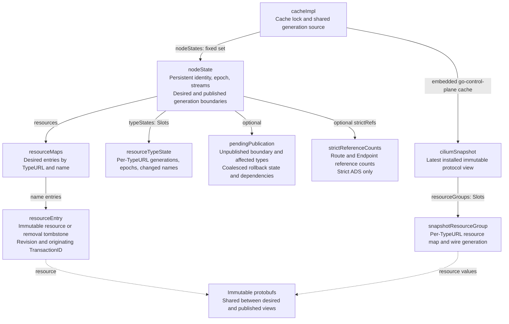
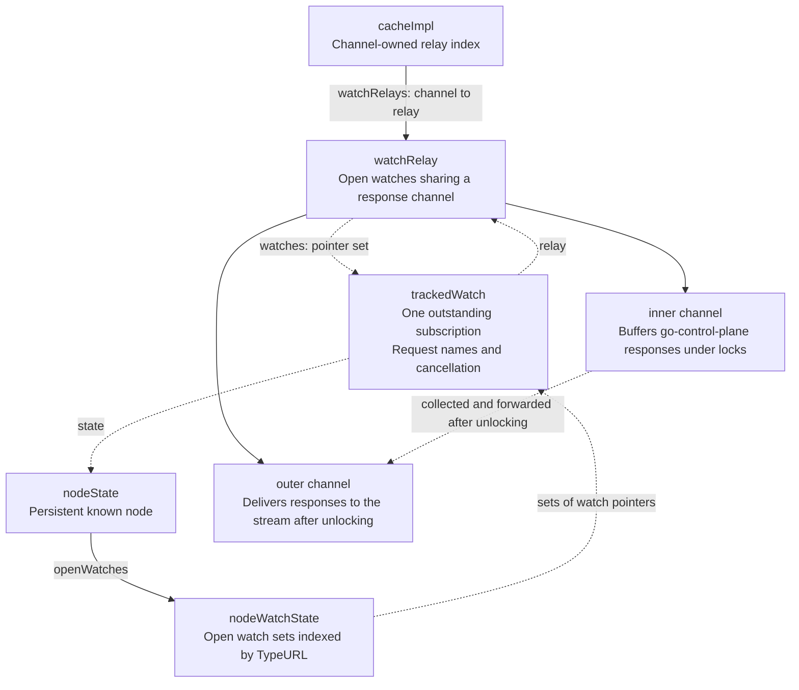
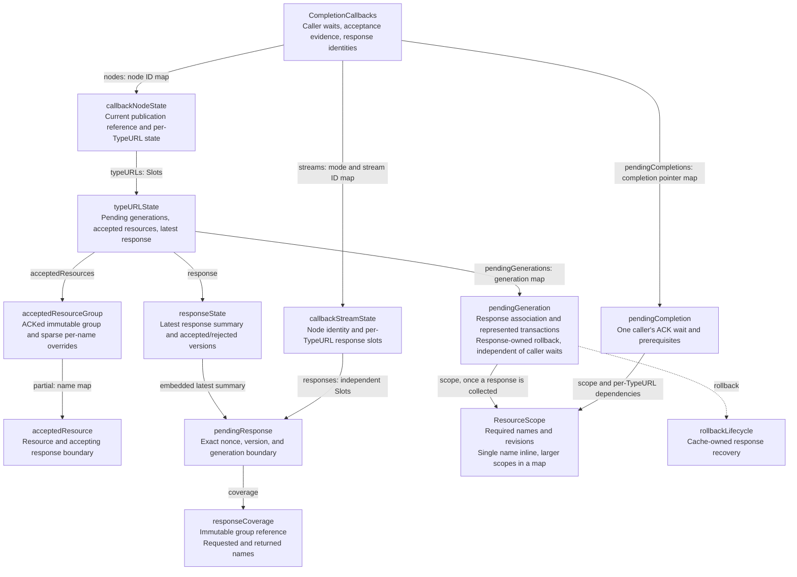
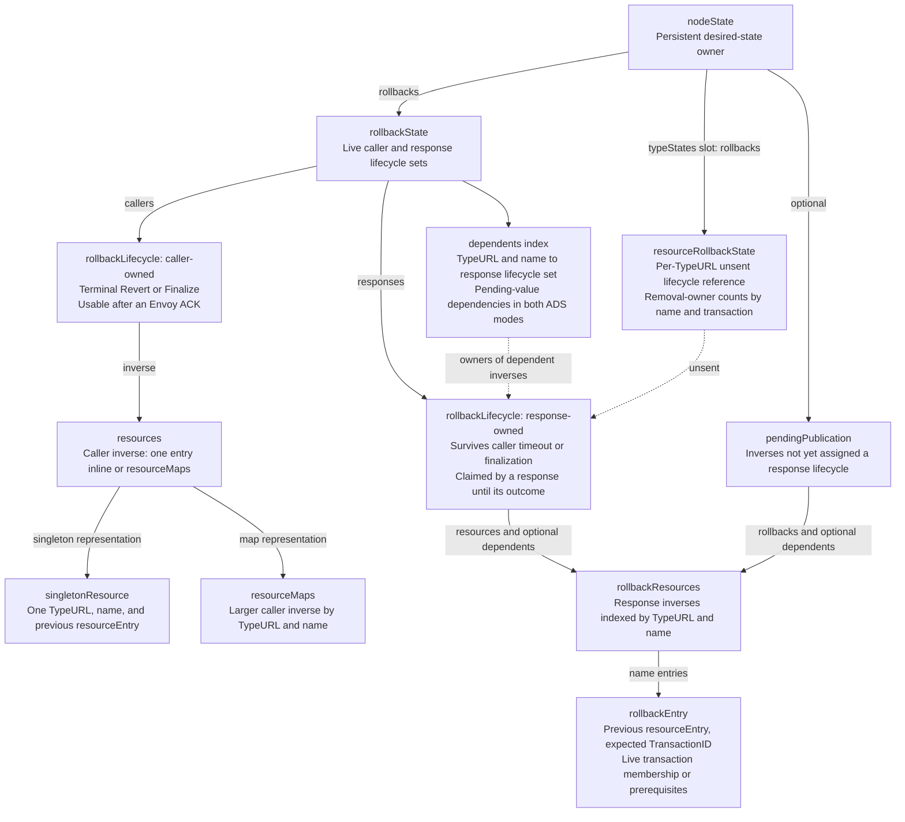

# ADS xDS cache state, publication, and rollback

## Overview

The ADS xDS cache extends go-control-plane's SnapshotCache to manage the resources
Cilium wants Envoy to use. It commits desired state, coalesces unpublished changes,
and retains sparse rollback state for caller failures and Envoy NACKs. This state
contains the previous resource entries needed to undo changes. A matching
watch triggers snapshot publication; go-control-plane constructs and delivers
protocol responses.

```text
Cilium update → desired state → watch → snapshot → response → ACK/NACK
                       │                              │
                caller lifecycle              response-owned rollback
```

There are three distinct resource views:

| View | Meaning |
| --- | --- |
| Desired | The resources Cilium currently wants Envoy to use. |
| Published | The latest immutable snapshot installed in go-control-plane. |
| Accepted | Resources acknowledged by Envoy, tracked by name for partial responses. |

Publication alone proves neither delivery nor acceptance. Caller rollback and
response rollback have independent lifetimes: finalizing a caller transaction
must not prevent a later Envoy NACK from correcting the cache.

## Principal invariants

- Supported nodes are fixed at construction. Their state persists even with no
  resources or streams; requests and mutations never create nodes.
- Desired state is cache-private and mutable; protobufs and published snapshots
  are immutable and may be shared.
- Mutations, rollback selection, and publication are serialized under the cache
  lock. Response delivery and application callbacks run after unlocking.
- Unpublished changes coalesce without constructing snapshots. There is no
  per-mutation snapshot queue.
- ACKs prove acceptance only for the resource names and revisions communicated
  by their response.
- Rollback preserves independently newer API changes. Strict ADS recovery can
  additionally change dependent resources to maintain reference consistency.
- Rollback state remains only while live owners or transaction relationships
  need it.

## API and locking

`ApplyResource` takes a resource type, name, and protobuf; nil removes the resource.
`ApplyResources` accepts sparse transactions containing Listeners (LDS), Routes
(RDS), Clusters (CDS), Endpoints (EDS), and Secrets (SDS). NetworkPolicies (NPDS) and
NetworkPolicyHosts (NPHDS) use the single-resource API, so one transaction cannot
mix Listener and NetworkPolicy changes.

Callers may supply a WaitGroup to wait for Envoy's response. Only the
`WithRollback` variants also return a caller lifecycle, on which the caller
eventually invokes either `Revert()` or `Finalize()`. All mutation APIs
independently retain any rollback state needed for a later NACK.

A transaction holds the cache write lock while preparing, validating, and
committing its changes. Readers cannot observe partial changes. Completion
registration and Listener-derived policy-wait bookkeeping use the same lock.
Responses and application callbacks are collected under the lock but delivered
after unlocking, allowing callbacks to reenter cache APIs.

## State and ownership

Each supported node has a persistent `nodeState`. It owns desired resources,
publication boundaries, epoch negotiation, open watches, and strict reference
counts. Per-resource-type state groups changed names, version generations, and
rollback ownership.

Node-local rollback state manages caller and response lifetimes, transaction
dependencies, and the adjustment of rollback targets after a NACK. A secondary
name index finds dependent response owners without scanning unrelated lifecycles.
It retains only live relationships and applies in both ADS modes.

Completion callbacks own caller ACK waits, accepted-resource evidence, and
response identities. Acceptance evidence retains the relevant immutable resource
group and sparse per-name overrides. Multiple streams
keep independent response identities for the same node and resource type.

The diagrams show state retained between calls, requests, and responses, omitting
temporary transaction and delivery batches. Solid arrows show containers and
their contents; dashed arrows show cross-references or shared values. `Slots`
and `Map` are fixed containers indexed by resource type.



## Updates and removals

Under the cache lock, a transaction:

1. Compares proposed resources with desired state. Semantic no-ops keep the
   existing protobuf and metadata.
2. Prepares changes and identifies unchanged values which are still awaiting
   acceptance by Envoy.
3. Reserves a generation if resources change and validates affected references
   in strict ADS mode.
4. Commits desired state, records changed names, and registers ACK waits.
5. Coalesces response-owned rollback state and transaction dependencies.
6. Publishes a snapshot if a directly affected watch is open.
7. Creates a requested caller lifecycle after a successful commit or publication.

Validation failure leaves desired state unchanged and detaches any waits prepared
for the transaction. If immediate publication fails before installation, the
transaction restores its previous entries and bookkeeping and detaches its waits.
A failed apply returns no caller lifecycle. A delivery error after installation
preserves the committed update.

### Strict ADS consistency

Strict mode counts Listeners referring to each Route and Clusters referring to
each Endpoint. It checks only references affected by a transaction, evaluating
parent and child changes together before committing desired state.

Missing Routes and orphan Routes or Endpoints are rejected synchronously. Missing
CLAs (ClusterLoadAssignments) are allowed: snapshot publication supplies empty
assignments without inserting them into desired state. This permits asynchronous
EDS updates from service backends.

Non-strict mode and unrelated resource types skip reference validation.
Compensating mutations done for caller- or response-driven reverts use the same
validation and publication path as API updates. A full snapshot consistency check
runs only when both strict ADS and agent debug logging are enabled. Mutation-time
validation provides transaction safety.

### Generations, revisions, and transactions

Every state-changing mutation reserves a number from a cache-wide generation
source. Three roles distinguish how that number is used:

- `Generation`: a mutation number or a snapshot/response boundary.
- `Revision`: when a named value last changed, whether by an API call or revert.
- `TransactionID`: the API transaction which originally inserted or deleted that
  value.

API changes assign the same number to the resource's revision and transaction ID.
Reverts restore the previous value and transaction ID but assign a fresh revision.
Ordering across these roles relies on their shared source. Failed attempts can
leave gaps in the sequence, which is never rewound.

Snapshot and response boundaries can include several API transactions and
reverts. ACK evidence must identify the required resource name and revision within
the acknowledged response.

In `A → B → A`, the two API changes to A have different transaction IDs and
revisions even when their contents match. An older rollback cannot undo the later
A. Restoring A through a revert also gives it a fresh revision, so a delayed ACK
for B or the original A cannot complete a wait for restored A.

## State coalescing

Unpublished changes are already committed to desired state. Pending publication
holds the necessary state for incremental snapshot publication and possible
rollback: publication generation boundary, affected resource types, and rollback
state.

Before a response claims rollback state, repeated changes to one name coalesce to
the oldest previous value and the latest expected API transaction:

```text
desired changes: P0 → P1 → P2 → P3
rollback state: previous=P0, expectedTransaction=transaction(P3)
```

A net no-op chain can discard its response-owned rollback state. Once a response
claims that state, it stops coalescing; subsequent updates begin another chain.
Returning desired state to the original value cannot discard a sent response's
rollback state, because Envoy may still NACK it. Caller rollback remains
independently owned in either case.

## Snapshot publication

A successful mutation commits desired state before returning, but only publishes
a snapshot if a directly affected watch is open. Otherwise, changes coalesce
until a matching request arrives. An unrelated watch does not trigger publication.

Known nodes start with empty desired state. Their first supported active
subscription creates and publishes the initial snapshot from current desired
state. An empty resource group is supplied only when that type's desired state is
empty.

New snapshots shallow-copy the previous snapshot and replace affected resource
groups. Immutable resource maps are cloned only where entries change. Missing
CLAs are synthesized in the snapshot. Generation-based versions make snapshot
construction independent of serialization and content hashing. Marshaling is
deferred to go-control-plane's response construction.

Publication metadata becomes visible only after successful installation. The
published generation advances, and pending publication bookkeeping and changed
names are cleared; independent rollback ownership remains intact.

If publication triggered by `CreateWatch` fails, desired state and pending
publication remain available for another attempt or caller rollback. Response
construction can still fail to encode a resource after a successful cache mutation
or publication.

### Wire versions and EDS replay

Wire versions use `e<epoch>:g<generation>`, for example `e1:g42`. The epoch
distinguishes the restarted agent's generation sequence from versions retained by
a running Envoy. Internally the cache keeps bare generations and binds the node's
epoch when publishing a snapshot. Each resource type's aggregate generation
advances for changes and reverts, ensuring restored values receive a new wire
version too.

The first request for each resource type contributes its reported epoch, if any.
Versions without an `e<positive integer>:` prefix are ignored. The initial node
epoch is the smallest positive integer absent from the first request. If another
type's first request reports that selected epoch, negotiation advances beyond all
first-request epochs recorded for the node. This handles Envoy retaining different
epochs for different resource types across agent restarts.

Negotiated types retain continuity across reconnects. Changing the epoch updates
the published protocol view without publishing unrelated pending changes.

A Cluster change can require fresh EDS delivery even when desired CLAs are
unchanged: Envoy may need it to finish warming with an already-subscribed EDS name,
or the snapshot may gain or lose synthesized empty assignments. In these cases,
the EDS wire generation advances to the greater of its current generation and the
CDS generation. Desired EDS revisions and transaction IDs remain unchanged.
LDS changes do not artificially advance RDS, CDS, or SDS versions.

## Delivery and ACK processing

Cache relays buffer responses produced synchronously by `SetSnapshot` or
`CreateWatch`. Before delivery, the cache captures their exact publication
generation, the resource names they communicate, and rollback ownership.
Immediate `CreateWatch` responses are captured under the lock too; their
generations are never inferred from later publications or newly registered waits.
Collected response batches are delivered outside the lock in dependency order.



Open watches are tracked both by node and resource type, and by response channel.
Both tracking structures refer to the same watch objects. One ADS stream maintains
a current watch per resource type with its requested names; different streams may
have independent named subscriptions. Relay state lives only while its watches do.

Requests for unsupported resource types from known nodes call the embedded
go-control-plane cache directly. Published resources are limited to supported
types. Requests for unsupported types with an empty version remain unanswered
until cancellation; a nonempty version may receive an empty response.

Named-resource coverage identifies the names whose state a response communicates,
including deletions where omission signals removal. Each stream keeps its own
response identity per resource type. `OnStreamResponse` records the response's
generation and named-resource coverage. Envoy supplies the corresponding ACK or
NACK in a later request, matched by stream and nonce. A matching ACK or NACK can
then complete the associated waits.

An ACK acknowledges only the names communicated by the response identified by
the nonce. For types supporting deletion by omission (LDS, CDS, NPDS, NPHDS), this
can include names within its subscription which are absent from the response. A
multi-name wait succeeds only after every required name has been acknowledged.
Response-owned rollback is released only after all of its required names and
pending prerequisites are acknowledged.



### Semantic no-op waits

A semantic no-op does not allocate a generation or caller rollback state. With a
WaitGroup, it checks acceptance of the specific resource:

- Already accepted contents complete immediately, even if another name of the
  same type is pending.
- Pending state waits for a response communicating that name and revision.
- A known NACK for that state can fail the wait immediately.

Bulk transaction waits only keep names whose desired contents are not already
accepted. Changing one resource does not cause waits on unchanged, ACKed resources.
If no published baseline exists, waits register against desired revisions and
acquire their wire version at publication; a no-op does not force publication just
to register a wait. Removing a resource from a node which has never held resources
completes immediately.

### Listener-derived policy waits

The ADS-supplied `ListenerObserver` counts desired Listeners starting an NPDS
client. This tracking runs under the cache lock and must not take the ADS server
mutex or call the cache. NACK reverts are counted; bulk replacement exposes only
its net Listener-count change.

Under the same lock, a NetworkPolicy update without NPDS Listeners stores desired
state but immediately satisfies its caller wait. Removing the last NPDS Listener
detaches existing node-scoped NPDS waits before unlocking and completes them
afterward. Completing these waits leaves acceptance evidence and rollback
ownership unchanged.

## NACK recovery

### Triggering resource changes and transaction members

A **triggering resource change** is a tracked change belonging to the NACKed
response's resource type. These changes identify the API transactions represented
by the response. If one API transaction adds a Listener and a Cluster, the
Listener change can trigger rollback on an LDS NACK, and the Cluster change can
trigger it on a CDS NACK. Both are members of the same transaction.

Coalescing transactions into one response does not merge their rollback
eligibility. A triggering change which still matches desired state makes its
transaction's other still-current members eligible for rollback. An independently
newer triggering value does not. Predecessor changes superseded within the same
rejected batch remain part of its rollback chain.

For example, transaction A adds Listener `l1` and Cluster `c1`, and B adds `l2`
and `c2`. Both Listeners are sent together, and CDS ACKs both Clusters. If another
transaction replaces `l1` before the LDS NACK, the NACK reverts `l2` and `c2`
but preserves the newer `l1` and A's `c1`.

Transaction-member selection applies in both ADS modes. **Companion** names the
additional resource changes required to maintain strict-ADS consistency.

### Transaction dependencies and strict consistency

In both ADS modes, a NACK also reverts later transactions that reused the rejected
transaction's pending values, including transactions without a WaitGroup.
Dependencies are transitive and survive caller finalization and ACKs for other
resource types. Outstanding dependent waits also fail. Caller waits remain
independent of rollback-state coalescing, so replacing a pending value cannot lose
earlier waits.

For example, transaction A adds Listener `l1`; B supplies the same pending `l1`
and adds Secret `s1`. An LDS NACK for A also reverts B's still-current `s1`,
even if SDS already ACKed it. An independently newer `l1` can skip A's rollback
without protecting B's still-current dependent `s1`.

Only strict ADS additionally expands rollback to maintain reference consistency.
Losing the last parent removes its child; removing a Route restores or removes
Listeners that still require it. Shared children survive, and content-only child
reverts do not cascade to parents. These reference dependencies are distinct from
API transaction dependencies, which apply in both modes.

### Atomic correction and failure

NACK recovery uses the ordinary cache transaction. The cache lock prevents caller
mutations and other NACKs from interleaving; no intermediate correction can be
published. Successful recovery commits one corrective generation and releases the
selected response-owned rollback state. An affected open watch can consume the
correction immediately; otherwise publication waits for a matching request.
Response delivery and application callbacks run after unlocking.

Rollback targets are adjusted to bypass rejected values. If A is rejected after B
replaces it, B remains desired, and its later rollback restores the value preceding
the rejected A. This also applies to caller rollback after B is ACKed. In the
`l1`/`c1` example above, A's preserved `c1` remains a valid rollback target, while
rejected `l1` must not be resurrected by reverting its replacement.

Failed validation or publication leaves desired state unchanged and retains
response-owned rollback state for a later response. Other rollback targets still
bypass rejected predecessors: rejection is definitive even if corrective
publication fails. Caller waits receive the original NACK, and the recovery error
closes the stream. An ACK can release retained recovery state; there is no
background cache-level retry loop.

## Rollback ownership and lifetime

The caller eventually invokes exactly one lifecycle method:

- `Finalize()` releases its rollback state without changing desired resources.
- `Revert()` restores entries only while their API transaction IDs match the
  transaction being undone. It returns any error and releases caller ownership
  whether it succeeds or fails.

Both calls are terminal. Duplicate calls warn and do nothing.

Caller and response lifecycles are separate objects. An Envoy ACK can precede a
wider caller failure, so caller rollback remains usable after ACK. Conversely,
caller cancellation, timeout, or early finalization cannot consume response-owned
rollback state. Response-owned rollback state also survives failed recovery.



### Removals and rollback lifetime

For SotW EDS/RDS/SDS, omitting a resource does not tell Envoy to delete it.
Envoy may retain its previous configuration while a parent still references it.
A removal which leaves the resource absent from the snapshot therefore needs no
response-owned rollback state unless another changed member of its transaction
can be NACKed and require the whole transaction to be undone.

Removing a CLA still referenced by a cached Cluster is different: the snapshot
supplies a named, empty CLA, explicitly replacing its old endpoint list. That
change can be ACKed or NACKed and retains response-owned rollback state even before
publication.

Removal tombstones retain the transaction identity needed to guard rollback.
They remain only while caller or response recovery needs them. Releasing the last
owner drops the tombstone; an unsent add/remove chain which becomes a no-op can
release its response-owned rollback state without consuming caller rollback.

## Stream disconnect, reconnect, and startup

Disconnect cancels that stream's watches and removes its response identity.
Desired state and recovery payloads persist. Sent, unacknowledged rollback loses
the dead stream/nonce association but remains frozen; unsent rollback remains
coalescible.
Other live streams keep their state. When the last stream closes, acceptance
evidence is cleared because reconnect might involve a fresh Envoy process.

A reconnecting node can receive retained generations again. Acceptance requires
named-resource coverage and an ACK matched to the delivered response.

Before the first connection, repeated changes to one name retain the absent or
oldest baseline and the latest expected API transaction. Caller finalization does
not remove response-owned rollback state, so an initial NACK can remove applicable
resources created during startup.

Repeated response/disconnect cycles without outcomes can retain several frozen
lifecycles. A later response can resolve the generations it communicates together.

## Code organization

- `cache.go`: API transactions, snapshot construction/publication, and delivery.
- `resources.go`: resource containers, prepared changes, and input validation.
- `node_state.go`: desired state, changed names, pending publication, reference
  validation, and epoch negotiation.
- `rollback.go`: caller and response rollback lifecycles, coalescing, transaction
  dependencies, and tombstone ownership.
- `callbacks/`: response identities, named-resource coverage, accepted state, ACK
  waits, NACK coordination, and stream lifecycle tracking.

Cache API/lifecycle tests use the mutation APIs; watch and named-response tests
drive real go-control-plane responses and stream callbacks.
