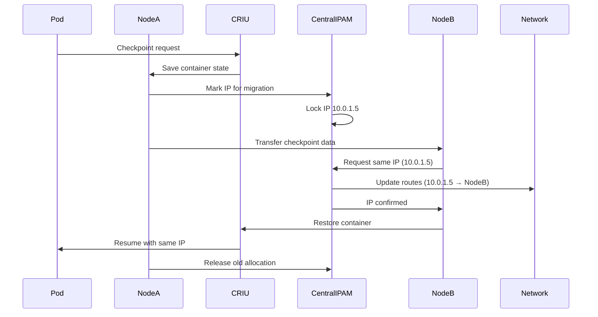

# Pod Live Migration with IP Preservation: Problem Statement and Architectural Challenges

## Executive Summary

This document outlines the architectural challenges and proposed solutions for implementing **live pod migration with IP address preservation** in Kubernetes clusters using Cilium CNI. The core challenge stems from Cilium's fundamental design of allocating distinct subnets to each node, which prevents pods from retaining their IP addresses when migrated across nodes.

## Table of Contents
1. [Problem Statement](#problem-statement)
2. [Current Architecture](#current-architecture)
3. [Technical Challenges](#technical-challenges)
4. [Proposed Solution](#proposed-solution)

## Problem Statement

### Use Case: Live Pod Migration
We are implementing a system for **live migration of pods** between Kubernetes nodes using:
- **CRIU (Checkpoint/Restore In Userspace)** to checkpoint container state
- Container state transfer to destination node
- Pod recreation on destination node with state restoration

### The IP Address Problem

```
Current Behavior:
┌──────────────────┐                    ┌──────────────────┐
│     Node A       │                    │     Node B       │
│ Subnet: 10.0.1.0/24                   │ Subnet: 10.0.2.0/24
│                  │     Migration      │                  │
│ Pod X            │ ──────────────────>│ Pod X            │
│ IP: 10.0.1.5     │                    │ IP: 10.0.2.5 ❌  │
└──────────────────┘                    └──────────────────┘
                    IP CHANGED - CONNECTIONS BROKEN!

Desired Behavior:
┌──────────────────┐                    ┌──────────────────┐
│     Node A       │                    │     Node B       │
│ Shared Subnet                         │ Shared Subnet    │
│                  │     Migration      │                  │
│ Pod X            │ ──────────────────>│ Pod X            │
│ IP: 10.0.1.5     │                    │ IP: 10.0.1.5 ✅  │
└──────────────────┘                    └──────────────────┘
                    IP PRESERVED - CONNECTIONS MAINTAINED!
```

### Why IP Preservation Matters

1. **Active TCP Connections**: Changing IP breaks all established TCP connections
2. **Service Discovery**: External services may have cached the pod IP
3. **Stateful Applications**: Some applications store/advertise their own IP
4. **Zero-Downtime Migration**: IP change requires connection re-establishment
5. **Session Continuity**: User sessions tied to specific IPs are disrupted

## Current Architecture

### How Cilium Allocates IPs Today

```yaml
# Cilium's Hierarchical IP Allocation
Cluster CIDR: 10.0.0.0/8
    ├── Node-1: 10.0.1.0/24 (256 IPs)
    │   ├── Pod-A: 10.0.1.1
    │   ├── Pod-B: 10.0.1.2
    │   └── Pod-C: 10.0.1.3
    ├── Node-2: 10.0.2.0/24 (256 IPs)
    │   ├── Pod-D: 10.0.2.1
    │   ├── Pod-E: 10.0.2.2. 
    │   └── Pod-F: 10.0.2.3
    └── Node-3: 10.0.3.0/24 (256 IPs)
        └── ...
```

### Key Components

1. **Operator Level (Cluster-wide)**
   ```go
   // Allocates unique subnets to nodes
   NodesPodCIDRManager.allocateNode(node) → unique /24 subnet
   ```

2. **Agent Level (Per-node)**
   ```go
   // Each node manages its own subnet independently
   podCIDRPool.allocateNext() → IP from node's subnet only
   ```

3. **Storage**
   ```yaml
   # CiliumNode CRD
   spec:
     ipam:
       podCIDRs: ["10.0.1.0/24"]  # Fixed per node
   ```

## Technical Challenges

### Why Current Cilium Architecture Prevents IP Preservation

#### 1. **Strict Subnet Isolation**
```go
// pkg/ipam/allocator/podcidr/podcidr.go
func (n *NodesPodCIDRManager) allocateNode(node *v2.CiliumNode) {
    // Each node MUST have a unique, non-overlapping subnet
    subnet := AllocateNext() // Returns 10.0.X.0/24
}
```
- **Design Principle**: Each node owns an exclusive subnet
- **Enforcement**: Bitmap allocator ensures no overlap
- **Result**: Pod IP is tied to its node's subnet

#### 2. **No Cross-Node IP Coordination**
```go
// pkg/ipam/pool.go - runs independently on each node
func (p *podCIDRPool) allocateNext() (net.IP, error) {
    // Only allocates from LOCAL subnet, no cluster-wide coordination
    return ipAllocator.AllocateNext() 
}
```
- **Issue**: Nodes don't coordinate individual IP allocations
- **Why**: Performance - avoids distributed consensus for each IP

#### 3. **Routing Assumptions**
```bash
# Current routing table
10.0.1.0/24 → Node-1  # All 10.0.1.x IPs route to Node-1
10.0.2.0/24 → Node-2  # All 10.0.2.x IPs route to Node-2
```
- **Problem**: Moving Pod with IP 10.0.1.5 to Node-2 breaks routing
- **Routing still sends 10.0.1.5 traffic to Node-1**

#### 4. **IP Conflict Prevention**
```go
// Current: Conflict impossible due to subnet isolation
Node-1: Can only allocate 10.0.1.x
Node-2: Can only allocate 10.0.2.x
// No possibility of both allocating same IP
```

## Proposed Solution

### Architecture: Centralized IP Management with Shared Subnet

```
┌─────────────────────────────────────────────────────┐
│            Central IP Allocation Service            │
│  - Manages shared subnet (e.g., 10.0.0.0/16)       │
│  - Distributed lock/lease per IP                    │
│  - IP mobility tracking                             │
└─────────────────────────────────────────────────────┘
                    │ gRPC/REST API │
        ┌───────────┴──────┬────────┴──────────┐
        ▼                  ▼                   ▼
   ┌─────────┐       ┌─────────┐        ┌─────────┐
   │ Node-1  │       │ Node-2  │        │ Node-3  │
   │         │       │         │        │         │
   │Shared   │       │Shared   │        │Shared   │
   │Subnet   │       │Subnet   │        │Subnet   │
   └─────────┘       └─────────┘        └─────────┘
```

### Component Design

#### 1. **Central IP Allocation Service**
```go
type CentralIPAM struct {
    subnet      *net.IPNet           // Shared subnet
    allocations map[string]IPLease   // IP → Node mapping
    mutex       sync.RWMutex         // Concurrency control
    etcdClient  *etcd.Client         // Persistent storage
}

type IPLease struct {
    IP       net.IP
    NodeName string
    PodName  string
    LeaseID  string
    Expiry   time.Time
}

func (c *CentralIPAM) AllocateIP(podName, nodeName string) (net.IP, error) {
    // Check if pod already has an IP (migration case)
    if existingIP := c.findIPForPod(podName); existingIP != nil {
        return c.transferIP(existingIP, nodeName)
    }
    // New allocation
    return c.allocateNewIP(podName, nodeName)
}

func (c *CentralIPAM) transferIP(ip net.IP, newNode string) (net.IP, error) {
    // Update routing tables
    c.updateRouting(ip, newNode)
    // Update lease
    c.allocations[ip.String()].NodeName = newNode
    return ip, nil
}
```

#### 2. **Modified Cilium Agent**
```go
// Modified pkg/ipam/allocator.go
type SharedSubnetAllocator struct {
    centralClient CentralIPAMClient
}

func (s *SharedSubnetAllocator) AllocateNext(owner string) (*AllocationResult, error) {
    // Request IP from central service instead of local pool
    ip, err := s.centralClient.AllocateIP(owner, nodeID)
    return &AllocationResult{IP: ip}, err
}
```

#### 3. **Dynamic Routing Updates**
```go
func updateRoutingForMigratedPod(podIP net.IP, newNode string) {
    // Update BGP announcements
    bgpClient.WithdrawRoute(podIP, oldNode)
    bgpClient.AnnounceRoute(podIP, newNode)
    
    // Or update iptables/eBPF rules
    updateDatapathRules(podIP, newNode)
}
```

### Migration Flow



## Conclusion

While Cilium's current per-node subnet architecture provides excellent performance and simplicity for standard Kubernetes workloads, it fundamentally prevents IP preservation during pod migration. Implementing a shared subnet with centralized IP management is technically feasible but requires significant architectural changes and introduces new complexity.
